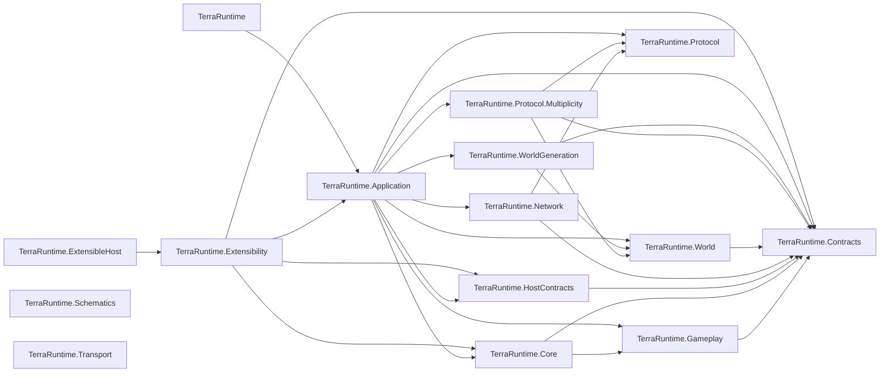
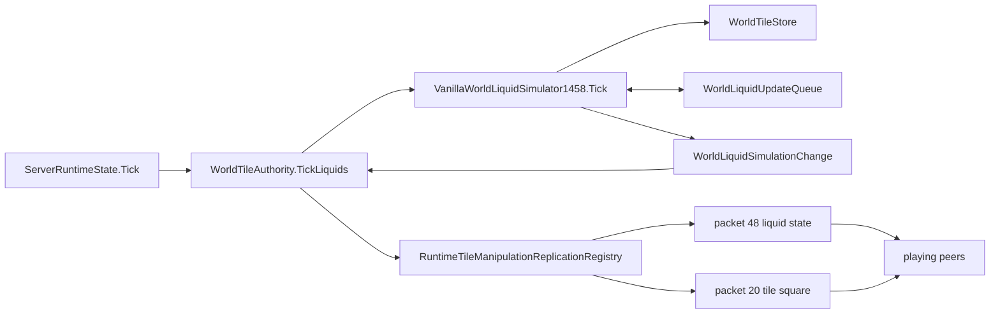

# Production graph

Last structural refresh: 2026-09-06.

This page records the dependency and ownership graph that is expensive to reconstruct repeatedly. It describes shipping projects under `src/`; tests are intentionally omitted.

## Project-reference graph

`TerraRuntime.Schematics` and `TerraRuntime.Transport` currently have no project references in their own `.csproj` files. The graph above is about compile-time references, not every runtime/data-flow edge.

## Authoritative liquid runtime path

Ownership/invariants for this path:

- `ServerRuntimeState.Tick` is on the authoritative game-loop path.
- `WorldTileAuthority` owns the runtime integration point for authoritative tile/liquid mutation and replication.
- `VanillaWorldLiquidSimulator1458` mutates `WorldTileStore` and consumes bounded `WorldLiquidUpdateQueue` work.
- `WorldLiquidSimulationChange.RequiresTileSquareReplication == false` means packet `48` replication is sufficient for the committed liquid amount/kind change.
- `RequiresTileSquareReplication == true` means the mutation changed tile/material state and must replicate through packet `20` tile-square state.
- Re-enqueued liquid work must not allow one tile to consume multiple logical vanilla update steps in the same TerraRuntime server tick.

## Change-impact shortcuts

| Concern | Start here | Usually inspect next |
| --- | --- | --- |
| Runtime tick ordering | `ServerRuntimeState.Tick.cs` | subsystem authority/store, replication |
| Client tile/liquid admission | `WorldTileAuthority.cs` | mutation service, budgets, Multiplicity codec |
| Liquid simulation | `VanillaWorldLiquidSimulator1458.cs` | `WorldLiquidUpdateQueue.cs`, `WorldTileStore.cs`, snapshot persistence, replication |
| Tile/material replication | `RuntimeTileManipulationReplicationRegistry.cs` | `TerrariaTileSquareCodec`, `TerrariaLiquidCodec` |
| Snapshot liquid persistence | `RuntimeWorldSnapshotCache.*.cs` | `WorldLiquidUpdateQueue`, `WorldTile` |
| Vanilla world generation | `TerraRuntime.WorldGeneration` | generation plan/provider, `TerraRuntime.World`, world-file writer/loader |
| Sandbox orchestration | `TerraRuntime.Application` sandbox owners | world generation/load path, player transfer/bootstrap, process worker contracts |
| Protocol wire semantics | `TerraRuntime.Protocol.Multiplicity` | `TerraRuntime.Protocol`, official 1.4.5.8 server/client behavior |

When a change crosses one of these rows, refresh the relevant graph rather than assuming the old impact boundary still holds.
