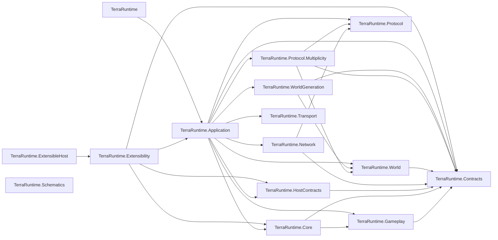
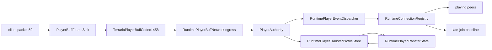
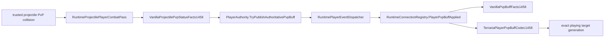
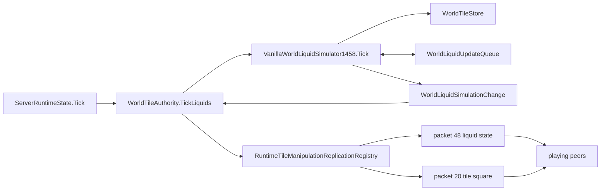
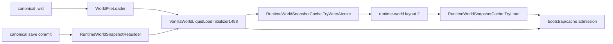
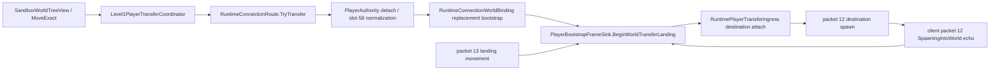
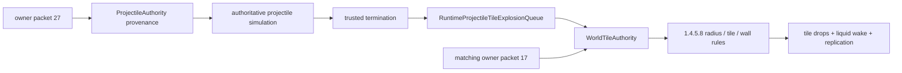
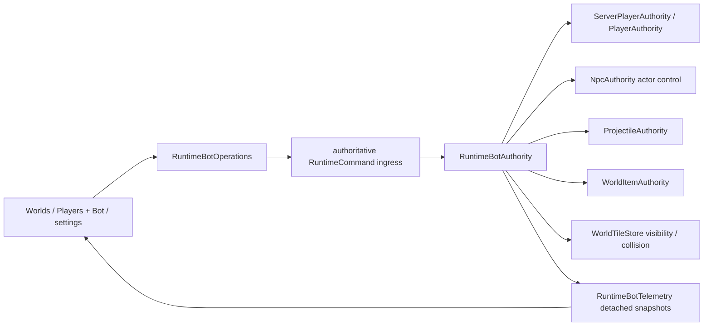
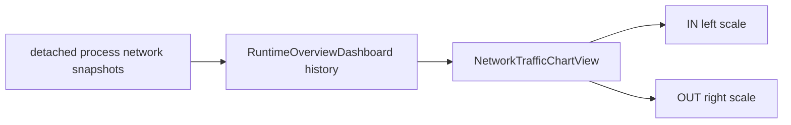

# Production graph

`RuntimeWorldClock` owns the persisted `maxRaining` projection needed by the admitted `Main.UpdateWeather` current-wind step. It leaves `windSpeedTarget` unscaled for checkpoint/header and packet-7 use, and eases `windSpeedCurrent` toward `windSpeedTarget * (1 + 5 / 9 * maxRaining)`. Source weather target scheduling, rain scheduling and creative/lantern gates are still outside this bounded slice.

## Prime encounter arm-slot order - 2026-09-20

The retained Windows and Linux `NPC.UpdateNPC` encounter traces confirm `PlanSkeletronPrimeArms` follows the source call order exactly: Cannon `128`, Saw `129`, Vice `130`, Laser `131`, with source `ai[0]`/`ai[3]` values. `PrimeEncounterContinuousTests` preserves 160 captured steps through runtime world motion across the `599`→spin and `399`→hover transitions, including same-pass ascending execution of all four newborn arms, Cannon bomb and Laser projectile allocation, retained projectile slots across the phase reset, and the complete shared RNG state. It compares retained actor and projectile state exactly except Windows `rotation`, where the original x86 and current x64 `Math.Atan2` differ by at most $10^{-6}$. The head's source `netUpdate` at `599`→spin now forces packet 23; its spin exit has no source request and remains cadenced. Projectile update/network cadence beyond that admitted head boundary and Mech Queen remain open.

Prime Cannon AI_035 and Laser AI_036 now also force packet 23 at their source timer phase changes: `1099`→attack and `299`→hover for Cannon, `799`→attack and `199`→hover for Laser. The direct source does not set `netUpdate` for the accompanying projectile emissions, so those remain on ordinary cadence. Other arm transitions and projectile/network cadence remain open.

Prime Saw AI_033 and Vice AI_034 now force packet 23 at the admitted source timer and charge handoffs: Saw's `299`/`599` timer paths, launch and phase-four return; Vice's `599` timer paths, launch and phase-four out-of-range charge. Vice's source slow live-target refresh is also forced only while its Prime parent is outside hover; slow idle-parent motion remains cadenced. Other ordinary movement returns remain open.

For every admitted Prime caller, the runtime also carries `TargetClosest`'s final `netUpdate` predicate: a changed target, `DirectionX`, or `DirectionY` forces packet 23 only if the prior state has neither `CollideX` nor `CollideY`. The head admits its established target-selection paths; Cannon admits phase one; Laser admits phases zero, one and three; Saw and Vice admit phases zero, one, three and four. This is intentionally not a generic NPC replication policy or a replacement for source proximity streaming.

## Moon Lord proximity stream - 2026-09-21

`NPC.StreamUpdatesToNearbyPlayers` was checked directly against TerrariaServer 1.4.5.8: `NPCID.Sets.UsesMultiplayerProximitySyncing` contains only `396` (Moon Lord Head), `397` (Hand), and `398` (Core). The source advances `netStream` only while `abs(vx)+abs(vy) > .5`, sends at `Main.npcStreamSpeed == 30`, and retains a counter per NPC/player. Their SetDefaults entries all set `boss = true`, so every active player receives gain `8` after its reported camera position is read and packet 23 is sent immediately. `RuntimeNpcReplicationRegistry` now maps this source-only route on top of the existing bounded ordinary cadence, with generation-safe part clocks and per-connection counters. Regressions prove the 30th update reaches two separately positioned playing endpoints, while an ordinary NPC and a `.5`-speed Moon Lord part do not stream. This does not close generic `netUpdate`, net-spam or section-sync parity.

AI_077/078/079/081 source review also admits the represented explicit `netUpdate` calls into `INpcAiForcedUpdateIntentPlanner`: Core initialization, intro/teleport completion and shell exposure; non-retired Hand and Head attack-table transitions; Head's elapsed-180 Deathray launch; and True Eye attack-table transitions excluding its retained `-2` marker, sphere-release elapsed `75`/`105`, Eye-shot turn selection elapsed `45`, and Deathray launch elapsed `180`. A direct regression covers every positive handoff and ordinary/retired negatives. No generic Moon Lord motion or unrepresented source effect is made urgent.

## Prime head direction and rotation - 2026-09-20

AI32 now updates Skeletron Prime's `DirectionX` when `TargetClosest` selects a candidate and commits phase rotation in source order: hover uses pre-steering `vx / 15`, while spin, daytime rage and despawn add `direction * .3` before velocity changes. The focused regression checks initial target acquisition at the spin-to-hover boundary. An independent 32-tick Linux `NPC.UpdateNPC` trace includes head plus all four arms in ascending-slot order across the hover-599 and spin-399 transitions; SHA256 `23dac3d4de2271a9085fc6763a16c7a36f227246a4fd5bd6ff147165615f385b`. This closes those head-state fields only. The retained cross-platform encounter fixture, Mech Queen, remaining head behavior, continuous projectiles and network cadence remain open. Local Release build, focused 808 tests and the full 100,115 suite pass.

## Prime melee implementation - 2026-09-16

Prime Saw/Vice AI33/34 now use source hover, pursuit, vertical/repeated charge and return phase ordering. The runtime additionally supplies a bounded retained-slot snapshot for source reads of inactive parents; active peer consumers remain unchanged. Retained regression fixtures contain 6,048 baseline + 3,360 edge + 112 parent calls, independently matched against original Windows/Linux after-state and RNG. SHA256 of parent Linux JSON: b39f407f06ece6977646de4c3e08ab4b5a61c54e320b3bf8bc59e1c5b78661f5. All 9,408 initial cases failed on the old strategy. The focused 9,528 cases and merged full suite of 100,113 tests pass, as do Windows NativeAOT publication and all five smokes. Dedicated-server death consumes four gore RNG draws after revision acceptance; only despawn is published. Full encounters, alternate player hitbox/raw inactive targets, outer movement and full parity remain open. Next: continuous encounter traces before claiming encounter parity.

## Resumed parity work - 2026-09-16

The user explicitly resumed work. Commit `2419b56229176401cdafc2bc253d8f23a7e24c47` has all 14 exact-commit workflows green, including CI `34954800396` (Windows/Linux NativeAOT publish and all five smoke paths, both extensible CoreCLR hosts, build/tests), Documentation `34954800296`, Generated World `34954800402`, and downstream World Item `34955209404`. Evidence: `.cache/prime-ranged-ci.json`.

The resumed local full suite passed all 90,031 tests with zero errors/failures/skips in 192.028 seconds; runner exited 0 and the complete XML parsed successfully. Evidence: `.cache/prime-ranged-resumed-full.xml` and `.log`. This closes the previous disk-full report-writing acceptance gap. No production/test source changed during the run.

Next: replace approximate Prime Saw/Vice AI33/34. Independent original Windows/Linux captures now contain 6,048 baseline calls plus 3,360 velocity/flags/counter cases per platform. After-state fields match across platforms at float32 precision within these matrices; this is not general platform-equivalence proof. Probes and JSON are ignored reference evidence under `.cache/prime-melee-{ai,edge}-{linux,windows}-probe`; hashes, matrix details, source locations and concrete implementation gaps are in `.cache/prime-melee-next-step.md`, `.cache/prime-melee-evidence.json` and `.cache/prime-melee-edge-evidence.json`. These captures are not yet retained runtime regression fixtures. Production melee implementation is still approximate; full encounters, gameplay/items and packet parity remain open.

## Checkpoint requested by user - 2026-09-15

Prime Cannon/Laser implementation is committed as a checkpoint; full parity remains open. Restored Release warnings-as-errors build, Windows NativeAOT publish and all five smoke paths passed, including primeRangedAI=ok. The full test runner reported 90,031 tests, zero errors/failures/skips, in 190.968 seconds, then exited 4 because disk space ran out while writing .cache/prime-ranged-full.xml. That XML is truncated; this is not a clean full-run process acceptance. Evidence: .cache/prime-ranged-final-full.log. Focused 10,590 tests and seven negative controls passed their expected checks. Remote acceptance remains pending. User requested commit, push and stop; do not automatically continue parity work.

## Prime ranged AI35/36 implementation and independent evidence - 2026-09-15

Working on accepted370dc5f5. New Core/Npcs/VanillaPrimeRangedBehavior owns128/131 source movement, phase clocks, retained-target movement thenTargetClosest, rotation/facing, retainedphysicalflags, parentAiStyle32validation (floatparentindex truncated including-.5=>0), phase-scopeddespawnencouragement. Old sharedStepRanged and PlanPrimeLimbProjectile removed; dispatcher routes128/131newstrategy; projectileplanningreturns0/noRNG. Accepted effect usesbeforephysicalcenter,parentattachmentanchorforidleCannon,committedtargetforothers,source2spreadNext(-40,41),Windowswiderjitteradd,correctphysicaltop-left. Clockresetsbeforeallocation; fulltableretainsdraws; exactgeneration/revisionguardpreventsstaleshots. ParentinvalidAI2+=10/>50deactivationpublishesonlydespawn. SourceHitEffect consumes4Next(61,64) evenonserver; retainedpostcommitwithrevisioncheckbeforefinalremoval. PrimeSaw/Vice remainoldstrategy/separatework.

Shared projectile100catalog nowphysical7x7/collision7x7 fromsourceinitial4x4*1.8 atSetDefaultsend; projectileoffsetsubtractswidth/height*.5 preserving3.5. UpdatedoldcatalogInlineData1004=>7. SourceProjectile.SetDefaults1873/10673 and NPC.AI35at28701/AI36at28937; NPC.HitEffect90523 consumes4gorechoices, Gore.NewGore1306returns600inservermode. FullNPCUpdate/projectileextra-update/network/MechQueen/rawinactiveplayerprojection remainunverified.

Originalfixtures perplatform: baseline3456 SHA Linux3e775739dde0684c27be0e41ec0cd7ca4080ba0cb12883c69ce42582c9adb61e Windows8ee324aa8db975e5067c844cfc54fb6d7064eecb8f2df31a353f69bcd6393267; .cache/prime-ranged-ai-{linux,windows}-probe. These supersede earlierSHA4fd78cba/d5f2ee81: initialcapture resetprojectileobjectsbutnotstaticgenerationarrays, correctedsourceprobe resetsslotGenerations/keyToIndex percase andrecaptured; neveradjustednumericexpectationsfromruntime. Geometry6912 SHA Linuxcf33bada81374f0c8e6d3b2f81fabcfa1b9407bee584cdc61560b162ce8f3269 Windowsbfcc490b26a3f244a14b58f89ae9af8c8496a9cfcc50b1b7b2277a4dbde9b67a; .cache/prime-ranged-geometry-*-probe:phase0/1/3/4,timer299/799/1099,4geometries,velocitysign9/7,secondtarget,explicitphysicalflagsfalse/JustHittrue. Traces96groupsx8=768 SHA Linux6b6f0f58cb64362b707345baca8baadf5de35ff51cf1c8c38c0a0b8f3ccdfbe1 Windows7d3d396818890df9d75f658486329120d547be49303b71cc4edd21e9be925d94; before/after+RNGcontinuityasserted. Parent60 SHA Linuxa831454e61eac0ad934f64b545163deef05df2077f067d19cbd03551201a67de Windowsb25f7185d4f5a3602507a8eff3a31e7a1495df142c17bee3e0f2b7d5e5638b48; active/inactive/wrongstyle/sentinel200/fraction-.5,parentphase0,armphase0/1/3/40/41/50. ParentprobeinitialHitEffectNREfixedbyinitializingMain.gore601includingserver-sentinel600; this revealedmandatory4draws, nowretained. Allprogramsignored;8gzfixturesretainedinTests.csproj. CapturefullNPC/projectiles/RNG; parentfrozen/nooutermotion.

PrimeRangedAiTests10542 =10428isolated +96sequences +18ownership/failureguards. Setup imports original state afterrawstoreTrySpawn/TryUpdate (initialTrySpawn resetsdefaults, so explicitTryUpdate needed forScale), verifiesbefore state. FourRNGreentry/4planning-reentry/4orphaneffectreentry,2fullallocation/2orphanpublication/2repeatplanning. Expandedwithprojectilecatalog10590passes, CoreCLRprotocolsmokeprimeRangedAI=okpasses. Newnativeprotocolsmokecreatesparent0+arm10seed0 forCannon140/Laser200clocks, assertsoriginalshotxy/vxy,provenanceandclockreset; runsbothAIinrealexecutor.

Sevennegativecontrols over10590tests: planning10542,clock3664,anchor1142,orphan-rng18,revision4,shape2083,movement917. .cache/run-prime-ranged-negatives.py; .cache/prime-ranged-negative-results.json; session61564terminal0; sourcebytesrestoredfinally. AdjacentNPC/Prime/projectile47300 initiallyoneoldlaser4x4expectation, correctedwithoriginal7x7evidence. PairedNPCownership andprojectileprofiledocs +roadmapupdated. Finalrestored build/WindowsNative5smokes/full90031pending; thenallgates/commitpushmain/exactheadCI+Docs+GeneratedWorld+downstreamWorldItem. No production/testmutationswhilefullsuiteactive. DiskonlyreversibleNTFSLZXcompressionwithSHAchecks, recordsprime-ranged-compression*.json; nodeletions. Goalactive, currentturnimplementation+independentprogress; fullencounters/meleearms/remainingNPCitems/packetsstillopen.

Final local scaling acceptance: full 79,489/79,489, zero failures/errors/skips in 188.383 s (.cache/npc-scaling-full.xml); final restored Release warnings-as-errors build and Windows NativeAOT publish plus all five loop/protocol/network/world/tui smokes passed, including npcScalingArithmetic=ok. Runner .cache/run-npc-scaling-final.py/session45544 terminated with exit0. Documentation 94 mirrored pages/227 files, domain audit293files, graph15projects/29edges, Python15 tests and diff check passed. Russian documentation was written via UTF-8 apply_patch file after a shell stdin encoding issue; final additions contain no replacement markers, both languages reviewed. Exact-commit remote CI/Linux NativeAOT pending after push.

## NPC platform creation arithmetic in progress - 2026-09-15

Implementation on efe902f7: VanillaNpcSpawnDefaults default resolves host platform, explicit windowsArithmetic overload verifies both originals. Windows initial integer life/damage products wider; life adjustment product stored Single then multiplied wider before Math.Round; damage ramp stays wider; Hardmode damage factor retains Single .9 constant in wider expression; knockback curve wider until final store; multiplayer boost update and final balance reduction wider between Single output stores. Linux boundaries retained. Prime daytime speed uses wider division/add before Single speed store; squared distance uses platform source products. Native protocol smoke adds npcScalingArithmetic=ok with original head1.01 life4443/4444, hand3.5 life2321/2320, Prime255players difficulty2 life7197400/7197399, HardmodePlantera sphere3 damage267/270 (Windows/Linux).

New .cache/npc-scaling-expanded-{windows,linux}-probe original NewNPC 14400 each; net48/x86 Windows original, Linux original on Windows CoreCLR. Types32/33/35/36/62/66/127..131/134..136/139; 14 difficulties .5..4 including1.01/1.9; Good, Hardmode, Plantera, activehead; players0/1/2/8/255. Explicit actualType/netId retained after RNG substitution. New gzip resources NpcScalingLinux1458 SHA3e43fbdc78552a0d955e2c57a32d64e61b8513b98b9f528974145777c617b17f and NpcScalingWindows1458 SHA64c8f0150a4fc7e41422794e3ec42d15c8a3388471d2c8f58e3a20a8596d7267. 28800 profile/shape/host-selector comparisons pass. Before implementation, ignored Python model matched all14400Windows stats; .cache/npc-scaling-expanded-model.py. Intermediate original samples in .cache/npc-scaling-intermediate-{windows,linux}-probe show field/return rounding differs from retained expression precision.

Old Linux fixtures were falsely universal: 1186 existing host tests initially failed. Independently recaptured 11 Windows probes, combined into eight resources; full names/counts/hashes .cache/npc-scaling-legacy-windows-fixtures.json. Existing host creation/RNG/phase readers now select the original platform. 66Prime daytime velocity differences required the source wider sum boundary; two caster world-fact assertions now use original Windows213/267/178 versus Linux216/270/180. All63125 adjacent NPC/Skeletron/Prime/Caster/Sphere tests then passed, plus CoreCLR protocol smoke. That smoke predates the new explicit npcScalingArithmetic cases; final build/smoke pending.

Five negative controls passed over29607 profile+Prime tests: platform3923 failures, life-store240, balance574, hardmode480, prime-speed66. .cache/run-npc-scaling-negatives.py; .cache/npc-scaling-negative-results.json. Source bytes restored in finally; final restored build/full/native still pending. Initial negative attempt hit a new smoke tuple-name inference compile error before running any tests; fixed explicit tuple array type, reran all five successfully. No production/tests mutation while full suite runs. Disk pressure managed only by reversible NTFS LZX compression with SHA checks, no deletion; records .cache/npc-scaling-compression*.json.

Paired NPC ownership docs and roadmap updated. Full boss encounters/outer lifecycle/urgent networking/raw target projection/remaining NPC/item/packet parity still open. Do not mark goal complete. Previous turn accepted efe902f7; current turn implements and independently proves wider platform creation/Prime arithmetic. Next immediate: final restored build, all five WindowsNative smokes and full79489; documentation/domain/project/Python/diff gates, fix actual failures, commit/push main, verify exact-commit LinuxNative/CI/docs/generated-world/downstream item workflows.

## RedHat head AI, source-ordered effects and scoped NPC creation - 2026-09-15

Current implementation on top of bc107261: head35 RedHat hover timer+1.5, alternate accelerations/caps and spin speed, double1.3 damage, Expert-only hand count for reflection/ordinary Good summon gate, owned rotation, preservation of NoGravity/NoTileCollide/JustHit and other retained fields. Head retargets a far/dead target before flee; valid pre-phase target remains the skull aim when hover later picks a different closest player. Shared head target resolver is used by skull effect. Raw inactive/ghost/disconnected-slot projection remains bounded/incomplete.

IVanillaSkeletronEnvironment/SetSkeletronEnvironment + Application/VanillaSkeletronWorldEnvironment implement1000attempts, sourcecenter/16 truncation, XY Next(-50,51), InWorldfluff0, SolidTile active/nonactuated/solid/non-solidTop/shape0, scanuntilmaxY-10 orsolid, decrementY andacceptnonsolid. Includesemptybottom andnegativebottomY-16 atfloor0, failclosedunrepresentablehostcoords. Head spin BEFOREtimer%200/capglobal32 RedHat4 versusGood6; RedHatallowswithhands, GoodonlyExpert0hands. Accepted effects runskullfirst, thentauntorsearch/creation; NewNPCGoodprefixremainsinsideallocation. Newhighercasterrunsinsamepass andinheritsmarkerthroughitsownAI.

New INpcAiTauntCommitSink/SkeletronTaunt + revision-scopedTryAnnounceSkeletronTaunt supportsvariants2..5. ApplicationNpcAuthoritypassesreplicationasbothhealingandtauntsink. TerrariaSkeletronTauntCodec1458 usesMultiplicityNetTextModule/LocalizationKey/red255,0,0/serverauthor255; fouroriginal32bytepacketschecked andplaying-onlyoutboundintegrationchecked. Nativeprotocolsmoke skeletronRedHatAI=ok: seed123normalheadStart10timer799marker1 emitsTaunt5, nextspincreatescaster0at1647/6184,target255,AI/local0.

New scopedNPCspawn overload checks expectedhandle/revision beforecontext/RNG andafterthosecallbacks,beforeallocation/publication. RuntimeNpcStore privateTrySpawnIntentCore retainsordinaryunscopedAPI; expectedSnapshotoptionalonlyinternaloverload. Headcasters andDarkCasterWaterSpheres use scoped sink; context/GoodNewNPCrandomreentry cannotpublishchildfornewerstate. Acceptedprefixdrawskept, staleinitialrequestnodraw. OtherunscopedNPCeffectfamilies remainseparatework.

Retained resources/original probes:
- SkeletronHeadEffects1458:2443 SHA d463ce4b71bcc9d2673ddbf15387dfc9809602681b1cd59bcfd544c97f00f6d1; Windows2443 SHA2767698fbae9b81515741e01abf750a299c5acda77a31b3d82586e6becc63ef9. Primary .cache/skeletron-head-effects[-windows]-probe. Fullbefore/after/children/projectiles/RNG. Setup imports originalbeforestate aftervanillacreate, deliberatelydecoupling3knownWindowsfractionalcreationlife differences; do notclaimcreationfixed.
- SkeletronCasterTerrain1458:1008 SHA f3875c62bffca75bcb5531054ec57219ff4ba6d4acc8787e6c385d9b223956d2; independentlyWindows1008 SHAebc8aedc1c14dd6e981ce07ea4c07f0c7decdc8b38d633f07dbf62cbeee62c8e, zero typed differences.7worldlayouts/seeds0,3,123/Good/marker/hands0,2/existingcasters0,4,6/fullNPCtable.108rowsaddcaster. WindowsJSONignorednotduplicatedasresource.
- SkeletronHeadTransition1458:96groups x5=480 SHA3bbaf16f9c43aa1df58a56da5998568cc9061e422a436ccc45bc52be6d1130ce; Windows SHA3af31de5ed4bc21dd678f77ad6c467cd9dbd93fcfcafd21b7e7c94bd04ff86d6. State/RNGcontinuityeachstepchecked; hovertaunt->spinminion andspinexit->skull; actors/projectilesfrozenoutsideheadAI.
- SkeletronTauntPacket1458:4 SHA76d58cb1418acfca70e7234e8c34633155acc858ed09a1c1bb00e828a8522544. SourceNetworkInitializerregistrationorder, originalSerializeServerMessage/ShrinkToFit, keys2..5; no literalgame text.
- SkeletronHeadCasterCoupled1458:144 SHA c6e9221a1570bb9a33d890312251bf7f5df22e735ae295c9978b81add3e624de; Windowsindependent SHAe3d187e358fddc6a0c0093f0db77a4ba464ca48d91eae3ec4cab0a2ec908bfbf, zero typed differences. .cache/skeletron-head-caster-coupled[-windows]-probe; headStart0/handsStart1/frozenhands, phase1timer200/modes0,1,2/Good/marker/hands0,2/seed0,3,123/fullbool.45casterchildren executeAIafterhead beforeRNGcapture, nooutermovement.
- SkeletronHeadTargetHandoff1458:32 SHAa2e1df8b14a54eda037786906181c0e1d18c7e6cbf52f5f92e8f7ccb995298c7; Windows32 SHAe79ff91ca429d9c47b1ae2604ecd7f23551e0488e60e46d200cec5808bbac837. .cache/skeletron-head-target-handoff[-windows]-probe. modes1,2/Good/marker/timer799,800/farbool,2players,nearerplayer1center1010/1021; farplayer0pos3500/1000else1500/1000. Allaftertarget1; skullusespriorvalid0unlessfar0wasreacquiredfirst.
- SkeletronCasterEdge1458:16 SHA11421c0e385d972cab002298f0af68dbae52546eb3cc8c2194fcf464ec81fd27; Windowsindependent SHAd37917b86328a4e5f9ec86a87783d72d1687d8d1817cdc925126a6c425d9ea79 zero typed differences. .cache/skeletron-caster-edge[-windows]-probe, world400x400Stonefloor0,headbottomX8/6392,Y51/6400,playernearhead,seed0/3/123/33. Seed33foundusingoriginalfirstdrawXnonnegative/Y0; head8/51 createscastertopY-56.
- SkeletronHeadFlags1458:32 SHA7512865ec249511f5a19637b788958cc4eda8f1f63b6d60ddd4acdc45da4f6b0; Windowsindependent SHA6f89a56cc4e5501bf82cfd0754d6939186a2eb89a6cecd009b3d5aadcab68d19 zero typed differences. .cache/skeletron-head-flags[-windows]-probe; phases0..3,timers1/799,Good,marker,Expertmode. ExplicitNoGravity/NoTileCollidefalse,JustHit/DontTakeDamagetrue,KB.37,alpha123,sprite1,rotation.7,directions-1 retainedexceptsource-ownedrotation/facing.

Focused25905/25905passed3.882s .cache/skeletron-redhat-expanded.xml/log, buildwarnaserrorandCoreCLRprotocolsmoke0. SkeletronHeadEffectsTests3787 +twoDarkCasterprefixguards added (expectedfull50689). Eightnegativecontrols across11388head+castertests: redhat1466,shape36,edge1,handoff8,creation4,taunt1,flags32,cap168; .cache/redhat-{label}-negative.xml/log, .cache/redhat-negative-results.json; exactsourcebytesrestored. Initialnegativeclass+methodfilters selected0cases (AND), discarded andrerunwithtwo-classOR. InitialtestcounterhadnullconditionalOnDraw?.Invoke(++Calls), correctedunconditionalincrement; twoinstrumentationfailuresresolved. NegativeXML/logsNTFScompressedwithhashchecks. Further31oldsourceJSON/fullXML/nativeEXE compressedreversibly, records .cache/redhat-compression.json, nothingdeleted; free249503744beforefinalpublish.

PairedNPCownershipdocs andheadprerequisitecheckboxupdated; fullencountercheckboxstillopen. Final local acceptance passed: restored Release build with warnings as errors; full 50,689/50,689 tests, zero failures/errors/skips in 185.261 s (.cache/skeletron-redhat-full.xml/log); Windows NativeAOT publish and all five loop/protocol/network/world/tui smokes, including skeletronRedHatAI=ok. Documentation gate: 94 mirrored pages / 227 Markdown files; domain literal audit: 293 C# files; project graph: 15 projects / 29 edges; 15 Python acceptance-tool tests and diff whitespace check passed. Exact-head Linux NativeAOT and remote CI remain pending after push. Next afteracceptance: verifyfractionalWindowsNPCcreation fromindependentmatrix beforeglobalarithmeticchanges; broadenencounters/outerNPC.Update/urgentnetworkcadence/targetprojection andremainingNPCboss/item/packetroadmap. Goalactive; previousbc107261turnwasprogress, currentturnalsoimplementation+independentprogress.

## Skeletron skull final local acceptance - 2026-09-15

Full46900/46900passed,0failed/errors/skipped,187.861s .cache/skeletron-skull-full.xml/log. Final sequential buildwarnaserror +WindowsNativepublish/five smokes +full suite allterminal0 in session20058. No production/test edits after finalbuild/fullstart. Finalnative .cache/skeletron-skull-native-win-x64, logs .cache/skeletron-skull-native-{publish,loop,protocol,network,world,tui}.log, skeletronSkull=ok checksactualplatform-specificvy. Docs94/227, domain292, references15/29, Python15, diffcheckpass. Originalretreatcall confirmsAI1=3/noRNG/zeroSkulls. Five negative controls acceptedbeforetheextra retreattest; theircounts328/386/1/1/396 arefrom1164cases, finalclass1165. Goalactive. Commit/push/exact-head CI next; do not call fullparity complete.

Disk: compressed previousdark-caster EXE SHA C93BEA6451D127236E220DACDB567384DFC71CE96E4040F8E69F98021E3587E2 andnew-npc EXE SHA5B76EEEE83482FF7A296FE18D4292CB851431FC8252DC69C8AD122557B7F9831 viaNTFS LZX, exacthashbefore/afteridentical. Nothingdeleted. Beforefullfree245202944bytes; monitorheadroom. PythononthisWindowsdefaultsCP1251: alwaysspecifyencoding='utf-8' forread_text/write_text; transientdocmojibakefromomittedreadencoding wasreversedexactly, diffshowsadditionsonly, doccheckerpass. NevertailTUI/full-loglines directly; useboundedfilteredtext/XMLsummary.

## Skeletron skull committed creation and platform arithmetic - 2026-09-15

AI_011 skull RNG/allocation moved from speculative planner into accepted effects. New revision-scoped TrySpawnProjectile sink preserves exact NPC provenance and rejects newer same-generation state or replacement after RNG callbacks. Visibility reentry checked before draws. Source uses refreshed target, pre-motion position/velocity, source cadence and double health threshold. Physical top-left uses catalog26x26 versus sourcecenter. Damage17, AI(-1,0,0), lifetime300. Windows x86 intermediate precision explicitly reproduced in Gameplay/Npcs/VanillaSkeletronSkull; Linux float operation boundaries retained. No global float arithmetic changes. Existing NPC initialization and wrappers still forward effects.

Independent originals: .cache/skeletron-skull-probe (Linux1458assembly/CoreCLR) and .cache/skeletron-skull-windows-probe (actualWindows32/net48/XNA),384calls each: modes1/2 xGood xhands0/1 xseeds0,1,3,17,42,123,2147483646,-123 xsix fractional/near-center targetpairs; beforevelocity1.125/-2.625, headStart10AI(1,0,0,0), frozenhands/empty400x400/noouterUpdate. Captures include before/afterheads, projectilesfullkey/position/velocity/AI/lifetime andall56RNGcells/index. Retained SkeletronSkullLinux1458 SHA0ea728500d5fc4440326c66b6fa6870013eef890ffa813a1bacb18a5e4e2f722; Windows SHA68869bca7d468e7615dd528ec7919dbea3f3e5e7899c72fb07912a35934f4b7a. Byte-for-byteoriginalJSONgzipresources; compareGetSingle, notparsedfloat64decimalrendering. Earlier2443headprobes remainignored/unimplementedRedHat evidence; arithmetic also modeledcorrectlyfor their76projectiles eachplatform. New independent384eachmatrix validatesoutsidefirstseed123matrix.

SkeletronSkullSpawnTests1165:768bothplatformexactmath+384hostcommittedspawn+13guards (staleplanning/query/RNG withsame/replacementgenerations, premotionanchor, blockedLOS/day, largehealthdouble, targetrefresh, fullreducedpool). Focused1421pass .cache/skeletron-skull-focused.xml/log. Negative arithmetic328, anchor386, revision1, health1, speculativeRNG396 failures; originalsrestoredexactbytes; .cache/skull-{arithmetic,anchor,revision,life,planning}-negative.xml/log. Initial arithmetic negative usedconstantfalse and failedbuildunreachablecode; rerunusesruntimepredicate andvalidtestfailure. Nativeprotocolsmoke skeletronSkull=ok added usingcapturedrow4 platform-specificvy. Additional direct original .cache/skeletron-skull-retreat-probe confirms target4000/1000 switchesAI1to3 beforeattack, creates0projectiles, RNGunchanged; guard/testaddedafterinitialNativepass. Full46900 expected, finalrestoredbuild/full/WindowsNative/LinuxCI stillpending. No acceptance claim yet.

Next: head RedHat deterministicstate/rotation, committedcasterquery/summons andlocalizedtaunts preserving skull-before-taunt/NewNPC ordering; sourceevidence2443bothplatforms remainsavailable. FractionalWindowsNPCcreation difference3rows requiresnewcreationmatrix beforeglobalfix. Complete encounter/targetgeometry/packetparity remainsopen. Earlierentriesbelowarehistorical.

## Dark Caster final local suite accepted - 2026-09-15

Final45735/45735passed, zero failures/errors/skips,183.839s .cache/dark-caster-full.xml/log, session73409terminal0. Includes7599DarkCaster cases andupdatedcreationAIadmissionexpectation. No production/test edits after finalfullstart. WindowsNativepublish andallfive smokes PASS, session79177terminal0 (.cache/dark-caster-native-win-x64 and publish/loop/protocol/network/world/tui logs). No localprocessrunning. Docs94/227/domain291/projectgraph15/29/Python15pass. Main/NPCroadmap andpairedNPCownershipdocs updated. Commit/push/exact-head CI stillpending. Sourceboundedwindowedgefix andsevennegativecontrols accepted as detailedbelow; entiregoal remainsactive.

## Caster teleport edge follow-up - 2026-09-15

Full45687/45687 passed187.392s, session6150terminal0, afterupdatingoldCasterSpawnTestsNoneexpectation. Further code review found an overstrict full-search-window guard: valid targettile20andmaxTile-21 were rejected, changing RNG.48 directoriginalquerycases atX20/21/378/379,Y20/24/358/379,seeds0/3/123 confirm it. RetainedCasterTeleportEdge1458 SHAa785b8a748e753940f56a955f1888e3a469a8de664768f37de45f4c1e6319e75; bootstrap .cache/caster-teleport-edge-probe. OriginalfloorrowtargetY+10 across400x400, playercenterattargettile, castercenterXsame/Y20pixelsabove; sourceclearancebottom40rowsstillconsumesall200draws onfailure. Oldguard36/48fails .cache/caster-edge-negative.xml/log; corrected20-tilewindowguard and safe y0-floor handling, focused8386/8386 (Caster7599+Spawn787) .cache/caster-edge-restored.xml/log3.472s. New totalexpected45735. Fullbeforeedge renamed .cache/dark-caster-full-before-edge.xml/log. Finalfull/native/CI next. Compressed both priorfullXML andselected caster-negativeXML with NTFS LZX; bytehashesverified, nothingdeleted. Earlier notes below are chronological.

## Dark Caster AI and committed random-dependent state - 2026-09-15

Type32 now explicitly admits DarkCaster family51: first-active-head35 marker inheritance/retention, TargetClosest refresh, source horizontal damping, timers/RedHat acceleration, queued physical teleport and source firing rectangle. CompleteCommittedState executes random teleport selection only after accepted unpublished source state, updates AI through expected-generation/revision TryUpdateAi, and publishes the final state once. Query reentry cannot overwrite newer state; accepted RNG prefix remains consumed. World-motion wrapper forwards the capability and runs movement once. Child33 uses post-queued-teleport/pre-motion position, source integer cast/halfwidth order, target255/marker and Start0; creation occurs before caster dust Next(3), including failed allocation. Higher child slots execute in the same pass. Other caster types/complete encounters/advanced target projection remain open.

VanillaCasterWorldEnvironment owns bounded100-attempt random tile search, source Manhattan cutoff2000, own3x3 exclusion, floor nactive/tileSolid (platform floor allowed), clearance3x4 active/nonactuated solid/non-solidTop with maxY-40 bound, dungeon-wall exception versus lava else-if including zero-liquid lava flag, and player current/predicted rectangle exclusion (active/nondead includingghost). Invalid exterior host coordinates fail closed before indexing/draw. Fully populated owned tiles need no original null-tile branch. Existing global firing rectangle reused.

IMPORTANT independent platform difference: shipped Linux FNA Rectangle.Union(ref predicted,ref current,out predicted) overwrites first input X/Y before reading right/bottom, losing positive displacement peraxis. Windows XNA caches input edges and correctly unions. Runtime defaults to matching host OS; internal query constructor allows test selection. Original Windows32 .NETFramework4.8 probe now works; earlier x64 CoreCLR attempt failed architecture mismatch, not a game failure. XNA reference in local GAC_32 Microsoft.Xna.Framework/v4.0_4.0.0.0__842cf8be1de50553; FNA in officialLinuxdistribution. Ignored decompiles .cache/{fna,xna}-rectangle-reference.cs; do not copy bodies.600 queries eachplatform differ40cases. Windowsprobe bootstraps .cache/caster-teleport-windows-probe use AppDomain resolution/System.Web JavaScriptSerializer, built net48/x86 and executed original Windows EXE. Also original Windows4800 fullcasterAI results are byte-identical to retained LinuxAI SHA3dec0335; .cache/dark-caster-windows-ai-probe.

Retained resources: DarkCasterAi1458 4800 SHA3dec0335a7463c1ae1d53d0b77117e12a79ddcd396d92ac6b1b32fcaf2e8123c; DarkCasterTrace1458 960five-calltraces SHA0d41754fa5ebd91aba65ea1b6801cc67330317f03794156b87d745094e3e6358; CasterTeleportQuery1458 600 SHA1bc4b5096cc037e83b8a29f01e2f53803fac871314cd282c1cbb18ae352f0690; CasterTeleportWindows1458 600 SHAa9cf39b46fc556d641f9f42df2d07cb945881bc384f1582cb4ec3c3de74a8f8b; NpcFiringDistance1458 486 SHA1300c160baac6a0a111e79f9bb6d076cbd12b3a9a3a329637b743ad0a16077b9; CasterSphereCoupled1458 96 SHA7e328c3a6f501272c5252872f9be8d31dcb0feb4ddded273e3ce96d3d060a612. Bootstrap/output .cache/{dark-caster-ai,dark-caster-trace,caster-teleport-query,caster-teleport-windows,npc-firing-distance,caster-sphere-coupled}-probe. Coupledmode/good/headmarker/localmarker/fulltable: parentStart0timer50attack26, invokesparentAI thenhighernewborn33AI, frozenhead/fillers, no outerUpdate. Tests compare full snapshots and all56 RNGcells/index; AI fixtures start from capturedpostcreationseed. Six resource files gzipembedded.7551 tests including9 publication/revision/invalid/world-motion/platform-default guards; focused19227 withSphere5909/NewNPC5767 allpass3.600s .cache/caster-final-focused.xml/log.

Negative controls admission/lava/platform/publication/revision/dust fail5864/294/40/3/1/5859 respectively; exactbytesrestored and finalwarnaserrorbuild0. Logs .cache/caster-{admission,lava,platform,publication,revision,dust}-negative.xml/log. Initialdustscript stopped beforemutation because CRLF pattern didnotmatch; corrected negative executed, source restored. Firstcomparison failures1062+600 were test assumption that child DamageOverride must be populated (fixed to compare effective definition fallback), plus40 genuine FNA/XNAquerydifferences nowcaptured andimplemented. Native protocol smoke adds darkCasterAI=ok, actual random queuedteleport/cast suppression/nextcallposition. Full suite/native/CI stillpending; no production changes aftertheir start. PriorAI8 limitations below are historical for type32 only. Fullgoal active; precedinggoalturn and currentturn progress.

## NewNPC random prefix and shared NPC stream - 2026-09-15

Good World vanilla creation consumes Next(3) before allocation, including full/protected-table failure; nonzero rolls substitute 46 -> 614 and 62 -> 66 before selected defaults. Both TrySpawnIntent and TrySpawnVanilla share this boundary; exact TrySpawn and invalid contexts do not draw. Creation definitions/profiles for 46/614/62/66 are admitted without AI: rabbits friendly/life5/difficulty1; demons initially gravity-enabled with ordinary difficulty/Hardmode scaling. NpcAuthority shares its world-owned random source with creation, natural selection and built-in targeting AI. SystemVanillaNpcRandom delegates to the pinned UnifiedRandom1458 algorithm. Other game consumers/custom AI are not yet a complete Main.rand stream.

Independent NewNpcRng1458: 2880 original NewNPC calls, SHA13a18afc7bb6d9a39d6ff76830aafb3496c295683cfd4a70758f5d62cc8c7d58. Modes0/1/2, Good World, Hardmode, Plantera, players0/2, types32/33/46/614/62/66, seeds0/1/2/3/123, empty/full200 tables. Both runtime entry points compare selected type, slot, geometry/combat/physical/friendly flags and all56 RNG seed cells plus index. NewNpcCoupledRng1458: six creation -> full-table failure -> sphereAI sequences, SHA2336a8850674a9935a5856b47e5c7bec5a3ec9d9775d42a6380580de7709e8c6. Original Linux assembly on Windows CoreCLR, not Linux NativeAOT; bootstraps in ignored .cache/new-npc-{rng,coupled-rng}-probe. Retained compressed fixtures and5767 tests. Coupled runtime uses real composition without tile world; this proves stream wiring, not full outer NPC.Update parity.

Focused5767 passed. Removing draw/substitution/full-table draw/shared-AI wiring fails2883/288/1443/6 tests respectively; exact bytes restored and final warn-as-error build passes. Initial full-table negative used storage Capacity256 and did not change behavior at physical200: corrected mutation uses PhysicalSlotCount and now fails1443. Logs .cache/new-npc-{draw,substitution,full-table,shared-ai}-negative.xml/log. Native protocol smoke adds npcSpawnRandom=ok. Full suite38136/38136 passed, zero failures/errors/skips,187.774s (.cache/new-npc-full.xml/log, session88550terminal0). Documentation94/227, domain289, project graph15/29 and Python15 checks passed. Windows NativeAOT publish and all five smokes passed (.cache/new-npc-native-win-x64, session25472terminal0, publish/loop/protocol/network/world/tui logs). No production/test edits after full-suite start. Push/exact-head CI pending. Caster teleport/attack AI, head RedHat summons/taunts, other NPC/gameplay/packet/world parity remain open. Earlier creation-RNG limitations below are historical and superseded only within this verified scope.

## Sphere AI and stale revision guard - 2026-09-15

AI9 for25BurningSphere/33WaterSphere now shares VanillaSphereNpcBehaviorStrategy, moved out of WOF-specific file. Physical-center launch onlytarget255, source speed/divisionorder, fallback0/dead-facing suppression, retainedbossinvulnerability,TimeLeftcap100,ownedRotation+.4*direction, preservedJustHit/physicalflags. WaterSpherepostcommitafterspawns consumes2Next(5); BurningSphere0. FullgameRNGcreationstream remainsunimplemented. Sharedexecutor checks currentgeneration/revision afterplanners beforecommit; same-generation reentrantmutation previouslyoverwritten, nowrejected. Rotationnullablefinite/materialized0/preservedomission/explicit0/typeidentityreset0. No newdependencies/projects.

Independent evidence: retained WaterSphereAi1458(2592) SHA1f4fb7768e26680b7e58b246bf5687bd71b3c47f7a5108a6be849ad04af50bea; WaterSphereTarget1458(288) SHA6d9ba9b7be89efa9d2f80c11273401af7eaf206952218b9a3149771f9b21c680; WaterSphereTrace1458(72traces/360calls) SHA12068ec3bead6641f12258fab9daf352f44830b17fde6ad07ed119ceb9336b47. BurningSphereAi1458(2592) SHAe16794fdfed48feffacff2c3aee7ac576f4d9efe3160deab0484bcf3bddd8621; BurningSphereTarget1458(288) SHAb1ae195f83bc56ea3a5f9429f83d374643427ed9a8d84c94fa45fdf30619cace; BurningSphereTrace1458(72traces/360calls) SHA2048210d33ea9a8e9ae676a3e188964b5ef3725b10a3e35a287a30d1dfe61ae1. Each ignored .cache/{water,burning}-sphere-{ai,target,trace}-probe contains bootstrap andoriginaloutput. OriginalLinuxassemblyonWindowsCoreCLR, dedicatednetMode2,initialized400x400tiles/clients/dust,seed123includingcreationprefix. TestsinjectcapturedpreAI RNGstate into separate pinnedruntimealgorithm; comparecomplete56seedarray+index afteracceptedstep, notonlycallcounts. OuterNPC.Update movement/lifetime notcaptured. Targetpet/oldtargetnegativeaggro/nonstandardplayergeometry/disconnectedpositions stillneedprojection; fullcasterAI8/headRedHat715 and creationRNG remainopen.

Focused6708pass (SphereAi5909 including5ownership/rejection cases, CasterSpawn787, WOF4, initialization8). Oldbody/RNG/latch/revision isolatednegatives5906/2952/1980/1, exactbytesrestored, finalbuild0. Nativeprotocoladds sphereAI=ok. Currentfull/native/CI acceptance pending.

## Dark Caster and Water Sphere creation implemented - 2026-09-15

Shared creation now admits definitions/profiles32/33 and samples Hardmode, Plantera and active35 per creation. Loaded facts survive composition without tiles; active Life0 head still counts until removal. Source integer Hardmode quotient, ProjectileNPC life exclusion, GoodWorld head tweaks and fractional knockback curve match retained CasterSpawn1458:784 original rows SHA312c0fd9130430fca01c6c191025e52146635f72755fa7bfd86f54bf5ecceba0. Contracts owns nullable live KnockBackResist with validation/preservation/type-reset; shared damage consumes it. AlphaAtSpawn supplies sphere255. Focused1114pass; isolated profile/combat/head-presence negatives691/1/1, restored. No AI8/9 admission: teleport/attacks, sphere motion, npcSlots pressure, creation RNG and head RedHat715 remain open. This supersedes only creation-support gaps in older entries below.

SharedVanillaNpcDamageResolver nowusesdouble forordinarydefensesubtraction/criticalmultiplybeforeintegerHPconversion, matchingMain.CalculateDamageNPCsTake. ExistingDefenseEffectiveness/CriticalDamageMultiplier publicconstanttypesandintMaxsaturation unchanged. This affects all NPC damage callers; RedHatpost-roundingfloat*.7 remainsinRuntimeNpcDamageExecutor.960additionaloriginalhighinputcallsvalidateprecision, nativehandhighdamagecaseadded.

## RedHat marker shared by AI, damage and loot - 2026-09-15

Gameplay.VanillaSkeletronCombat.HasRedHatAdjustments owns original marker predicate, reused by handAI, RuntimeNpcDamageExecutor and RuntimeNpcNetworkCombatPipeline.Loot. Contracts adds named32DarkCaster/33WaterSphere IDs only, no definitions/AI admission. Damage executor appliesfloat*.7/min1 afterordinaryresolver andbeforelife/knockback. Loot readscommittedheadAI insteadfalse. Nativeprotocol skeletronRedHatCombat checksactualhandcritical100=>130/life470. No newinterfaces/projects/dependencies; fixturetest-only reflection remainsoutsideproduction.

## Skeletron hand variants and removal - 2026-09-15

Existing hand strategy now applies inherited RedHat marker (including retained orphan local marker) to base contact damage and source phase motion. Parent rule checks catalog aiStyle11; Contracts.DungeonGuardian68 and Gameplay base definition/geometry added with BehaviorFamily.None, no Guardian AI/profile claim. Existing VanillaTargeting.DeactivatesAfterStep forwards hand orphan terminal Life0/ai2>50/+10 to executor unpublished update/removal, retaining TimeLeft; world-motion forwarding already supports final integration. No new interface/project/dependency. Protocol smoke skeletronHandVariants checks RedHat dash and actual executor orphan removal.

## Ordinary hand motion and vertical spawn direction - 2026-09-15

VanillaSkeletronHandNpcBehaviorStrategy resolvesphysicalhand/parenthitboxes; integerhalfwidthparentalignment andfloatcenter dash/dot/distance; source.01dashfloor andspeed/distance multiplicationorder; forceddashTargetClosest updatesDirectionX/Y;SpriteDirection=-ai0; localAi3fromparentai3; Encourage10onlystates0/3. Shared RuntimeNpcStore.TrySpawnVanillaCore initializeszeroDirectionYto1 forbothvanillaentrypoints; nonzerooverridepreserved; exactTrySpawn/updatesunchanged. No newcontract/project/dependency. NativeprotocolfrozenGoodWorldhanddashadded. Orphan/parentstyle/RedHat/fullfightsemanticsremainopen.

## Optional NPC initialization stage - 2026-09-15

ExistingINpcAiSpawnIntentPlanner addsdefaultfalseTryPlanInitialization(source,proposed,Span,outinitialization,outcount). VanillaTargetingoptsinonlySkeletron35ai0=0->1; retainsbeforeposition/velocity/timers andinitialtarget. FirstTryStepState mustbeside-effect-free (verifiedSkeletronAI/worldmotion); executorvalidatesfirstproposal/count/unlinkedintents/exactsource, commitsinitializationunpublished, allocateschildrenwithperchildheadrevisionguards, refreshespeers, rerunsstateonce andguardscontinuationrevision. Ordinaryplannersunchanged. Onlyfinalheadpublished, childrenmaypublishandchangeheadinbetween; acceptedprefixisnotrolledbackaftercontinuationrejection. RuntimeNpcStore.IsValid nowinternalforadmissionreuse. SkeletroninitialTargetClosestnowrunswithvalidprevioustargettoo. No newproject/dependency. Fullinitializationfamilies/childAI/networkRNGremainopen.

## Retained NPC difficulty and Skeletron phases - 2026-09-15

Contracts.NpcSimulationState.SpawnDifficulty nullablefloat validatedfinite.5..4. RuntimeNpcStore capturesitoncewith existingVanillaSpawnContext forbothvanillaentrypoints, evenunimplementedstatprofiles; explicitTrySpawn stayscontextfree. Ownershippolicy defaultsknownNPCto1,preservesomittedsame-definitionupdates,resetsdefinitionchangeto1; arbitraryTransformparamsstillopen. Skeletronheadstrategyusesretaineddifficulty/basecombat andphysicalhitbox, preservesfleedamage,sourcefloatmotion andGoodWorldspinreflection. Nativeprotocolactualexecutor spinexitwithhands added. No newprojects/dependencies. Phasefixturesinitializedheads; initialspawn/headdefenseorderingstillopen.

## Skeletron spawn profile and hand anchors - 2026-09-15

Existing Gameplay.VanillaNpcSpawnDefaults now admits35/36: head/hand good scales1.25/1.15, expert life1/1.3, damage1.1, masterlife.85, fullplayerbalance, noExpertvisual1.05. Existing Core hand planner usesintegerphysicalhalfsize andcastYbeforeaddition. No new abstraction/contracts/projects/dependencies. Skeletron head AI live damage currentlystilldefinitionbased; creation support doesnotclosephasebehavior. Native smoke covers original scaled spawn andfractionalhandplacement.

## Prime initial arm anchors - 2026-09-15

Existing VanillaNpcTargetingAiStepper planner now resolves source physical hitbox and uses pre-motion head position with original integer cast order. No new production abstraction, project, contract or dependency. PrimeArmsSpawnTests uses existing executor/wrapper capability composition to inspect arms before their first AI. Protocol smoke exercises Good World fractional creation through world motion and vanilla allocation. Acceptance in work-state.

## Prime baseline/phase draft — 2026-09-15

Contracts.NpcSimulationState nowretainsBaseDamage/BaseDefense separatelyfromliveoverrides. CoreRuntimeNpcStateOwnershipPolicy initializesfromexplicit/profile/definition, preservesomittedsame-definitionvalues, resetschangeddefinitionsandgenerationreuse. No wire-layoutchange. Gameplay.VanillaNpcSpawnDefaults supportsPrime127..131 inexistingworldcontext; headAIrestoresbasevaluesandusesphysicalhitboxcenters/sourcefloatdistancearithmetic. Realruntimeheadinitialization testsfourarms inheritcurrentcontext; nativeprotocolPrimephaseexit added. No newprojects/dependencies. Fulltransformationcontext/remainingbossAIstillopen; acceptanceinwork-state.

## NPC creation context draft — 2026-09-15

Gameplay.VanillaNpcSpawnContext/VanillaNpcSpawnDefaults own effective-difficulty/playercount/seed inputs and verified134/135/136/139 stat evaluation. NpcAuthority suppliescurrentcontext throughone Func callback registeredonRuntimeNpcStore; storecapturesonce pervanillarequest, usesphysicalsizeforintentbottomplacement andpassesresolveddefaults toatomicspawnnormalization. ExistingexactslotTrySpawn bypassescontext. Profilehealthfillsunspecifiedlife, initialdamage/defenseoverridesmaterializeonlywhendifferentfromdefinition; HitboxOverride retainsphysicalsize independentlyofvisualscale. NpcAuthority alsofeedsAIeffectiveExpert/Master flags withGoodWorldincrement. Realplayerlookupincludesdead/disconnectstate; ghost/Journeyprojectionstillopen. Noproject/dependencychange. Nativeprotocolactualruntimecontext andsamepasschildexerciseadded; acceptanceinwork-state.

## Destroyer chain draft — 2026-09-15

VanillaDestroyerNpcBehaviorStrategy now owns bounded head-driven chain allocation via existing committed-effect dispatch. No speculative per-segment Destroyer planner remains. RuntimeNpcAiStateExecutor implements generation-safe TryLinkFollower on existing INpcAiCommittedNpcMutationSink; slot200 can be retained as failure reference but never spawned as a sentinel NPC. Spawn intent/shared vanilla allocator own physical selection and normal initial defaults. Ascending executor sees all created peers before next slot AI. Native protocol smoke uses actual world-motion composition. Generic worms unchanged. Good-world spawn defaults and exact network publication timing remain open; source fixture tests explicitly separate those fields. No new project/dependency.

## CI scope repair accompanying Start work ? 2026-09-15

560e1537 main CI34914905749green, but sourceworkflow34914905908FAILEDafteritsSourceContractpassed: VSTest --filter wasignored and it ranall16818 tests, failingUIbot2secondSpinWait. Corrected12filteredworkflows to dotnetrun testproject -cRelease [--no-build] -- -noLogo -method "*substring*" repeatedOR; fullmainCIremainsfullsuite. Native-methodscope matches VSTest intendedFullyQualifiedName substring includingclassANDmethodname (notclass-only approximation). CorrectedstaleSourceBackedProvider1458Tests/ItemVanillaDefinitionCatalogTests selectors andallmissingliteralsrc/testpaths amongchangedworkflows. Resetworkflow nowbuildssolutionbefore--no-buildtests; movementlogguardchecksnonzeroTotal+Errors0+Failed0. No packageupgrade. Twelve scopes audited againstall3238discoveredmethods via-listmethods/json, everyselector matches, exactscopeequalPythoncasefoldsubstring: .cache/native-ci-filter-audit.json. Eight affectedWorldgen/Skyblock/Townsourceprobespassedlocally againstofficialdecompile; scriptsunchanged.

Dashboardinternaltestsurface replacesHasPendingBotCommandForSmoke bool withPendingBotCommandForSmoke Task?. Bot-buttontestawaitspending.WaitAsync(TestContext.Current.CancellationToken), checkscreatecount1,publishescompletion,assertsclearedpending+createdfeedback; productionoperationflowunchanged. ControlledfakeingressThread.Sleep3000: oldtestfails,newtestpasses (.cache/ui-bot-scheduling-{old,new}.log), temporarydelayremovedinfinally; rebuiltfinal. UIclass20/20pass. CurrentfinalfullwithallStart+UIrepairs running96263 .cache/npc-slot-start-ci-repair-full.xml/log; doNOTpublish/rebuilduntilterminal. PriorStartfull16833andnativepredateUIgetterrepair andarenotfinalcombinedacceptance. Moreworkflowsnowtriggeronpushduefileedits; inspectallredones, notjustmainCI.

## Bounded NewNPC.Start and skeleton limb draft ? 2026-09-15

After560e1537, RuntimeNpcStore.TrySpawnVanilla has optional int startSlot=0; rejectsnegativeor>=min(capacity,200)beforeiteration. OriginalCannotSpawnInSlot0 adjustment onlyforStart0; ascendingincludesstart,reverseexcludesstart. NpcAiSpawnIntent.StartSlot isbyte, defaults0, forwardedbyTrySpawnIntent. SkeletronHands andSkeletronPrimeArms plannerscarrysourceheadslot. No blanketworm/otherchild changes: several originalchainsallocatewholebatches fromroot, whileordinarywormfollowersstartatcurrentsegment. Nativeprotocolsmokeaddsstart197selectionandint.MaxValue rejection. PairedNPCownershipdocsupdated. No project/dependency changes.

## Vanilla NPC allocator and world-owned protection draft ? 2026-09-15

After pushed7ffb327e, Gameplay.VanillaNpcSpawnRules owns200physicalslots/2protectionupdates/source50CannotSpawnInSlot0IDs/reverseQueenBee222andGolem245. Core TrySpawnVanilla searches boundedmin(storeCapacity,200); reverse excludes0 even though222/245are not inCannotSpawnInSlot0. A single scan retains firstreplacement candidate but alwaysprefers anyfreeunprotectedslot. Replaceable inactive entries are eligible despiteprotection. RuntimeNpcStore retains privatevalueUpdate ondespawn for thisflag; allpublicsnapshotqueriesstillhideinactive. TrySpawnCore withreplaceActive/protect commitsfreshgeneration+revision1, countsactiveonlyifpreviousinactive, publishesSpawn withoutkill/loot. ExplicitTrySpawn staysstorageoperation bypassingvanillaallocation/protection; no publicactive-overwrite. NpcSimulationState andNpcAiSpawnIntent carryCanBeReplacedByOtherNpcs; QueenBee minionplanner setsittrue alongsideLocalAi0=60. Other flagproducers notyetadmitted here.

NpcAuthority.AdvanceWorldTick replaces oldAdvanceReplicationTick andupdatesprotectionbeforeotherworldsimulation inServerRuntimeState.Tick. AIexecutoralone doesnotadvanceprotection; coupled400-stepMoonLeechtestnowcallsupdateexplicitly to matchoriginalreference. Nativeprotocolsmoke has npcAllocation=ok forreverse/zeroexclusion/protection/reusegeneration. Contracts/runtime/Gameplaysameprojectsnoedgesadded. Public arbitraryStartoffsetnotyetimplemented. Existingvanilla TrySpawnVanilla defaultstore256 nowrespects200pool; explicitstorageaddressesremainbytebounded.

## Head-created Moon Leech clots ? 2026-09-15

After c383526f, VanillaMoonLordLeechBehavior.SpawnFromHead runs at accepted AI79 phase2 elapsed120/180/240. It uses the existing post-commit NPC mutation sink and scans bounded physical slots0..999, allocating each eligible401 best effort rather than overflowing the256 intent buffer. New higher-slot children participate in the existing live NPC pass. IVanillaNpcProjectileAnchorLookup adds default TryGetHealingAnchor; Application.RuntimeNpcProjectileAnchors reads live type456, addressed player buff145 and reverse exact-handle wire identity. No source-head ownership/returning-sign/player-active filter. PlayerBuffState.Contains checks positive duration; transfer profiles retain prejoin packet50 state, disconnect clears it. PlayerAuthority combines remote snapshot and server-player MoonLeech state. General equipment immunity remains unrepresented. Production NpcAuthority passes PlayerAuthority into this adapter. Native protocol smoke now exercises this path as npcClotSpawn=ok. No project/dependency changes.

## NPC401 committed healing and terminal AI steps — 2026-09-15

Draft after ecf2306d: VanillaMoonLordLeechBehavior in Core owns AI82 motion and source-order heal allocation, reading current step peers and IVanillaNpcProjectileAnchorLookup. Application RuntimeNpcProjectileAnchors resolves opaque floatbits through existing exact wire identities and RuntimeProjectileStore; NpcAuthority wires it when projectile replication exists. Gameplay definition401/style82/family50 has30x30/400/noGravity/noTileCollide/HiddenAtSpawn; core spawn ownership applies HiddenAtSpawn. Coverage remains Partial; definition count incremented to194.

INpcAiStatePostCommitEffect.DeactivatesAfterStep is a default-false terminal capability; world-motion wrapper must forward it. Core executor uses internal TryUpdateUnpublished for terminal steps, runs committed effects, then despawns before next live slot. Post-commit observer invalidation now stops stale effects. INpcAiCommittedNpcMutationSink.TryHeal clamps against live same-generation missing life, commits without intermediate update publication, and invokes optional INpcAiHealingCommitSink. Application NPC replication implements this sink: refresh joining baseline and broadcast numeric81, without manufacturing a damage event or immediate healed-part23. Regular cadence/later source sync remains existing behavior, not a new full netUpdate-parity claim. Existing public TryUpdate still publishes as before. No new project edges. Native protocol smoke traverses world wrapper, heal and removal. Head-driven clot creation and broader immunity remain open.

## Opaque NPC projectile anchors — 2026-09-15

NpcAiState.IsValidFor(NpcTypeId) admits the source opaque ai1 field only for named NPC401, checking the key index<=1000 and finite other fields; generic IsFinite unchanged. Store input, spawn intents and behavior composition use it. Protocol remains dependency-free and independently enforces the matching packet23 rule (do not add a Contracts reference there); its adapter still verifies NetId/type consistency. Named401/style82 identities added, but no definition/AI82 behavior yet. Native protocol smoke now exercises these bit carriers. No new project edge. Wire-generation-zero admission and canonical mapping now use the original 14-bit mask, with an independent 12-row fixture, raw packet-27 checks, exact runtime-generation binding regressions and a native protocol smoke. Runtime handles remain nonzero. Entirely-zero incoming key allocation and inactive-key reuse are separate open ingress semantics; the current replication identity registry owns live mappings only.

## Server-player Moon Leech draft — 2026-09-15

ServerPlayerAuthority now owns bounded per-slot MoonLeech owner/duration/order arrays alongside the existing lava owner, with exact PlayerHandle validation. ServerRuntimeState.Tick calls TickBuffs before lava and physics even when dryPhysics is absent. PlayerAuthority projectile application and duration query fall back to this server-player owner. Death/vitals transitions reset both effects in one snapshot; despawn clears MoonLeech owner/duration. Existing ServerPlayerBuffTypesUpdated already encodes packet50 and retains late-join baselines; PublishBurning now calls a combined publisher preserving the insertion order of OnFire and MoonLeech. No new event contract or packet55 path was needed. Bot potion state remains separate and general buff unification remains open.

## Moon Leech buff draft — 2026-09-15

Projectile behavior proposes optional ProjectilePlayerBuffApplication (exact PlayerHandle, BuffTypeId, duration). World stepper forwards it into ProjectileSimulationStepResult; composition carries it in the local context across decorators (last non-null wins), executor validates it and exposes it to the existing commit sink only after successful generation-safe projectile commit. The fixed application commit fanout calls PlayerAuthority.TryApplyProjectileBuff. Currently only MoonLeech and network membership are admitted; server-player ownership remains to implement. No effect is carried into the next subupdate.

RuntimePlayerTransferProfileStore Entry now owns optional PlayerBuffState instead of bare BuffTypes; same entry/generation/lifecycle remains authoritative. Packet50 replaces presence/durations60; transfer capture projects types. Bounded44-slot state implements the source MoonLeech refresh/eviction path, consulting new source-backed VanillaBuffDefinitionCatalog.IsDebuff. It does not decrement remote timers or emit packet55. Broader buff rules, server players and NPC401 healing remain open. Work is uncommitted; see work-state for exact verification.

## Moon Lord head AI - 2026-09-15

Internal VanillaMoonLordHeadBehavior owns source attached-position/phase/pupil/eyelid/projectile planning, invoked by existing MoonLordstrategy with sharedrandom. Hand pupil ellipse nowacceptshead27x59parameters; angle interpolationreused. Removed oldgenericheadflight/retiredheadbranch anddeadpartclockhelpers/projectilebranch. SpawnheadlocalAIstarts0; ai3alreadyownscoreslot. Existing postcommit afterspawncallback force23forheadphase/target/boltacquisition/deathraylaunch. SourceMoonLeech16x16ai85definitionadded; AI85behavior/buffinteraction stillopen. No newauthority/IPC/schema dependency.

## Retained Moon Lord targets and release - 2026-09-15

Hand AI uses retained raw player candidate or reset geometry without living targets. Context FindClosestPlayer layers original Player.FindClosest fallback on living Manhattan selector. Sphere mutation intent keeps existing exact NPC provenance and ai1 ownership checks; source float normalization now reciprocal-times-components. Existing RuntimeProjectileReplicationRegistry immediately sends changed27 (no new forcedprojectilecontract). Hand afterspawncallback also synchronizes phase3elapsed0 even unchanged incomingstate. Network/serverplayer motion already enriches candidates through snapshot lookup; no authorityprojection change. Sourcechecker now recognizes strict original temporary NPC aliases with absentXNA.

## Moon Lord hand AI draft - 2026-09-15

Hand strategy now delegates phase/motion/frame/projectile planning to internal VanillaMoonLordHandBehavior. Runtime retains finite double FrameCounter in NpcSimulationState (not persisted/wire), and existing damage executor reads DontTakeDamage computed from incoming frame. IVanillaNpcRandom gains compatible NextDouble adapter, production uses real underlying draw. Existing generation-checked after-spawn callback requests forced packet23 on hand phase change. Removed dead former hand branches from shared head path. Full acceptance pending; see work-state.

## Moon Lord teleport / forced NPC synchronization - 2026-09-15

Core strategy computes source-space distance/offset and commits state-2 without timer reset. Existing postcommit-effect contract now has optional ApplyCommittedEffectAfterSpawns; executor validates current source generation/revision after allocation/link updates, worldmotion delegates to inner capability. MoonLord callback translates linkedactive slots in order and allglobalTrueEyes using exactgeneration TryTranslate; sourcecorezero translation requests immediate sync after its alreadycommittedmovement. Store TryUpdate(forceSync:true) emits ForcedUpdate; registry maps it to normalpacket23 while bypassing cadence/dedup and retainingbaseline, telemetry counts it asupdate. No newentitystatebit or wireformat. Live-slot traversal makes laterAI observe moved peers. Hand/head/TrueEye attack fidelity remains separate.

## Dedicated worker wakeup / cancellation - 2026-09-14

BoundedWorkerPool private work-channel notifications permit synchronous completion, eliminating a ThreadPool continuation dependency before waking dedicated readers. Work delegates still execute only on dedicated threads; externally read completion-channel continuations remain asynchronous. Constructor captures shutdownToken before owner disposal; workers use it for waits/writes/cancellationchecks even if execute outlives the boundedDispose wait. Work/completion bounds and five-second disposal ceiling are unchanged. WorkerPoolProbe owns process isolation for pool-saturation and late-disposal regressions; no production plugin/dynamic-loading dependency introduced.

## Live NPC traversal - 2026-09-14

RuntimeNpcAiStateExecutor now traverses capacity in ascending slots with TryGetActive immediately before each step. It refreshes the existing INpcAiPeerSnapshotConsumer view at that boundary using its reusable scratch buffer. Earlier movement/replacement/removal is visible; new higher slots participate and already-passed slots wait. Current-step generation still guards commits and planned effects. Full copy cost is bounded by Capacity squared (<=256 slots); larger tables require a live read-only lookup boundary. No new production abstraction. INpcAiPeerSnapshotConsumer now means per-step rather than prepass. Commit/effect/spawn ordering within each step is unchanged; teleport's after-allocation peer relocation still needs implementation.

## Moon Lord introduction ownership - 2026-09-14

VanillaNpcTargetingAiStepper supplies its existing IVanillaNpcRandom to the Moon Lord strategy. Initialization normalizes state/local3 before death or departure handling while retaining the incoming timer. Intro and teleport-return complete only when the incremented timer equals60, then pursue in the same AI call. The existing spawn planner allocates the shell from the source core center before outer world motion, truncating before offsets and preserving NewNPC target255. Exact allocated slots remain linked through the executor. Distance-triggered peer relocation and source live-slot update ordering remain open.

## Moon Lord departure ownership - 2026-09-14

NPC state3 advances without a target through the existing AI stepper. RuntimeNpcNetworkCombatPipeline validates committed core generation/revision before global attack/part cleanup at40/60. Departure repeats projectile27 through the existing registry then uses silent Remove (clears join baseline/identity), and sends inactive NPC projections. At60 it clears the world-owned LunarApocalypseIsUp journal value and requests an immediate existing WorldClock/world-info broadcast. WorldRuntime seeds journal baseline from loaded metadata; checkpoint snapshots carry nullable explicit true/false to the validated header patcher. No new world/cache format. NpcAuthority's shared candidate projection now includes mounted connection-owned and server-owned players; source TargetClosest has no mount exclusion.

## Chest ownership on live world exit - 2026-09-14

RuntimeConnectionRoute.DisconnectActive uses RuntimePlayerTransferTransaction.Detach, not RuntimePlayerDisconnectIngress. PlayerAuthority receives the existing world-owned RuntimeChestCommandProcessor through ServerRuntimeComposition and releases exact-generation chest ownership after successful membership removal and before transfer completion/event publication. Normal disconnect uses the same release method; stale callbacks cannot clear a replacement owner. No state mutation was added to transport threads or IRuntimePlayerEventSink (projection-only contract retained). The legacy processor disconnect fallthrough remains idempotent.

## Shared interrupted-save startup boundary - 2026-09-14

WorldStartupPreparation now owns marker recovery admission before canonical existence validation, for canonical and backup targets. Product/host/direct/standalone all pass through it; duplicate StandaloneServerProgram recovery removed. Same AtomicSaveFileWriter remains the single transaction authority. LiveWrites, suppressed conflicts and I/O failures stop startup26; completed and discarded recovery get structured logs. No new recovery algorithm or file publication path.

## Late-boss persistence and lunar metadata - 2026-09-14

Existing boss lifecycle journal -> WorldFileProgressionHeaderPatcher now accepts and monotonically writes DukeFishron/LunaticCultist/EmpressOfLight/MoonLord, using the existing bounded variable-header scanner. Previously these admitted wins made checkpoints unsupported. WorldFileRuntimeMetadataParser retains five lunar-event booleans; RuntimeWorldPreparedStateCodec appends them without reordering old indices. Cache layout3 forces old2 rebuild. No new production dependency, mutable authority or event transition introduced.

## Moon Lord core pursuit — 2026-09-14

The existing MoonLord strategy now refreshes the shared authoritative target selector for protected/exposed core ticks, preserving faceTargetfalse direction state. Its movement rule uses source relative velocity, reversal acceleration and dead zone; other boss families' LateBossMath.FlyToward remains unchanged. Retained official AI goldens verify the real targeting stepper, not a stand-alone duplicate of its formula. No new authority or mutable store introduced.

## Moon Lord shell identity — 2026-09-14

NpcAiSpawnIntent.LinkSourceLocalAiSlot lets the existing authoritative spawn executor store an allocated child slot in a specific source localAI element after the exact source generation commits. Moon Lord maps left/right/head into0/1/2; missing allocation keeps-1. Core protected state0 resolves these exact slots for presence and retired state; missing/wrong-type parts expire the core via TimeLeft0/Life0 without imported-loot/progression callbacks. This does not add generation identity to vanilla float slot links; that wider lifecycle task remains open.

## Moon Lord terminal loot — 2026-09-14

Committed MoonLord core death tick600 invokes VanillaMoonLordLootEvaluator through RuntimeNpcNetworkCombatPipeline and RuntimeMoonLordLootDeliverySink. Existing world-item materialization/packet21 and addressed instanced packet90/slot-lease ownership remain unchanged. Both admitted client strike and server-owned damage mark head/hand participation on the exact active ai3 core before part death. A bounded255entry scratch buffer carries active participants in source slot order. Eighteen drop-only definitions do not admit item-use or bag-opening behavior. Owner-generation tracking across core-slot reuse remains open.

## Shared inbound packet policy — 2026-09-14

`ServerConnectionAcceptor.PacketRateLimits` owns one process-session `PacketRateLimitControl`. Host `IRuntime.PacketRateLimits` and `ScopedHostRuntime` expose that same instance. Each accepted socket receives it through `TerrariaConnectionPolicyOptions.PacketRateLimits`; its `TerrariaConnectionPolicySink` owns a separate `SessionPacketRateBudget`. Configuration is thread-safe, counting is receive-path-only, world transfers preserve socket usage. Existing hard-abuse checks, telemetry and rejection semantics remain in the same boundary. No simulation or outgoing/liquid owner changed.

2026-09-11 local disconnect correction: socket receive -> `RuntimeConnectionRoute` -> `ProjectileLifecycleFrameSink` -> typed `TerrariaProjectileDestroyState` -> existing authoritative projectile ingress/registry. `packet 29` retains raw key and IEEE-754 position bits, including an unresolved key or non-finite final position, because official `MessageBuffer.GetData` case29 forwards that notification; only the existing exact-generation registry lookup plus finite-position gate grants local position mutation. Terminal route state now preserves the rejecting packet ID/length in the connection log. This closes no gameplay-authority boundary and adds no background writer or compatibility fallback.

2026-09-09 complete ordinary Dungeon wiring: RuntimeWorldGenerationExecutor -> DungeonPass -> GraphGenerator(layout/entrance/stairs) -> FeaturePipeline(candidate discovery/pits/spikes/doors/walls/platforms/biome chests/books/basic chests/lights/traps/furniture/paintings/banners/late Gothic doors). Same per-pass RNG, isolated component seeds, retained bounds/protection lists/chest side tables; Gameplay natural prefix roller reused. Shared generation framing handles chandelier cascade, chest support and post-trap neighbors. CanHit crackedBricksSolid defaulttrue unchanged live, Dungeon lighting false. Unknown base-wall profile now rejects BEFORE RNG/mutation, no repeated-wall fallback. No live authority changes.24 complete flat+16 identical-real-prefix+14 campaign original comparisons pass. Bounded R16 status is not independent whole-prefix/all-GenVars/special-seed/world parity. Final acceptance in work-state.

2026-09-09 whole Dungeon WIP: GraphGenerator now retains crawler GenerationBounds/FeatureBounds separately from component protected footprints; FeaturePipeline consumes those bounds (source ten-tile clamp, inflation only for late features). Bookshelves/Lights/Banners are source-order owners; existing platform placement/framing extracted to DungeonObjectPlacement1458 for shared use. No live authority path changed. Chests/traps/furniture/paintings and complete-prefix acceptance remain in progress; see current work-state, not previous final acceptance below.

2026-09-09 Dungeon surfaces: same unpublished FeaturePipeline.Apply -> existing candidate collector -> DungeonSpikes1458 -> existing DungeonDoors1458 -> DungeonWallVariants1458 -> existing DungeonPlatforms1458. New cohesive algorithm owners replace/delete old local spike/radial-wall approximations. Queue is per generation feature instance, no static state/recursion/whole-world scratch. Early sampling uses unpadded retained graph envelope; remaining crawler bounds/decor parity stays open. Live gameplay/player/item/tile/NPC/projectile authorities unchanged.

2026-09-09 Dungeon discovery/doors: existing FeaturePipeline.Apply now calls DungeonFeatureCandidates1458.Collect(actual room.InnerBounds, retained hall.HallDirection, ordered entrance records), then SAME spike stage -> DungeonDoors1458 -> SAME wall variants -> existing DungeonPlatforms1458. Deleted approximate dedup/inset-based discovery and short door-center scan/mutation helpers, no parallel fallback. Shared generation door placement now receives ordinary style. Live WorldRuntime/player/tile/item/projectile/NPC authorities unaffected. Remaining unrelated room-decoration heuristics not silently changed.

2026-09-09 cohesive Dungeon WIP: SAME DungeonPass/Graph.Renderer.RenderEntrance now dispatches Legacy or DungeonSurfaceBuildings1458 Dome/Tower, never a rectangle fallback. Existing graph retains ordered building platform records alongside connection/Legacy candidates. SAME DungeonFeaturePipeline replaces its short fixed-span platform loop with DungeonPlatforms1458 using typed candidates, source clearance/forced placement/shelf flags and shared RNG. Source stores duplicate candidates; no permanent claims/dedup changes their order. Existing tree/wall/smoothing helpers reused; all tile writes remain on unpublished generation workspace, no live authority changes. Full feature candidate scan/doors/decor remain incomplete.

2026-09-09 layout origin: SAME DungeonPass.ApplyDungeon -> DungeonGraphGenerator1458.Generate -> extracted SAME GenerateLayout loop -> existing room/hall renderers. Source precalculated cursor/RNG draw precedes component seeds. DungeonLegacyRoom1458 retains immutable InnerBounds separately from painted Bounds; ResolveEntranceOrigin picks first minimum interiorTop and centerX. Existing connection/entrance/feature owners continue from that anchor. No new class/project/dependency, live authority or fallback. Official component proof and remaining full-Dungeon debt in work-state/verified-vanilla; earlier layout-origin debt paragraphs are historical.

2026-09-09 live falling/mining: WorldTileStore.Set -> bounded WorldFallingBlockUpdates -> SAME WorldTileAuthority.TickFallingBlocks (256checks/16spawns) -> SAME ProjectileAuthority spawn/store/stepper (AI10) -> exact-generation RuntimeFallingBlockProjectiles termination handoff (active+pending128) -> SAME WorldTileAuthority mutation/item transaction. ClearTile is a source-defined operation in the existing VanillaWorldTileMutationService, not a second tile writer. Existing projectile player/NPC passes classify trusted owner255 falling materials and use typed EnvironmentProjectile damage via the existing combat owners; normal packet118 publication retained.

PlayerBot: Perception -> RuntimeBotMining resumable65x65/256-cell search and detached tile+section revision -> deterministic brain Mining action -> existing Navigation and shared server-player pick transaction in WorldTileAuthority. Dirt/Stone corridor work does not let Collect preempt an active ore task; close approach allows normal post-break pickup. Generic TileTarget leases prevent competing claims and release on termination/cancel/despawn; world/bot/goal/section revisions reject stale work. TUI config MiningOre selects eight ordinary ores, no player target required. Existing Follow/Guard assistance/combat/maintenance paths preserved. No new project/dependency, no raw tile writes or direct inventory rewards in bot code. Detailed tested limits and gates are in work-state and verified-vanilla.

2026-09-09 precalculated connection: SAME DungeonGraphGenerator1458 entrance loop -> DungeonEntranceRoute1458 (double interpolation/countdown and shared seeds) -> Renderer.RenderPrecalculatedEntranceSegment -> SAME DungeonLegacyEntranceHall1458.GeneratePrecalculated brush. Old straight painter/catch-up removed, no alternate generation/runtime authority. Graph retains ordered DungeonHallPlatform1458 records; existing feature collector deduplicates their positions before building/room candidates. Metadata flags/chances retained but not all consumed by feature placement. Ordinary nonprecalculated hall path unchanged. Dome/Tower buildings and graph layout origin/top-room metadata still incomplete; detailed proof/resume in work-state.

2026-09-09 Legacy building batch: SAME DungeonGraphGenerator1458.Renderer.RenderEntrance -> DungeonLegacyEntrance1458 for ordinary Legacy only. Graph carries source OldManSpawn as Anchor and optional EntrancePlatform; DungeonFeaturePipeline1458 places that candidate before later room/hall candidates, retaining its existing feature owner. DungeonPass.ApplyDungeon writes source bottom-center converted to position into the existing Workspace.TryAddGeneratedTownNpc. NPC authority/runtime semantics unchanged. GenerationWallPlacement1458 is the shared retained PlaceWall framing owner for Corruption and entrance; no added project, dependency, plan or fallback. Renderer is assembly-internal for direct production-path regression; no production reflection. Dome/Tower stay the existing incomplete implementations, unknown entrance enum fails closed. Detailed source/gates in verified-vanilla/work-state.

2026-09-09 current surface-material batch: SAME DungeonPass1458.Execute -> ApplyGems(shared SmallTerrainRunner1458) / ApplyGravitatingSand / ApplyCleanUpDirt, unpublished Workspace only. Removed old gem-circle painter and old falling-cell transfer/dirt-removal logic; runtime plan/order/RNG owner unchanged. Generic RuntimeWorldItemStore.CopyActive now has a version-validated empty return, no writer/replication change. Bot cadence fixture uses existing ServerPlayerAuthority teleport solely to isolate repeated-swing timing; no bot production change. Final Release5329/5329, WindowsNativeAOT+6smokes and fresh dual-server loading pass; full equality unproven. Details/resume in work-state.

2026-09-09 continuation: existing Renderer.RenderLegacyEntranceSegment -> DungeonLegacyEntranceHall1458 -> shared SmallTerrainRunner1458 narrow AirCavity(-1), component RNG for brush/parameters and caller world RNG for TileRunner. No new worldgen plan/legacy fallback. Gameplay bugfix: packet5 inventory -> packet13 selection -> packet17 -> same WorldTileAuthority now resolves Gravedigger Shovel against verified target set; same edit counter admits bounded18-event shovel burst, ordinary8 unchanged; mutation/drop/replication owners unchanged. Bot Mining orchestration unchanged and now tested for consecutive swings/held pick/drop count; UI explains assisted scope. Falling-block runtime not implemented yet.

2026-09-09 current Dungeon batch: SAME graph Renderer.RenderRoom/RenderHall -> DungeonLegacyRoom1458 / DungeonLegacyHall1458 -> shared DungeonGenerationTiles1458 and unchanged component RNG, unpublished TileStore only. Removed old hall painter/direction chooser; graph/entrance/feature orchestration retained.63 room+135 hall official fixtures match. New geometry exposed smoother's missing tileSolidTop exclusion; corrected using existing collision catalog. Post-load platform->book cascade uses existing loading resolver/kill operation, bounded1x2 region, not a live destruction/drop path. Full acceptance is pending after two real startup regressions; latest work-state owns exact gates. No stage promotion from kernel evidence.

2026-09-09 Dungeon room WIP: SAME DungeonGraphGenerator1458.Renderer.RenderRoom -> DungeonLegacyRoom1458 on unpublished WorldTileStore. Existing component RNG extracted unchanged as internal DungeonUnifiedRandom1458, shared with existing hall/entrance renderer. Room source shell/cavity and float motion replace PaintLegacyRoomStep; existing VanillaWallDefinitionCatalog owns Main.wallDungeon facts. Graph/component identities retained.63 independent official full-cell room fixtures match; negative54 failures, restored78/78 pass. Whole-pass/hall/new full/native gates pending in work-state. Prior Lakes/Slush batch completed31E9/279 checkpoints and local Windows acceptance; no gameplay authority changes.

2026-09-08 Slush WIP joins the Lakes batch: Early.IceBiome exports the original snowTop/bottom and per-row min/max bounds, detached in Workspace. Existing Mid.Slush delegates to SnowMaterialConversion1458 (no RNG), replacing/removing RunSlushBlob. Source stored Silt/Stone conversion and active Jungle60/70/71/72 radius3 Mud preservation retain other fields. Official whole-pass3 fixtures + focused rules pass; actual invalid-active-gate negative fails4. Small real-prefix3 through Lakes/Slush and snow metadata match; larger/full gates pending.

2026-09-08 Lakes WIP: existing Mid.Lakes now invokes SurfaceLakes1458 on Workspace. Early.Tunnels retains original xs[5] columns; Lakes consumes these and mountain-cave/desert/lake metadata. GenerationGrass1458 owns the existing depth-limited dirt/mud recursion for both evil surface and real lake-carving callers, reusing StoneBiomeTiles1458 framing; Mud59->Grass60 is newly admitted and independently exercised. Removed old underground ellipse/FillLiquidEllipse; no alternate generator or live authority. Official kernels12 and complete-pass fixtures6 match; new batch acceptance in work-state.

2026-09-08 Corruption WIP: same MidStage1458.Corruption now delegates ordinary Corruption regions to CorruptionCaves1458 (main/sideways algorithms + ordered regional orchestration). Reuses EvilBiomeSurface1458, EvilAltarPlacement1458, SmallTerrainRunner1458; EvilBiomeTiles1458 owns shared orb/heart placement previously inline in Crimson. Deleted generic CarveEvilChasm and broad deep material conversion. All mutations remain unpublished Workspace only. Official36 cave +6 Corruption pass kernel matches; fresh/full acceptance pending in work-state.

2026-09-08 host-loader initialization-cycle correction: HostModuleLoadContext now has explicit type initialization before its first instance constructor. SharedContractAssemblies and resolver behavior are unchanged; Terminal.Gui's module-init assembly scanner no longer starts lazily from this context's Load callback after collectible modules are published. Captured stalled parallel full-suite stacks establish the cycle; order negative control1/1 and affected74/74. This belongs to CoreCLR extensibility only, no NativeAOT dynamic loader addition.

2026-09-08 Crimson surface: same MidPass -> EvilBiomeSurface1458 -> existing StoneBiomeTiles1458.Frame on unpublished Workspace. Shared frame owner admits only verified additional Cobweb51 no-op; no live simulation change. Same caves/altars/deferred hearts owners compose in source order. Six complete official Crimson kernels and16 grass kernels verify cells/RNG; current new acceptance in work-state. Corruption generic geometry still open.

2026-09-08 evil altars WIP: existing Mid Crimson and late JungleStructure Altars invoke generation-only EvilAltarPlacement1458 on unpublished Workspace. Existing Shimmer pass exports its current center through Workspace.VanillaShimmerPosition for mandatory downstream exclusion. No new provider, live tile authority, game dependency or fallback. Component official evidence and pending current acceptance are in work-state.

Crimson cave component current acceptance: full4783/4783, WindowsNativeAOT/sixsmokes and NativeAOT-produced Crimson file dual load pass. Only additional non-generation edit is the existing GameLoopTests SlowCommandState fixture: actual ThreadCpuClock consumption replaces elapsed-wall work; production clocks/budgets unchanged. Geometry remains the same existing Mid pass and unpublished Workspace. No stage32 parity promotion; remaining surface/altar/Corruption sequencing in work-state.

2026-09-08 Crimson geometry: MidPass.ApplyEvilBiome creates pass-local CrimsonCaves1458 only for ordinary Crimson; Start per source-selected region, deferred PlaceHearts once afterward. It owns geometry and <=100 endpoints, not live tile/item authority. Shared Workspace, RNG, CanEvilReplace/collision remain existing owners. Old generic vertical chasm is no longer used by Crimson; Corruption remains approximate. See current gates in work-state.

Evil placement/excavation final bounded slice: all4770 Release tests, WindowsNativeAOT/sixsmokes and fresh-map dual load pass. Corruption ore/orb excavation exclusions are explicitly NOT applied to Crimson. Same existing provider/Workspace/authorities; no geometry-stage promotion. Next separate ChasmRunner and CrimStart families without duplicating live gameplay semantics. Detailed evidence/resume in work-state.

2026-09-08 evil-biome WIP: existing MidPass.ApplyEvilBiome -> EvilBiomePlacement1458 (surface scan / per-selection bounded rejection state), consuming the same Workspace desert bounds and pass-local random stream. Fixed-coordinate PickEvilCenter removed. Existing chasm now uses EvilBiomeTiles1458 generation-only protection/excavation and the existing World wall catalog. No new provider/live authority/dependency. Generic geometry remains approximate; acceptance/status in work-state.

Underworld complete ordinary prefix now matches all9 canonical cases, including full cells, nextRNG and ordered empty dresser metadata. Shared World QuickWater pre-Dungeon path includes the source LavaCheck desert-wall7x7 kind conversion; loading excludes it. Existing owners unchanged. Retained EarlyTerrainReference1458Tests now28 rows/case;46P+30C remain. WindowsNativeAOT/fresh dual-load and full sequential4728 pass; final default full recheck in work-state.

Current liquid contact correction stays inside World VanillaWorldLiquidSimulator1458: QuickWater dispatcher and shared generation/loading sub24 reaction. UnderworldLiquidPreparation1458 and normal loading retain their existing call paths. No separate simulator, new public API or live tile-cut bypass. Current acceptance in work-state.

2026-09-08 Underworld framing: existing UnderworldVegetation -> AshTreeGrower1458 now owns bounded fresh-root post-growth framing; existing HellFortGenerator1458 preserves incoming brick frames and frames flat platform endpoints. No new provider/authority/runtime dependency or duplicate gameplay path. Per-component official goldens retained in54 tree +12 fort tests; Small prefix frames/RNG match but liquids do not. Full/native current-batch gates are recorded in work-state; earlier4638 evidence is the preceding batch.

2026-09-08 deposits downstream correction: existing FinalCleanup -> GenerationDesertObjectFraming1458 now recognizes incomplete485 antlion-larva footprints (four generated styles) as well as484. This is unpublished generation cleanup only; no new provider/live tile mutation/NPC spawn/drop path. WaterCheckLoading still rejects ambiguous objects, unchanged. Canonical Large1458 post-load now passes; complete4638 suite and WindowsNativeAOT/fresh dual-load green.

2026-09-08 sky/deposit/web batch: same Early MountCaves exports bounded originalXY to Workspace; same Mid FloatingIslands exports bounded orderedXY/style/lake. Mid DirtToMud/Silt/Shinies invokes MineralDeposits1458 scheduling -> existing SmallTerrainRunner1458; old blob algorithms deleted. Mid Webs consumes retained mountain anchors and the same runner's strictly admitted web override. All mutation remains unpublished Workspace with pass-local shared RNG; no live tile/item authority, reflected game dependency, provider or fallback added. Downstream IslandHouse and general early StructureMap consumers remain open.

2026-09-08 PlayerBot architecture supersedes older monolithic/NpcBot operator diagrams below: WorldRuntime.Identity -> ServerRuntimeState -> RuntimeBotAuthority lifecycle -> RuntimeBotController -> detached RuntimeBotPerception -> IRuntimeBotBrain -> RuntimeBotActionExecutor -> typed navigation/combat/inventory/world-interaction adapters -> SAME existing server-player/projectile/NPC/item/tile authorities. Hostile operator NpcBot stays removed. Reduced observations are immutable values with bot/player/world/session/goal/revision identities; telemetry carries them detached. Per-runtime RuntimeBotResourceLeases coordinates exact items/tiles but grants no mutation authority. Follow/Guard source-backed mechanics extracted, not duplicated. Assisted Mining/Collect/ReturnToPlayer modes are bounded; generic autonomous gameplay remains unsupported. Internal synchronous contract only, no LLM/HTTP/reflection/dependencies/public SDK. See paired runtime-bot-architecture.md.

2026-09-08 mining/pickup correction: WorldItemFrameSink now decodes ordinary compact packet151 via TerrariaWorldItemRemovalDecoder1458 and calls the SAME RuntimeWorldItemIngress.TryPostRemove -> generation-captured WorldItemRemoveRuntimeCommand -> WorldItemAuthority owner gate -> RuntimeWorldItemStore.TryRemove. No alternate remover or active leased-slot grant. TerrariaWorldItemFrameEncoder.TryEncodeRemoval now owns151 for both ordinary removal and existing instanced expiry; obsolete lease-only encoder name and misleading enum name migrated directly, no aliases. WorldItemAuthority's existing reservation-space query recognizes verified partial inventory stacks. Network policy/pool capacity unchanged; live packet17 mining and bot assistance still share their previous authority path.

2026-09-08 stone-biome batch: existing MidPass.Marble/Granite invoke MarbleBiome1458 and GraniteBiome1458 directly on unpublished Workspace; shared ellipse method is deleted. StoneBiomeTiles1458 owns the generation-only TileFrame/SmoothSlope/PlaceTight/unchecked-stalactite/ClearTile slice, reusing existing collision/slope-protection catalogs. GenerationFieldRandom1458 is the unchanged former DesertHive field RNG shared with Granite, not a second shared-RNG authority. Workspace retains bounded ordered Marble/Granite structure rectangles (padding8); these are not new persisted fields or a complete general StructureMap implementation. CurrentRockLayer and retained liquid lines are required; unknown framing aborts. No live mining/loot/actor/client authority, dynamic assembly loading or fallback path is added. Independent22-stage prefix matches198 checkpoints; final batch acceptance remains tracked in work-state.

2026-09-08 Mushroom Patches: existing MidPass invokes MushroomBiome1458 on its unpublished Workspace. It retains at most50 source centres, composes MushroomPatch1458 brush/roots, then whole-map nonrecursive grass and ordered topology cleanup. The existing small Underworld runner is now SmallTerrainRunner1458, reused for the strictly admitted mud-root arguments; Underworld callers migrated directly with no alias, fallback or alternate generator. Unknown cleanup neighbours abort this candidate; no live mining, actors, loot, reflection or client authority are introduced. GenVars-style centres remain generation-only metadata, not a new persisted world-file field.

Full Desert integration: WorldSmoother's existing IsSolidIdentity applies source inherited484 non-solidity; no global collision catalog change. Existing FinalCleanup invokes GenerationDesertObjectFraming1458 for incomplete484 removal only. Existing World loading liquid resolver admits coherent484/485 footprints, keeps malformed/foreign refusal, and suppresses live side effects. Generation Validator1458 reuses internal World.VanillaLiquidQuickWaterFacts1458 via the existing friend assembly instead of a duplicate boulder catalog or another validator path.

2026-09-08 Full Desert: existing MidPass1458.FullDesert composes DesertSurface1458, DesertEntrances1458, DesertHive1458 and DesertDecoration1458 on the same unpublished Workspace. Removed approximate shell/chambers and invented placement fallback; no secondary generator, reflection or live mutation authority. Workspace retains the existing underground desert region plus source hive/density/structure bounds; general StructureMap consumers remain open. WorldGenerationRequest.ResolveVanillaSeed1458 is the one shared seed identity owner for existing Core executor reseeding and WorldGeneration material FastRandom; this avoids Core/WorldGeneration references and corrects UTF-8 hashing to source low-UTF16-byte CRC. Independent bounded prefix evidence extends to171 checkpoints/19 stages, with full cell flags and desert metadata at Full Desert.

2026-09-08 generated-door correction: existing FinalPass1458.FinalCleanup invokes GenerationObsidianDoorFraming1458 on the unpublished Workspace only. The bounded source Obsidian-door check removes fragments damaged by overlapping HellForts; no live door, item-drop, player mining or alternate generation owner is introduced. Complete object framing and other door styles remain open.

2026-09-08 Jungle/surface continuation: existing EarlyPass1458 Jungle uses a bounded generation-only natural-terrain KillTile slice and verified wall placement/RNG, still writing the unpublished Workspace directly. Existing MidPass1458.MudCavesToGrass now calls JungleMudSurface1458 on that same tile store for whole-map grass and small-component removal. Unknown active semantics fail before surface mutation; no live mining/loot/packet ownership or secondary world writer is introduced.162 official prefix cell/RNG/pyramid checkpoints cover18 stages; diagnostic clump counters and remaining GenVars/StructureMap are outside this bounded proof.

2026-09-08 early-prefix continuation: the same EarlyPass1458 instances retain Terrain current-surface state and execute source-backed Dunes/cave/Grass corrections directly on the unpublished Workspace. No secondary generator, live tile mutation owner, reflected game dependency or test-only fallback was introduced. EarlyTerrainReference1458Tests executes shipping SourceBackedFinal1458 passes with144 independent official cell/RNG/pyramid checkpoints; missing-surface scans stop before invoking the runner. This graph does not imply complete GenVars/StructureMap retention or Jungle-and-later parity.

2026-09-08 worldgen all-pass continuation: existing SourceBackedFinal1458 composition remains unchanged. Reset -> Terrain (advanced pass-local RNG, layer/liquid publication to unpublished Workspace) -> TerrainLayers (state-only copy, missing liquid state throws) -> existing biome/cave/structure passes. Existing PostSettlePass1458.RemoveWaterFromSand now drains source-admitted inland surface columns only; it does not run a new liquid simulator or live tile authority. The entire107 ordinary source positions/7 internal stages are pinned by the complete-order regression and documented in the109-registration audit. FullDesert/Dungeon and complete generation-settle orchestration remain approximation debt, not closed by load/graph tests.

Plantera/Golem loot continuation (2026-09-08): `NpcAuthority` passes loaded `DownedPlantera` to the existing `RuntimeNpcNetworkCombatPipeline`; exact-generation authoritative kill -> interaction ledger -> NPC-specific Plantera/Golem evaluator -> existing world-item/instanced-lease replication owners -> existing boss progression/death effects. Plantera consults baseline OR live progression before death effects mark the flag; unknown initial Classic baseline withholds that reward slice. Clientless/stale-generation interactors receive no addressed bag and never redirect a copy to a human observer. Item catalogs add world-drop facts/natural prefixes only, not weapon-use authority. Packet52 Temple Key unlocking remains an unconnected progression debt, not a hidden fallback in this graph.

Bot cave/squad continuation (2026-09-08): ServerRuntimeComposition passes the existing WorldTileAuthority into RuntimeBotAuthority. Accepted client simple pick commits produce short-lived generation-keyed observations inside that same tile owner. Bot Follow/idle-Guard policy asks TryAssistUndergroundMining only for an obstruction near the followed player; the owner checks verified surface, both live actors, recent observed mining, inventory pick and narrow natural tile rules, then reuses prepared drop/mutation/replication. Inventory slot6 is the verified Vortex Pickaxe; SetHeldItem/PresentItemUse use existing player replica events. No network mining bypass, alternate world writer or authority duplication. BotTraversal retains normal movement intent and adds bounded49x49 local cave search; mirror checks rounded recall-body landing. Squad target scoring/positions operate only over this authority's bots sharing the same protected PlayerHandle; combat pipeline remains unchanged.

2026-09-08 bot/sky continuation: RuntimeBotAuthority still submits MoveTo; BotTraversal performs bounded full-body read-only route probes only. Functional equipment resolves shared ServerPlayerAuthority physics, including Fishron admission, airborne parameters and Insignia; the existing generation-keyed jump state retains bounded flight time and existing lifecycle clears it. No bot-local velocity/HP pipeline. Existing ordinary MidPass.FloatingIslands calls SkyIsland1458 on Workspace.TileStore/shared VanillaRandom; old cloud/lake/anchor fallback helpers removed, no alternate generator. Exact component geometry is independently verified; later houses/Dungeon/final-map equality remain open.

Ordinary Underworld continuation: existing MidPass1458 calls UnderworldTerrain1458 on the isolated Workspace, using exact Early-pass liquid lines and pass-local RNG; the existing vegetation/HellFort/decorations remain subsequent owners. Generation-only preparation surrounds the shared World liquid flow with pre-Dungeon/pre-Aether phase rules, without adding a live authority path. Existing Jungle/Final settle passes invoke the bounded source embedded-solid liquid clearing slice. VanillaDyePlantFrame1458 is shared by the generation writer and loading-only liquid-death admission; no live plant loot/mining authority is added. Complete late settle orchestration and reference-world parity remain open.

Rail/ocean correction: existing MicroBiomesPass1458.TryPlaceTrack reserves the maximum clearance, computes source ordinary single-track frame indices before mutation, then clears/publishes the same isolated Workspace. No replacement worldgen plan. PlayerTeleportRequestFrameSink packet73 -> RuntimePlayerTeleportIngress -> PlayerAuthority now calls VanillaOceanLanding1458 on its world's TileStore, with verified non-Skyblock surface passed by ServerRuntimeComposition. Existing collision queries, player revision/motion commit and RuntimeConnectionRegistry packet65 remain owners; no client destination coordinates or new mutation path. Failed packet65 uses source bit2. Pre-teleport section delivery ordering remains open; existing packet13 streaming unchanged.

Guide-doll continuation: WorldItemFrameSink decodes source packet39 through the bounded protocol adapter, RuntimeWorldItemIngress captures exact connection/item generation, WorldItemAuthority owns owner-gated release. Packet22 remains ignored inbound. Initial packet21 applies source local/all-player delay, and RuntimeWorldItemStore owns silent countdown/motion updates under its existing seqlock. Existing world tick calls the bounded267-only motion/contact pass before reservation discovery; committed whole-stack removal precedes NpcAuthority.ApplyBurnedGuideDoll. Victim strikes reuse RuntimeNpcNetworkCombatPipeline.CommitNonPlayerDamage; source SpawnWOF placement queries the existing aggregated player snapshots/world tile store, then RuntimeNpcStore.TrySpawnIntent materializes the boss. No alternate NPC/loot/progression store or client boss authority. Flat unreserved item motion only; client-reserved movement, general item burning/physics and remaining lava/buff cases remain open.

Player-lava continuation: ServerRuntimeComposition carries already verified world seed/difficulty facts to the existing ServerRuntimeState tick. After bot intent and before server-player motion, ServerPlayerAuthority.TickLava updates bounded generation-keyed environmental state. Existing VanillaPlayerCombatEquipment supplies verified protection; RuntimePlayerDamageImmunityStore now has a separate Lava channel. Direct hits and regeneration loss share ServerPlayerAuthority's existing HP/vitals/death commit. Typed EnvironmentDamageCause distinguishes contact/burning in packet118, without adding client authority. RuntimeServerPlayerEvents.ServerPlayerBuffTypesUpdated projects owned OnFire through ServerPlayerReplicaStore's retained packet50 baseline and the existing per-world registry fanout; it is type-only presentation, not duration input. No item, transport or worldgen path changed. This supersedes the earlier server-player lava absence below; NPC DoT/shared immunity and world-item lava remain absent, Level2 deferred.

Biome/lava continuation: existing ServerRuntimeState/ServerRuntimeComposition -> NpcAuthority accepts optional IVanillaNpcRandom for the same natural-spawn path, no separate test implementation. NpcAuthority feeds source ordinary Underworld choice from live/persisted progression and current NPC snapshots, then keeps the existing definition/AI gate. Its committed AI tick now also invokes the bounded RuntimeNpcLavaContactPass1458 for known ordinary-world facts. The pass queries WorldTileStore via the independent full-body LavaCollision helper and calls RuntimeNpcNetworkCombatPipeline.TryStrikeEnvironment. Existing town-NPC melee and environment strikes share CommitNonPlayerDamage, preserving one non-player HP/death/loot/progression finalizer. No packet sink gains terrain, ownership or combat authority. Contact cooldown arrays are capacity-bounded and NPC-generation keyed; full NPC buff/shared immunity and server-player/item lava passes remain absent. Deferred Level2 unchanged.

NPC continuation: NpcAuthority attaches real WorldTileStore width + verified WorldSurfaceTiles to the existing VanillaNpcTargetingAiStepper context. Duke AI69 and its existing projectile-intent planner share one enrage predicate; missing bounds refuses root/planning instead of guessing ocean status. The normal RuntimeNpcAiStateExecutor/commit path owns phase damage, motion and Cthulhunado ai2; no alternate combat/spawn pipeline. Ordinary defDamage difficulty scaling is applied before AI phase overrides, because contact damage consumes DamageOverride directly. Underworld's existing MidPipeline calls UnderworldLava1458 between current carving and Hellstone, before vegetation/forts, on the same unpublished Workspace without RNG draws. Geometry/ore helpers remain partial.

Bot tester correction: PlayerAuthority combat-target lookup now explicitly includes ServerPlayerAuthority alongside connection membership; direct-melee validation and bounded trusted-projectile/explosion target snapshots reach the same owned server-player HP/immunity commit. ServerPlayerMoved retains packet13 normal gravity/successful-use bits, and ranged presentation adds packet41 only after trusted spawn. WorldBinding cleanup precedes packet7 with remote packet14 deactivation (excluding own slot/255); destination attach rebaselines destination actors only. Dashboard refresh updates an open bot's detached status; lost exact target generation clears bot policy target. See work-state's2026-09-07 bot correction for tests and open live-client/Lost connection gates.

Last structural refresh: 2026-09-07.

Primary loading remains WorldStartupPreparation -> VanillaWorldLiquidLoadInitializer1458 -> VanillaWorldLiquidSimulator1458 on an unpublished candidate. WaterCheckLoading now resolves effective TileObjectData-style liquid flags with static VanillaTileObjectLiquidDeath1458 before bounded coherent itemless removal; no new world/runtime/loot authority path. Existing JunglePlants sampling calls JungleDetritusPlacement1458 for complete233 objects, never a single-cell substitute. RuntimeHostLog's detached startup telemetry retains a bounded last error; StartupProgram reports unsuccessful exit through StartupProgressUiHost after TTY release. Generation-only smoke still does not execute primary liquid preparation/NetworkReady. See work-state for actual native process and source-differential proof.

Underworld generation now keeps current ash/lava/ore terrain, UnderworldVegetation1458 (AshTreeGrower1458), HellFortGenerator1458, HellFortLighting1458, HellFortFurniture1458 and HellFortDecoration1458 in that order inside the existing ordinary MidPipeline.Underworld pass. Helpers mutate only the isolated Workspace, share context.VanillaRandom, and add no optimized/legacy replacement. Decoration owns ordinary painting recentering/exclusions/palette and ceiling-object selection/full footprints, not player placement. Furniture uses existing Workspace.TryAddGeneratedChest for empty3x2 dresser storage; registry refusal restores the footprint. Both StructuralValidator and Validator1458 call GeneratedContainerFootprint against the existing VanillaMultiTileObjectCatalog rather than hard-code2x2 metadata. Ash growth reuses the existing capability/atlas catalogs but owns GrowTreeWithSettings's different root algorithm; ordinary GrowTree is unchanged. Existing SurfaceFinish.Hellforge calls HellforgePlacement1458 on the same workspace; normal finalization/composition remains the publication boundary. Structural forts/connections/forges, ordinary edge forests, torch attachment, cleared-room ground furniture and ordinary settlement decorations are implemented; terrain and special seeds remain partial.

Difficulty-loot projection filters aggregate player snapshots through RuntimeWorldItemReplicationRegistry.HasClientLocalItemReceiver(exact PlayerHandle). Clientless actors retain combat credit but do not reach addressed packet90 delivery without an explicit actor-owned consumer. This prevents bot kills from throwing in the common death boundary; normal world drops/pickup and human recipient isolation remain on their existing paths.

Early-boss correction: Eye of Cthulhu uses the same imported-loot dispatch, source-ordered Gameplay evaluator and addressed/ordinary item sinks. Existing death branches mark WorldProgression.EyeOfCthulhu; WorldFileProgressionHeaderPatcher owns the already-parsed downedBoss1 byte. No alternate save writer or client-driven progression was introduced.

Hardmode loot continuation: RuntimeNpcNetworkCombatPipeline.TryExecuteImportedLoot dispatches Queen Slime and ordinary mechanical root tables to Gameplay evaluators. Existing world-item materializer/store, addressed packet90 replication and exact54,000-tick instanced leases remain the sole delivery path. Sparse item catalogs add world-drop facts only; Blade Staff natural prefixes and Soul no-gravity are source-specific. Twins/Prime interaction propagation uses the existing generation-safe ledger before network/server-player strikes; MissingTwin queries the active NPC store. No separate loot allocator, client loot authority or weapon-use fallback was added.

Follow-on NPC geometry: nullable bounded NpcSimulationState.HitboxOverride shares the normal server-owned revision. Definition resolution routes live geometry consumers to the physical body independently of Scale; AI70 writes36/100, shared damage intercepts lethal Bubble hits, ordinary post-AI expiry removes the exact generation. NpcAuthority projects the loaded RuntimeWorldClock wind into the existing behavior context; weather evolution remains unimplemented. No alternate damage pipeline or client-owned body was added.

TZ-35: operator bots are player-only; the unused hostile NPC bot preset catalog is removed without removing generic NPC actor/interaction/shop contracts. Bot damage enters the existing NPC-contact/projectile/termination passes and `ServerPlayerAuthority`'s shared vanilla mitigation/immunity pipeline, then post-commit vitals/death events reach `RuntimeConnectionRegistry`. Mirror recovery calls the same server-player teleport mutation and adds packet-12 recall presentation. NPC spawn policy materializes nullable Friendly/Chaseable/Immortal in the normal simulation revision; AI, controlled-magic targeting and Guard consume that same instance state. There is no bot-specific alternative NPC authority path.

This page records the dependency and ownership graph that is expensive to reconstruct repeatedly. It describes shipping projects under `src/`; tests are intentionally omitted.

## Project-reference graph

`TerraRuntime.Schematics` and `TerraRuntime.Transport` currently have no project references in their own `.csproj` files. The graph above is about compile-time references, not every runtime/data-flow edge.

## Runtime-only dedicated worker foundation

Application `SandboxSupervisor` launches the same application executable with private `--sandbox-worker` entry, owns one current-user local pipe and exact child Process, authenticates a fresh boot identity, and serializes bounded Transport exchanges. Worker materializes built-in Generated/hash-checked .wld into the existing `WorldRuntime`, whose loop remains sole simulation owner. Source-generated JSON is AOT-safe; no new NuGet dependency, dynamic modules, gameplay proxy, listener or socket/player admission is added. Stop is ephemeral; broken control retires the pipe and owned process. Level1 uses the same materializer, now with a preallocation file-size cap. S3/S4/S5 host integration remains partial/open, not an alternate runtime path.

## Player buff presentation-sync path

Ownership/invariants for this path:

- packet `50` is a bounded client presentation snapshot, not authoritative proof of a combat buff. The 1.4.5.8 wire shape is `[player][0..44 buff ushort][zero ushort terminator]`; it contains no durations.
- `PlayerBuffFrameSink` accepts the snapshot only after connection slot assignment, discards the claimed player byte, and posts an owned typed command for the exact `PlayerHandle` generation. Malformed shape/IDs stop as malformed protocol; mailbox pressure may drop this replaceable snapshot.
- `PlayerAuthority` owns mutation of the generation-scoped transfer/presentation profile. Client-reported buff types do not mutate authoritative combat modifier state.
- `RuntimeConnectionRegistry` owns retained encoded packet-50 state, duplicate suppression, peer relay and late-join baseline exchange. A never-observed snapshot remains distinct from an observed empty snapshot.
- cross-world transfer carries the observed snapshot if one exists; it does not manufacture an empty snapshot when packet `50` was never received.
- TerrariaServer 1.4.5.8 dedicated server skips hostile projectile `Damage_EVP`; the affected client applies such PvE status locally and reports only the resulting active type list. Packet `55` remains the separate targeted PvP path and is not a fallback for missing packet-50 duration.

## Authoritative projectile PvP status path

Ownership/invariants for this path:

- the status roll exists only after the ordinary legal PvP collision/hostility/team/immunity gate. For the admitted type-specific slice the source rules are Fire Arrow `2` -> `On Fire!` `24`/180 ticks/`1/3`, Flamelash `34` -> `On Fire!`/240/`1/2`, and Poisoned Knife `54` -> `Poisoned` `20`/600/`1/2`; unsupported/equipment-derived `StatusPvP` effects fail closed.
- vanilla calls `StatusPvP` before `Player.Hurt`. TerraRuntime preserves that ordering point logically: a Creative-GodMode damage avoidance does not suppress a status roll that already passed the legal hit gate.
- `PlayerAuthority` does not create a server-owned buff-duration mirror. It validates exact target generation plus relayable type/duration and emits a side-effect event.
- `RuntimeConnectionRegistry` resolves that exact generation to one playing endpoint and enqueues packet `55` only there. Slot reuse/stale generations cannot receive it; observers do not.
- `TerrariaPlayerPvpBuffCodec1458` pins `[target byte][buff ushort][duration int32]`. `VanillaPvpBuffFacts1458` pins the exact 1.4.5.8 `Main.pvpBuff` true set. Client-originated packet `55` is not trusted as TerraRuntime combat authority.

## Authoritative liquid runtime path

Ownership/invariants for this path:

- `ServerRuntimeState.Tick` is on the authoritative game-loop path.
- `WorldTileAuthority` owns the runtime integration point for authoritative tile/liquid mutation and replication.
- `VanillaWorldLiquidSimulator1458` mutates `WorldTileStore` and consumes bounded `WorldLiquidUpdateQueue` work.
- `WorldLiquidSimulationChange.RequiresTileSquareReplication == false` means packet `48` replication is sufficient for the committed liquid amount/kind change.
- `RequiresTileSquareReplication == true` means the mutation changed tile/material state and must replicate through packet `20`; merge changes may carry an explicit source-backed square and `TileChangeType`.
- material merge side effects cross a synchronous prepare/commit boundary owned by `WorldTileAuthority`; unsupported active targets fail before participating liquids are cleared.
- a committed material merge is represented by its packet-20 tile square, not redundant packet-48 updates for the liquid cells cleared as part of that merge.
- Re-enqueued liquid work must not allow one tile to consume multiple logical vanilla update steps in the same TerraRuntime server tick.
- The live work slice follows the pinned dedicated-server budget: `curMaxLiquid = 25000 - players * 250`, divided by `cycles = 10 + players / 3`, capped at 2500 entries on an empty server. Each world computes its own equal-TPS slice; no process-global backlog can starve another world.
- Zero-liquid cells do not enter the active queue. A committed tile mutation explicitly wakes adjacent non-empty liquid. The simulator rents its large per-tick change scratch from `ArrayPool` and returns it after replication processing.

## Canonical load and runtime-cache preparation path

Ownership/invariants for this path:

- canonical `.wld` bytes remain the persistence/recovery source of truth; post-load preparation mutates only the unpublished runtime candidate;
- the supported normal-world preparation order is `QuickWater -> WaterCheck -> quickSettle drain (maximum 100000 iterations) -> WaterCheck`;
- runtime-cache layout `2` is a semantic contract as well as a binary layout: `TryWriteAtomic` rejects any `WorldTileStore` that does not carry the post-load-prepared marker;
- only `TerraRuntime.World` can set that marker. Cache decode restores it after complete layout/hash/world validation; application code cannot forge it;
- a post-save runtime-cache rebuild replays the same preparation before atomic cache publication, so cache hit, canonical fallback and save-triggered rebuild converge on the same runtime liquid state;
- Remix/Zenith post-load remapping remains fail-closed before cache publication until its generation-only inputs are represented.

## Live cross-world player transfer path

Ownership/invariants for this path:

- cross-world position is not portable state; destination authoritative attach owns the destination world spawn;
- vanilla inventory slot 58 is `Main.mouseItem`; detach moves a non-empty cursor stack exactly once into an empty main slot 0..49 or aborts before source detach. Destination publishes an explicit empty slot 58 before the normalized inventory image;
- the synthetic packet 12 is a world-handoff frame, not permission for its immediate client echo to create another authoritative respawn;
- while the landing gate is active, a client packet 12 with `SpawnContext=SpawningIntoWorld` is consumed as transfer echo and cannot overwrite the correction target;
- stale packet-5 inventory echoes and packet-13 movement from the old world remain rejected/corrected until the client lands near the destination spawn.

## Trusted projectile terrain-explosion path

Ownership/invariants for this path:

- only a generation admitted by strict weapon/ammo/volley provenance can enqueue terrain destruction; client packet 17 is never the explosion authority;
- Bomb/Dynamite, admitted launcher/Mini Nuke types and Celebration children use exact source-backed defaults. Celebration holder 714 stays untrusted and children 715..718 use a separate aiStyle-147 simulation slice;
- `RuntimeProjectileTileExplosionQueue` observes committed trusted termination and carries the exact type-derived definition into `WorldTileAuthority` in the same runtime tick;
- `WorldTileAuthority` applies strict radius membership, `CanExplodeTile`, wall eligibility, transactional drops, liquid wake and packet replication. Unknown types and unsupported tile/object cases fail closed;
- a short-lived, bounded `RuntimeProjectileTileExplosionEchoTracker` consumes only exact owner/tile/action convergence echoes after authoritative mutation. The network packet-17 ceiling remains an emergency containment boundary, not gameplay authority.

## Server-owned world-item pickup path

```mermaid
flowchart LR
    Tick[ServerRuntimeState.Tick]
    Owner[WorldItemAuthority.TickPlayerReservations]
    Store[RuntimeWorldItemStore owner reservation]
    P22[packet 22 ItemOwner]
    Client[reserved client]
    P151[inbound packet 151 full pickup]
    Remove[owner-gated authoritative removal]
    Peers[packet 151 replication]

    Tick --> Owner --> Store --> P22 --> Client --> P151 --> Remove --> Peers
```

The current `WorldItem.FindOwner` slice runs every five ticks and accepts an empty main slot or a matching partial stack with a verified maximum, including occupied ammo slots. Unknown favorite-item rules/maxima, cursor and ordinary-item coin-slot space do not qualify. Inbound22 never grants ownership. Packet151 (and source-supported empty21) removal requires the exact current item generation and reservation owner; no active item means no permission, including instanced leases. General GetItem, world-item stacking/overflow, special magnets and alternate-storage routing remain incomplete.

## Operator bot ownership path

Ownership/invariants for this path:

- `TerraRuntime.Application.Bots` owns bot lifecycle and high-level policy only. It does not own a parallel player/NPC/projectile/item simulation.
- source-pinned bot content facts live in `TerraRuntime.Gameplay.Bots`; `TerraRuntime.Core` has no bot-specific dependency. Generic NPC actor-control capability remains a Core/runtime primitive because trusted-host actors use it too.
- PlayerBot actor state is a normal server-owned player and crosses existing server-player/player/projectile/world-item authority boundaries. Held-weapon selection and use animation are committed through `ServerPlayerAuthority`; trusted ranged and melee damage continue through the existing projectile and player-owned NPC combat finalizers. Pickup, healing and admitted buff use are unconditional bot policy, not parallel UI-selected execution paths.
- PlayerBot target acquisition and predictive trajectory admission read the authoritative `WorldTileStore`. A blocked line or simulated tile/liquid collision rejects the attack before ammo consumption; movement obstacle probes are part of the existing server-player dry-physics path. Follow/Guard writes a per-bot offset `MoveTo` intent with a distinct movement phase. A clear level route targets the protected player's ground level so ordinary locomotion walks; a materially higher player or blocked direct rectangle raises and briefly holds an airborne formation target so the existing jump/Fishron-wing physics actually ascends. Functional accessory slots remain normal authoritative inventory, and their admitted Terraspark/Magiluminescence parameters are resolved by the shared server-player physics path.
- NpcBot is a normal authoritative NPC actor bound to an exact `ActorControllerId`; only source-verified controlled-motion families are admitted. The current controlled roster is ground fighters plus AI_002 flying-eye steering, AI_005 flyer pursuit and the ordinary pre-wander AI_014 bat pursuit slice. Follow/Guard supplies a separated per-bot escort coordinate, while the replicated vanilla NPC target remains `255`; UI enumeration deduplicates exact NPC types before presentation.
- NpcBot uses the vanilla NPC body only as a trusted presentation/motion actor: bot spawn forces `DamageOverride=0` and `DontTakeDamage=true`. Because packet 23 does not carry a per-instance friendly/damage override and an unmodified client derives contact behavior from the NPC type, the controller also keeps the body outside the followed player's collision rectangle. Until bot-specific death/drop semantics exist, these rules prevent operator actors from entering ordinary contact-damage, death, loot or progression farming paths.
- bot mutations are serialized through the authoritative runtime command queue. Terminal.Gui consumes detached immutable telemetry and never receives mutable actor stores. The shipped `+ Bot` button invokes `RuntimeBotOperations.CreateAsync` through its real `Command.Accept` binding; it is not a presentation-only placeholder.
- unsupported bot content/AI/combat semantics are rejected rather than approximated. In particular, NpcBot offensive Guard is not synthesized through a fake player projectile owner.

## Terminal UI network presentation path

This is presentation-only state. IN and OUT packet-rate histories share one plot but use independent scale maxima; byte throughput remains numeric telemetry beside the chart. The UI must not feed chart state back into network/runtime authority.

## Change-impact shortcuts

| Concern | Start here | Usually inspect next |
| --- | --- | --- |
| Runtime tick ordering | `ServerRuntimeState.Tick.cs` | subsystem authority/store, replication |
| Client tile/liquid admission | `WorldTileAuthority.cs` | mutation service, budgets, Multiplicity codec |
| Projectile terrain explosions | `ProjectileAuthority` / `RuntimeProjectileTileExplosionQueue.cs` | `WorldTileAuthority.cs`, 1.4.5.8 explosion facts/rules, echo tracker, packet-17 budgets |
| World-item pickup ownership | `WorldItemAuthority.cs` | `RuntimeWorldItemStore`, replication registry, packet 21/22 ingress |
| Liquid simulation | `VanillaWorldLiquidSimulator1458.cs` | `WorldLiquidUpdateQueue.cs`, `WorldTileStore.cs`, snapshot persistence, replication |
| Tile/material replication | `RuntimeTileManipulationReplicationRegistry.cs` | `TerrariaTileSquareCodec`, `TerrariaLiquidCodec` |
| Snapshot liquid persistence | `RuntimeWorldSnapshotCache.*.cs` | `WorldLiquidUpdateQueue`, `WorldTile` |
| Canonical load / runtime-cache admission | `WorldStartupPreparation.cs` | `VanillaWorldLiquidLoadInitializer1458.cs`, `RuntimeWorldSnapshotCache.*.cs`, `RuntimeWorldSnapshotRebuilder.cs` |
| Vanilla world generation | `TerraRuntime.WorldGeneration` | generation plan/provider, `CaveHousePlacement1458`, `TerraRuntime.World`, world-file writer/loader |
| Sandbox orchestration | `TerraRuntime.Application` sandbox owners | world generation/load path, player transfer/bootstrap, process worker contracts |
| Cross-world inventory conservation | `PlayerAuthority.Transfer.cs` | `RuntimeConnectionRoute`, landing gate, packet-5 ingress, transfer tests |
| Player buff presentation sync | `PlayerBuffFrameSink.cs` / `TerrariaPlayerBuffCodec1458.cs` | `PlayerAuthority.BuffPresentation.cs`, `RuntimeConnectionRegistry.PlayerBuffs.cs`, transfer profile |
| Protocol wire semantics | `TerraRuntime.Protocol.Multiplicity` | `TerraRuntime.Protocol`, official 1.4.5.8 server/client behavior |

When a change crosses one of these rows, refresh the relevant graph rather than assuming the old impact boundary still holds.
