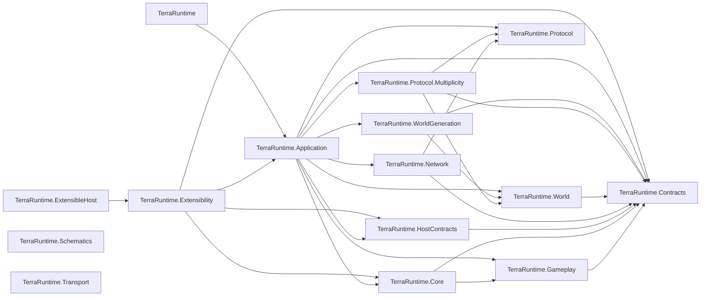
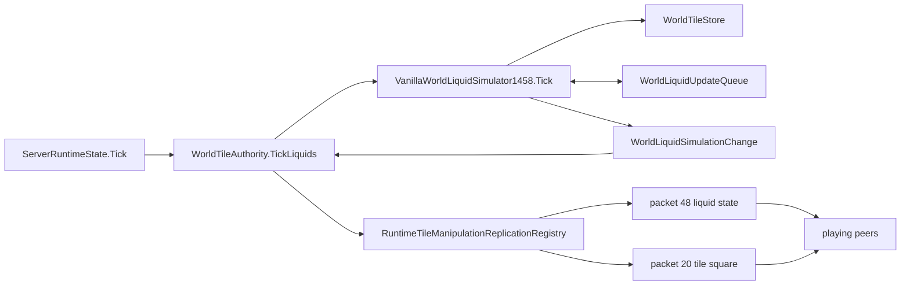
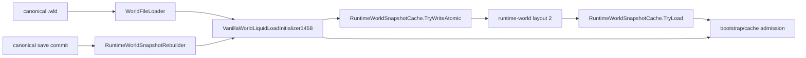
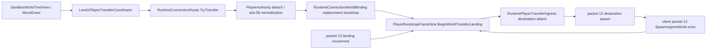
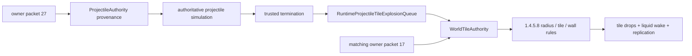
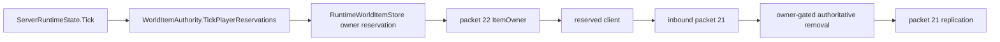
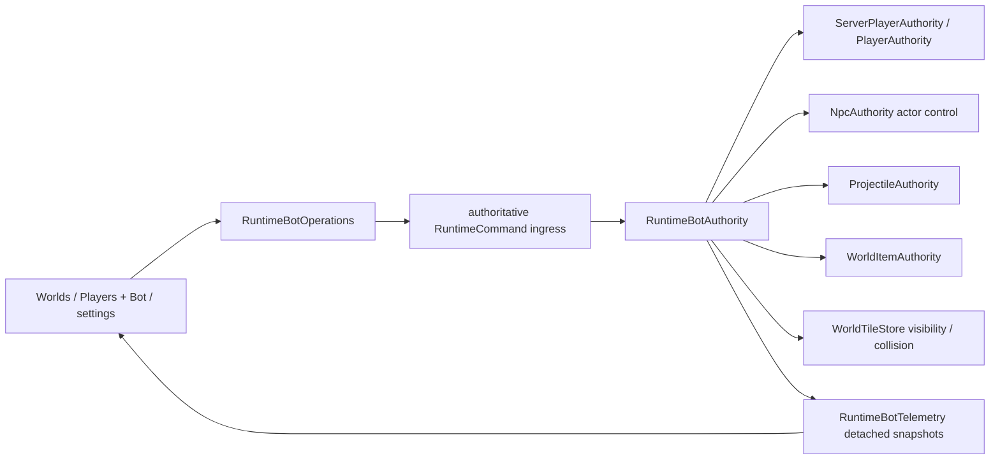
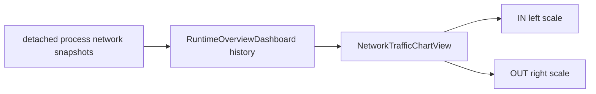

# Production graph

Last structural refresh: 2026-09-07.

This page records the dependency and ownership graph that is expensive to reconstruct repeatedly. It describes shipping projects under `src/`; tests are intentionally omitted.

## Project-reference graph

`TerraRuntime.Schematics` and `TerraRuntime.Transport` currently have no project references in their own `.csproj` files. The graph above is about compile-time references, not every runtime/data-flow edge.

## Authoritative liquid runtime path

Ownership/invariants for this path:

- `ServerRuntimeState.Tick` is on the authoritative game-loop path.
- `WorldTileAuthority` owns the runtime integration point for authoritative tile/liquid mutation and replication.
- `VanillaWorldLiquidSimulator1458` mutates `WorldTileStore` and consumes bounded `WorldLiquidUpdateQueue` work.
- `WorldLiquidSimulationChange.RequiresTileSquareReplication == false` means packet `48` replication is sufficient for the committed liquid amount/kind change.
- `RequiresTileSquareReplication == true` means the mutation changed tile/material state and must replicate through packet `20`; merge changes may carry an explicit source-backed square and `TileChangeType`.
- material merge side effects cross a synchronous prepare/commit boundary owned by `WorldTileAuthority`; unsupported active targets fail before participating liquids are cleared.
- a committed material merge is represented by its packet-20 tile square, not redundant packet-48 updates for the liquid cells cleared as part of that merge.
- Re-enqueued liquid work must not allow one tile to consume multiple logical vanilla update steps in the same TerraRuntime server tick.
- The live work slice follows the pinned dedicated-server budget: `curMaxLiquid = 25000 - players * 250`, divided by `cycles = 10 + players / 3`, capped at 2500 entries on an empty server. Each world computes its own equal-TPS slice; no process-global backlog can starve another world.
- Zero-liquid cells do not enter the active queue. A committed tile mutation explicitly wakes adjacent non-empty liquid. The simulator rents its large per-tick change scratch from `ArrayPool` and returns it after replication processing.

## Canonical load and runtime-cache preparation path

Ownership/invariants for this path:

- canonical `.wld` bytes remain the persistence/recovery source of truth; post-load preparation mutates only the unpublished runtime candidate;
- the supported normal-world preparation order is `QuickWater -> WaterCheck -> quickSettle drain (maximum 100000 iterations) -> WaterCheck`;
- runtime-cache layout `2` is a semantic contract as well as a binary layout: `TryWriteAtomic` rejects any `WorldTileStore` that does not carry the post-load-prepared marker;
- only `TerraRuntime.World` can set that marker. Cache decode restores it after complete layout/hash/world validation; application code cannot forge it;
- a post-save runtime-cache rebuild replays the same preparation before atomic cache publication, so cache hit, canonical fallback and save-triggered rebuild converge on the same runtime liquid state;
- Remix/Zenith post-load remapping remains fail-closed before cache publication until its generation-only inputs are represented.

## Live cross-world player transfer path

Ownership/invariants for this path:

- cross-world position is not portable state; destination authoritative attach owns the destination world spawn;
- vanilla inventory slot 58 is `Main.mouseItem`; detach moves a non-empty cursor stack exactly once into an empty main slot 0..49 or aborts before source detach. Destination publishes an explicit empty slot 58 before the normalized inventory image;
- the synthetic packet 12 is a world-handoff frame, not permission for its immediate client echo to create another authoritative respawn;
- while the landing gate is active, a client packet 12 with `SpawnContext=SpawningIntoWorld` is consumed as transfer echo and cannot overwrite the correction target;
- stale packet-5 inventory echoes and packet-13 movement from the old world remain rejected/corrected until the client lands near the destination spawn.

## Trusted projectile terrain-explosion path

Ownership/invariants for this path:

- only a generation admitted by strict weapon/ammo/volley provenance can enqueue terrain destruction; client packet 17 is never the explosion authority;
- Bomb/Dynamite, admitted launcher/Mini Nuke types and Celebration children use exact source-backed defaults. Celebration holder 714 stays untrusted and children 715..718 use a separate aiStyle-147 simulation slice;
- `RuntimeProjectileTileExplosionQueue` observes committed trusted termination and carries the exact type-derived definition into `WorldTileAuthority` in the same runtime tick;
- `WorldTileAuthority` applies strict radius membership, `CanExplodeTile`, wall eligibility, transactional drops, liquid wake and packet replication. Unknown types and unsupported tile/object cases fail closed;
- a short-lived, bounded `RuntimeProjectileTileExplosionEchoTracker` consumes only exact owner/tile/action convergence echoes after authoritative mutation. The network packet-17 ceiling remains an emergency containment boundary, not gameplay authority.

## Server-owned world-item pickup path

The current `WorldItem.FindOwner` slice runs every five ticks and selects the nearest live player that has an empty ordinary inventory slot. Inbound packet 22 is never accepted as ownership. Packet 21 may remove an existing item only when its sender is the exact current reservation owner; another playing connection fails closed. Stacking, special pickup magnets and alternate-storage routing remain outside this admitted slice.

## Operator bot ownership path

Ownership/invariants for this path:

- `TerraRuntime.Application.Bots` owns bot lifecycle and high-level policy only. It does not own a parallel player/NPC/projectile/item simulation.
- source-pinned bot content facts live in `TerraRuntime.Gameplay.Bots`; `TerraRuntime.Core` has no bot-specific dependency. Generic NPC actor-control capability remains a Core/runtime primitive because trusted-host actors use it too.
- PlayerBot actor state is a normal server-owned player and crosses existing server-player/player/projectile/world-item authority boundaries. Held-weapon selection and use animation are committed through `ServerPlayerAuthority`; trusted ranged and melee damage continue through the existing projectile and player-owned NPC combat finalizers. Pickup, healing and admitted buff use are unconditional bot policy, not parallel UI-selected execution paths.
- PlayerBot target acquisition and predictive trajectory admission read the authoritative `WorldTileStore`. A blocked line or simulated tile/liquid collision rejects the attack before ammo consumption; movement obstacle probes are part of the existing server-player dry-physics path. Follow/Guard writes a per-bot offset `MoveTo` intent with a distinct movement phase. A clear level route targets the protected player's ground level so ordinary locomotion walks; a materially higher player or blocked direct rectangle raises and briefly holds an airborne formation target so the existing jump/Fishron-wing physics actually ascends. Functional accessory slots remain normal authoritative inventory, and their admitted Terraspark/Magiluminescence parameters are resolved by the shared server-player physics path.
- NpcBot is a normal authoritative NPC actor bound to an exact `ActorControllerId`; only source-verified controlled-motion families are admitted. The current controlled roster is ground fighters plus AI_002 flying-eye steering, AI_005 flyer pursuit and the ordinary pre-wander AI_014 bat pursuit slice. Follow/Guard supplies a separated per-bot escort coordinate, while the replicated vanilla NPC target remains `255`; UI enumeration deduplicates exact NPC types before presentation.
- NpcBot uses the vanilla NPC body only as a trusted presentation/motion actor: bot spawn forces `DamageOverride=0` and `DontTakeDamage=true`. Because packet 23 does not carry a per-instance friendly/damage override and an unmodified client derives contact behavior from the NPC type, the controller also keeps the body outside the followed player's collision rectangle. Until bot-specific death/drop semantics exist, these rules prevent operator actors from entering ordinary contact-damage, death, loot or progression farming paths.
- bot mutations are serialized through the authoritative runtime command queue. Terminal.Gui consumes detached immutable telemetry and never receives mutable actor stores. The shipped `+ Bot` button invokes `RuntimeBotOperations.CreateAsync` through its real `Command.Accept` binding; it is not a presentation-only placeholder.
- unsupported bot content/AI/combat semantics are rejected rather than approximated. In particular, NpcBot offensive Guard is not synthesized through a fake player projectile owner.

## Terminal UI network presentation path

This is presentation-only state. IN and OUT packet-rate histories share one plot but use independent scale maxima; byte throughput remains numeric telemetry beside the chart. The UI must not feed chart state back into network/runtime authority.

## Change-impact shortcuts

| Concern | Start here | Usually inspect next |
| --- | --- | --- |
| Runtime tick ordering | `ServerRuntimeState.Tick.cs` | subsystem authority/store, replication |
| Client tile/liquid admission | `WorldTileAuthority.cs` | mutation service, budgets, Multiplicity codec |
| Projectile terrain explosions | `ProjectileAuthority` / `RuntimeProjectileTileExplosionQueue.cs` | `WorldTileAuthority.cs`, 1.4.5.8 explosion facts/rules, echo tracker, packet-17 budgets |
| World-item pickup ownership | `WorldItemAuthority.cs` | `RuntimeWorldItemStore`, replication registry, packet 21/22 ingress |
| Liquid simulation | `VanillaWorldLiquidSimulator1458.cs` | `WorldLiquidUpdateQueue.cs`, `WorldTileStore.cs`, snapshot persistence, replication |
| Tile/material replication | `RuntimeTileManipulationReplicationRegistry.cs` | `TerrariaTileSquareCodec`, `TerrariaLiquidCodec` |
| Snapshot liquid persistence | `RuntimeWorldSnapshotCache.*.cs` | `WorldLiquidUpdateQueue`, `WorldTile` |
| Canonical load / runtime-cache admission | `WorldStartupPreparation.cs` | `VanillaWorldLiquidLoadInitializer1458.cs`, `RuntimeWorldSnapshotCache.*.cs`, `RuntimeWorldSnapshotRebuilder.cs` |
| Vanilla world generation | `TerraRuntime.WorldGeneration` | generation plan/provider, `CaveHousePlacement1458`, `TerraRuntime.World`, world-file writer/loader |
| Sandbox orchestration | `TerraRuntime.Application` sandbox owners | world generation/load path, player transfer/bootstrap, process worker contracts |
| Cross-world inventory conservation | `PlayerAuthority.Transfer.cs` | `RuntimeConnectionRoute`, landing gate, packet-5 ingress, transfer tests |
| Protocol wire semantics | `TerraRuntime.Protocol.Multiplicity` | `TerraRuntime.Protocol`, official 1.4.5.8 server/client behavior |

When a change crosses one of these rows, refresh the relevant graph rather than assuming the old impact boundary still holds.
