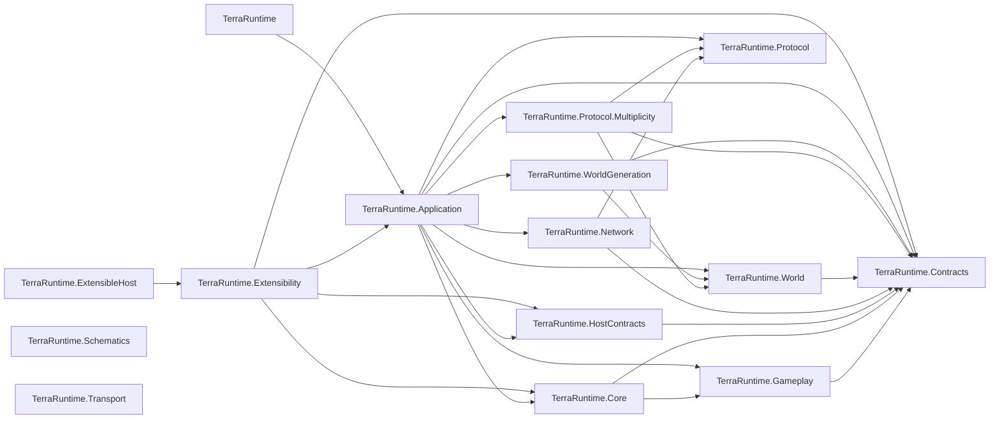
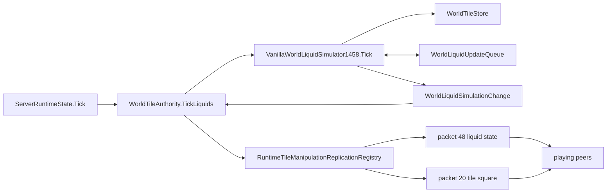
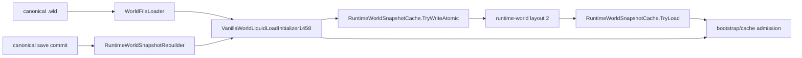
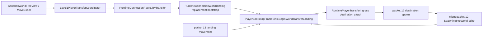
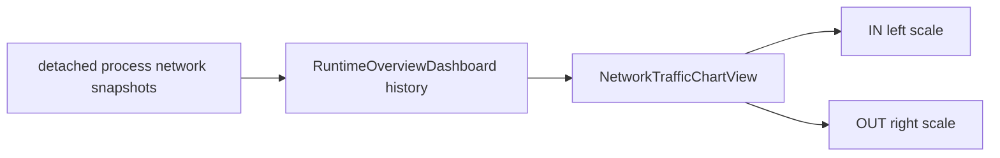

# Production graph

Last structural refresh: 2026-09-06.

This page records the dependency and ownership graph that is expensive to reconstruct repeatedly. It describes shipping projects under `src/`; tests are intentionally omitted.

## Project-reference graph

`TerraRuntime.Schematics` and `TerraRuntime.Transport` currently have no project references in their own `.csproj` files. The graph above is about compile-time references, not every runtime/data-flow edge.

## Authoritative liquid runtime path

Ownership/invariants for this path:

- `ServerRuntimeState.Tick` is on the authoritative game-loop path.
- `WorldTileAuthority` owns the runtime integration point for authoritative tile/liquid mutation and replication.
- `VanillaWorldLiquidSimulator1458` mutates `WorldTileStore` and consumes bounded `WorldLiquidUpdateQueue` work.
- `WorldLiquidSimulationChange.RequiresTileSquareReplication == false` means packet `48` replication is sufficient for the committed liquid amount/kind change.
- `RequiresTileSquareReplication == true` means the mutation changed tile/material state and must replicate through packet `20`; merge changes may carry an explicit source-backed square and `TileChangeType`.
- material merge side effects cross a synchronous prepare/commit boundary owned by `WorldTileAuthority`; unsupported active targets fail before participating liquids are cleared.
- a committed material merge is represented by its packet-20 tile square, not redundant packet-48 updates for the liquid cells cleared as part of that merge.
- Re-enqueued liquid work must not allow one tile to consume multiple logical vanilla update steps in the same TerraRuntime server tick.

## Canonical load and runtime-cache preparation path

Ownership/invariants for this path:

- canonical `.wld` bytes remain the persistence/recovery source of truth; post-load preparation mutates only the unpublished runtime candidate;
- the supported normal-world preparation order is `QuickWater -> WaterCheck -> quickSettle drain (maximum 100000 iterations) -> WaterCheck`;
- runtime-cache layout `2` is a semantic contract as well as a binary layout: `TryWriteAtomic` rejects any `WorldTileStore` that does not carry the post-load-prepared marker;
- only `TerraRuntime.World` can set that marker. Cache decode restores it after complete layout/hash/world validation; application code cannot forge it;
- a post-save runtime-cache rebuild replays the same preparation before atomic cache publication, so cache hit, canonical fallback and save-triggered rebuild converge on the same runtime liquid state;
- Remix/Zenith post-load remapping remains fail-closed before cache publication until its generation-only inputs are represented.

## Live cross-world player transfer path

Ownership/invariants for this path:

- cross-world position is not portable state; destination authoritative attach owns the destination world spawn;
- the synthetic packet 12 is a world-handoff frame, not permission for its immediate client echo to create another authoritative respawn;
- while the landing gate is active, a client packet 12 with `SpawnContext=SpawningIntoWorld` is consumed as transfer echo and cannot overwrite the correction target;
- stale packet-13 movement from the old world remains rejected/corrected until the client lands near the destination spawn.

## Terminal UI network presentation path

This is presentation-only state. IN and OUT throughput histories share one plot but use independent scale maxima; the UI must not feed chart state back into network/runtime authority.

## Change-impact shortcuts

| Concern | Start here | Usually inspect next |
| --- | --- | --- |
| Runtime tick ordering | `ServerRuntimeState.Tick.cs` | subsystem authority/store, replication |
| Client tile/liquid admission | `WorldTileAuthority.cs` | mutation service, budgets, Multiplicity codec |
| Liquid simulation | `VanillaWorldLiquidSimulator1458.cs` | `WorldLiquidUpdateQueue.cs`, `WorldTileStore.cs`, snapshot persistence, replication |
| Tile/material replication | `RuntimeTileManipulationReplicationRegistry.cs` | `TerrariaTileSquareCodec`, `TerrariaLiquidCodec` |
| Snapshot liquid persistence | `RuntimeWorldSnapshotCache.*.cs` | `WorldLiquidUpdateQueue`, `WorldTile` |
| Canonical load / runtime-cache admission | `WorldStartupPreparation.cs` | `VanillaWorldLiquidLoadInitializer1458.cs`, `RuntimeWorldSnapshotCache.*.cs`, `RuntimeWorldSnapshotRebuilder.cs` |
| Vanilla world generation | `TerraRuntime.WorldGeneration` | generation plan/provider, `TerraRuntime.World`, world-file writer/loader |
| Sandbox orchestration | `TerraRuntime.Application` sandbox owners | world generation/load path, player transfer/bootstrap, process worker contracts |
| Protocol wire semantics | `TerraRuntime.Protocol.Multiplicity` | `TerraRuntime.Protocol`, official 1.4.5.8 server/client behavior |

When a change crosses one of these rows, refresh the relevant graph rather than assuming the old impact boundary still holds.
