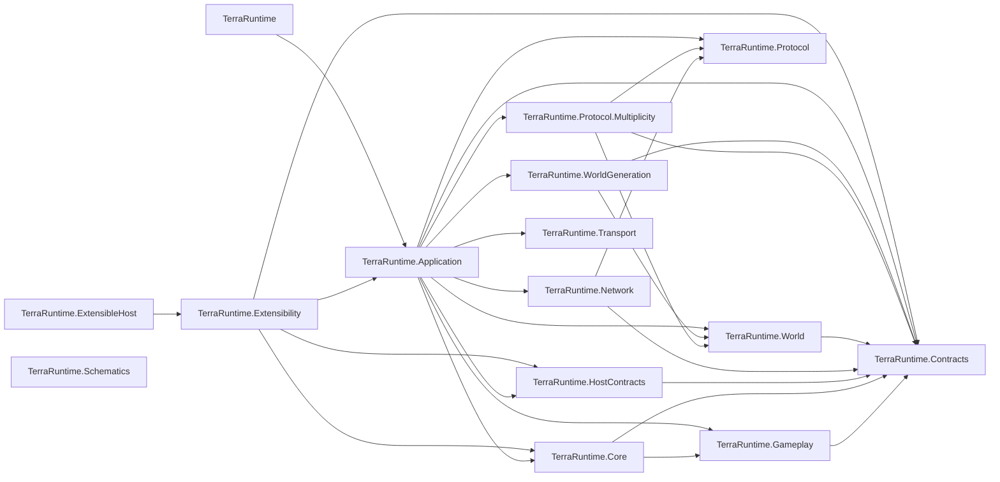
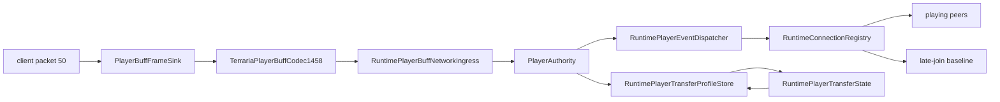
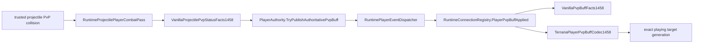
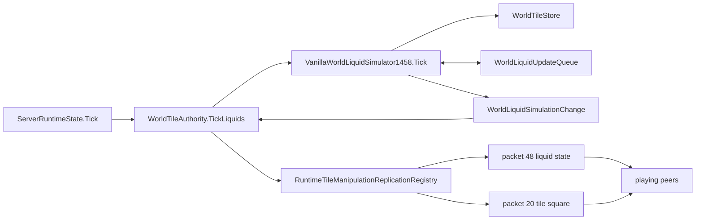
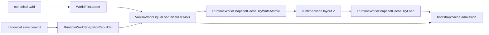
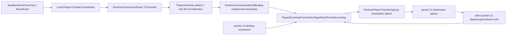
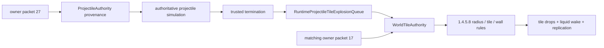
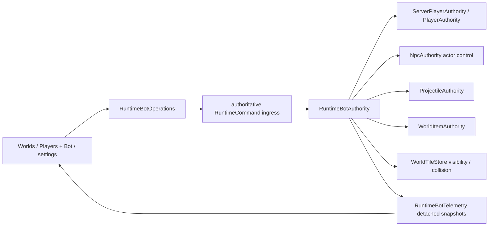
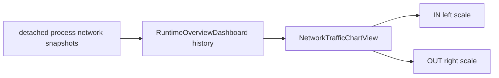

# Production graph

2026-09-11 local disconnect correction: socket receive -> `RuntimeConnectionRoute` -> `ProjectileLifecycleFrameSink` -> typed `TerrariaProjectileDestroyState` -> existing authoritative projectile ingress/registry. `packet 29` retains a finite final position even when its raw key cannot resolve locally, because official `MessageBuffer.GetData` case29 forwards that notification; only the existing exact-generation registry lookup grants local mutation. Terminal route state now preserves the rejecting packet ID/length in the connection log. This closes no gameplay-authority boundary and adds no background writer or compatibility fallback.

2026-09-09 complete ordinary Dungeon wiring: RuntimeWorldGenerationExecutor -> DungeonPass -> GraphGenerator(layout/entrance/stairs) -> FeaturePipeline(candidate discovery/pits/spikes/doors/walls/platforms/biome chests/books/basic chests/lights/traps/furniture/paintings/banners/late Gothic doors). Same per-pass RNG, isolated component seeds, retained bounds/protection lists/chest side tables; Gameplay natural prefix roller reused. Shared generation framing handles chandelier cascade, chest support and post-trap neighbors. CanHit crackedBricksSolid defaulttrue unchanged live, Dungeon lighting false. Unknown base-wall profile now rejects BEFORE RNG/mutation, no repeated-wall fallback. No live authority changes.24 complete flat+16 identical-real-prefix+14 campaign original comparisons pass. Bounded R16 status is not independent whole-prefix/all-GenVars/special-seed/world parity. Final acceptance in work-state.

2026-09-09 whole Dungeon WIP: GraphGenerator now retains crawler GenerationBounds/FeatureBounds separately from component protected footprints; FeaturePipeline consumes those bounds (source ten-tile clamp, inflation only for late features). Bookshelves/Lights/Banners are source-order owners; existing platform placement/framing extracted to DungeonObjectPlacement1458 for shared use. No live authority path changed. Chests/traps/furniture/paintings and complete-prefix acceptance remain in progress; see current work-state, not previous final acceptance below.

2026-09-09 Dungeon surfaces: same unpublished FeaturePipeline.Apply -> existing candidate collector -> DungeonSpikes1458 -> existing DungeonDoors1458 -> DungeonWallVariants1458 -> existing DungeonPlatforms1458. New cohesive algorithm owners replace/delete old local spike/radial-wall approximations. Queue is per generation feature instance, no static state/recursion/whole-world scratch. Early sampling uses unpadded retained graph envelope; remaining crawler bounds/decor parity stays open. Live gameplay/player/item/tile/NPC/projectile authorities unchanged.

2026-09-09 Dungeon discovery/doors: existing FeaturePipeline.Apply now calls DungeonFeatureCandidates1458.Collect(actual room.InnerBounds, retained hall.HallDirection, ordered entrance records), then SAME spike stage -> DungeonDoors1458 -> SAME wall variants -> existing DungeonPlatforms1458. Deleted approximate dedup/inset-based discovery and short door-center scan/mutation helpers, no parallel fallback. Shared generation door placement now receives ordinary style. Live WorldRuntime/player/tile/item/projectile/NPC authorities unaffected. Remaining unrelated room-decoration heuristics not silently changed.

2026-09-09 cohesive Dungeon WIP: SAME DungeonPass/Graph.Renderer.RenderEntrance now dispatches Legacy or DungeonSurfaceBuildings1458 Dome/Tower, never a rectangle fallback. Existing graph retains ordered building platform records alongside connection/Legacy candidates. SAME DungeonFeaturePipeline replaces its short fixed-span platform loop with DungeonPlatforms1458 using typed candidates, source clearance/forced placement/shelf flags and shared RNG. Source stores duplicate candidates; no permanent claims/dedup changes their order. Existing tree/wall/smoothing helpers reused; all tile writes remain on unpublished generation workspace, no live authority changes. Full feature candidate scan/doors/decor remain incomplete.

2026-09-09 layout origin: SAME DungeonPass.ApplyDungeon -> DungeonGraphGenerator1458.Generate -> extracted SAME GenerateLayout loop -> existing room/hall renderers. Source precalculated cursor/RNG draw precedes component seeds. DungeonLegacyRoom1458 retains immutable InnerBounds separately from painted Bounds; ResolveEntranceOrigin picks first minimum interiorTop and centerX. Existing connection/entrance/feature owners continue from that anchor. No new class/project/dependency, live authority or fallback. Official component proof and remaining full-Dungeon debt in work-state/verified-vanilla; earlier layout-origin debt paragraphs are historical.

2026-09-09 live falling/mining: WorldTileStore.Set -> bounded WorldFallingBlockUpdates -> SAME WorldTileAuthority.TickFallingBlocks (256checks/16spawns) -> SAME ProjectileAuthority spawn/store/stepper (AI10) -> exact-generation RuntimeFallingBlockProjectiles termination handoff (active+pending128) -> SAME WorldTileAuthority mutation/item transaction. ClearTile is a source-defined operation in the existing VanillaWorldTileMutationService, not a second tile writer. Existing projectile player/NPC passes classify trusted owner255 falling materials and use typed EnvironmentProjectile damage via the existing combat owners; normal packet118 publication retained.

PlayerBot: Perception -> RuntimeBotMining resumable65x65/256-cell search and detached tile+section revision -> deterministic brain Mining action -> existing Navigation and shared server-player pick transaction in WorldTileAuthority. Dirt/Stone corridor work does not let Collect preempt an active ore task; close approach allows normal post-break pickup. Generic TileTarget leases prevent competing claims and release on termination/cancel/despawn; world/bot/goal/section revisions reject stale work. TUI config MiningOre selects eight ordinary ores, no player target required. Existing Follow/Guard assistance/combat/maintenance paths preserved. No new project/dependency, no raw tile writes or direct inventory rewards in bot code. Detailed tested limits and gates are in work-state and verified-vanilla.

2026-09-09 precalculated connection: SAME DungeonGraphGenerator1458 entrance loop -> DungeonEntranceRoute1458 (double interpolation/countdown and shared seeds) -> Renderer.RenderPrecalculatedEntranceSegment -> SAME DungeonLegacyEntranceHall1458.GeneratePrecalculated brush. Old straight painter/catch-up removed, no alternate generation/runtime authority. Graph retains ordered DungeonHallPlatform1458 records; existing feature collector deduplicates their positions before building/room candidates. Metadata flags/chances retained but not all consumed by feature placement. Ordinary nonprecalculated hall path unchanged. Dome/Tower buildings and graph layout origin/top-room metadata still incomplete; detailed proof/resume in work-state.

2026-09-09 Legacy building batch: SAME DungeonGraphGenerator1458.Renderer.RenderEntrance -> DungeonLegacyEntrance1458 for ordinary Legacy only. Graph carries source OldManSpawn as Anchor and optional EntrancePlatform; DungeonFeaturePipeline1458 places that candidate before later room/hall candidates, retaining its existing feature owner. DungeonPass.ApplyDungeon writes source bottom-center converted to position into the existing Workspace.TryAddGeneratedTownNpc. NPC authority/runtime semantics unchanged. GenerationWallPlacement1458 is the shared retained PlaceWall framing owner for Corruption and entrance; no added project, dependency, plan or fallback. Renderer is assembly-internal for direct production-path regression; no production reflection. Dome/Tower stay the existing incomplete implementations, unknown entrance enum fails closed. Detailed source/gates in verified-vanilla/work-state.

2026-09-09 current surface-material batch: SAME DungeonPass1458.Execute -> ApplyGems(shared SmallTerrainRunner1458) / ApplyGravitatingSand / ApplyCleanUpDirt, unpublished Workspace only. Removed old gem-circle painter and old falling-cell transfer/dirt-removal logic; runtime plan/order/RNG owner unchanged. Generic RuntimeWorldItemStore.CopyActive now has a version-validated empty return, no writer/replication change. Bot cadence fixture uses existing ServerPlayerAuthority teleport solely to isolate repeated-swing timing; no bot production change. Final Release5329/5329, WindowsNativeAOT+6smokes and fresh dual-server loading pass; full equality unproven. Details/resume in work-state.

2026-09-09 continuation: existing Renderer.RenderLegacyEntranceSegment -> DungeonLegacyEntranceHall1458 -> shared SmallTerrainRunner1458 narrow AirCavity(-1), component RNG for brush/parameters and caller world RNG for TileRunner. No new worldgen plan/legacy fallback. Gameplay bugfix: packet5 inventory -> packet13 selection -> packet17 -> same WorldTileAuthority now resolves Gravedigger Shovel against verified target set; same edit counter admits bounded18-event shovel burst, ordinary8 unchanged; mutation/drop/replication owners unchanged. Bot Mining orchestration unchanged and now tested for consecutive swings/held pick/drop count; UI explains assisted scope. Falling-block runtime not implemented yet.

2026-09-09 current Dungeon batch: SAME graph Renderer.RenderRoom/RenderHall -> DungeonLegacyRoom1458 / DungeonLegacyHall1458 -> shared DungeonGenerationTiles1458 and unchanged component RNG, unpublished TileStore only. Removed old hall painter/direction chooser; graph/entrance/feature orchestration retained.63 room+135 hall official fixtures match. New geometry exposed smoother's missing tileSolidTop exclusion; corrected using existing collision catalog. Post-load platform->book cascade uses existing loading resolver/kill operation, bounded1x2 region, not a live destruction/drop path. Full acceptance is pending after two real startup regressions; latest work-state owns exact gates. No stage promotion from kernel evidence.

2026-09-09 Dungeon room WIP: SAME DungeonGraphGenerator1458.Renderer.RenderRoom -> DungeonLegacyRoom1458 on unpublished WorldTileStore. Existing component RNG extracted unchanged as internal DungeonUnifiedRandom1458, shared with existing hall/entrance renderer. Room source shell/cavity and float motion replace PaintLegacyRoomStep; existing VanillaWallDefinitionCatalog owns Main.wallDungeon facts. Graph/component identities retained.63 independent official full-cell room fixtures match; negative54 failures, restored78/78 pass. Whole-pass/hall/new full/native gates pending in work-state. Prior Lakes/Slush batch completed31E9/279 checkpoints and local Windows acceptance; no gameplay authority changes.

2026-09-08 Slush WIP joins the Lakes batch: Early.IceBiome exports the original snowTop/bottom and per-row min/max bounds, detached in Workspace. Existing Mid.Slush delegates to SnowMaterialConversion1458 (no RNG), replacing/removing RunSlushBlob. Source stored Silt/Stone conversion and active Jungle60/70/71/72 radius3 Mud preservation retain other fields. Official whole-pass3 fixtures + focused rules pass; actual invalid-active-gate negative fails4. Small real-prefix3 through Lakes/Slush and snow metadata match; larger/full gates pending.

2026-09-08 Lakes WIP: existing Mid.Lakes now invokes SurfaceLakes1458 on Workspace. Early.Tunnels retains original xs[5] columns; Lakes consumes these and mountain-cave/desert/lake metadata. GenerationGrass1458 owns the existing depth-limited dirt/mud recursion for both evil surface and real lake-carving callers, reusing StoneBiomeTiles1458 framing; Mud59->Grass60 is newly admitted and independently exercised. Removed old underground ellipse/FillLiquidEllipse; no alternate generator or live authority. Official kernels12 and complete-pass fixtures6 match; new batch acceptance in work-state.

2026-09-08 Corruption WIP: same MidStage1458.Corruption now delegates ordinary Corruption regions to CorruptionCaves1458 (main/sideways algorithms + ordered regional orchestration). Reuses EvilBiomeSurface1458, EvilAltarPlacement1458, SmallTerrainRunner1458; EvilBiomeTiles1458 owns shared orb/heart placement previously inline in Crimson. Deleted generic CarveEvilChasm and broad deep material conversion. All mutations remain unpublished Workspace only. Official36 cave +6 Corruption pass kernel matches; fresh/full acceptance pending in work-state.

2026-09-08 host-loader initialization-cycle correction: HostModuleLoadContext now has explicit type initialization before its first instance constructor. SharedContractAssemblies and resolver behavior are unchanged; Terminal.Gui's module-init assembly scanner no longer starts lazily from this context's Load callback after collectible modules are published. Captured stalled parallel full-suite stacks establish the cycle; order negative control1/1 and affected74/74. This belongs to CoreCLR extensibility only, no NativeAOT dynamic loader addition.

2026-09-08 Crimson surface: same MidPass -> EvilBiomeSurface1458 -> existing StoneBiomeTiles1458.Frame on unpublished Workspace. Shared frame owner admits only verified additional Cobweb51 no-op; no live simulation change. Same caves/altars/deferred hearts owners compose in source order. Six complete official Crimson kernels and16 grass kernels verify cells/RNG; current new acceptance in work-state. Corruption generic geometry still open.

2026-09-08 evil altars WIP: existing Mid Crimson and late JungleStructure Altars invoke generation-only EvilAltarPlacement1458 on unpublished Workspace. Existing Shimmer pass exports its current center through Workspace.VanillaShimmerPosition for mandatory downstream exclusion. No new provider, live tile authority, game dependency or fallback. Component official evidence and pending current acceptance are in work-state.

Crimson cave component current acceptance: full4783/4783, WindowsNativeAOT/sixsmokes and NativeAOT-produced Crimson file dual load pass. Only additional non-generation edit is the existing GameLoopTests SlowCommandState fixture: actual ThreadCpuClock consumption replaces elapsed-wall work; production clocks/budgets unchanged. Geometry remains the same existing Mid pass and unpublished Workspace. No stage32 parity promotion; remaining surface/altar/Corruption sequencing in work-state.

2026-09-08 Crimson geometry: MidPass.ApplyEvilBiome creates pass-local CrimsonCaves1458 only for ordinary Crimson; Start per source-selected region, deferred PlaceHearts once afterward. It owns geometry and <=100 endpoints, not live tile/item authority. Shared Workspace, RNG, CanEvilReplace/collision remain existing owners. Old generic vertical chasm is no longer used by Crimson; Corruption remains approximate. See current gates in work-state.

Evil placement/excavation final bounded slice: all4770 Release tests, WindowsNativeAOT/sixsmokes and fresh-map dual load pass. Corruption ore/orb excavation exclusions are explicitly NOT applied to Crimson. Same existing provider/Workspace/authorities; no geometry-stage promotion. Next separate ChasmRunner and CrimStart families without duplicating live gameplay semantics. Detailed evidence/resume in work-state.

2026-09-08 evil-biome WIP: existing MidPass.ApplyEvilBiome -> EvilBiomePlacement1458 (surface scan / per-selection bounded rejection state), consuming the same Workspace desert bounds and pass-local random stream. Fixed-coordinate PickEvilCenter removed. Existing chasm now uses EvilBiomeTiles1458 generation-only protection/excavation and the existing World wall catalog. No new provider/live authority/dependency. Generic geometry remains approximate; acceptance/status in work-state.

Underworld complete ordinary prefix now matches all9 canonical cases, including full cells, nextRNG and ordered empty dresser metadata. Shared World QuickWater pre-Dungeon path includes the source LavaCheck desert-wall7x7 kind conversion; loading excludes it. Existing owners unchanged. Retained EarlyTerrainReference1458Tests now28 rows/case;46P+30C remain. WindowsNativeAOT/fresh dual-load and full sequential4728 pass; final default full recheck in work-state.

Current liquid contact correction stays inside World VanillaWorldLiquidSimulator1458: QuickWater dispatcher and shared generation/loading sub24 reaction. UnderworldLiquidPreparation1458 and normal loading retain their existing call paths. No separate simulator, new public API or live tile-cut bypass. Current acceptance in work-state.

2026-09-08 Underworld framing: existing UnderworldVegetation -> AshTreeGrower1458 now owns bounded fresh-root post-growth framing; existing HellFortGenerator1458 preserves incoming brick frames and frames flat platform endpoints. No new provider/authority/runtime dependency or duplicate gameplay path. Per-component official goldens retained in54 tree +12 fort tests; Small prefix frames/RNG match but liquids do not. Full/native current-batch gates are recorded in work-state; earlier4638 evidence is the preceding batch.

2026-09-08 deposits downstream correction: existing FinalCleanup -> GenerationDesertObjectFraming1458 now recognizes incomplete485 antlion-larva footprints (four generated styles) as well as484. This is unpublished generation cleanup only; no new provider/live tile mutation/NPC spawn/drop path. WaterCheckLoading still rejects ambiguous objects, unchanged. Canonical Large1458 post-load now passes; complete4638 suite and WindowsNativeAOT/fresh dual-load green.

2026-09-08 sky/deposit/web batch: same Early MountCaves exports bounded originalXY to Workspace; same Mid FloatingIslands exports bounded orderedXY/style/lake. Mid DirtToMud/Silt/Shinies invokes MineralDeposits1458 scheduling -> existing SmallTerrainRunner1458; old blob algorithms deleted. Mid Webs consumes retained mountain anchors and the same runner's strictly admitted web override. All mutation remains unpublished Workspace with pass-local shared RNG; no live tile/item authority, reflected game dependency, provider or fallback added. Downstream IslandHouse and general early StructureMap consumers remain open.

2026-09-08 PlayerBot architecture supersedes older monolithic/NpcBot operator diagrams below: WorldRuntime.Identity -> ServerRuntimeState -> RuntimeBotAuthority lifecycle -> RuntimeBotController -> detached RuntimeBotPerception -> IRuntimeBotBrain -> RuntimeBotActionExecutor -> typed navigation/combat/inventory/world-interaction adapters -> SAME existing server-player/projectile/NPC/item/tile authorities. Hostile operator NpcBot stays removed. Reduced observations are immutable values with bot/player/world/session/goal/revision identities; telemetry carries them detached. Per-runtime RuntimeBotResourceLeases coordinates exact items/tiles but grants no mutation authority. Follow/Guard source-backed mechanics extracted, not duplicated. Assisted Mining/Collect/ReturnToPlayer modes are bounded; generic autonomous gameplay remains unsupported. Internal synchronous contract only, no LLM/HTTP/reflection/dependencies/public SDK. See paired runtime-bot-architecture.md.

2026-09-08 mining/pickup correction: WorldItemFrameSink now decodes ordinary compact packet151 via TerrariaWorldItemRemovalDecoder1458 and calls the SAME RuntimeWorldItemIngress.TryPostRemove -> generation-captured WorldItemRemoveRuntimeCommand -> WorldItemAuthority owner gate -> RuntimeWorldItemStore.TryRemove. No alternate remover or active leased-slot grant. TerrariaWorldItemFrameEncoder.TryEncodeRemoval now owns151 for both ordinary removal and existing instanced expiry; obsolete lease-only encoder name and misleading enum name migrated directly, no aliases. WorldItemAuthority's existing reservation-space query recognizes verified partial inventory stacks. Network policy/pool capacity unchanged; live packet17 mining and bot assistance still share their previous authority path.

2026-09-08 stone-biome batch: existing MidPass.Marble/Granite invoke MarbleBiome1458 and GraniteBiome1458 directly on unpublished Workspace; shared ellipse method is deleted. StoneBiomeTiles1458 owns the generation-only TileFrame/SmoothSlope/PlaceTight/unchecked-stalactite/ClearTile slice, reusing existing collision/slope-protection catalogs. GenerationFieldRandom1458 is the unchanged former DesertHive field RNG shared with Granite, not a second shared-RNG authority. Workspace retains bounded ordered Marble/Granite structure rectangles (padding8); these are not new persisted fields or a complete general StructureMap implementation. CurrentRockLayer and retained liquid lines are required; unknown framing aborts. No live mining/loot/actor/client authority, dynamic assembly loading or fallback path is added. Independent22-stage prefix matches198 checkpoints; final batch acceptance remains tracked in work-state.

2026-09-08 Mushroom Patches: existing MidPass invokes MushroomBiome1458 on its unpublished Workspace. It retains at most50 source centres, composes MushroomPatch1458 brush/roots, then whole-map nonrecursive grass and ordered topology cleanup. The existing small Underworld runner is now SmallTerrainRunner1458, reused for the strictly admitted mud-root arguments; Underworld callers migrated directly with no alias, fallback or alternate generator. Unknown cleanup neighbours abort this candidate; no live mining, actors, loot, reflection or client authority are introduced. GenVars-style centres remain generation-only metadata, not a new persisted world-file field.

Full Desert integration: WorldSmoother's existing IsSolidIdentity applies source inherited484 non-solidity; no global collision catalog change. Existing FinalCleanup invokes GenerationDesertObjectFraming1458 for incomplete484 removal only. Existing World loading liquid resolver admits coherent484/485 footprints, keeps malformed/foreign refusal, and suppresses live side effects. Generation Validator1458 reuses internal World.VanillaLiquidQuickWaterFacts1458 via the existing friend assembly instead of a duplicate boulder catalog or another validator path.

2026-09-08 Full Desert: existing MidPass1458.FullDesert composes DesertSurface1458, DesertEntrances1458, DesertHive1458 and DesertDecoration1458 on the same unpublished Workspace. Removed approximate shell/chambers and invented placement fallback; no secondary generator, reflection or live mutation authority. Workspace retains the existing underground desert region plus source hive/density/structure bounds; general StructureMap consumers remain open. WorldGenerationRequest.ResolveVanillaSeed1458 is the one shared seed identity owner for existing Core executor reseeding and WorldGeneration material FastRandom; this avoids Core/WorldGeneration references and corrects UTF-8 hashing to source low-UTF16-byte CRC. Independent bounded prefix evidence extends to171 checkpoints/19 stages, with full cell flags and desert metadata at Full Desert.

2026-09-08 generated-door correction: existing FinalPass1458.FinalCleanup invokes GenerationObsidianDoorFraming1458 on the unpublished Workspace only. The bounded source Obsidian-door check removes fragments damaged by overlapping HellForts; no live door, item-drop, player mining or alternate generation owner is introduced. Complete object framing and other door styles remain open.

2026-09-08 Jungle/surface continuation: existing EarlyPass1458 Jungle uses a bounded generation-only natural-terrain KillTile slice and verified wall placement/RNG, still writing the unpublished Workspace directly. Existing MidPass1458.MudCavesToGrass now calls JungleMudSurface1458 on that same tile store for whole-map grass and small-component removal. Unknown active semantics fail before surface mutation; no live mining/loot/packet ownership or secondary world writer is introduced.162 official prefix cell/RNG/pyramid checkpoints cover18 stages; diagnostic clump counters and remaining GenVars/StructureMap are outside this bounded proof.

2026-09-08 early-prefix continuation: the same EarlyPass1458 instances retain Terrain current-surface state and execute source-backed Dunes/cave/Grass corrections directly on the unpublished Workspace. No secondary generator, live tile mutation owner, reflected game dependency or test-only fallback was introduced. EarlyTerrainReference1458Tests executes shipping SourceBackedFinal1458 passes with144 independent official cell/RNG/pyramid checkpoints; missing-surface scans stop before invoking the runner. This graph does not imply complete GenVars/StructureMap retention or Jungle-and-later parity.

2026-09-08 worldgen all-pass continuation: existing SourceBackedFinal1458 composition remains unchanged. Reset -> Terrain (advanced pass-local RNG, layer/liquid publication to unpublished Workspace) -> TerrainLayers (state-only copy, missing liquid state throws) -> existing biome/cave/structure passes. Existing PostSettlePass1458.RemoveWaterFromSand now drains source-admitted inland surface columns only; it does not run a new liquid simulator or live tile authority. The entire107 ordinary source positions/7 internal stages are pinned by the complete-order regression and documented in the109-registration audit. FullDesert/Dungeon and complete generation-settle orchestration remain approximation debt, not closed by load/graph tests.

Plantera/Golem loot continuation (2026-09-08): `NpcAuthority` passes loaded `DownedPlantera` to the existing `RuntimeNpcNetworkCombatPipeline`; exact-generation authoritative kill -> interaction ledger -> NPC-specific Plantera/Golem evaluator -> existing world-item/instanced-lease replication owners -> existing boss progression/death effects. Plantera consults baseline OR live progression before death effects mark the flag; unknown initial Classic baseline withholds that reward slice. Clientless/stale-generation interactors receive no addressed bag and never redirect a copy to a human observer. Item catalogs add world-drop facts/natural prefixes only, not weapon-use authority. Packet52 Temple Key unlocking remains an unconnected progression debt, not a hidden fallback in this graph.

Bot cave/squad continuation (2026-09-08): ServerRuntimeComposition passes the existing WorldTileAuthority into RuntimeBotAuthority. Accepted client simple pick commits produce short-lived generation-keyed observations inside that same tile owner. Bot Follow/idle-Guard policy asks TryAssistUndergroundMining only for an obstruction near the followed player; the owner checks verified surface, both live actors, recent observed mining, inventory pick and narrow natural tile rules, then reuses prepared drop/mutation/replication. Inventory slot6 is the verified Vortex Pickaxe; SetHeldItem/PresentItemUse use existing player replica events. No network mining bypass, alternate world writer or authority duplication. BotTraversal retains normal movement intent and adds bounded49x49 local cave search; mirror checks rounded recall-body landing. Squad target scoring/positions operate only over this authority's bots sharing the same protected PlayerHandle; combat pipeline remains unchanged.

2026-09-08 bot/sky continuation: RuntimeBotAuthority still submits MoveTo; BotTraversal performs bounded full-body read-only route probes only. Functional equipment resolves shared ServerPlayerAuthority physics, including Fishron admission, airborne parameters and Insignia; the existing generation-keyed jump state retains bounded flight time and existing lifecycle clears it. No bot-local velocity/HP pipeline. Existing ordinary MidPass.FloatingIslands calls SkyIsland1458 on Workspace.TileStore/shared VanillaRandom; old cloud/lake/anchor fallback helpers removed, no alternate generator. Exact component geometry is independently verified; later houses/Dungeon/final-map equality remain open.

Ordinary Underworld continuation: existing MidPass1458 calls UnderworldTerrain1458 on the isolated Workspace, using exact Early-pass liquid lines and pass-local RNG; the existing vegetation/HellFort/decorations remain subsequent owners. Generation-only preparation surrounds the shared World liquid flow with pre-Dungeon/pre-Aether phase rules, without adding a live authority path. Existing Jungle/Final settle passes invoke the bounded source embedded-solid liquid clearing slice. VanillaDyePlantFrame1458 is shared by the generation writer and loading-only liquid-death admission; no live plant loot/mining authority is added. Complete late settle orchestration and reference-world parity remain open.

Rail/ocean correction: existing MicroBiomesPass1458.TryPlaceTrack reserves the maximum clearance, computes source ordinary single-track frame indices before mutation, then clears/publishes the same isolated Workspace. No replacement worldgen plan. PlayerTeleportRequestFrameSink packet73 -> RuntimePlayerTeleportIngress -> PlayerAuthority now calls VanillaOceanLanding1458 on its world's TileStore, with verified non-Skyblock surface passed by ServerRuntimeComposition. Existing collision queries, player revision/motion commit and RuntimeConnectionRegistry packet65 remain owners; no client destination coordinates or new mutation path. Failed packet65 uses source bit2. Pre-teleport section delivery ordering remains open; existing packet13 streaming unchanged.

Guide-doll continuation: WorldItemFrameSink decodes source packet39 through the bounded protocol adapter, RuntimeWorldItemIngress captures exact connection/item generation, WorldItemAuthority owns owner-gated release. Packet22 remains ignored inbound. Initial packet21 applies source local/all-player delay, and RuntimeWorldItemStore owns silent countdown/motion updates under its existing seqlock. Existing world tick calls the bounded267-only motion/contact pass before reservation discovery; committed whole-stack removal precedes NpcAuthority.ApplyBurnedGuideDoll. Victim strikes reuse RuntimeNpcNetworkCombatPipeline.CommitNonPlayerDamage; source SpawnWOF placement queries the existing aggregated player snapshots/world tile store, then RuntimeNpcStore.TrySpawnIntent materializes the boss. No alternate NPC/loot/progression store or client boss authority. Flat unreserved item motion only; client-reserved movement, general item burning/physics and remaining lava/buff cases remain open.

Player-lava continuation: ServerRuntimeComposition carries already verified world seed/difficulty facts to the existing ServerRuntimeState tick. After bot intent and before server-player motion, ServerPlayerAuthority.TickLava updates bounded generation-keyed environmental state. Existing VanillaPlayerCombatEquipment supplies verified protection; RuntimePlayerDamageImmunityStore now has a separate Lava channel. Direct hits and regeneration loss share ServerPlayerAuthority's existing HP/vitals/death commit. Typed EnvironmentDamageCause distinguishes contact/burning in packet118, without adding client authority. RuntimeServerPlayerEvents.ServerPlayerBuffTypesUpdated projects owned OnFire through ServerPlayerReplicaStore's retained packet50 baseline and the existing per-world registry fanout; it is type-only presentation, not duration input. No item, transport or worldgen path changed. This supersedes the earlier server-player lava absence below; NPC DoT/shared immunity and world-item lava remain absent, Level2 deferred.

Biome/lava continuation: existing ServerRuntimeState/ServerRuntimeComposition -> NpcAuthority accepts optional IVanillaNpcRandom for the same natural-spawn path, no separate test implementation. NpcAuthority feeds source ordinary Underworld choice from live/persisted progression and current NPC snapshots, then keeps the existing definition/AI gate. Its committed AI tick now also invokes the bounded RuntimeNpcLavaContactPass1458 for known ordinary-world facts. The pass queries WorldTileStore via the independent full-body LavaCollision helper and calls RuntimeNpcNetworkCombatPipeline.TryStrikeEnvironment. Existing town-NPC melee and environment strikes share CommitNonPlayerDamage, preserving one non-player HP/death/loot/progression finalizer. No packet sink gains terrain, ownership or combat authority. Contact cooldown arrays are capacity-bounded and NPC-generation keyed; full NPC buff/shared immunity and server-player/item lava passes remain absent. Deferred Level2 unchanged.

NPC continuation: NpcAuthority attaches real WorldTileStore width + verified WorldSurfaceTiles to the existing VanillaNpcTargetingAiStepper context. Duke AI69 and its existing projectile-intent planner share one enrage predicate; missing bounds refuses root/planning instead of guessing ocean status. The normal RuntimeNpcAiStateExecutor/commit path owns phase damage, motion and Cthulhunado ai2; no alternate combat/spawn pipeline. Ordinary defDamage difficulty scaling is applied before AI phase overrides, because contact damage consumes DamageOverride directly. Underworld's existing MidPipeline calls UnderworldLava1458 between current carving and Hellstone, before vegetation/forts, on the same unpublished Workspace without RNG draws. Geometry/ore helpers remain partial.

Bot tester correction: PlayerAuthority combat-target lookup now explicitly includes ServerPlayerAuthority alongside connection membership; direct-melee validation and bounded trusted-projectile/explosion target snapshots reach the same owned server-player HP/immunity commit. ServerPlayerMoved retains packet13 normal gravity/successful-use bits, and ranged presentation adds packet41 only after trusted spawn. WorldBinding cleanup precedes packet7 with remote packet14 deactivation (excluding own slot/255); destination attach rebaselines destination actors only. Dashboard refresh updates an open bot's detached status; lost exact target generation clears bot policy target. See work-state's2026-09-07 bot correction for tests and open live-client/Lost connection gates.

Last structural refresh: 2026-09-07.

Primary loading remains WorldStartupPreparation -> VanillaWorldLiquidLoadInitializer1458 -> VanillaWorldLiquidSimulator1458 on an unpublished candidate. WaterCheckLoading now resolves effective TileObjectData-style liquid flags with static VanillaTileObjectLiquidDeath1458 before bounded coherent itemless removal; no new world/runtime/loot authority path. Existing JunglePlants sampling calls JungleDetritusPlacement1458 for complete233 objects, never a single-cell substitute. RuntimeHostLog's detached startup telemetry retains a bounded last error; StartupProgram reports unsuccessful exit through StartupProgressUiHost after TTY release. Generation-only smoke still does not execute primary liquid preparation/NetworkReady. See work-state for actual native process and source-differential proof.

Underworld generation now keeps current ash/lava/ore terrain, UnderworldVegetation1458 (AshTreeGrower1458), HellFortGenerator1458, HellFortLighting1458, HellFortFurniture1458 and HellFortDecoration1458 in that order inside the existing ordinary MidPipeline.Underworld pass. Helpers mutate only the isolated Workspace, share context.VanillaRandom, and add no optimized/legacy replacement. Decoration owns ordinary painting recentering/exclusions/palette and ceiling-object selection/full footprints, not player placement. Furniture uses existing Workspace.TryAddGeneratedChest for empty3x2 dresser storage; registry refusal restores the footprint. Both StructuralValidator and Validator1458 call GeneratedContainerFootprint against the existing VanillaMultiTileObjectCatalog rather than hard-code2x2 metadata. Ash growth reuses the existing capability/atlas catalogs but owns GrowTreeWithSettings's different root algorithm; ordinary GrowTree is unchanged. Existing SurfaceFinish.Hellforge calls HellforgePlacement1458 on the same workspace; normal finalization/composition remains the publication boundary. Structural forts/connections/forges, ordinary edge forests, torch attachment, cleared-room ground furniture and ordinary settlement decorations are implemented; terrain and special seeds remain partial.

Difficulty-loot projection filters aggregate player snapshots through RuntimeWorldItemReplicationRegistry.HasClientLocalItemReceiver(exact PlayerHandle). Clientless actors retain combat credit but do not reach addressed packet90 delivery without an explicit actor-owned consumer. This prevents bot kills from throwing in the common death boundary; normal world drops/pickup and human recipient isolation remain on their existing paths.

Early-boss correction: Eye of Cthulhu uses the same imported-loot dispatch, source-ordered Gameplay evaluator and addressed/ordinary item sinks. Existing death branches mark WorldProgression.EyeOfCthulhu; WorldFileProgressionHeaderPatcher owns the already-parsed downedBoss1 byte. No alternate save writer or client-driven progression was introduced.

Hardmode loot continuation: RuntimeNpcNetworkCombatPipeline.TryExecuteImportedLoot dispatches Queen Slime and ordinary mechanical root tables to Gameplay evaluators. Existing world-item materializer/store, addressed packet90 replication and exact54,000-tick instanced leases remain the sole delivery path. Sparse item catalogs add world-drop facts only; Blade Staff natural prefixes and Soul no-gravity are source-specific. Twins/Prime interaction propagation uses the existing generation-safe ledger before network/server-player strikes; MissingTwin queries the active NPC store. No separate loot allocator, client loot authority or weapon-use fallback was added.

Follow-on NPC geometry: nullable bounded NpcSimulationState.HitboxOverride shares the normal server-owned revision. Definition resolution routes live geometry consumers to the physical body independently of Scale; AI70 writes36/100, shared damage intercepts lethal Bubble hits, ordinary post-AI expiry removes the exact generation. NpcAuthority projects the loaded RuntimeWorldClock wind into the existing behavior context; weather evolution remains unimplemented. No alternate damage pipeline or client-owned body was added.

TZ-35: operator bots are player-only; the unused hostile NPC bot preset catalog is removed without removing generic NPC actor/interaction/shop contracts. Bot damage enters the existing NPC-contact/projectile/termination passes and `ServerPlayerAuthority`'s shared vanilla mitigation/immunity pipeline, then post-commit vitals/death events reach `RuntimeConnectionRegistry`. Mirror recovery calls the same server-player teleport mutation and adds packet-12 recall presentation. NPC spawn policy materializes nullable Friendly/Chaseable/Immortal in the normal simulation revision; AI, controlled-magic targeting and Guard consume that same instance state. There is no bot-specific alternative NPC authority path.

This page records the dependency and ownership graph that is expensive to reconstruct repeatedly. It describes shipping projects under `src/`; tests are intentionally omitted.

## Project-reference graph

`TerraRuntime.Schematics` and `TerraRuntime.Transport` currently have no project references in their own `.csproj` files. The graph above is about compile-time references, not every runtime/data-flow edge.

## Runtime-only dedicated worker foundation

Application `SandboxSupervisor` launches the same application executable with private `--sandbox-worker` entry, owns one current-user local pipe and exact child Process, authenticates a fresh boot identity, and serializes bounded Transport exchanges. Worker materializes built-in Generated/hash-checked .wld into the existing `WorldRuntime`, whose loop remains sole simulation owner. Source-generated JSON is AOT-safe; no new NuGet dependency, dynamic modules, gameplay proxy, listener or socket/player admission is added. Stop is ephemeral; broken control retires the pipe and owned process. Level1 uses the same materializer, now with a preallocation file-size cap. S3/S4/S5 host integration remains partial/open, not an alternate runtime path.

## Player buff presentation-sync path

Ownership/invariants for this path:

- packet `50` is a bounded client presentation snapshot, not authoritative proof of a combat buff. The 1.4.5.8 wire shape is `[player][0..44 buff ushort][zero ushort terminator]`; it contains no durations.
- `PlayerBuffFrameSink` accepts the snapshot only after connection slot assignment, discards the claimed player byte, and posts an owned typed command for the exact `PlayerHandle` generation. Malformed shape/IDs stop as malformed protocol; mailbox pressure may drop this replaceable snapshot.
- `PlayerAuthority` owns mutation of the generation-scoped transfer/presentation profile. Client-reported buff types do not mutate authoritative combat modifier state.
- `RuntimeConnectionRegistry` owns retained encoded packet-50 state, duplicate suppression, peer relay and late-join baseline exchange. A never-observed snapshot remains distinct from an observed empty snapshot.
- cross-world transfer carries the observed snapshot if one exists; it does not manufacture an empty snapshot when packet `50` was never received.
- TerrariaServer 1.4.5.8 dedicated server skips hostile projectile `Damage_EVP`; the affected client applies such PvE status locally and reports only the resulting active type list. Packet `55` remains the separate targeted PvP path and is not a fallback for missing packet-50 duration.

## Authoritative projectile PvP status path

Ownership/invariants for this path:

- the status roll exists only after the ordinary legal PvP collision/hostility/team/immunity gate. For the admitted type-specific slice the source rules are Fire Arrow `2` -> `On Fire!` `24`/180 ticks/`1/3`, Flamelash `34` -> `On Fire!`/240/`1/2`, and Poisoned Knife `54` -> `Poisoned` `20`/600/`1/2`; unsupported/equipment-derived `StatusPvP` effects fail closed.
- vanilla calls `StatusPvP` before `Player.Hurt`. TerraRuntime preserves that ordering point logically: a Creative-GodMode damage avoidance does not suppress a status roll that already passed the legal hit gate.
- `PlayerAuthority` does not create a server-owned buff-duration mirror. It validates exact target generation plus relayable type/duration and emits a side-effect event.
- `RuntimeConnectionRegistry` resolves that exact generation to one playing endpoint and enqueues packet `55` only there. Slot reuse/stale generations cannot receive it; observers do not.
- `TerrariaPlayerPvpBuffCodec1458` pins `[target byte][buff ushort][duration int32]`. `VanillaPvpBuffFacts1458` pins the exact 1.4.5.8 `Main.pvpBuff` true set. Client-originated packet `55` is not trusted as TerraRuntime combat authority.

## Authoritative liquid runtime path

Ownership/invariants for this path:

- `ServerRuntimeState.Tick` is on the authoritative game-loop path.
- `WorldTileAuthority` owns the runtime integration point for authoritative tile/liquid mutation and replication.
- `VanillaWorldLiquidSimulator1458` mutates `WorldTileStore` and consumes bounded `WorldLiquidUpdateQueue` work.
- `WorldLiquidSimulationChange.RequiresTileSquareReplication == false` means packet `48` replication is sufficient for the committed liquid amount/kind change.
- `RequiresTileSquareReplication == true` means the mutation changed tile/material state and must replicate through packet `20`; merge changes may carry an explicit source-backed square and `TileChangeType`.
- material merge side effects cross a synchronous prepare/commit boundary owned by `WorldTileAuthority`; unsupported active targets fail before participating liquids are cleared.
- a committed material merge is represented by its packet-20 tile square, not redundant packet-48 updates for the liquid cells cleared as part of that merge.
- Re-enqueued liquid work must not allow one tile to consume multiple logical vanilla update steps in the same TerraRuntime server tick.
- The live work slice follows the pinned dedicated-server budget: `curMaxLiquid = 25000 - players * 250`, divided by `cycles = 10 + players / 3`, capped at 2500 entries on an empty server. Each world computes its own equal-TPS slice; no process-global backlog can starve another world.
- Zero-liquid cells do not enter the active queue. A committed tile mutation explicitly wakes adjacent non-empty liquid. The simulator rents its large per-tick change scratch from `ArrayPool` and returns it after replication processing.

## Canonical load and runtime-cache preparation path

Ownership/invariants for this path:

- canonical `.wld` bytes remain the persistence/recovery source of truth; post-load preparation mutates only the unpublished runtime candidate;
- the supported normal-world preparation order is `QuickWater -> WaterCheck -> quickSettle drain (maximum 100000 iterations) -> WaterCheck`;
- runtime-cache layout `2` is a semantic contract as well as a binary layout: `TryWriteAtomic` rejects any `WorldTileStore` that does not carry the post-load-prepared marker;
- only `TerraRuntime.World` can set that marker. Cache decode restores it after complete layout/hash/world validation; application code cannot forge it;
- a post-save runtime-cache rebuild replays the same preparation before atomic cache publication, so cache hit, canonical fallback and save-triggered rebuild converge on the same runtime liquid state;
- Remix/Zenith post-load remapping remains fail-closed before cache publication until its generation-only inputs are represented.

## Live cross-world player transfer path

Ownership/invariants for this path:

- cross-world position is not portable state; destination authoritative attach owns the destination world spawn;
- vanilla inventory slot 58 is `Main.mouseItem`; detach moves a non-empty cursor stack exactly once into an empty main slot 0..49 or aborts before source detach. Destination publishes an explicit empty slot 58 before the normalized inventory image;
- the synthetic packet 12 is a world-handoff frame, not permission for its immediate client echo to create another authoritative respawn;
- while the landing gate is active, a client packet 12 with `SpawnContext=SpawningIntoWorld` is consumed as transfer echo and cannot overwrite the correction target;
- stale packet-5 inventory echoes and packet-13 movement from the old world remain rejected/corrected until the client lands near the destination spawn.

## Trusted projectile terrain-explosion path

Ownership/invariants for this path:

- only a generation admitted by strict weapon/ammo/volley provenance can enqueue terrain destruction; client packet 17 is never the explosion authority;
- Bomb/Dynamite, admitted launcher/Mini Nuke types and Celebration children use exact source-backed defaults. Celebration holder 714 stays untrusted and children 715..718 use a separate aiStyle-147 simulation slice;
- `RuntimeProjectileTileExplosionQueue` observes committed trusted termination and carries the exact type-derived definition into `WorldTileAuthority` in the same runtime tick;
- `WorldTileAuthority` applies strict radius membership, `CanExplodeTile`, wall eligibility, transactional drops, liquid wake and packet replication. Unknown types and unsupported tile/object cases fail closed;
- a short-lived, bounded `RuntimeProjectileTileExplosionEchoTracker` consumes only exact owner/tile/action convergence echoes after authoritative mutation. The network packet-17 ceiling remains an emergency containment boundary, not gameplay authority.

## Server-owned world-item pickup path

```mermaid
flowchart LR
    Tick[ServerRuntimeState.Tick]
    Owner[WorldItemAuthority.TickPlayerReservations]
    Store[RuntimeWorldItemStore owner reservation]
    P22[packet 22 ItemOwner]
    Client[reserved client]
    P151[inbound packet 151 full pickup]
    Remove[owner-gated authoritative removal]
    Peers[packet 151 replication]

    Tick --> Owner --> Store --> P22 --> Client --> P151 --> Remove --> Peers
```

The current `WorldItem.FindOwner` slice runs every five ticks and accepts an empty main slot or a matching partial stack with a verified maximum, including occupied ammo slots. Unknown favorite-item rules/maxima, cursor and ordinary-item coin-slot space do not qualify. Inbound22 never grants ownership. Packet151 (and source-supported empty21) removal requires the exact current item generation and reservation owner; no active item means no permission, including instanced leases. General GetItem, world-item stacking/overflow, special magnets and alternate-storage routing remain incomplete.

## Operator bot ownership path

Ownership/invariants for this path:

- `TerraRuntime.Application.Bots` owns bot lifecycle and high-level policy only. It does not own a parallel player/NPC/projectile/item simulation.
- source-pinned bot content facts live in `TerraRuntime.Gameplay.Bots`; `TerraRuntime.Core` has no bot-specific dependency. Generic NPC actor-control capability remains a Core/runtime primitive because trusted-host actors use it too.
- PlayerBot actor state is a normal server-owned player and crosses existing server-player/player/projectile/world-item authority boundaries. Held-weapon selection and use animation are committed through `ServerPlayerAuthority`; trusted ranged and melee damage continue through the existing projectile and player-owned NPC combat finalizers. Pickup, healing and admitted buff use are unconditional bot policy, not parallel UI-selected execution paths.
- PlayerBot target acquisition and predictive trajectory admission read the authoritative `WorldTileStore`. A blocked line or simulated tile/liquid collision rejects the attack before ammo consumption; movement obstacle probes are part of the existing server-player dry-physics path. Follow/Guard writes a per-bot offset `MoveTo` intent with a distinct movement phase. A clear level route targets the protected player's ground level so ordinary locomotion walks; a materially higher player or blocked direct rectangle raises and briefly holds an airborne formation target so the existing jump/Fishron-wing physics actually ascends. Functional accessory slots remain normal authoritative inventory, and their admitted Terraspark/Magiluminescence parameters are resolved by the shared server-player physics path.
- NpcBot is a normal authoritative NPC actor bound to an exact `ActorControllerId`; only source-verified controlled-motion families are admitted. The current controlled roster is ground fighters plus AI_002 flying-eye steering, AI_005 flyer pursuit and the ordinary pre-wander AI_014 bat pursuit slice. Follow/Guard supplies a separated per-bot escort coordinate, while the replicated vanilla NPC target remains `255`; UI enumeration deduplicates exact NPC types before presentation.
- NpcBot uses the vanilla NPC body only as a trusted presentation/motion actor: bot spawn forces `DamageOverride=0` and `DontTakeDamage=true`. Because packet 23 does not carry a per-instance friendly/damage override and an unmodified client derives contact behavior from the NPC type, the controller also keeps the body outside the followed player's collision rectangle. Until bot-specific death/drop semantics exist, these rules prevent operator actors from entering ordinary contact-damage, death, loot or progression farming paths.
- bot mutations are serialized through the authoritative runtime command queue. Terminal.Gui consumes detached immutable telemetry and never receives mutable actor stores. The shipped `+ Bot` button invokes `RuntimeBotOperations.CreateAsync` through its real `Command.Accept` binding; it is not a presentation-only placeholder.
- unsupported bot content/AI/combat semantics are rejected rather than approximated. In particular, NpcBot offensive Guard is not synthesized through a fake player projectile owner.

## Terminal UI network presentation path

This is presentation-only state. IN and OUT packet-rate histories share one plot but use independent scale maxima; byte throughput remains numeric telemetry beside the chart. The UI must not feed chart state back into network/runtime authority.

## Change-impact shortcuts

| Concern | Start here | Usually inspect next |
| --- | --- | --- |
| Runtime tick ordering | `ServerRuntimeState.Tick.cs` | subsystem authority/store, replication |
| Client tile/liquid admission | `WorldTileAuthority.cs` | mutation service, budgets, Multiplicity codec |
| Projectile terrain explosions | `ProjectileAuthority` / `RuntimeProjectileTileExplosionQueue.cs` | `WorldTileAuthority.cs`, 1.4.5.8 explosion facts/rules, echo tracker, packet-17 budgets |
| World-item pickup ownership | `WorldItemAuthority.cs` | `RuntimeWorldItemStore`, replication registry, packet 21/22 ingress |
| Liquid simulation | `VanillaWorldLiquidSimulator1458.cs` | `WorldLiquidUpdateQueue.cs`, `WorldTileStore.cs`, snapshot persistence, replication |
| Tile/material replication | `RuntimeTileManipulationReplicationRegistry.cs` | `TerrariaTileSquareCodec`, `TerrariaLiquidCodec` |
| Snapshot liquid persistence | `RuntimeWorldSnapshotCache.*.cs` | `WorldLiquidUpdateQueue`, `WorldTile` |
| Canonical load / runtime-cache admission | `WorldStartupPreparation.cs` | `VanillaWorldLiquidLoadInitializer1458.cs`, `RuntimeWorldSnapshotCache.*.cs`, `RuntimeWorldSnapshotRebuilder.cs` |
| Vanilla world generation | `TerraRuntime.WorldGeneration` | generation plan/provider, `CaveHousePlacement1458`, `TerraRuntime.World`, world-file writer/loader |
| Sandbox orchestration | `TerraRuntime.Application` sandbox owners | world generation/load path, player transfer/bootstrap, process worker contracts |
| Cross-world inventory conservation | `PlayerAuthority.Transfer.cs` | `RuntimeConnectionRoute`, landing gate, packet-5 ingress, transfer tests |
| Player buff presentation sync | `PlayerBuffFrameSink.cs` / `TerrariaPlayerBuffCodec1458.cs` | `PlayerAuthority.BuffPresentation.cs`, `RuntimeConnectionRegistry.PlayerBuffs.cs`, transfer profile |
| Protocol wire semantics | `TerraRuntime.Protocol.Multiplicity` | `TerraRuntime.Protocol`, official 1.4.5.8 server/client behavior |

When a change crosses one of these rows, refresh the relevant graph rather than assuming the old impact boundary still holds.
