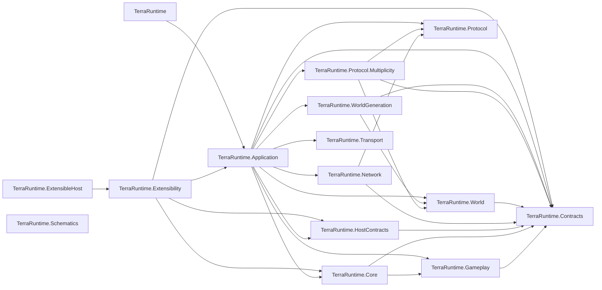
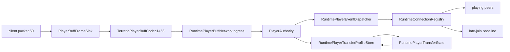
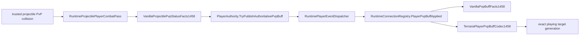
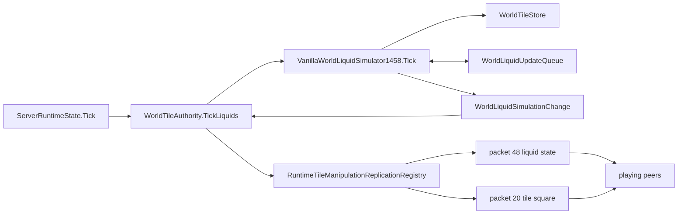
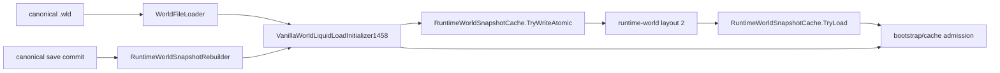
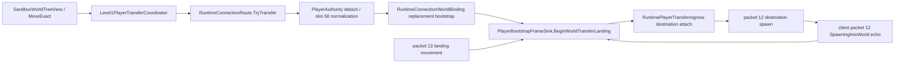
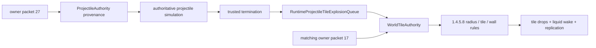
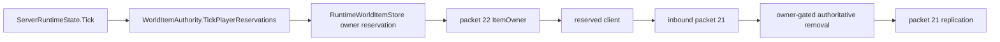
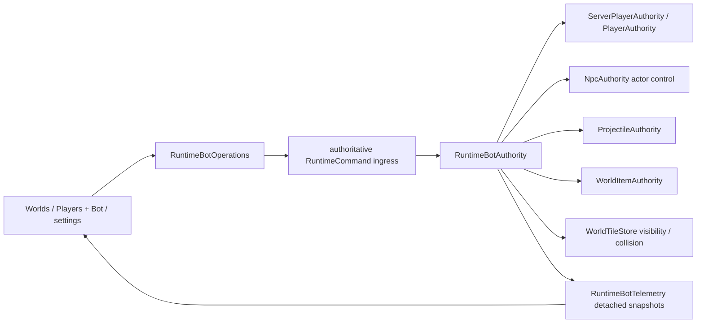
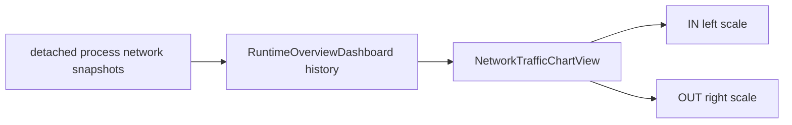

# Production graph

Rail/ocean correction: existing MicroBiomesPass1458.TryPlaceTrack reserves the maximum clearance, computes source ordinary single-track frame indices before mutation, then clears/publishes the same isolated Workspace. No replacement worldgen plan. PlayerTeleportRequestFrameSink packet73 -> RuntimePlayerTeleportIngress -> PlayerAuthority now calls VanillaOceanLanding1458 on its world's TileStore, with verified non-Skyblock surface passed by ServerRuntimeComposition. Existing collision queries, player revision/motion commit and RuntimeConnectionRegistry packet65 remain owners; no client destination coordinates or new mutation path. Failed packet65 uses source bit2. Pre-teleport section delivery ordering remains open; existing packet13 streaming unchanged.

Guide-doll continuation: WorldItemFrameSink decodes source packet39 through the bounded protocol adapter, RuntimeWorldItemIngress captures exact connection/item generation, WorldItemAuthority owns owner-gated release. Packet22 remains ignored inbound. Initial packet21 applies source local/all-player delay, and RuntimeWorldItemStore owns silent countdown/motion updates under its existing seqlock. Existing world tick calls the bounded267-only motion/contact pass before reservation discovery; committed whole-stack removal precedes NpcAuthority.ApplyBurnedGuideDoll. Victim strikes reuse RuntimeNpcNetworkCombatPipeline.CommitNonPlayerDamage; source SpawnWOF placement queries the existing aggregated player snapshots/world tile store, then RuntimeNpcStore.TrySpawnIntent materializes the boss. No alternate NPC/loot/progression store or client boss authority. Flat unreserved item motion only; client-reserved movement, general item burning/physics and remaining lava/buff cases remain open.

Player-lava continuation: ServerRuntimeComposition carries already verified world seed/difficulty facts to the existing ServerRuntimeState tick. After bot intent and before server-player motion, ServerPlayerAuthority.TickLava updates bounded generation-keyed environmental state. Existing VanillaPlayerCombatEquipment supplies verified protection; RuntimePlayerDamageImmunityStore now has a separate Lava channel. Direct hits and regeneration loss share ServerPlayerAuthority's existing HP/vitals/death commit. Typed EnvironmentDamageCause distinguishes contact/burning in packet118, without adding client authority. RuntimeServerPlayerEvents.ServerPlayerBuffTypesUpdated projects owned OnFire through ServerPlayerReplicaStore's retained packet50 baseline and the existing per-world registry fanout; it is type-only presentation, not duration input. No item, transport or worldgen path changed. This supersedes the earlier server-player lava absence below; NPC DoT/shared immunity and world-item lava remain absent, Level2 deferred.

Biome/lava continuation: existing ServerRuntimeState/ServerRuntimeComposition -> NpcAuthority accepts optional IVanillaNpcRandom for the same natural-spawn path, no separate test implementation. NpcAuthority feeds source ordinary Underworld choice from live/persisted progression and current NPC snapshots, then keeps the existing definition/AI gate. Its committed AI tick now also invokes the bounded RuntimeNpcLavaContactPass1458 for known ordinary-world facts. The pass queries WorldTileStore via the independent full-body LavaCollision helper and calls RuntimeNpcNetworkCombatPipeline.TryStrikeEnvironment. Existing town-NPC melee and environment strikes share CommitNonPlayerDamage, preserving one non-player HP/death/loot/progression finalizer. No packet sink gains terrain, ownership or combat authority. Contact cooldown arrays are capacity-bounded and NPC-generation keyed; full NPC buff/shared immunity and server-player/item lava passes remain absent. Deferred Level2 unchanged.

NPC continuation: NpcAuthority attaches real WorldTileStore width + verified WorldSurfaceTiles to the existing VanillaNpcTargetingAiStepper context. Duke AI69 and its existing projectile-intent planner share one enrage predicate; missing bounds refuses root/planning instead of guessing ocean status. The normal RuntimeNpcAiStateExecutor/commit path owns phase damage, motion and Cthulhunado ai2; no alternate combat/spawn pipeline. Ordinary defDamage difficulty scaling is applied before AI phase overrides, because contact damage consumes DamageOverride directly. Underworld's existing MidPipeline calls UnderworldLava1458 between current carving and Hellstone, before vegetation/forts, on the same unpublished Workspace without RNG draws. Geometry/ore helpers remain partial.

Bot tester correction: PlayerAuthority combat-target lookup now explicitly includes ServerPlayerAuthority alongside connection membership; direct-melee validation and bounded trusted-projectile/explosion target snapshots reach the same owned server-player HP/immunity commit. ServerPlayerMoved retains packet13 normal gravity/successful-use bits, and ranged presentation adds packet41 only after trusted spawn. WorldBinding cleanup precedes packet7 with remote packet14 deactivation (excluding own slot/255); destination attach rebaselines destination actors only. Dashboard refresh updates an open bot's detached status; lost exact target generation clears bot policy target. See work-state's2026-09-07 bot correction for tests and open live-client/Lost connection gates.

Last structural refresh: 2026-09-07.

Primary loading remains WorldStartupPreparation -> VanillaWorldLiquidLoadInitializer1458 -> VanillaWorldLiquidSimulator1458 on an unpublished candidate. WaterCheckLoading now resolves effective TileObjectData-style liquid flags with static VanillaTileObjectLiquidDeath1458 before bounded coherent itemless removal; no new world/runtime/loot authority path. Existing JunglePlants sampling calls JungleDetritusPlacement1458 for complete233 objects, never a single-cell substitute. RuntimeHostLog's detached startup telemetry retains a bounded last error; StartupProgram reports unsuccessful exit through StartupProgressUiHost after TTY release. Generation-only smoke still does not execute primary liquid preparation/NetworkReady. See work-state for actual native process and source-differential proof.

Underworld generation now keeps current ash/lava/ore terrain, UnderworldVegetation1458 (AshTreeGrower1458), HellFortGenerator1458, HellFortLighting1458, HellFortFurniture1458 and HellFortDecoration1458 in that order inside the existing ordinary MidPipeline.Underworld pass. Helpers mutate only the isolated Workspace, share context.VanillaRandom, and add no optimized/legacy replacement. Decoration owns ordinary painting recentering/exclusions/palette and ceiling-object selection/full footprints, not player placement. Furniture uses existing Workspace.TryAddGeneratedChest for empty3x2 dresser storage; registry refusal restores the footprint. Both StructuralValidator and Validator1458 call GeneratedContainerFootprint against the existing VanillaMultiTileObjectCatalog rather than hard-code2x2 metadata. Ash growth reuses the existing capability/atlas catalogs but owns GrowTreeWithSettings's different root algorithm; ordinary GrowTree is unchanged. Existing SurfaceFinish.Hellforge calls HellforgePlacement1458 on the same workspace; normal finalization/composition remains the publication boundary. Structural forts/connections/forges, ordinary edge forests, torch attachment, cleared-room ground furniture and ordinary settlement decorations are implemented; terrain and special seeds remain partial.

Difficulty-loot projection filters aggregate player snapshots through RuntimeWorldItemReplicationRegistry.HasClientLocalItemReceiver(exact PlayerHandle). Clientless actors retain combat credit but do not reach addressed packet90 delivery without an explicit actor-owned consumer. This prevents bot kills from throwing in the common death boundary; normal world drops/pickup and human recipient isolation remain on their existing paths.

Early-boss correction: Eye of Cthulhu uses the same imported-loot dispatch, source-ordered Gameplay evaluator and addressed/ordinary item sinks. Existing death branches mark WorldProgression.EyeOfCthulhu; WorldFileProgressionHeaderPatcher owns the already-parsed downedBoss1 byte. No alternate save writer or client-driven progression was introduced.

Hardmode loot continuation: RuntimeNpcNetworkCombatPipeline.TryExecuteImportedLoot dispatches Queen Slime and ordinary mechanical root tables to Gameplay evaluators. Existing world-item materializer/store, addressed packet90 replication and exact54,000-tick instanced leases remain the sole delivery path. Sparse item catalogs add world-drop facts only; Blade Staff natural prefixes and Soul no-gravity are source-specific. Twins/Prime interaction propagation uses the existing generation-safe ledger before network/server-player strikes; MissingTwin queries the active NPC store. No separate loot allocator, client loot authority or weapon-use fallback was added.

Follow-on NPC geometry: nullable bounded NpcSimulationState.HitboxOverride shares the normal server-owned revision. Definition resolution routes live geometry consumers to the physical body independently of Scale; AI70 writes36/100, shared damage intercepts lethal Bubble hits, ordinary post-AI expiry removes the exact generation. NpcAuthority projects the loaded RuntimeWorldClock wind into the existing behavior context; weather evolution remains unimplemented. No alternate damage pipeline or client-owned body was added.

TZ-35: operator bots are player-only; the unused hostile NPC bot preset catalog is removed without removing generic NPC actor/interaction/shop contracts. Bot damage enters the existing NPC-contact/projectile/termination passes and `ServerPlayerAuthority`'s shared vanilla mitigation/immunity pipeline, then post-commit vitals/death events reach `RuntimeConnectionRegistry`. Mirror recovery calls the same server-player teleport mutation and adds packet-12 recall presentation. NPC spawn policy materializes nullable Friendly/Chaseable/Immortal in the normal simulation revision; AI, controlled-magic targeting and Guard consume that same instance state. There is no bot-specific alternative NPC authority path.

This page records the dependency and ownership graph that is expensive to reconstruct repeatedly. It describes shipping projects under `src/`; tests are intentionally omitted.

## Project-reference graph

`TerraRuntime.Schematics` and `TerraRuntime.Transport` currently have no project references in their own `.csproj` files. The graph above is about compile-time references, not every runtime/data-flow edge.

## Runtime-only dedicated worker foundation

Application `SandboxSupervisor` launches the same application executable with private `--sandbox-worker` entry, owns one current-user local pipe and exact child Process, authenticates a fresh boot identity, and serializes bounded Transport exchanges. Worker materializes built-in Generated/hash-checked .wld into the existing `WorldRuntime`, whose loop remains sole simulation owner. Source-generated JSON is AOT-safe; no new NuGet dependency, dynamic modules, gameplay proxy, listener or socket/player admission is added. Stop is ephemeral; broken control retires the pipe and owned process. Level1 uses the same materializer, now with a preallocation file-size cap. S3/S4/S5 host integration remains partial/open, not an alternate runtime path.

## Player buff presentation-sync path

Ownership/invariants for this path:

- packet `50` is a bounded client presentation snapshot, not authoritative proof of a combat buff. The 1.4.5.8 wire shape is `[player][0..44 buff ushort][zero ushort terminator]`; it contains no durations.
- `PlayerBuffFrameSink` accepts the snapshot only after connection slot assignment, discards the claimed player byte, and posts an owned typed command for the exact `PlayerHandle` generation. Malformed shape/IDs stop as malformed protocol; mailbox pressure may drop this replaceable snapshot.
- `PlayerAuthority` owns mutation of the generation-scoped transfer/presentation profile. Client-reported buff types do not mutate authoritative combat modifier state.
- `RuntimeConnectionRegistry` owns retained encoded packet-50 state, duplicate suppression, peer relay and late-join baseline exchange. A never-observed snapshot remains distinct from an observed empty snapshot.
- cross-world transfer carries the observed snapshot if one exists; it does not manufacture an empty snapshot when packet `50` was never received.
- TerrariaServer 1.4.5.8 dedicated server skips hostile projectile `Damage_EVP`; the affected client applies such PvE status locally and reports only the resulting active type list. Packet `55` remains the separate targeted PvP path and is not a fallback for missing packet-50 duration.

## Authoritative projectile PvP status path

Ownership/invariants for this path:

- the status roll exists only after the ordinary legal PvP collision/hostility/team/immunity gate. For the admitted type-specific slice the source rules are Fire Arrow `2` -> `On Fire!` `24`/180 ticks/`1/3`, Flamelash `34` -> `On Fire!`/240/`1/2`, and Poisoned Knife `54` -> `Poisoned` `20`/600/`1/2`; unsupported/equipment-derived `StatusPvP` effects fail closed.
- vanilla calls `StatusPvP` before `Player.Hurt`. TerraRuntime preserves that ordering point logically: a Creative-GodMode damage avoidance does not suppress a status roll that already passed the legal hit gate.
- `PlayerAuthority` does not create a server-owned buff-duration mirror. It validates exact target generation plus relayable type/duration and emits a side-effect event.
- `RuntimeConnectionRegistry` resolves that exact generation to one playing endpoint and enqueues packet `55` only there. Slot reuse/stale generations cannot receive it; observers do not.
- `TerrariaPlayerPvpBuffCodec1458` pins `[target byte][buff ushort][duration int32]`. `VanillaPvpBuffFacts1458` pins the exact 1.4.5.8 `Main.pvpBuff` true set. Client-originated packet `55` is not trusted as TerraRuntime combat authority.

## Authoritative liquid runtime path

Ownership/invariants for this path:

- `ServerRuntimeState.Tick` is on the authoritative game-loop path.
- `WorldTileAuthority` owns the runtime integration point for authoritative tile/liquid mutation and replication.
- `VanillaWorldLiquidSimulator1458` mutates `WorldTileStore` and consumes bounded `WorldLiquidUpdateQueue` work.
- `WorldLiquidSimulationChange.RequiresTileSquareReplication == false` means packet `48` replication is sufficient for the committed liquid amount/kind change.
- `RequiresTileSquareReplication == true` means the mutation changed tile/material state and must replicate through packet `20`; merge changes may carry an explicit source-backed square and `TileChangeType`.
- material merge side effects cross a synchronous prepare/commit boundary owned by `WorldTileAuthority`; unsupported active targets fail before participating liquids are cleared.
- a committed material merge is represented by its packet-20 tile square, not redundant packet-48 updates for the liquid cells cleared as part of that merge.
- Re-enqueued liquid work must not allow one tile to consume multiple logical vanilla update steps in the same TerraRuntime server tick.
- The live work slice follows the pinned dedicated-server budget: `curMaxLiquid = 25000 - players * 250`, divided by `cycles = 10 + players / 3`, capped at 2500 entries on an empty server. Each world computes its own equal-TPS slice; no process-global backlog can starve another world.
- Zero-liquid cells do not enter the active queue. A committed tile mutation explicitly wakes adjacent non-empty liquid. The simulator rents its large per-tick change scratch from `ArrayPool` and returns it after replication processing.

## Canonical load and runtime-cache preparation path

Ownership/invariants for this path:

- canonical `.wld` bytes remain the persistence/recovery source of truth; post-load preparation mutates only the unpublished runtime candidate;
- the supported normal-world preparation order is `QuickWater -> WaterCheck -> quickSettle drain (maximum 100000 iterations) -> WaterCheck`;
- runtime-cache layout `2` is a semantic contract as well as a binary layout: `TryWriteAtomic` rejects any `WorldTileStore` that does not carry the post-load-prepared marker;
- only `TerraRuntime.World` can set that marker. Cache decode restores it after complete layout/hash/world validation; application code cannot forge it;
- a post-save runtime-cache rebuild replays the same preparation before atomic cache publication, so cache hit, canonical fallback and save-triggered rebuild converge on the same runtime liquid state;
- Remix/Zenith post-load remapping remains fail-closed before cache publication until its generation-only inputs are represented.

## Live cross-world player transfer path

Ownership/invariants for this path:

- cross-world position is not portable state; destination authoritative attach owns the destination world spawn;
- vanilla inventory slot 58 is `Main.mouseItem`; detach moves a non-empty cursor stack exactly once into an empty main slot 0..49 or aborts before source detach. Destination publishes an explicit empty slot 58 before the normalized inventory image;
- the synthetic packet 12 is a world-handoff frame, not permission for its immediate client echo to create another authoritative respawn;
- while the landing gate is active, a client packet 12 with `SpawnContext=SpawningIntoWorld` is consumed as transfer echo and cannot overwrite the correction target;
- stale packet-5 inventory echoes and packet-13 movement from the old world remain rejected/corrected until the client lands near the destination spawn.

## Trusted projectile terrain-explosion path

Ownership/invariants for this path:

- only a generation admitted by strict weapon/ammo/volley provenance can enqueue terrain destruction; client packet 17 is never the explosion authority;
- Bomb/Dynamite, admitted launcher/Mini Nuke types and Celebration children use exact source-backed defaults. Celebration holder 714 stays untrusted and children 715..718 use a separate aiStyle-147 simulation slice;
- `RuntimeProjectileTileExplosionQueue` observes committed trusted termination and carries the exact type-derived definition into `WorldTileAuthority` in the same runtime tick;
- `WorldTileAuthority` applies strict radius membership, `CanExplodeTile`, wall eligibility, transactional drops, liquid wake and packet replication. Unknown types and unsupported tile/object cases fail closed;
- a short-lived, bounded `RuntimeProjectileTileExplosionEchoTracker` consumes only exact owner/tile/action convergence echoes after authoritative mutation. The network packet-17 ceiling remains an emergency containment boundary, not gameplay authority.

## Server-owned world-item pickup path

The current `WorldItem.FindOwner` slice runs every five ticks and selects the nearest live player that has an empty ordinary inventory slot. Inbound packet 22 is never accepted as ownership. Packet 21 may remove an existing item only when its sender is the exact current reservation owner; another playing connection fails closed. Stacking, special pickup magnets and alternate-storage routing remain outside this admitted slice.

## Operator bot ownership path

Ownership/invariants for this path:

- `TerraRuntime.Application.Bots` owns bot lifecycle and high-level policy only. It does not own a parallel player/NPC/projectile/item simulation.
- source-pinned bot content facts live in `TerraRuntime.Gameplay.Bots`; `TerraRuntime.Core` has no bot-specific dependency. Generic NPC actor-control capability remains a Core/runtime primitive because trusted-host actors use it too.
- PlayerBot actor state is a normal server-owned player and crosses existing server-player/player/projectile/world-item authority boundaries. Held-weapon selection and use animation are committed through `ServerPlayerAuthority`; trusted ranged and melee damage continue through the existing projectile and player-owned NPC combat finalizers. Pickup, healing and admitted buff use are unconditional bot policy, not parallel UI-selected execution paths.
- PlayerBot target acquisition and predictive trajectory admission read the authoritative `WorldTileStore`. A blocked line or simulated tile/liquid collision rejects the attack before ammo consumption; movement obstacle probes are part of the existing server-player dry-physics path. Follow/Guard writes a per-bot offset `MoveTo` intent with a distinct movement phase. A clear level route targets the protected player's ground level so ordinary locomotion walks; a materially higher player or blocked direct rectangle raises and briefly holds an airborne formation target so the existing jump/Fishron-wing physics actually ascends. Functional accessory slots remain normal authoritative inventory, and their admitted Terraspark/Magiluminescence parameters are resolved by the shared server-player physics path.
- NpcBot is a normal authoritative NPC actor bound to an exact `ActorControllerId`; only source-verified controlled-motion families are admitted. The current controlled roster is ground fighters plus AI_002 flying-eye steering, AI_005 flyer pursuit and the ordinary pre-wander AI_014 bat pursuit slice. Follow/Guard supplies a separated per-bot escort coordinate, while the replicated vanilla NPC target remains `255`; UI enumeration deduplicates exact NPC types before presentation.
- NpcBot uses the vanilla NPC body only as a trusted presentation/motion actor: bot spawn forces `DamageOverride=0` and `DontTakeDamage=true`. Because packet 23 does not carry a per-instance friendly/damage override and an unmodified client derives contact behavior from the NPC type, the controller also keeps the body outside the followed player's collision rectangle. Until bot-specific death/drop semantics exist, these rules prevent operator actors from entering ordinary contact-damage, death, loot or progression farming paths.
- bot mutations are serialized through the authoritative runtime command queue. Terminal.Gui consumes detached immutable telemetry and never receives mutable actor stores. The shipped `+ Bot` button invokes `RuntimeBotOperations.CreateAsync` through its real `Command.Accept` binding; it is not a presentation-only placeholder.
- unsupported bot content/AI/combat semantics are rejected rather than approximated. In particular, NpcBot offensive Guard is not synthesized through a fake player projectile owner.

## Terminal UI network presentation path

This is presentation-only state. IN and OUT packet-rate histories share one plot but use independent scale maxima; byte throughput remains numeric telemetry beside the chart. The UI must not feed chart state back into network/runtime authority.

## Change-impact shortcuts

| Concern | Start here | Usually inspect next |
| --- | --- | --- |
| Runtime tick ordering | `ServerRuntimeState.Tick.cs` | subsystem authority/store, replication |
| Client tile/liquid admission | `WorldTileAuthority.cs` | mutation service, budgets, Multiplicity codec |
| Projectile terrain explosions | `ProjectileAuthority` / `RuntimeProjectileTileExplosionQueue.cs` | `WorldTileAuthority.cs`, 1.4.5.8 explosion facts/rules, echo tracker, packet-17 budgets |
| World-item pickup ownership | `WorldItemAuthority.cs` | `RuntimeWorldItemStore`, replication registry, packet 21/22 ingress |
| Liquid simulation | `VanillaWorldLiquidSimulator1458.cs` | `WorldLiquidUpdateQueue.cs`, `WorldTileStore.cs`, snapshot persistence, replication |
| Tile/material replication | `RuntimeTileManipulationReplicationRegistry.cs` | `TerrariaTileSquareCodec`, `TerrariaLiquidCodec` |
| Snapshot liquid persistence | `RuntimeWorldSnapshotCache.*.cs` | `WorldLiquidUpdateQueue`, `WorldTile` |
| Canonical load / runtime-cache admission | `WorldStartupPreparation.cs` | `VanillaWorldLiquidLoadInitializer1458.cs`, `RuntimeWorldSnapshotCache.*.cs`, `RuntimeWorldSnapshotRebuilder.cs` |
| Vanilla world generation | `TerraRuntime.WorldGeneration` | generation plan/provider, `CaveHousePlacement1458`, `TerraRuntime.World`, world-file writer/loader |
| Sandbox orchestration | `TerraRuntime.Application` sandbox owners | world generation/load path, player transfer/bootstrap, process worker contracts |
| Cross-world inventory conservation | `PlayerAuthority.Transfer.cs` | `RuntimeConnectionRoute`, landing gate, packet-5 ingress, transfer tests |
| Player buff presentation sync | `PlayerBuffFrameSink.cs` / `TerrariaPlayerBuffCodec1458.cs` | `PlayerAuthority.BuffPresentation.cs`, `RuntimeConnectionRegistry.PlayerBuffs.cs`, transfer profile |
| Protocol wire semantics | `TerraRuntime.Protocol.Multiplicity` | `TerraRuntime.Protocol`, official 1.4.5.8 server/client behavior |

When a change crosses one of these rows, refresh the relevant graph rather than assuming the old impact boundary still holds.
