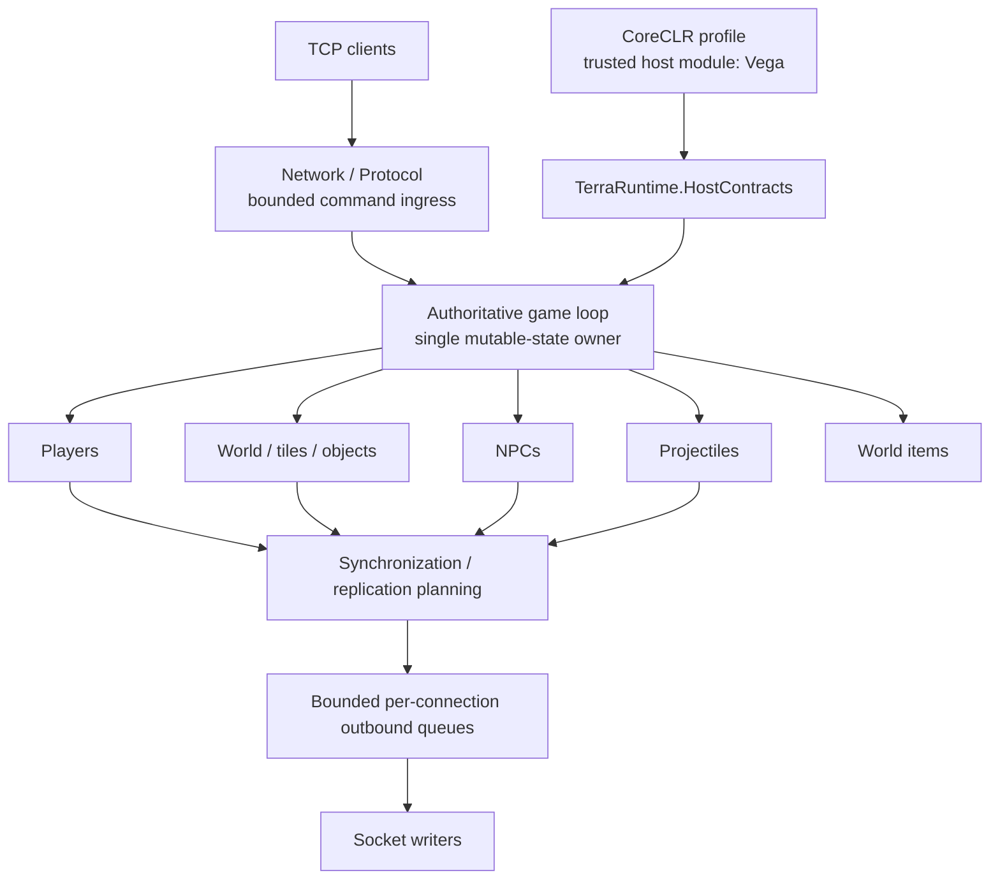
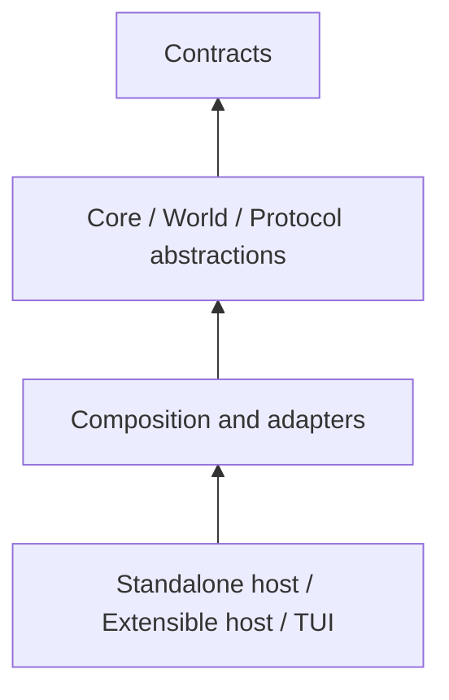
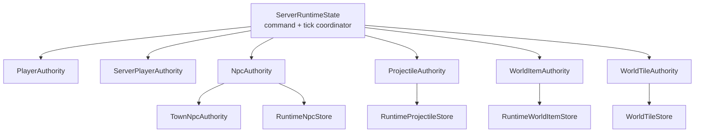
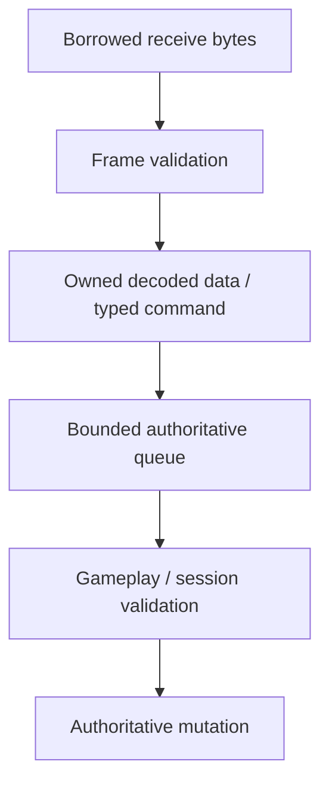
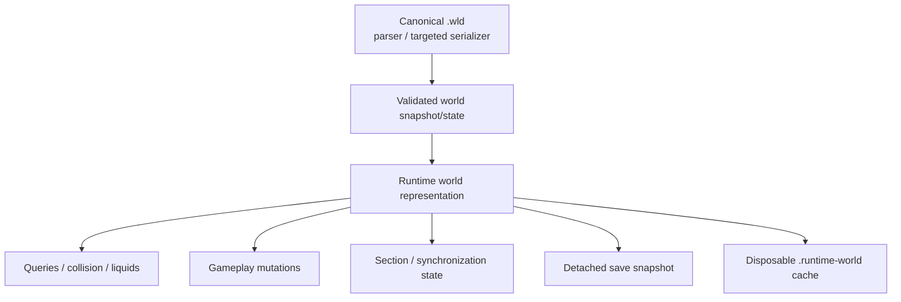
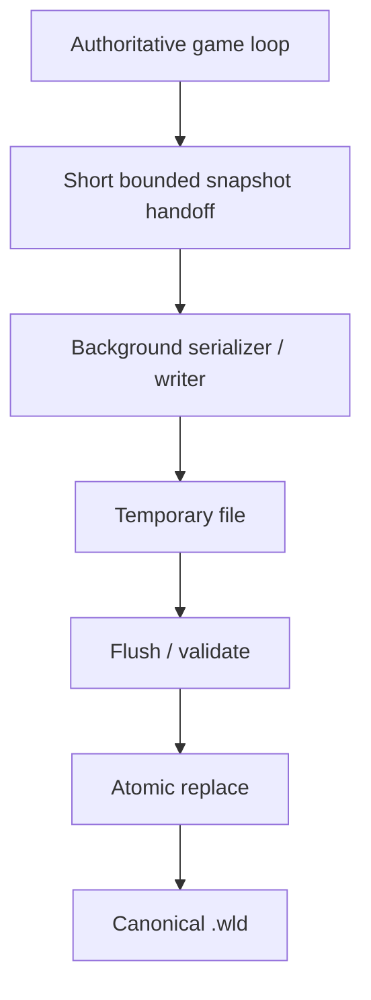
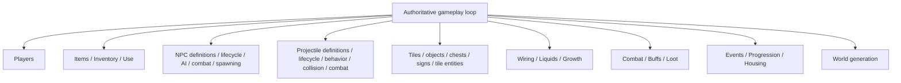
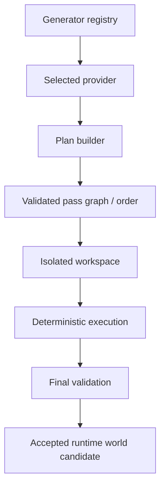
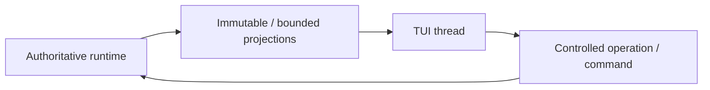

# TerraRuntime architecture

[Русский](../ru/architecture.md) · [Documentation](README.md) · [Project guide](project-guide.md) · [Host interfaces](host-interfaces.md)

## 1. Architectural goal

TerraRuntime reproduces observable TerrariaServer 1.4.5.8 behavior without preserving the original internal architecture. The primary design constraints are:

- mutable simulation state has one authoritative owner;
- network I/O never mutates gameplay state directly;
- client input is always untrusted and bounded;
- blocking I/O, compression, and expensive background work do not run on the game-loop hot path;
- gameplay behavior is separated from packet encoding/decoding;
- `.wld` remains the canonical persistent representation;
- the runtime core remains NativeAOT-compatible;
- external hosts receive narrow explicit contracts instead of implementation objects.

## 2. High-level shape

The game loop is the ownership center. Transport, UI and trusted-host code surround it through bounded contracts rather than sharing mutable runtime objects.

## 3. Dependency direction

The architecture must not collapse into circular dependencies between networking, gameplay, and host integration.

`TerraRuntime.HostContracts` must not reference internal concrete runtime classes. A trusted host receives contracts and snapshots, not `ServerRuntimeState`, mutable stores, or socket objects.

## 4. Authoritative ownership

One dedicated game-loop thread owns mutable simulation state.

Owned state includes, as implementation grows:

- player runtime state;
- NPC slots/handles/state;
- projectile slots/handles/state;
- world item state;
- mutable world/tile/progression state;
- connection-associated gameplay state after network input has been converted into commands.

Other threads may receive network data, decode bounded input, build immutable work products, perform disk I/O, serialize snapshots, update UI from immutable telemetry, and return results through explicit completion/command boundaries. They may not mutate authoritative collections directly.

`ServerRuntimeState` is the authoritative command/tick coordinator, not the owner of every entity subsystem. World-scoped collaborators own coherent mutation lifecycles while remaining callable only from that same writer: `PlayerAuthority` owns connection-player state application; `ServerPlayerAuthority` owns runtime-controlled player leases, semantic control intent, dry-physics progression and per-generation liquid-contact state; `NpcAuthority` owns NPC commands/AI/combat/actor-archetype lifecycle and coordinates `TownNpcAuthority`; `ProjectileAuthority` owns projectile mutation; `WorldItemAuthority` owns world-item commands and instanced leases; and `WorldTileAuthority` owns tile/object mutation admission. Extraction changes ownership structure, not tick-thread ownership.

Connection fanout is decomposed independently from simulation ownership. `RuntimeConnectionEndpoint` owns one connection's retained playing-generation and bounded appearance/equipment/movement baselines, while `ServerPlayerReplicaStore` owns retained protocol projections for runtime-controlled players. `RuntimeConnectionRegistry` remains the routing/fanout owner and does not become an alternate simulation writer.

## 5. Command boundary

Network input transfers ownership before entering the game loop.

This separates two different questions:

1. Can these bytes be parsed safely?
2. Is this action legal in the current gameplay/session state?

The decoder must not make gameplay policy decisions, and gameplay must not depend on transient socket receive buffers.

## 6. Scheduling and fairness

The baseline simulation schedule runs at $60\,\mathrm{Hz}$, corresponding to a nominal tick interval of approximately $16.67\,\mathrm{ms}$.

Inbound command processing is budgeted. One connection must not be able to turn an unbounded `while(queue.TryRead(...))` into a private DoS primitive.

The runtime uses or is evolving toward:

- a hard global operation cap;
- per-source fairness quota;
- optional authoritative CPU-time cap;
- deferred-work counters;
- oldest backlog age;
- subsystem phase timing.

Subsystem budgets are global when work competes for one simulation tick. They must not be multiplied mechanically by player count.

## 7. Network architecture

Each connection has independent read and write paths.

```mermaid
flowchart LR
    SocketIn["Socket read"] --> Framing["Incremental framing"]
    Framing --> Decode["Bounded protocol decode"]
    Decode --> State["Connection-state legality<br/>+ rate/work accounting"]
    State --> Command["Owned typed command"]
    Command --> Loop["Authoritative game loop"]
    Loop --> Recipients["Recipient decision"]
    Recipients --> Encode["Packet projection / encode"]
    Encode --> Outbound["Bounded per-client queue"]
    Outbound --> Slow["Slow-client policy"]
    Slow --> SocketOut["Socket writer"]
```

Terraria framing is `[u16 length][u8 message id][payload]`. A slow client must never force the game loop to wait for socket-buffer capacity.

## 8. Protocol boundary

`TerraRuntime.Protocol` defines runtime-facing protocol concepts. `TerraRuntime.Protocol.Multiplicity` adapts Multiplicity 2.7.x behind that boundary.

Gameplay code should not depend on concrete Multiplicity packet classes where it can work with domain commands/state instead.

Protocol-layer responsibilities are wire framing, packet IDs and flags, bounded decode/encode, conversion into owned semantic input, and conversion from runtime projections back into wire representation.

Gameplay-layer responsibilities are legality, domain invariants, state transitions and authoritative outcomes.

## 9. Entity identity

Content type and live runtime identity are different concepts.

| Content identity | Live runtime identity |
|---|---|
| `ProjectileTypeId` | projectile slot/handle |
| `NpcTypeId` | NPC slot/handle |
| `ItemTypeId` | inventory/world-item identity |

The runtime uses generation/revision-style identity where slot reuse can make stale references dangerous. This prevents a command intended for an old entity from mutating a new entity that reused the same slot.

## 10. World architecture

The world subsystem separates canonical persistence, live representation and disposable derived data.

The derived cache must never be the only recovery source for a world.

## 11. Save architecture

The save pipeline minimizes stop-the-world work on the authoritative thread.

The runtime coalesces redundant save requests instead of accumulating serialization work. Shutdown semantics must ensure newer authoritative state cannot lose to an older background save.

## 12. Runtime world cache

`.runtime-world` accelerates startup and may contain prepared runtime state. It is versioned, disposable, and validated against the source `.wld` plus its own schema/integrity metadata.

Rules:

- a cache miss is normal;
- invalid cache means fallback to `.wld`;
- cache rebuild does not precede a successful canonical save;
- cache corruption is not world corruption;
- the optimization is accepted only when it produces a measured `WorldReady`/`NetworkReady` improvement.

## 13. Synchronization and interest management

Replication does not need to preserve an inefficient vanilla broadcast algorithm when observable behavior remains compatible.

Interest management is an internal TerraRuntime subsystem. External hosts only receive an `IInterestManagementControl` enable/disable surface.

The following remain internal: spatial partitioning, recipient sets, enter/leave transitions, hysteresis, forced resync deadlines, full-state-on-entry and entity-specific visibility rules.

Until those semantics are proven, packet suppression must fail open.

## 14. Gameplay decomposition

Gameplay must not become one giant packet switch.

Definition catalogs contain version-pinned vanilla facts. Runtime stores contain live state. Packet projection stays at the outer boundary.

## 15. World-generation architecture

Worldgen separates discovery from execution.

A trusted host registers a provider, while TerraRuntime retains control over execution boundaries and acceptance of the result. `terraruntime:flat` remains the infrastructure baseline. Separately, `terraruntime:vanilla` is the runtime-owned TerrariaServer 1.4.5.8 clean-room generator: ordinary canonical worlds now traverse all 109 pinned pass identities through `Final Cleanup`, with a per-pass vanilla RNG reseed matching `WorldGenerator.RunPass`. This is pass-pipeline coverage, not a claim of reference-world equality; fixed-seed differential parity and special/secret-seed behavior remain open work.

## 16. NativeAOT and CoreCLR split

### NativeAOT profile

It proves the core architecture does not depend on JIT-only behavior, does not require arbitrary managed DLL loading, does not rely on reflection-driven discovery, and survives Linux/Windows native smoke paths.

### CoreCLR extensible profile

It adds trusted host-module loading. This does not remove AOT constraints from core projects. Host-specific dynamic behavior must remain behind the extensible-host boundary and must not leak back into runtime core architecture.

## 17. Host integration boundary

A trusted host module receives API in two stages.

### Bootstrap environment

`ITerraRuntimeHostEnvironment` is available before a live runtime and contains root/deployment paths, the dashboard registry and the world-generator registry.

### Live runtime

`ITerraRuntimeHostRuntime` is attached after the authoritative runtime starts and provides runtime info, interest-management control, player snapshots, NPC actor operations and controlled server-player operations.

None of these contracts permit retaining mutable references to internal stores.

## 18. TUI architecture

The TUI consumes the operations/read-model boundary.

The UI toolkit must not become a gameplay-core dependency.

## 19. Background workers

A worker receives a snapshot or isolated buffer and returns a result. A worker must not receive a mutable world object and modify it concurrently with the game loop.

Parallel gameplay/worldgen work is allowed only after independence is proven and deterministic equivalence is verified where vanilla RNG/order matters.

## 20. Failure containment

Trust boundaries localize failures.

- a malformed frame does not crash the process;
- a bad packet cannot bypass mutation validation;
- save failure does not replace a good canonical file with partial output;
- TUI failure does not stop runtime readiness;
- stale/corrupt runtime cache does not prevent `.wld` fallback;
- a host module does not receive direct mutable authority over internal state.

## 21. Observability

Telemetry should explain where runtime time is spent and why work is rejected without turning every packet into an allocation festival.

Key groups include tick CPU/wall and worst phase, command backlog/budget exhaustion, queue depth/slow-client drops, active entity counts, spatial membership, save/cache state, malformed/rejected protocol categories and GC/memory where safely available.

## 22. Architectural Definition of Done

When an architecture boundary changes, verify at the same time that:

1. mutable-state ownership remains explicit;
2. input/output contracts remain bounded;
3. NativeAOT constraints remain intact;
4. failure behavior is defined;
5. tests can detect the regression;
6. RU and EN documentation is updated in the same change.
