# Combat damage foundation

[Русский](../ru/combat-damage.md) · [Gameplay](gameplay.md) · [Gameplay decomposition roadmap](../roadmap/gameplay-decomposition-and-catalogs.md)

## 1. Purpose

TerraRuntime now has a protocol-independent, generation-safe foundation for authoritative NPC damage. This slice deliberately separates **damage provenance**, **deterministic NPC defense resolution**, and **authoritative HP commit** from packet handlers, replication, death effects and loot.

It is a foundation for broader TerrariaServer 1.4.5.8 combat parity, not a claim that the complete vanilla `StrikeNPC` path has been reproduced.

## 2. Implemented contracts

`DamageSource` records semantic provenance without carrying packet IDs or mutable runtime objects. The current source categories are:

- environment;
- player item;
- player projectile;
- NPC contact;
- NPC projectile;
- server-owned/internal damage.

Player, NPC and projectile provenance uses generation-safe runtime handles. The source validates that only handles meaningful for its category are populated. For example, `PlayerItem` requires a player handle and rejects an unrelated projectile handle, while `PlayerProjectile` requires both the owning player and the exact projectile generation.

`NpcDamageRequest` contains the generation-safe target, semantic source, positive base damage, non-negative flat armor penetration, the ordinary critical-hit flag, non-negative finite knockback and a source-resolved hit direction in `-1..1`. Direction is explicit because vanilla uses the attack/projectile direction supplied to `NPC.StrikeNPC`; it is not inferred from the NPC's own movement.

`NpcDamageResult` is an immutable record of the committed transition, including source damage, defense, effective defense, resolved damage and life before/after.

## 3. Authoritative flow

```mermaid
flowchart LR
    Source["Item / projectile / NPC / environment"] --> Request["NpcDamageRequest"]
    Request --> Lookup["Generation-safe NPC lookup"]
    Lookup --> Definition["Verified VanillaNpcDefinition"]
    Definition --> Resolve["Defense + armor penetration + crit"]
    Resolve --> Knockback["justHit + vanilla knockback slice"]
    Knockback --> Store["RuntimeNpcStore atomic commit"]
    Store --> Result["NpcDamageResult"]
    Result --> Future["Future hit replication / death / loot"]
```

The target must still be the exact live `NpcHandle`. Reusing the same numeric NPC slot with a newer generation does not make an old damage request valid.

## 4. Deterministic damage math

This implemented slice starts **after** source-specific weapon/projectile scaling and any random damage variation. Let

- \(B\) be the already resolved base/source damage;
- \(D\) be the verified NPC defense from `VanillaNpcDefinitionCatalog`;
- \(P\) be flat armor penetration.

Effective defense is

\[
D_{\mathrm{eff}}=\max(D-P,0).
\]

The ordinary NPC defense effectiveness used by this slice is

\[
k_D=0.5,
\]

so pre-critical damage is

\[
H=\max(B-k_DD_{\mathrm{eff}},1).
\]

For an ordinary critical hit the implemented multiplier is

\[
k_{\mathrm{crit}}=2,
\]

therefore

\[
H_{\mathrm{crit}}=2H.
\]

The final integer result is bounded to at least one damage and saturates at `Int32.MaxValue` instead of overflowing on extreme input.

This is intentionally narrower than the complete vanilla hit pipeline. Damage variation, banners, buffs/debuffs, scaling armor penetration, target damage multipliers, immunity, special resistances and other source/target modifiers are not silently approximated here.

## 5. `justHit` and ordinary knockback

Every accepted strike commits `JustHit = true`, including zero-knockback hits and hits against zero-resistance bosses. The AI stage clears this transient state at its source-backed update point, so fighter stuck/hop logic observes a real hit instead of an unrelated direction heuristic.

The ordinary TerrariaServer 1.4.5.8 `NPC.StrikeNPC_Inner` knockback slice is implemented. Effective strength starts as

\[
K_0=K R,
\]

where \(K\) is requested knockback and \(R\) is the effective definition's `KnockBackResist`. In vanilla this field is a multiplier: `0` means immune, `0.5` halves the initial strength and values above `1` amplify it. It is not a percentage subtracted from one. The implementation applies the source-ordered softening above `8`, `10`, `12` and `14`, caps the result at `16`, and only then applies the critical-hit multiplier `1.4`.

The resolved damage selects vanilla's two velocity branches. A strong hit uses the supplied hit direction, preserves velocity already moving faster in that direction, and adds the gravity/no-gravity vertical impulse. A weak hit replaces horizontal and vertical velocity and applies `KnockBackResist` a second time, matching the source. The strong-hit threshold is \(10H>L_{\max}\) in classic mode and \(15H>L_{\max}\) in expert/master mode, where \(H\) is resolved damage and \(L_{\max}\) is current maximum life.

The executor resolves the complete positive type plus signed `netId` definition. Negative slime, eye and flyer variants therefore use their own defense, maximum life and knockback multiplier rather than silently falling back to positive-type defaults.

## 6. HP commit and lethal hits

`RuntimeNpcDamageExecutor` reads the exact current NPC generation, resolves damage against its verified definition, and commits the new `Life` through `RuntimeNpcStore.TryUpdate`. That means the existing revision/generation invariants remain the single owner of NPC state mutation.

For a lethal hit, this slice commits

\[
\mathrm{Life}_{after}=0
\]

and reports `NpcDamageResult.Lethal = true`.

It deliberately does **not** immediately despawn the NPC, run loot, trigger kill effects or invent death ordering. Those effects are observable gameplay and require their own verified death pipeline. Keeping the zero-life NPC alive for that future commit point prevents this foundation from baking in guessed ordering.

## 7. Safety properties

- zero/unassigned target handles are rejected;
- stale NPC generations are rejected before mutation;
- invalid/mixed damage provenance is rejected;
- non-positive base damage, negative armor penetration, invalid knockback and hit directions outside `-1..1` are rejected;
- already-dead (`Life <= 0`) NPCs are not damaged again by this executor;
- NPCs without a verified definition/combat state are rejected rather than assigned guessed defense values;
- extreme critical damage is saturated rather than overflowing.

## 8. Current limitations

The following remain explicit follow-up work:

- player PvE/PvP damage and player defense/difficulty rules;
- damage variation and luck;
- immunity frames/cooldowns and projectile penetration;
- buffs, debuffs, banners and special target modifiers, including the On Fire! 2 knockback bonus;
- dynamically changing knockback resistance and type-specific strike branches not represented by the admitted definition/state model;
- contact/projectile collision-to-hit generation;
- hit packet/combat-text replication;
- NPC death ordering, kill effects, loot and progression hooks;
- boss-specific damage rules and special immunities.

The semantic damage model is designed so those systems can attach around one authoritative transition rather than reintroducing packet-driven HP mutation.

## 9. Verification

Focused tests pin source-shape validation, Blue Slime defense resolution, armor penetration before critical multiplication, minimum one-damage behavior, lethal zero-life commit, stale-generation rejection and integer-overflow protection. Regression cases also pin `justHit`, attack-supplied direction, strong/weak and expert thresholds, gravity-aware vertical velocity, ordered soft caps before critical amplification, zero-resistance bosses and variant-specific resistance above `1`. These cases fail under the previous `(1 - resistance)`/NPC-direction approximation. The expected transitions were traced to TerrariaServer 1.4.5.8 `NPC.StrikeNPC_Inner`; broader combat parity still requires differential evidence before the remaining rules are marked complete.

## Live packet 28 integration

Production now decodes TerrariaServer 1.4.5.8 packet 28 in the existing bounded gameplay ingress. The authoritative owner sends packet 162 acknowledgement before generation resolution, compares the wrapped 1..255 wire generation against the current runtime handle, records player interaction before the strike, clamps negative wire damage to zero, and applies the existing defense/critical/knockback resolver.

For lethal imported deaths, implemented NPC-specific loot is materialized before death effects. King Slime normal/Expert/Master paths use the existing source-backed loot evaluators and instanced-item transport; Slime Rain termination, blue-town-slime unlock/Nerdy spawn and downed-King-Slime progression follow loot, then the NPC generation is despawned. Packet 28 is relayed after those server-side effects and packet 23 follows for death, while the synchronous store packet-23 commit is suppressed only for that exact NPC generation.

This does not claim full Terraria `NPCLoot`: money, hearts, banners, bestiary, generic global drop rules, segmented `realLife` death sync and every boss-specific death event remain separate compatibility work.
