# Combat damage foundation

[Русский](../ru/combat-damage.md) · [Gameplay](gameplay.md) · [Gameplay decomposition roadmap](../roadmap/gameplay-decomposition-and-catalogs.md)

## 1. Purpose

TerraRuntime now has a protocol-independent, generation-safe foundation for authoritative NPC damage. This slice deliberately separates **damage provenance**, **deterministic NPC defense resolution**, and **authoritative HP commit** from packet handlers, replication, death effects and loot.

It is a foundation for broader TerrariaServer 1.4.5.8 combat parity, not a claim that the complete vanilla `StrikeNPC` path has been reproduced.

## 2. Implemented contracts

`DamageSource` records semantic provenance without carrying packet IDs or mutable runtime objects. The current source categories are:

- environment;
- player item;
- player projectile;
- NPC contact;
- NPC projectile;
- server-owned/internal damage.

Player, NPC and projectile provenance uses generation-safe runtime handles. The source validates that only handles meaningful for its category are populated. For example, `PlayerItem` requires a player handle and rejects an unrelated projectile handle, while `PlayerProjectile` requires both the owning player and the exact projectile generation.

`NpcDamageRequest` contains the generation-safe target, semantic source, positive base damage, non-negative flat armor penetration and the ordinary critical-hit flag. `NpcDamageResult` is an immutable record of the committed transition, including source damage, defense, effective defense, resolved damage and life before/after.

## 3. Authoritative flow

```mermaid
flowchart LR
    Source["Item / projectile / NPC / environment"] --> Request["NpcDamageRequest"]
    Request --> Lookup["Generation-safe NPC lookup"]
    Lookup --> Definition["Verified VanillaNpcDefinition"]
    Definition --> Resolve["Defense + armor penetration + crit"]
    Resolve --> Store["RuntimeNpcStore HP commit"]
    Store --> Result["NpcDamageResult"]
    Result --> Future["Future hit replication / death / loot"]
```

The target must still be the exact live `NpcHandle`. Reusing the same numeric NPC slot with a newer generation does not make an old damage request valid.

## 4. Deterministic damage math

This implemented slice starts **after** source-specific weapon/projectile scaling and any random damage variation. Let

- \(B\) be the already resolved base/source damage;
- \(D\) be the verified NPC defense from `VanillaNpcDefinitionCatalog`;
- \(P\) be flat armor penetration.

Effective defense is

\[
D_{\mathrm{eff}}=\max(D-P,0).
\]

The ordinary NPC defense effectiveness used by this slice is

\[
k_D=0.5,
\]

so pre-critical damage is

\[
H=\max(B-k_DD_{\mathrm{eff}},1).
\]

For an ordinary critical hit the implemented multiplier is

\[
k_{\mathrm{crit}}=2,
\]

therefore

\[
H_{\mathrm{crit}}=2H.
\]

The final integer result is bounded to at least one damage and saturates at `Int32.MaxValue` instead of overflowing on extreme input.

This is intentionally narrower than the complete vanilla hit pipeline. Damage variation, banners, buffs/debuffs, scaling armor penetration, target damage multipliers, immunity, special resistances and other source/target modifiers are not silently approximated here.

## 5. HP commit and lethal hits

`RuntimeNpcDamageExecutor` reads the exact current NPC generation, resolves damage against its verified definition, and commits the new `Life` through `RuntimeNpcStore.TryUpdate`. That means the existing revision/generation invariants remain the single owner of NPC state mutation.

For a lethal hit, this slice commits

\[
\mathrm{Life}_{after}=0
\]

and reports `NpcDamageResult.Lethal = true`.

It deliberately does **not** immediately despawn the NPC, run loot, trigger kill effects or invent death ordering. Those effects are observable gameplay and require their own verified death pipeline. Keeping the zero-life NPC alive for that future commit point prevents this foundation from baking in guessed ordering.

## 6. Safety properties

- zero/unassigned target handles are rejected;
- stale NPC generations are rejected before mutation;
- invalid/mixed damage provenance is rejected;
- non-positive base damage and negative armor penetration are rejected;
- already-dead (`Life <= 0`) NPCs are not damaged again by this executor;
- NPCs without a verified definition/combat state are rejected rather than assigned guessed defense values;
- extreme critical damage is saturated rather than overflowing.

## 7. Current limitations

The following remain explicit follow-up work:

- player PvE/PvP damage and player defense/difficulty rules;
- damage variation and luck;
- knockback and knockback resistance application;
- immunity frames/cooldowns and projectile penetration;
- buffs, debuffs, banners and special target modifiers;
- contact/projectile collision-to-hit generation;
- hit packet/combat-text replication;
- NPC death ordering, kill effects, loot and progression hooks;
- boss-specific damage rules and special immunities.

The semantic damage model is designed so those systems can attach around one authoritative transition rather than reintroducing packet-driven HP mutation.

## 8. Verification

Focused tests pin source-shape validation, Blue Slime defense resolution, armor penetration before critical multiplication, minimum one-damage behavior, lethal zero-life commit, stale-generation rejection and integer-overflow protection. The selected NPC defense values come from the existing version-pinned `VanillaNpcDefinitionCatalog`; broader combat parity still requires official TerrariaServer 1.4.5.8 differential evidence before those additional rules are marked complete.
