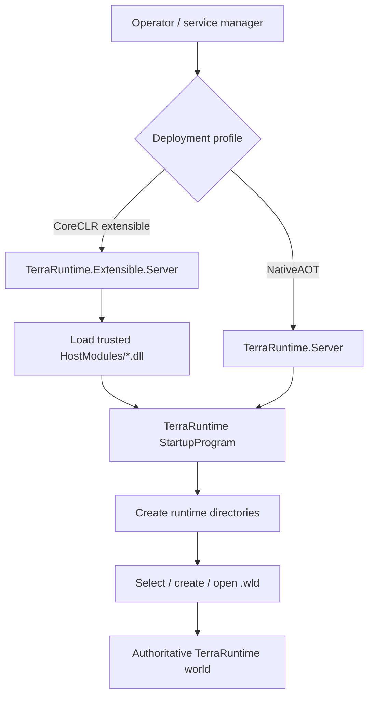
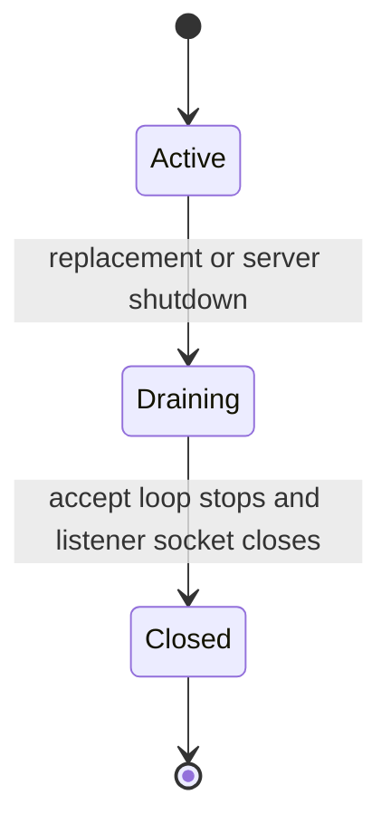

# Deployment and configuration

[Русский](../ru/deployment-configuration.md) · [Documentation index](README.md) · [Operations/TUI](operations-tui.md) · [Host interfaces](host-interfaces.md)

This guide describes the deployment shapes and configuration surface that exist in the current TerraRuntime codebase. It intentionally separates implemented runtime behavior from directories or extension points that are only reserved for future use.

## Deployment profiles

TerraRuntime has two deliberately different executable profiles.

| Profile | Executable | Runtime model | Dynamic trusted host modules |
| --- | --- | --- | --- |
| NativeAOT core | `TerraRuntime.Server` / `TerraRuntime.Server.exe` | NativeAOT-first, trim/AOT-compatible core | No |
| Extensible host | `TerraRuntime.Extensible.Server` / `TerraRuntime.Extensible.Server.exe` | self-contained CoreCLR single-file host | Yes, from `HostModules/` |

The NativeAOT executable is the minimal production runtime. The extensible executable wraps the same startup/runtime path but deliberately enables managed DLL loading for trusted integration modules.



## NativeAOT deployment layout

`TerraRuntime.csproj` creates the runtime directories after a NativeAOT publish. The application also ensures them at startup, so an empty deployment can bootstrap its writable directory structure.

```text
TerraRuntime.Server[.exe]
Worlds/
config/
data/
logs/
```

Platform-native dependencies may also be present. The current CI contract requires `libonigwrap.so` on Linux and `libonigwrap.dll` on Windows.

Release publication removes `.pdb`/`.dbg` files from the runnable deployment. CI verifies the expected top-level layout rather than accepting arbitrary publish-directory debris.

Example Linux publish:

```text
dotnet publish src/TerraRuntime/TerraRuntime.csproj -c Release -r linux-x64 -p:PublishAot=true -p:IlcTreatWarningsAsErrors=true -o artifacts/native-aot/linux-x64
```

Example Windows publish:

```text
dotnet publish src/TerraRuntime/TerraRuntime.csproj -c Release -r win-x64 -p:PublishAot=true -p:IlcTreatWarningsAsErrors=true -o artifacts/native-aot/win-x64
```

## Extensible CoreCLR deployment layout

The extensible host is intentionally not AOT-compatible because dynamic managed module loading is part of its contract. Its Release publish is self-contained, single-file, ReadyToRun-enabled CoreCLR with server GC, tiered compilation and tiered PGO enabled by the project configuration.

```text
TerraRuntime.Extensible.Server[.exe]
runtime/
HostModules/
ServerPlugins/
Worlds/
config/
data/
logs/
```

Example Linux publish:

```text
dotnet publish src/TerraRuntime.ExtensibleHost/TerraRuntime.ExtensibleHost.csproj -c Release -r linux-x64 -p:PublishAot=false -p:PublishSingleFile=true -p:SelfContained=true -p:PublishReadyToRun=true -o artifacts/coreclr/linux-x64
```

The Windows form is identical except for `-r win-x64` and the destination path.

The `runtime/` directory is part of the extensible deployment contract. `HostModules/` is actively consumed by TerraRuntime. `ServerPlugins/` is currently an exposed/reserved directory for the trusted host/plugin architecture; TerraRuntime itself does **not** currently scan it and instantiate arbitrary server plugins.

## Runtime directory ownership

Both profiles derive their root directory from `AppContext.BaseDirectory`, not from the shell's current working directory.

Core runtime directories:

- `Worlds/` — default local world discovery and default generated `.wld` destination;
- `config/` — stable location reserved for runtime/host configuration data;
- `data/` — mutable runtime/host data;
- `logs/` — runtime/host log output location.

The extensible host additionally exposes:

- `HostModules/` — trusted host module assemblies;
- `ServerPlugins/` — reserved/exposed server-plugin location.

These paths are passed to trusted modules through `IEnvironment`; modules should use the supplied paths instead of reconstructing deployment-relative paths themselves.

Directory creation failure is fatal before world startup. The core startup path returns exit code `24`; the extensible wrapper returns `30` if its expanded directory layout cannot be initialized.

## Current configuration model

The core server does **not** yet define a stable general-purpose configuration-file schema. The current stable server startup surface is CLI-based. The existence of `config/` must therefore not be interpreted as proof that a particular `json`, `toml`, YAML, or legacy Terraria configuration file is already supported.

Current server host options:

| Option | Meaning | Default / range |
| --- | --- | --- |
| `--world <path.wld>` | world to load | required unless startup selects/creates one |
| `--bind <ip>`, `--bind-address <ip>` | initial TCP bind address | `0.0.0.0`; numeric IPv4/IPv6, `*`, `any`, or `localhost` |
| `--port <n>` | initial TCP listen port | `7777`; valid `1..65535` |
| `--max-players <n>` | maximum player slots | `8`; valid `1..255` |
| `--interest-management` | enable runtime interest-management control | disabled |
| `--tui` | enable Terminal UI | enabled |
| `--no-tui` | disable Terminal UI | disabled flag; overrides the default enabled TUI |
| `--help`, `-h` | print startup help | exits without starting a world |
| `--list-world-generators` | list built-in and trusted-host generators | exits without starting a world |

The runtime normalizes `--world` to an absolute path. Invalid host options that fail required-value/range validation return exit code `23`.

### Live listener endpoint replacement

The startup `--bind`/`--port` pair defines only the initial public endpoint. While the server is running, **Settings → Runtime settings** and the visible **Settings** button on the System Dashboard can replace the bind address and/or port without disconnecting already accepted clients. Hostname lookup is intentionally not part of this control surface: use a numeric IPv4/IPv6 address, `*`/`any`, or `localhost`.

`ListenerManager` owns listening sockets as generations, while `ServerConnectionAcceptor` owns accepted client sockets independently. A listener generation has the explicit lifecycle below:



A normal endpoint change binds the replacement listener before retiring the previous generation. If the replacement bind fails, the current active listener remains in service. Some same-port address changes can overlap an `ANY` socket at the OS level; in that case TerraRuntime drains only the old listening socket, retries the requested bind, and attempts to restore the previous endpoint if the retry fails. Already accepted connections are owned outside the listener generation and are preserved in every rebind path. The overlap fallback can therefore cause a short **new-connection acceptance** gap, but it does not migrate or close existing client sockets.

### No-argument startup

Running the server without `--world` is an interactive local startup path, not an error. TerraRuntime ensures the runtime directories, scans `Worlds/`, and lets the operator select an existing `.wld` or enter the world-creation flow.

For unattended service deployment, pass `--world` explicitly so startup never depends on an interactive selector.

## Non-interactive world creation

The startup layer can create a world and then immediately start it:

```text
TerraRuntime.Server --create-world <name> --world-generator <id> --world-seed <uint64> --world-width <tiles> --world-height <tiles> [--world-game-mode <classic|expert|master|journey>] [--world-evil <corruption|crimson>] [--world-output <path.wld>] [server options]
```

Required creation values are explicit to preserve deterministic generation inputs:

- `--create-world` — logical world name;
- `--world-generator` — registered generator ID;
- `--world-seed` — unsigned 64-bit seed;
- `--world-width` and `--world-height` — positive tile dimensions.

Defaults:

- game mode: `classic`;
- world evil: `corruption`;
- output path: `Worlds/<name>.wld` under the runtime root.

`--world-output` may select another absolute/relative `.wld` destination after normalization. Existing destinations are not overwritten by the creation pipeline. `--create-world` and `--world` are mutually exclusive. Invalid generation/startup requests return exit code `25`.

The built-in generator catalog currently includes `terraruntime:flat`; it is a framework/baseline generator, not a claim of vanilla Terraria WorldGen parity. See [World generation](world-generation.md).

## Trusted host modules

Only the extensible CoreCLR executable loads host modules.

Startup behavior is deterministic:

1. enumerate top-level `HostModules/*.dll` files;
2. sort file names case-insensitively;
3. create a collectible `AssemblyLoadContext` per candidate;
4. validate the TerraRuntime assembly boundary;
5. locate exactly one exported concrete `IModule` implementation;
6. instantiate it through a public parameterless constructor;
7. require a non-empty, case-insensitively unique module name;
8. call `StartAsync` before the TerraRuntime world is attached;
9. attach the running world through the host lifecycle after startup;
10. detach and stop modules in reverse order during teardown.

Assemblies that are not valid managed images are ignored. An assembly containing no host module implementation is also ignored. A malformed or failing actual host module aborts trusted-module startup; already started modules are stopped/unloaded before the error is propagated. The extensible executable reports host-module startup failure with exit code `31`.

### Contract boundary

A trusted module may reference TerraRuntime contract assemblies admitted by the loader. The current direct TerraRuntime allowlist is:

- `TerraRuntime.HostContracts`;
- `TerraRuntime.Contracts`.

References to implementation assemblies such as `TerraRuntime`, `TerraRuntime.World`, or protocol/network implementation projects are rejected. `Terminal.Gui` is shared through the load context for dashboard extensions.

This is an architectural compatibility boundary, not a security sandbox. Host modules are **trusted in-process code** and can execute arbitrary managed/native behavior available to the process identity. Do not deploy untrusted third-party DLLs into `HostModules/`.

### Module dependencies

The collectible load context first uses `AssemblyDependencyResolver`. It also supports a fallback dependency directory beside each module:

```text
HostModules/
├── Vega.dll
└── Vega/
    ├── SomeDependency.dll
    └── AnotherDependency.dll
```

Shared TerraRuntime contract assemblies and `Terminal.Gui` come from the host rather than being privately loaded into each module context.

## Service deployment guidance

For a headless service, prefer explicit arguments:

```text
TerraRuntime.Server --world Worlds/world.wld --port 7777 --max-players 8 --no-tui
```

For the extensible profile:

```text
TerraRuntime.Extensible.Server --world Worlds/world.wld --port 7777 --max-players 8 --no-tui
```

The executable root should be writable by the service account if TerraRuntime is expected to create or update `Worlds/`, `config/`, `data/`, or `logs/`. World persistence has additional atomic-publication and recovery rules described in [World loading and persistence](world-persistence.md).

Do not run multiple server processes against the same writable world/save path unless an explicit multi-process ownership mechanism says that is safe. Current save/persistence design assumes one authoritative runtime owner for a running world.

## Smoke and maintenance modes

The core startup program also recognizes implementation/CI-oriented standalone modes:

- `--loop-smoke`;
- `--protocol-smoke`;
- `--network-smoke`;
- `--world-smoke`;
- `--tui-smoke`;
- `--save-wld <path.wld>`.

The extensible wrapper bypasses host-module loading for these modes and for `--help`/`-h`, keeping core verification independent from optional managed extensions.

`--host-module-smoke` is specific to the extensible executable: it loads/starts trusted host modules and exits before starting a world.

## What is not yet a deployment contract

Current code does not establish the following as stable supported features:

- a general TerraRuntime configuration-file schema;
- automatic hot reload of configuration;
- automatic hot reload of trusted host modules;
- automatic scanning/loading of `ServerPlugins/` by TerraRuntime itself;
- sandboxing or permission isolation for trusted host modules;
- arbitrary dynamic DLL loading in the NativeAOT core executable;
- compatibility guarantees for undocumented files placed under `config/`, `data/`, or `runtime/`.

When any of these become real behavior, both this guide and the host/operations documentation must change in the same implementation change.
