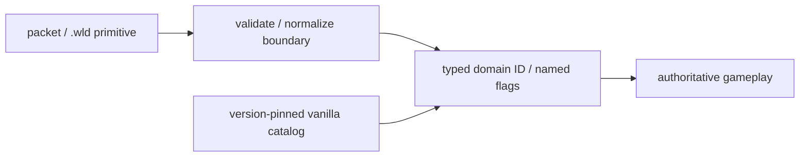

# Gameplay domain-literal CI gate

[Русский](../ru/gameplay-domain-literal-gate.md) · [Gameplay decomposition roadmap](../roadmap/gameplay-decomposition-and-catalogs.md)

TerraRuntime treats numeric Terraria identity as boundary/version data, not as an ordinary gameplay implementation detail. `tools/ci/audit_gameplay_domain_literals.py` is the high-signal CI guard for that rule.

The gate scans gameplay-owned C# in `src/TerraRuntime.Core`, `src/TerraRuntime` and `src/TerraRuntime.World`. Protocol, persistence, snapshot and world-generation adapters whose names explicitly identify boundary ownership are excluded because raw representation is legitimate there.

The audit rejects these forms outside those boundaries:

- constructing `ItemTypeId`, `NpcTypeId`, `ProjectileTypeId`, `TileTypeId`, `WallTypeId`, `BuffTypeId`, `PrefixId`, `TileEntityTypeId`, `NpcAiStyleId` or `ProjectileAiStyleId` from a numeric literal;
- target-typed variants such as `NpcTypeId type = new(3)`;
- direct decisions such as `npc.Type == 3`, `tile.Type is 10 or 388` or `tile.Wall != 350`;
- direct frame arithmetic such as `tile.FrameX / 18`; object geometry or a named frame fact owns the literal;
- direct numeric bit operations on semantic `Flags`, `ControlFlags`, `StateFlags`, `WireFlags` or `Bits` values.
- raw player-inventory subrange constants/comparisons such as `AmmoSlotStart = 54` or `inventorySlot >= 59`; these belong to `VanillaPlayerItemSlotCatalog`.
- non-empty numeric `ItemNetId` construction/comparisons in gameplay-owned code; named `VanillaItemIds`/item facts or a validated boundary value must supply them.

Comments, string literals and character literals are stripped before matching, so documentation/examples do not become fake violations.

## Correct ownership



Gameplay therefore uses forms such as `VanillaNpcIds.Zombie`, `VanillaProjectileIds.Shuriken`, `VanillaNpcAiStyles.Fighter` or verified metadata families instead of repeating their raw values.

## Suppressions

There is no baseline file that silently grandfathered existing violations. A genuinely intentional gameplay literal must carry a same-line, review-visible suppression:

```text
// gameplay-domain-literal-audit: allow <rule> - <specific reason>
```

The rule name must match the reported violation and the reason must be non-trivial. Boundary representation should normally be moved to an explicitly named adapter rather than suppressed.

## Acceptance scope

Passing this gate proves that the audited gameplay roots do not use the prohibited raw-domain forms above. It does **not** claim that every numeric gameplay tuning value is wrong or that protocol/persistence code should stop using primitives. Timers, dimensions and mathematical values remain governed by their owning subsystem and the roadmap's normal magic-number review rules.

The gate runs inside `Gameplay AI Verify` before the .NET build so a new raw identity fails cheaply and visibly.
