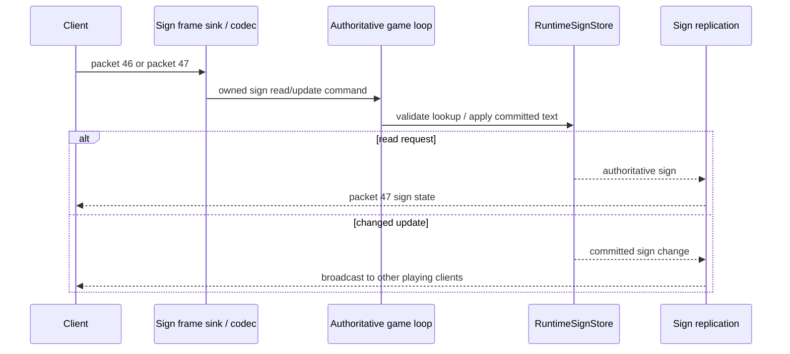
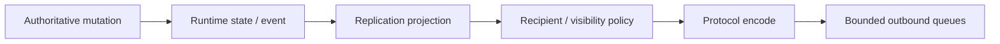
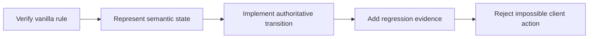

# Gameplay runtime and vanilla parity

[Русский](../ru/gameplay.md) · [Documentation](README.md) · [Architecture](architecture.md) · [Gameplay decomposition roadmap](../roadmap/gameplay-decomposition-and-catalogs.md)

## 1. Purpose

TerraRuntime implements Terraria gameplay as authoritative runtime systems rather than as side effects inside packet handlers.

The goal is **observable TerrariaServer 1.4.5.8 parity**, not source-structure parity. Internal implementation may differ completely when player-visible results, ordering and compatibility remain correct.

This document distinguishes implemented foundations from broad vanilla coverage. A subsystem having a runtime store or an AI dispatcher does not mean every Terraria entity that can use that subsystem is implemented.

## 2. Core gameplay flow

```mermaid
flowchart LR
    Client["Client / network input"] --> Decode["Bounded protocol decode"]
    Decode --> Ingress["Semantic ingress / command"]
    Ingress --> Loop["Authoritative game loop"]
    Loop --> Validate["Validation + state transition"]
    Validate --> Store["Runtime store / event"]
    Store --> Replication["Replication projection"]
    Replication --> Recipients["Recipient selection"]
    Recipients --> Encode["Protocol encode"]
```

Gameplay owns legality and authoritative outcomes. Networking owns wire transport. Replication owns conversion back toward clients.

## 3. Authoritative ownership

Mutable gameplay state is owned by the game-loop thread.

This includes player state, world mutations, chests, signs, world items, NPCs, projectiles and other simulation state as each subsystem becomes authoritative.

External threads and trusted host modules use snapshots or command/operations surfaces. They do not receive mutable stores.

## 4. Identity versus content type

TerraRuntime separates vanilla content identity from a live runtime entity identity.

| Vanilla content identity | Live runtime identity |
|---|---|
| `NpcTypeId(1)` | `NpcHandle(slot, generation)` |
| `ProjectileTypeId(1)` | projectile slot/handle |
| `ItemTypeId` | inventory/world-item identity |

Generation/revision-aware handles prevent a stale reference from mutating a different entity after a slot is reused.

Raw protocol IDs are allowed at the wire boundary. Gameplay should cross into validated named domain IDs as early as practical.

## 5. Version-pinned vanilla facts

Runtime gameplay facts are pinned to TerrariaServer 1.4.5.8.

Current typed/named facts include NPC IDs and AI-style IDs, projectile IDs and AI-style IDs, verified widths/heights/defaults consumed by simulation, tile/item/sign facts used by implemented mutation paths, and protocol-independent runtime handles/snapshots.

A catalog contains only facts actually needed by current behavior. TerraRuntime does not copy the entire decompiled `SetDefaults` surface merely to appear complete.

## 6. Current parity status

The following table is deliberately conservative.

| Area | Current state | Meaning |
|---|---|---|
| Handshake / join / player slot | substantial | live official-world join probes exist; not every gameplay packet is supported |
| Player spawn/state/movement | partial-to-substantial | authoritative ingress/state, normalization and replication foundations exist; complete anti-cheat movement model does not |
| Inventory/equipment | partial | typed commit/request paths and packet handling exist, but full server-authoritative item-use/equipment semantics are not complete |
| World items | substantial foundation | runtime-owned store, allocation/reservation/update/replication paths and tests exist |
| Tiles | partial | verified mutation slices, dirt/stone behavior and replication exist; full placement/framing/wiring/growth breadth does not |
| Chests | substantial slice | runtime chest state, live open/content path, replication and persistence are exercised; complete chest/item authority is still growing |
| Signs | substantial slice | authoritative read/update/store/replication, source-backed tile normalization and `.wld` persistence exist; complete placement/destruction/object lifecycle parity does not |
| Projectiles | partial | lifecycle/store/ownership/AI-style physics/collision/replication exist for verified type families; full projectile catalog/combat/side effects do not |
| NPC lifecycle | partial | runtime store, generation-safe identity, definitions, targeting/check-active/spawn/motion primitives exist |
| NPC AI breadth | early partial | selected verified NPCs and AI families exist, not the full vanilla roster |
| Combat/damage | early/partial | supporting structures exist but full vanilla PvE/PvP damage pipeline is not complete |
| Bosses | largely incomplete | no broad boss parity should be assumed |
| Loot/drops | early/partial | selected world/tile drop paths exist; complete NPC loot tables and RNG behavior do not |
| Housing/town NPCs | incomplete | target architecture exists; broad behavior not implemented |
| Events/invasions/progression | incomplete | not production-parity yet |
| Wiring/liquids/growth | foundation/partial | world/liquid primitives exist; full vanilla simulation is not complete |
| Vanilla world generation | incomplete | extensible worldgen framework exists; built-in flat generator is not vanilla WorldGen |

When this table conflicts with executable evidence or a newer roadmap item, update this document immediately rather than preserving a stale percentage.

## 7. Players

Player networking is converted into runtime-owned commit requests/events before mutation.

Implemented architecture includes dedicated ingress/commit shapes for spawn, movement, vitals/state slices, appearance/equipment slices and event fanout/replication.

Movement has a vanilla-oriented normalization layer and server-known state, but the long-term roadmap still includes richer history/tolerance handling for exceptional movement such as teleports, mounts and respawn transitions.

The runtime must not reject legal vanilla movement merely because a future authoritative model is more ambitious. Anti-cheat policy is not allowed to become guessed gameplay.

## 8. Server-controlled players

Trusted hosts may create connection-free runtime-owned players through `IServerPlayerOperations`.

These actors reserve normal Terraria player slots from the generation-safe pool and accept semantic intent such as horizontal movement. The host cannot directly set final velocity/position every tick and bypass runtime physics/ownership.

This boundary is intended for server-controlled actors and integration scenarios, not for exposing mutable player internals to plugins.

## 9. Inventory and equipment

Inventory/equipment processing is being decomposed away from loose packet fields and raw slot numbers.

Target concepts include named inventory layout regions, validated item type/stack/prefix state, explicit equipment/loadout semantics, semantic item use instead of packet-handler side effects, and server-known ownership for world items/transitions.

The sparse item-definition catalog now enforces source-backed stack maxima for imported item types at normalization, stored-mutation and item-use boundaries. Canonical item types whose defaults have not been imported remain compatibility-permissive for positive protocol-valid stacks instead of inheriting guessed metadata.

Current packet/commit infrastructure should not be mistaken for complete authoritative recipe/use/ammo/accessory logic.

## 10. World items

`RuntimeWorldItemStore` is an authoritative runtime entity store rather than a transparent client relay.

The implemented foundation includes tested slot allocation/reservation, updates/partial updates, runtime ingress/commands, replication-registry integration and selected tile-drop integration.

World-item identity is separate from item content type. Future pickup/stack/ownership validation builds on this server-owned identity instead of trusting arbitrary client slot metadata.

## 11. Tiles and world mutation

World edits pass through semantic/runtime mutation paths rather than directly rewriting tiles in a decoder.

The runtime already has verified slices for tile kill/update/replication and world collision/query behavior. Selected dirt/stone cases are pinned by official-source/reference workflows.

Still incomplete at broad vanilla scale are all placement rules, frame-important and multi-tile object behavior, every slope/platform interaction, wiring/actuation, growth/spread families, and complete tool/item requirements/drops.

A tile mutation is not complete merely because the resulting tile ID looks correct. Neighbor framing, object validity, drops, liquid interaction, persistence and network replication may all be observable parts of the same vanilla action.

## 12. Chests

Chest work is one of the more mature object slices.

Current architecture includes runtime chest state, interaction/replication paths and authoritative persistence support. Live workflows exercise open/content behavior against official-world data.

Important invariants include chest identity/coordinate validation before mutation, malformed chest traffic containment, authoritative-owner save capture and separation of replication from storage.

Full server-authoritative inventory conservation/anti-dupe logic must be introduced only when the underlying item-ownership model is strong enough to avoid false rejects of legal vanilla traffic.

## 13. Signs

Signs now form an authoritative object slice rather than a packet relay.

The current production path contains:

- protocol `326` typed handling for `RequestSign` (`packet 46`) and `SignNew` (`packet 47`);
- `RuntimeSignNetworkIngress` for bounded socket-thread to game-thread handoff;
- `RuntimeSignStore` and `RuntimeSignCommandProcessor` for authoritative lookup/mutation;
- `RuntimeSignReplicationRegistry` for transport projection;
- `SignInteractionFrameSink` in the production connection chain;
- `.wld` sign-section persistence from authoritative runtime state.

### Source-backed tile normalization

A sign read is normalized from the clicked tile to the sign origin using the verified TerrariaServer 1.4.5.8 frame rule. Horizontal origin selection uses `FrameX / 18` modulo two, while vertical origin uses `FrameY / 18`. The normalized origin must resolve to one of the verified sign tile types `55`, `85`, `425` or `573`.

Out-of-world coordinates or a normalized tile that is not one of those sign types are rejected rather than guessed.

### Update replication

For a committed text change, the current source-backed path broadcasts the resulting sign state to other playing clients while excluding the sender, matching the pinned vanilla update path. A read response is sent only to the requesting connection.

This is a substantial interaction/persistence slice, not complete sign-object lifecycle parity. Placement, destruction, framing and every surrounding tile-object rule remain part of broader tile/object work.

## 14. NPC lifecycle

NPCs use a runtime-owned store and generation-safe handles.

Current foundations include allocation/lifecycle state, version-pinned definition lookup, target selection primitives, gravity/world motion, spawn cadence primitives, check-active/despawn behavior slices, replication projection and trusted-host actor control through semantic intent.

The current verified definition catalog includes **Blue Slime**, **Demon Eye** and **Zombie**. This is an explicit coverage slice, not an implication that other NPC defaults are guessed from similar entities.

## 15. NPC AI

AI is decomposed by behavior/family instead of becoming one unbounded `switch(type)` in a packet handler.

Current selected implementation includes AI-specific/family primitives for the verified NPC slice, including slime/fighter/flying-style work used by Blue Slime, Zombie and Demon Eye paths.

Rules for expanding AI:

1. verify constants and state ordering from TerrariaServer 1.4.5.8;
2. isolate reusable behavior only when entities genuinely share the rule;
3. preserve RNG ordering where observable;
4. add deterministic tests for state transitions;
5. use official-server/client evidence when local tests can share the same wrong assumption.

Boss orchestration should not be forced through abstractions designed for three simple early-game NPCs.

## 16. Trusted-host NPC actors

`INpcActorOperations` lets a trusted host acquire a lease over an existing runtime NPC and submit semantic `NpcActorIntent`.

The runtime still owns final movement, gravity, collision, lifetime/entity identity and authoritative application order.

Controller IDs and explicit release support safe module/plugin teardown. A host cannot retain direct mutable NPC objects across reload boundaries.

## 17. Projectiles

Projectile support has moved beyond a relay-only design.

Current architecture includes runtime projectile store, ownership/provenance facts, lifecycle handling, definition catalog, behavior state executor/stepper, world physics/collision, tile-cut integration for supported cases, and packet projection/replication.

Projectile-to-NPC combat now has a separate mutation-free intent boundary. Player-owned provenance resolves the byte owner to the current generation-safe `PlayerHandle`; server-owned/NPC provenance and actual entity-hit selection remain fail-closed until modeled explicitly.

Generic supported tile impacts now retain `TileCollision` as their semantic termination reason through the generation-safe authoritative commit. Post-behavior decorators and termination observers can therefore distinguish an impact from ordinary lifetime expiry without inspecting wire state.

The source-backed world step also applies vanilla's pre-AI inclusive world-edge deactivation for supported non-boomerang families and reports `WorldBounds` separately. This prevents out-of-world state from being simulated for another tick while preserving the vanilla boomerang exemption for its future behavior slice.

| Verified family | Vanilla AI style |
|---|---:|
| Arrow | `1` |
| Thrown | `2` |
| Boomerang | `3` |

The definition catalog contains a growing verified set across these families, including multiple arrows, bullets/lasers, bones, shuriken/throwing-knife-style projectiles and boomerang support.

This still does **not** mean complete Terraria projectile parity. Unsupported irreversible side effects, child spawning, immunity, penetration, specialized AI, damage and kill effects must remain explicit boundaries rather than silently guessed behavior.

## 18. Combat

Combat is a separate semantic subsystem, not just fields attached to projectile/NPC packets.

The target model includes damage source/provenance, attacker/target, base/final damage, defense interaction, knockback, critical hits, immunity/cooldowns, death reason/result and PvP/environment/NPC/projectile categories.

Only verified portions should be made authoritative. Until complete conservation/damage rules exist, the server should not invent strict rejection rules that break legal vanilla behavior.

## 19. Drops and loot

Selected tile/world-item drop paths are implemented and tested, but complete vanilla loot is much larger.

NPC loot parity eventually requires rule/data structures that preserve conditions, probabilities, stack ranges, progression/event dependencies and RNG ordering.

A declarative loot table is useful only if it reproduces the verified sequence; changing RNG call order while preserving nominal percentages can still change observable vanilla outcomes.

## 20. Buffs, prefixes and item metadata

The architecture is moving toward typed IDs and version-pinned metadata rather than scattered raw integers.

These systems remain broad future work. New authoritative validation must not accept arbitrary unvalidated bytes as meaningful domain state, but it also must not reject values whose vanilla legality has not been verified.

## 21. Wiring, liquids and growth

Wiring, liquid material and growth commits now have separate typed mutation boundaries. Liquids also have an explicit runtime work queue that can be persisted through warm snapshots.

That decomposition is not full vanilla simulation. Circuit traversal/devices, liquid flow/reactions and growth/spread rule families remain incomplete.

These subsystems are order-sensitive and can touch large world areas, so their implementation must combine exact behavioral verification, global bounded per-tick work, deterministic owner-thread commits, dirty/replication tracking and save compatibility.

## 22. Progression, events, town NPCs and bosses

These are currently major parity gaps.

Do not infer support from world header fields being readable or from generic NPC infrastructure existing. A world can load progression metadata without the runtime yet reproducing all transitions and gameplay consequences of that metadata.

As these systems become authoritative, each needs explicit persistence, synchronization and official behavior evidence.

## 23. World generation

TerraRuntime has a world-generation **framework** with provider registration, planning, ordered passes, isolated workspace execution and final validation.

The built-in generator is currently a deterministic flat dirt/stone baseline. It is explicitly not an approximation of Terraria's vanilla WorldGen pipeline.

Vanilla worldgen therefore remains incomplete even though the architecture for custom/pluggable world generation is substantially developed.

## 24. Replication

Gameplay mutation and network replication are separate responsibilities.

Runtime replication registries exist for multiple entity/object classes, including player-related events, NPCs, projectiles, world items, chests, signs and tile manipulation.

This separation matters because one mutation may have multiple recipients, recipients may change under interest management, identical encoded state can be shared where safe, and persistence must not depend on what was last sent to a client.

## 25. Validation philosophy

The server becomes more authoritative only where it can prove the rule.

The anti-pattern is to assume what a legitimate client "should" do, reject everything else, and only later discover that vanilla allows the rejected behavior. False-positive anti-cheat is a gameplay bug.

## 26. Evidence hierarchy

Gameplay changes use the project-wide source hierarchy:

1. locally decompiled TerrariaServer 1.4.5.8 for current vanilla behavior and constants;
2. Multiplicity for protocol `326` wire representation;
3. terrustia as an independent implementation cross-check;
4. TShock/OTAPI for history/exploit lessons only.

Real official-client/server traffic, generated worlds and differential probes are required when a local unit test cannot independently prove behavior.

## 27. Test strategy

Depending on the subsystem, evidence should include deterministic state-transition unit tests, definition/catalog tests, runtime store lifecycle/slot-reuse tests, collision/world-query tests, replication tests, malformed/illegal input tests, official-source contract workflows, live official-world/client probes, and persistence/restart tests for state that survives saves.

A green build is not parity evidence by itself.

## 28. Adding a new NPC/projectile behavior

Before adding a new behavior slice:

1. identify the exact Terraria 1.4.5.8 type and AI/default facts;
2. decide whether it belongs to an existing verified behavior family or needs a separate strategy;
3. add only metadata consumed by current behavior;
4. implement state transitions without protocol-library dependencies;
5. verify world collision/physics assumptions independently;
6. add lifecycle/replication handling;
7. add deterministic regression tests;
8. document unsupported side effects explicitly;
9. update both RU and EN parity documentation in the same change.

## 29. Current highest-risk gaps

The largest remaining gameplay breadth is not basic store architecture. It is vanilla rule coverage:

- many NPC AI families;
- bosses;
- full combat and damage semantics;
- complete item use/inventory authority;
- loot;
- housing/town NPC behavior;
- invasions/events;
- wiring/liquids/growth;
- world progression;
- vanilla world generation.

These should be treated as explicit work, not hidden behind a global "gameplay implemented" label.

## 30. Documentation rule

Gameplay diagrams use Mermaid for flows/sequences/state relationships. Numeric measurements or dimensional limits use LaTeX with units; packet IDs, AI-style IDs, content IDs and protocol versions remain code literals because they are identifiers, not measurements.
