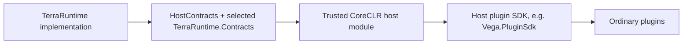
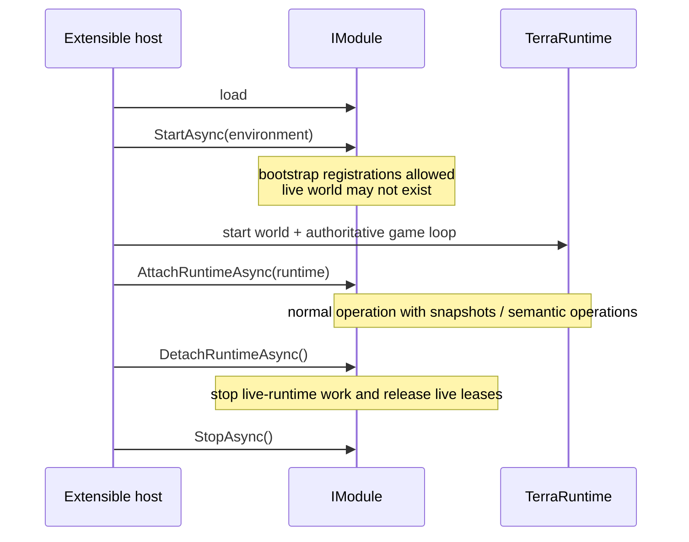
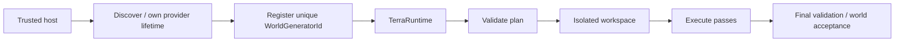

# TerraRuntime host interfaces

[Русский](../ru/host-interfaces.md) · [Documentation](README.md) · [Architecture](architecture.md) · [Project guide](project-guide.md)

This document describes the public integration surface for a trusted host module in the CoreCLR profile. It is not a catalog of every internal `public` TerraRuntime type. The canonical external boundary for Vega and other trusted hosts is `TerraRuntime.HostContracts` plus deliberately exposed contracts from `TerraRuntime.Contracts`.

## 1. Trust model

A trusted host module is more privileged than an ordinary Vega plugin, but it does not become a co-owner of internal runtime state.

> A host receives snapshots, semantic operations, and registration surfaces. It does not receive mutable stores, the game-loop object, socket connection objects, or direct setters for authoritative fields.



Ordinary plugins should use Vega and its Plugin SDK. `TerraRuntime.HostContracts` is not intended to be handed to every plugin DLL.

## 2. Trusted host module lifecycle

Primary contract:

```csharp
public interface IModule
{
    string Name { get; }

    ValueTask StartAsync(
        IEnvironment environment,
        CancellationToken cancellationToken = default);

    ValueTask AttachRuntimeAsync(
        IRuntime runtime,
        CancellationToken cancellationToken = default);

    ValueTask DetachRuntimeAsync(CancellationToken cancellationToken = default);

    ValueTask StopAsync(CancellationToken cancellationToken = default);
}
```



### Lifecycle rules

- `StartAsync` must not assume a live world exists.
- A module that implements `IModuleWorldActivation` is queried with immutable world identity before each runtime attachment. Returning `false` skips `AttachRuntimeAsync`, creates no runtime scope and therefore publishes no actor/shop state for that world. Activation policy and configuration remain module-owned.
- Registration handles/resources owned by the module are retired before unload.
- After `DetachRuntimeAsync`, retained references must not be used as though the world were still attached.
- `StopAsync` releases host-owned resources.
- Cancellation tokens must be respected; lifecycle calls must not hang indefinitely.

## 3. `IEnvironment`

The bootstrap environment is available in `StartAsync`.

```csharp
public interface IEnvironment
{
    string RootDirectory { get; }
    string HostModulesDirectory { get; }
    string ServerPluginsDirectory { get; }
    string WorldsDirectory { get; }
    string ConfigDirectory { get; }
    string DataDirectory { get; }
    string LogsDirectory { get; }

    IDashboardRegistry TerminalDashboards { get; }
    IGeneratorRegistry WorldGenerators { get; }
}
```

### Intended uses

- resolve host-owned config/data/log paths;
- register an independent TUI dashboard;
- register a selectable world generator.

### Not intended for

- scanning TerraRuntime internal assemblies and reflecting implementation types;
- treating deployment paths as a substitute for runtime API;
- directly rewriting a running world's `.wld` behind the runtime persistence boundary.

## 4. `IRuntime`

The live runtime surface is attached after the authoritative runtime starts.

```csharp
public interface IRuntime
{
    RuntimeInfo Info { get; }
    IInterestManagementControl InterestManagement { get; }
    IPlayerStateSnapshotReader PlayerStates { get; }
    IPlayerAdministrativeOperations PlayerAdministration { get; }
    INpcActorOperations NpcActors { get; }
    INpcShopOperations NpcShops { get; }
    IServerPlayerOperations ServerPlayers { get; }
}
```

This is a composition surface. Each child contract owns one semantic area.

## 5. Reading player state

`IPlayerStateSnapshotReader` returns an immutable snapshot for a generation-safe `PlayerHandle`.

```csharp
PlayerStateSnapshot? snapshot = await runtime.PlayerStates.CaptureAsync(
    playerHandle,
    cancellationToken);

if (snapshot is null)
{
    // The player is gone, the handle is stale, or state is unavailable.
    return;
}

// Read the snapshot. Do not mutate authoritative player state.
```

The API is asynchronous because the request may be serialized through a runtime-owned boundary. A host must not assume capture is a direct dictionary/array read on the calling thread.

### Trusted player administration

`IPlayerAdministrativeOperations` is the typed administrative boundary for exact-generation live players. It currently exposes runtime-only GodMode get/set operations keyed by `PlayerHandle`; a stale handle returns no state/change rather than targeting a replacement player that reused the same slot. This surface is intended for trusted hosts such as Vega and the built-in TUI. It is deliberately not exposed as a chat command or a text-command grammar.

GodMode remains process/runtime state rather than player persistence. Level-1 world transfer preserves it for the same live connection, while disconnect ends the state with that player generation.

## 6. Interest management

`IInterestManagementControl` is intentionally narrow:

```csharp
bool currentlyEnabled = runtime.InterestManagement.IsEnabled;
bool changed = runtime.InterestManagement.SetEnabled(true);
```

The host controls only whether the mechanism participates. Spatial cell/section size, enter/leave radii, hysteresis, entity visibility rules, forced resync and packet-specific routing belong to TerraRuntime.

## 7. Runtime-owned NPC actors

`INpcActorOperations` allows a trusted host to acquire semantic control of a supported NPC actor.

A module first registers a stable archetype backed by a source-verified vanilla presentation, then asks TerraRuntime to allocate and spawn the actor. Both archetype publication and NPC mutation occur at an authoritative game-loop boundary; the module never selects a raw NPC slot:

```csharp
var descriptor = new NpcArchetypeDescriptor(
    merchantArchetypeId,
    VanillaNpcIds.Zombie,
    Role: NpcArchetypeRole.Town);
NpcArchetypeRegistrationStatus registered = runtime.NpcActors.TryRegisterArchetype(
    descriptor,
    out INpcArchetypeRegistration? archetype);

NpcActorSpawnResult spawned = await runtime.NpcActors.SpawnAsync(
    new NpcActorSpawnRequest(descriptor.Id, positionX, positionY),
    cancellationToken);
```

The returned `NpcHandle` is generation-safe. Spawn uses the first reusable runtime NPC slot, commits through the ordinary NPC store/replication chain and binds the server-only archetype identity to that exact generation. `DespawnAsync` uses the same authoritative path.

`Role` defaults to `Ordinary`. Custom town and boss actors must declare `Town` or `Boss` explicitly; TerraRuntime does not infer lifecycle policy from the presentation NPC type or AI style. Role classification is bound to the exact actor generation and the published archetype-registry revision. This is an ownership boundary for custom runtime actors, not a claim of vanilla town/boss parity.

```csharp
NpcActorAcquireStatus status = await runtime.NpcActors.AcquireAsync(
    npc,
    controllerId,
    cancellationToken);

if (status != NpcActorAcquireStatus.Acquired)
    return;

await runtime.NpcActors.SetIntentAsync(
    npc,
    controllerId,
    intent,
    cancellationToken);
```

The host supplies **intent**, not final velocity/position values. TerraRuntime retains gravity, collision, final motion, lifecycle and replication ownership.

Release one actor:

```csharp
await runtime.NpcActors.ReleaseAsync(npc, controllerId, cancellationToken);
```

On controller/module unload, release all leases:

```csharp
int released = await runtime.NpcActors.ReleaseControllerAsync(
    controllerId,
    cancellationToken);
```

Explicit release gives the module deterministic fallback timing. As a fail-safe, the trusted-module runtime scope tracks every archetype registration, spawned actor and successfully acquired controller; detach releases controls, despawns owned actors and retires archetypes. Calls through the expired scope then fail closed.

### `NpcActorAcquireStatus`

- `Acquired` — lease acquired;
- `InvalidActor` — handle does not reference a valid live actor;
- `InvalidController` — controller identity is invalid;
- `UnsupportedNpcType` — actor control is not implemented for that NPC type;
- `AlreadyControlled` — another controller owns the actor;
- `QueueRejected` — the authoritative command boundary did not accept the operation.

`QueueRejected` is not confirmation that an operation probably applied.

### Runtime NPC-shop registration

`INpcShopOperations` registers an immutable, protocol-valid vanilla catalog against a stable runtime NPC archetype. Registration and replacement are staged from the host thread and published together at the next authoritative game-loop tick:

```csharp
var catalog = new NpcShopCatalog(shopId, merchantArchetypeId, offers);
NpcShopRegistrationStatus status = runtime.NpcShops.TryRegister(catalog, out INpcShopRegistration? shop);
bool replaced = shop?.TryReplaceCatalog(updatedCatalog) ?? false;
```

The returned registration cannot change its shop or archetype identity. A trusted-module runtime scope owns every registration and retires it on detach even if module cleanup fails or drops the lease; retirement becomes visible at the next authoritative tick. `RuntimeDetached` rejects registrations attempted through an expired scope.

### NPC shop purchase commit observations

`INpcShopPurchaseCommitSink` receives an immutable `NpcShopPurchaseCommit` only after the complete coin and inventory transaction commits atomically. The record carries exact-generation buyer/vendor handles, stable shop/offer IDs, the catalog revision, price/change, destination slot and mutation count. It is an observer boundary with no inventory mutation authority; observer failures do not change an already committed purchase result.

`RuntimeActorInteractionBoundary` validates semantic `ActorInteractionRequest` values before policy dispatch. It requires exact-generation player/NPC handles, live available state, a source-backed target definition and intersection with vanilla's `TileReachCheckSettings.Simple` region. Accepted requests capture both authoritative revisions; raw wire slots and final policy/UI decisions remain outside this boundary.

## 8. Connection-free runtime-owned players

`IServerPlayerOperations` creates runtime-owned player actors without a network connection while using the normal Terraria player-slot pool.

```csharp
ServerPlayerCreateResult result = await runtime.ServerPlayers.CreateAsync(
    serverPlayerId,
    positionX,
    positionY,
    cancellationToken);

if (!result.IsCreated)
    return;

PlayerHandle handle = result.Player;
```

Appearance, vitals and packet-valid equipment/inventory slots are also authoritative commands keyed by the stable `ServerPlayerId`:

```csharp
await runtime.ServerPlayers.SetAppearanceAsync(serverPlayerId, appearance, cancellationToken);
await runtime.ServerPlayers.SetVitalsAsync(
    serverPlayerId,
    new ServerPlayerVitalsState(Life: 100, MaxLife: 100, Mana: 20, MaxMana: 20),
    cancellationToken);
await runtime.ServerPlayers.SetItemAsync(serverPlayerId, item, cancellationToken);
```

TerraRuntime applies the same source-backed appearance, life and item-ID/slot normalization used at connection boundaries. State is exact-generation and is retired with the server-player lease; sparse item storage is allocated only after the first non-empty item.

Committed server-player lifecycle, appearance, relayable equipment, vitals and movement are projected to playing real clients through ordinary protocol `326` player packets. A newly playing client receives existing server-player baselines in stable active/appearance/equipment/vitals/movement order, and despawn emits the inactive player state. This first replication slice conservatively sends server-player state to every playing client; fake-player AOI routing remains separate work.

Connection-owned player ingress accepts appearance, equipment, vitals and movement only for that connection's exact allocated slot. Because connection and server-player leases share one exclusive slot pool, a client packet claiming a server-owned slot is rejected before it reaches the authoritative command queue.

The host does not receive direct position/velocity setters after creation. Control is semantic intent:

```csharp
bool accepted = await runtime.ServerPlayers.SetHorizontalIntentAsync(
    serverPlayerId,
    ServerPlayerHorizontalIntent.Right,
    cancellationToken);

bool jumping = await runtime.ServerPlayers.SetJumpIntentAsync(
    serverPlayerId,
    ServerPlayerJumpIntent.Held,
    cancellationToken);

await runtime.ServerPlayers.SetJumpIntentAsync(
    serverPlayerId,
    ServerPlayerJumpIntent.Released,
    cancellationToken);

bool moving = await runtime.ServerPlayers.SetMovementIntentAsync(
    serverPlayerId,
    ServerPlayerMovementIntent.MoveTo(targetX: 800f, targetY: 320f),
    cancellationToken);

bool following = await runtime.ServerPlayers.SetMovementIntentAsync(
    serverPlayerId,
    ServerPlayerMovementIntent.FollowPlayer(targetPlayer),
    cancellationToken);
```

`ServerPlayerJumpIntent` is button-level semantic input, not a velocity command. TerraRuntime owns ordinary vanilla jump speed/duration, release gate, gravity and collision. Holding jump through landing does not start another jump until `Released` rearms the vanilla release gate.

`MoveTo` and `FollowPlayer` resolve on the authoritative tick into the same horizontal/jump button intents. They never write position or velocity directly. Follow targets are exact-generation `PlayerHandle` values; disconnect or slot reuse stops the controller instead of redirecting it to a replacement player. Bounded stop, vertical-jump and maximum-distance policy is supplied through `ServerPlayerMovementOptions`.

Liquid contact is derived by TerraRuntime from authoritative world tiles; the host still supplies no liquid or velocity data. The verified ordinary unmounted path carries exact-generation contact state between ticks and selects the source-backed dry/water/lava/honey/shimmer gravity, fall-speed and jump profile from the preceding contact pass. Current contact selects vanilla position factors $0.5$ in water/lava, $0.25$ in honey and $0.375$ in shimmer; authoritative collision velocity remains unscaled, and an axis clamped by tile collision advances without applying the factor twice. Leaving liquid also clamps the remaining ordinary jump counter at the source-backed transition point. Accessory swimming/floating, mounts, grapples and extra-jump families remain separate gameplay work and fail outside this supported baseline.

Despawn:

```csharp
await runtime.ServerPlayers.DespawnAsync(serverPlayerId, cancellationToken);
```

`ServerPlayerCreateStatus` currently includes `Created`, `InvalidId`, `InvalidPosition`, `AlreadyExists`, `NoAvailableSlot` and `QueueRejected`.

A created server player uses generation-safe runtime identity. Raw slot index is not a permanent identifier.

`TerraRuntime.HostModuleFixture` is the executable bot and custom-merchant example used by the CoreCLR host-boundary tests. On runtime attach it spawns a controlled merchant archetype, attaches a protocol-valid shop, creates a named server player, commits appearance/vitals, submits the bot's `MoveTo`, and tells the merchant to `FollowPlayer` that exact live generation. On detach it stops and despawns both actors; the loader also proves scope-owned registration retirement. The example therefore exercises the public semantic API without direct position/velocity writes. The controlled-physics regression compares identical $256\,\text{tick}$ runs and keeps the warmed allocation budget below $3\,\mathrm{KiB/tick}$.

## 9. Terminal dashboard registration

```csharp
public interface IDashboardProvider
{
    string Id { get; }
    string Title { get; }
    View CreateDashboard();
    void Refresh(View rootView);
}
```

Registration/removal:

```csharp
bool registered = environment.TerminalDashboards.TryRegister(provider);
environment.TerminalDashboards.TryUnregister(provider.Id);
```

`CreateDashboard()` and `Refresh(...)` run on the Terminal.Gui UI thread. A provider supplies a complete independent dashboard root; it does not inject controls into TerraRuntime's built-in system dashboard. UI callbacks do not mutate gameplay state directly.

## 10. World-generator registration

```csharp
TerraRuntimeWorldGeneratorRegistrationResult result =
    environment.WorldGenerators.TryRegister(provider, out var registration);
```

Possible results are `Registered`, `DuplicateId` and `InvalidProvider`. A successful registration returns `ITerraRuntimeWorldGeneratorRegistration`; `Dispose()` retires it before provider/module unload.



The host owns provider discovery/lifetime and pass logic. TerraRuntime owns selection, plan validation, isolated workspace, execution boundary, final acceptance and cancellation/error containment. Explicit registration exists instead of reflection-driven discovery.

## 11. `ILifecycle`

```csharp
public interface ILifecycle
{
    ValueTask AttachRuntimeAsync(
        IRuntime runtime,
        CancellationToken cancellationToken = default);

    ValueTask DetachRuntimeAsync(CancellationToken cancellationToken = default);
}
```

This optional bridge lets an extensible host attach loaded modules to a live runtime. Standalone NativeAOT normally does not provide it.

The CoreCLR loader reload path detaches every live runtime scope first, which releases controls, despawns scope-owned actors and retires archetype/shop registrations. It then stops modules, unloads their collectible assembly contexts, rediscovers the module DLLs and starts and attaches fresh instances. Integration coverage executes attach, per-world skip, reload, reattach and final detach while verifying that no old actor, controller or catalog state survives.

## 12. Host-module implementation pattern

```csharp
public sealed class ExampleHostModule : IModule
{
    private IEnvironment? environment;
    private IRuntime? runtime;

    public string Name => "Example";

    public ValueTask StartAsync(
        IEnvironment environment,
        CancellationToken cancellationToken = default)
    {
        this.environment = environment;
        return ValueTask.CompletedTask;
    }

    public ValueTask AttachRuntimeAsync(
        IRuntime runtime,
        CancellationToken cancellationToken = default)
    {
        this.runtime = runtime;
        return ValueTask.CompletedTask;
    }

    public ValueTask DetachRuntimeAsync(CancellationToken cancellationToken = default)
    {
        runtime = null;
        return ValueTask.CompletedTask;
    }

    public ValueTask StopAsync(CancellationToken cancellationToken = default)
    {
        environment = null;
        return ValueTask.CompletedTask;
    }
}
```

A real module also retires dashboard/worldgen registrations and releases actor-controller leases before `StopAsync` completes.

## 13. Boundary violations

Host integration must not use reflection to reach internal runtime state, write directly into NPC/player/world stores, mutate gameplay from the TUI thread around the command boundary, store raw slots as permanent identity, block with `.Result`/`.Wait()` inside sensitive host callbacks, use live-runtime contracts after detach, or leave registrations/controller leases behind after unload.

## 14. Interface documentation versioning

Any change to a signature, status enum, lifecycle ordering, threading semantics or ownership guarantee requires matching source XML docs where appropriate, both EN/RU host-interface pages, `architecture.md` when the boundary changes and roadmap status when readiness/plans change.

Architecture/process diagrams in this guide use Mermaid. Dimensional measurements use LaTeX where such quantities appear; API signatures, enum values and code examples remain literal code.
