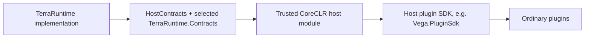
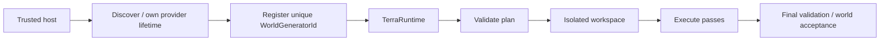

# TerraRuntime host interfaces

[Русский](../ru/host-interfaces.md) · [Documentation](README.md) · [Architecture](architecture.md) · [Project guide](project-guide.md)

This document describes the public integration surface for a trusted host module in the CoreCLR profile. It is not a catalog of every internal `public` TerraRuntime type. The canonical external boundary for Vega and other trusted hosts is `TerraRuntime.HostContracts` plus deliberately exposed contracts from `TerraRuntime.Contracts`.

## 1. Trust model

A trusted host module is more privileged than an ordinary Vega plugin, but it does not become a co-owner of internal runtime state.

> A host receives snapshots, semantic operations, and registration surfaces. It does not receive mutable stores, the game-loop object, socket connection objects, or direct setters for authoritative fields.



Ordinary plugins should use Vega and its Plugin SDK. `TerraRuntime.HostContracts` is not intended to be handed to every plugin DLL.

## 2. Trusted host module lifecycle

Primary contract:

```csharp
public interface ITerraRuntimeHostModule
{
    string Name { get; }

    ValueTask StartAsync(
        ITerraRuntimeHostEnvironment environment,
        CancellationToken cancellationToken = default);

    ValueTask AttachRuntimeAsync(
        ITerraRuntimeHostRuntime runtime,
        CancellationToken cancellationToken = default);

    ValueTask DetachRuntimeAsync(CancellationToken cancellationToken = default);

    ValueTask StopAsync(CancellationToken cancellationToken = default);
}
```


### Lifecycle rules

- `StartAsync` must not assume a live world exists.
- Registration handles/resources owned by the module are retired before unload.
- After `DetachRuntimeAsync`, retained references must not be used as though the world were still attached.
- `StopAsync` releases host-owned resources.
- Cancellation tokens must be respected; lifecycle calls must not hang indefinitely.

## 3. `ITerraRuntimeHostEnvironment`

The bootstrap environment is available in `StartAsync`.

```csharp
public interface ITerraRuntimeHostEnvironment
{
    string RootDirectory { get; }
    string HostModulesDirectory { get; }
    string ServerPluginsDirectory { get; }
    string WorldsDirectory { get; }
    string ConfigDirectory { get; }
    string DataDirectory { get; }
    string LogsDirectory { get; }

    ITerraRuntimeTerminalDashboardRegistry TerminalDashboards { get; }
    ITerraRuntimeWorldGeneratorRegistry WorldGenerators { get; }
}
```

### Intended uses

- resolve host-owned config/data/log paths;
- register an independent TUI dashboard;
- register a selectable world generator.

### Not intended for

- scanning TerraRuntime internal assemblies and reflecting implementation types;
- treating deployment paths as a substitute for runtime API;
- directly rewriting a running world's `.wld` behind the runtime persistence boundary.

## 4. `ITerraRuntimeHostRuntime`

The live runtime surface is attached after the authoritative runtime starts.

```csharp
public interface ITerraRuntimeHostRuntime
{
    TerraRuntimeHostRuntimeInfo Info { get; }
    IInterestManagementControl InterestManagement { get; }
    IPlayerStateSnapshotReader PlayerStates { get; }
    INpcActorOperations NpcActors { get; }
    IServerPlayerOperations ServerPlayers { get; }
}
```

This is a composition surface. Each child contract owns one semantic area.

## 5. Reading player state

`IPlayerStateSnapshotReader` returns an immutable snapshot for a generation-safe `PlayerHandle`.

```csharp
PlayerStateSnapshot? snapshot = await runtime.PlayerStates.CaptureAsync(
    playerHandle,
    cancellationToken);

if (snapshot is null)
{
    // The player is gone, the handle is stale, or state is unavailable.
    return;
}

// Read the snapshot. Do not mutate authoritative player state.
```

The API is asynchronous because the request may be serialized through a runtime-owned boundary. A host must not assume capture is a direct dictionary/array read on the calling thread.

## 6. Interest management

`IInterestManagementControl` is intentionally narrow:

```csharp
bool currentlyEnabled = runtime.InterestManagement.IsEnabled;
bool changed = runtime.InterestManagement.SetEnabled(true);
```

The host controls only whether the mechanism participates. Spatial cell/section size, enter/leave radii, hysteresis, entity visibility rules, forced resync and packet-specific routing belong to TerraRuntime.

## 7. Runtime-owned NPC actors

`INpcActorOperations` allows a trusted host to acquire semantic control of a supported NPC actor.

```csharp
NpcActorAcquireStatus status = await runtime.NpcActors.AcquireAsync(
    npc,
    controllerId,
    cancellationToken);

if (status != NpcActorAcquireStatus.Acquired)
    return;

await runtime.NpcActors.SetIntentAsync(
    npc,
    controllerId,
    intent,
    cancellationToken);
```

The host supplies **intent**, not final velocity/position values. TerraRuntime retains gravity, collision, final motion, lifecycle and replication ownership.

Release one actor:

```csharp
await runtime.NpcActors.ReleaseAsync(npc, controllerId, cancellationToken);
```

On controller/module unload, release all leases:

```csharp
int released = await runtime.NpcActors.ReleaseControllerAsync(
    controllerId,
    cancellationToken);
```

### `NpcActorAcquireStatus`

- `Acquired` — lease acquired;
- `InvalidActor` — handle does not reference a valid live actor;
- `InvalidController` — controller identity is invalid;
- `UnsupportedNpcType` — actor control is not implemented for that NPC type;
- `AlreadyControlled` — another controller owns the actor;
- `QueueRejected` — the authoritative command boundary did not accept the operation.

`QueueRejected` is not confirmation that an operation probably applied.

## 8. Connection-free runtime-owned players

`IServerPlayerOperations` creates runtime-owned player actors without a network connection while using the normal Terraria player-slot pool.

```csharp
ServerPlayerCreateResult result = await runtime.ServerPlayers.CreateAsync(
    serverPlayerId,
    positionX,
    positionY,
    cancellationToken);

if (!result.IsCreated)
    return;

PlayerHandle handle = result.Player;
```

The host does not receive direct position/velocity setters after creation. Control is semantic intent:

```csharp
bool accepted = await runtime.ServerPlayers.SetHorizontalIntentAsync(
    serverPlayerId,
    ServerPlayerHorizontalIntent.Right,
    cancellationToken);

bool jumping = await runtime.ServerPlayers.SetJumpIntentAsync(
    serverPlayerId,
    ServerPlayerJumpIntent.Held,
    cancellationToken);

await runtime.ServerPlayers.SetJumpIntentAsync(
    serverPlayerId,
    ServerPlayerJumpIntent.Released,
    cancellationToken);
```

`ServerPlayerJumpIntent` is button-level semantic input, not a velocity command. TerraRuntime owns ordinary vanilla jump speed/duration, release gate, gravity and collision. Holding jump through landing does not start another jump until `Released` rearms the vanilla release gate. The current source-backed slice is dry, unmounted and normal-gravity; liquids, mounts, grapples and extra-jump families remain separate gameplay work.

Despawn:

```csharp
await runtime.ServerPlayers.DespawnAsync(serverPlayerId, cancellationToken);
```

`ServerPlayerCreateStatus` currently includes `Created`, `InvalidId`, `InvalidPosition`, `AlreadyExists`, `NoAvailableSlot` and `QueueRejected`.

A created server player uses generation-safe runtime identity. Raw slot index is not a permanent identifier.

## 9. Terminal dashboard registration

```csharp
public interface ITerraRuntimeTerminalDashboardProvider
{
    string Id { get; }
    string Title { get; }
    View CreateDashboard();
    void Refresh(View rootView);
}
```

Registration/removal:

```csharp
bool registered = environment.TerminalDashboards.TryRegister(provider);
environment.TerminalDashboards.TryUnregister(provider.Id);
```

`CreateDashboard()` and `Refresh(...)` run on the Terminal.Gui UI thread. A provider supplies a complete independent dashboard root; it does not inject controls into TerraRuntime's built-in system dashboard. UI callbacks do not mutate gameplay state directly.

## 10. World-generator registration

```csharp
TerraRuntimeWorldGeneratorRegistrationResult result =
    environment.WorldGenerators.TryRegister(provider, out var registration);
```

Possible results are `Registered`, `DuplicateId` and `InvalidProvider`. A successful registration returns `ITerraRuntimeWorldGeneratorRegistration`; `Dispose()` retires it before provider/module unload.



The host owns provider discovery/lifetime and pass logic. TerraRuntime owns selection, plan validation, isolated workspace, execution boundary, final acceptance and cancellation/error containment. Explicit registration exists instead of reflection-driven discovery.

## 11. `ITerraRuntimeHostLifecycle`

```csharp
public interface ITerraRuntimeHostLifecycle
{
    ValueTask AttachRuntimeAsync(
        ITerraRuntimeHostRuntime runtime,
        CancellationToken cancellationToken = default);

    ValueTask DetachRuntimeAsync(CancellationToken cancellationToken = default);
}
```

This optional bridge lets an extensible host attach loaded modules to a live runtime. Standalone NativeAOT normally does not provide it.

## 12. Host-module implementation pattern

```csharp
public sealed class ExampleHostModule : ITerraRuntimeHostModule
{
    private ITerraRuntimeHostEnvironment? environment;
    private ITerraRuntimeHostRuntime? runtime;

    public string Name => "Example";

    public ValueTask StartAsync(
        ITerraRuntimeHostEnvironment environment,
        CancellationToken cancellationToken = default)
    {
        this.environment = environment;
        return ValueTask.CompletedTask;
    }

    public ValueTask AttachRuntimeAsync(
        ITerraRuntimeHostRuntime runtime,
        CancellationToken cancellationToken = default)
    {
        this.runtime = runtime;
        return ValueTask.CompletedTask;
    }

    public ValueTask DetachRuntimeAsync(CancellationToken cancellationToken = default)
    {
        runtime = null;
        return ValueTask.CompletedTask;
    }

    public ValueTask StopAsync(CancellationToken cancellationToken = default)
    {
        environment = null;
        return ValueTask.CompletedTask;
    }
}
```

A real module also retires dashboard/worldgen registrations and releases actor-controller leases before `StopAsync` completes.

## 13. Boundary violations

Host integration must not use reflection to reach internal runtime state, write directly into NPC/player/world stores, mutate gameplay from the TUI thread around the command boundary, store raw slots as permanent identity, block with `.Result`/`.Wait()` inside sensitive host callbacks, use live-runtime contracts after detach, or leave registrations/controller leases behind after unload.

## 14. Interface documentation versioning

Any change to a signature, status enum, lifecycle ordering, threading semantics or ownership guarantee requires matching source XML docs where appropriate, both EN/RU host-interface pages, `architecture.md` when the boundary changes and roadmap status when readiness/plans change.

Architecture/process diagrams in this guide use Mermaid. Dimensional measurements use LaTeX where such quantities appear; API signatures, enum values and code examples remain literal code.
