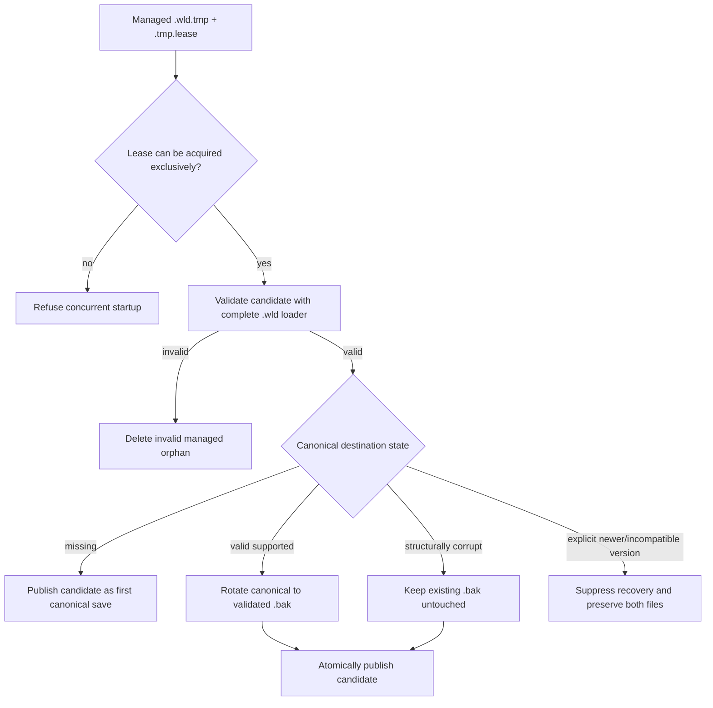

# Interrupted `.wld` save recovery

[World persistence](world-persistence.md) · [Architecture](architecture.md) · [Roadmap](../roadmap.md)

## Purpose

Atomic publication already guarantees that a killed writer cannot expose a partially written canonical `.wld`. That leaves a second recovery problem: a process may die after a complete candidate has reached its managed same-directory `.tmp`, but before the atomic rename publishes it. Deleting every abandoned temporary is safe for the old canonical checkpoint, but it can discard the newest fully recoverable generation.

TerraRuntime therefore treats a managed orphan candidate as untrusted recovery input rather than immediate garbage.

## Startup order

The executable `--world` startup path performs interrupted-save recovery before the host's ordinary orphan cleanup and before canonical cache/stat/load work.

The candidate is published through the same atomic rename plus Linux parent-directory `fsync` boundary used by normal saves. I/O failure leaves the candidate and lease on disk so recovery can be retried instead of silently converting uncertainty into data loss.

## Candidate selection

Only correctly named TerraRuntime managed transactions are considered. Candidates are ordered by temporary-file `LastWriteTimeUtc`; the newest abandoned candidate is tried first. If that candidate fails complete `.wld` validation, it is removed and recovery continues to the next older candidate. A live exclusive lease stops recovery rather than allowing an older orphan to race a newer active writer.

Legacy temporary files without a recognized TerraRuntime lease remain outside this mechanism because their ownership cannot be proven.

## Canonical and backup policy

A valid supported canonical checkpoint is preserved as the previous generation before a recovered candidate becomes visible. Backup publication is itself temporary-file based, validated and atomic.

If the visible canonical checkpoint is structurally corrupt, the interrupted candidate may replace it without rotating the corrupt bytes over an already known-good `.bak`. This preserves both independent recovery sources.

An explicitly unsupported world format is different from corruption. For example, a canonical Terraria world reporting version `327` is not replaced by a valid orphan candidate built for the currently supported version `326`. Startup fails closed and preserves the incompatible canonical plus the managed orphan for version-aware/manual handling.

## Process-crash proof

The dedicated `Interrupted World Save Recovery` workflow uses the official TerrariaServer 1.4.5.8 to create a real version-326 `.wld`. `TerraRuntime.AtomicSaveCrashProbe` then starts a first save, copies the complete official world into the writer-owned temporary, holds the lease, and is killed with real `SIGKILL` before publication.

The proof requires the canonical path to remain hidden after `SIGKILL`, the managed orphan to match the official source byte-for-byte, executable startup to validate and publish it before cleanup, and an explicitly newer canonical to suppress recovery without changing either file.

## Scope and limitations

This mechanism recovers complete managed `.wld` candidates that survived a process crash. It does not claim that bytes which were never durably flushed will survive sudden power loss; the existing file-content and directory-metadata durability barriers define that separate guarantee.

The preflight is currently part of the `TerraRuntime.Server --world` executable startup composition. Low-level embedders that call `TerrariaServerHost.RunAsync` directly must invoke the same recovery boundary before host cleanup if they want identical interrupted-save behavior.
