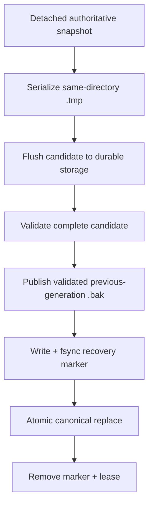
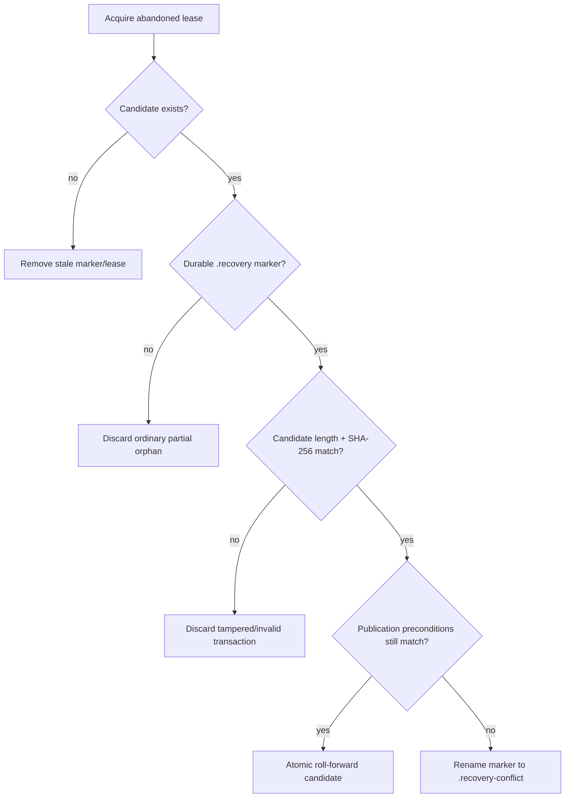

# Interrupted-save recovery

[Русский](../ru/interrupted-save-recovery.md) · [Documentation](README.md) · [World persistence](world-persistence.md)

## Purpose

Atomic replacement protects the canonical `.wld` from partial publication, but a process can still die after a complete, validated candidate and its rollback backup are durable and before the final namespace replace. TerraRuntime treats that state as a recoverable transaction instead of blindly deleting the candidate.

The recovery mechanism is implemented inside `AtomicSaveFileWriter`, so host startup and the next save use the same lease-safe transaction rules.

## Transaction boundary

For the authoritative `.wld` save path the ordering is:

For a first save there is no previous-generation backup, so the recovery marker is sealed after candidate validation and before the first canonical publication.

The important distinction is that a random orphan `.tmp` is **not** enough to authorize recovery. Roll-forward is possible only after a durable recovery marker exists.

## Recovery marker

Each recovery-ready managed temporary may have a sibling `.recovery` marker. The current marker stores:

- an `$8\,\mathrm{B}$` format magic and a mode byte;
- candidate byte length and a `$32\,\mathrm{B}$` SHA-256 digest;
- previous-generation backup byte length and SHA-256 digest when a backup exists;
- the normalized backup path when required.

The marker is bounded to `$64\,\mathrm{KiB}$`, written through the durable file path, flushed with `Flush(flushToDisk: true)`, and followed by the Linux parent-directory `fsync` barrier before it can grant recovery authority.

For runtime `.wld` saves the marker is created only after `ValidateCandidateAsync` has accepted the exact candidate. `RuntimeWorldTileChestSaveService` binds that callback to the complete supported `WorldFileLoader`, so the SHA-256 seals bytes that already passed Terraria 1.4.5.8 structural/content validation. For an existing canonical world the marker is created only after the previous generation has also been copied, validated and published at `<world>.wld.bak`.

## Startup and next-write recovery

Recovery first acquires the abandoned `.tmp.lease` exclusively. A live writer still owns its lease with `FileShare.None`, so its transaction is never inspected or deleted.

A first-save candidate can roll forward only while the canonical target is still absent. An existing-save candidate can roll forward only while both the current canonical and `.bak` still match the previous-generation fingerprint sealed into the marker. This prevents an old orphan from overwriting a newer successful save or an externally replaced world.

When those preconditions no longer match, TerraRuntime does not guess. The candidate and lease stay in place and the marker is quarantined as `.recovery-conflict` for explicit inspection. Repeated cleanup attempts remain fail-closed and never overwrite the current canonical bytes.

## Crash windows

The behavior is intentionally asymmetric:

- crash before a recovery marker becomes durable: the old canonical checkpoint remains authoritative; the abandoned managed temporary is later removed;
- crash after the recovery marker becomes durable but before canonical publication: the exact sealed candidate may be rolled forward;
- crash after canonical rename but before marker/lease cleanup: the canonical path already contains the new generation; startup removes the stale sidecars;
- live lease: no cleanup or recovery action touches that transaction;
- unknown legacy `.tmp` without a TerraRuntime lease: left untouched because ownership cannot be proven.

This closes the dangerous interrupted-publication gap without turning arbitrary temporary files into recovery sources.

## Single recovery authority and writer exclusion

There is no second `LastWriteTimeUtc`-ordered orphan recovery path. Executable startup calls the same marker-aware `AtomicSaveFileWriter.RecoverAbandonedWrites` boundary used by save cleanup. An unsealed managed `.tmp` is therefore cleanup input only and can never become canonical merely because its bytes happen to parse as a world.

The same boundary is enforced when a new atomic write starts. If another process still owns a same-target lease, recovery I/O is uncertain, or a transaction has been quarantined as `.recovery-conflict`, the new writer fails before creating its own temporary. This gives one cross-process owner for a canonical target instead of allowing two save transactions to race publication.

## Cost and ownership

Recovery hashing and marker I/O run inside the detached background save transaction, not on the authoritative game-loop thread. The implementation currently re-reads the sealed candidate and backup to compute SHA-256. That extra sequential I/O is accepted as a correctness-first recovery cost; it can be optimized later only with measurements and without weakening the guarantee that the marker authenticates the exact validated bytes.

## Verification

`AtomicSaveFileWriterCleanupTests` covers marker parsing, roll-forward, tamper rejection, conflict quarantine and live-lease isolation. `AtomicSaveFileWriterConsolidatedRecoveryTests` additionally proves that unsealed candidates never publish, a live same-target writer blocks a second write, and quarantined conflicts block later writes. The dedicated `Interrupted World Save Recovery` workflow creates a real TerrariaServer 1.4.5.8 world, holds a recovery-ready transaction under a live lease, proves startup refusal, kills that writer with real `SIGKILL`, then proves marker-authorized startup roll-forward. It separately proves rejection of an unsealed orphan and conflict quarantine without changing the newer canonical bytes.
