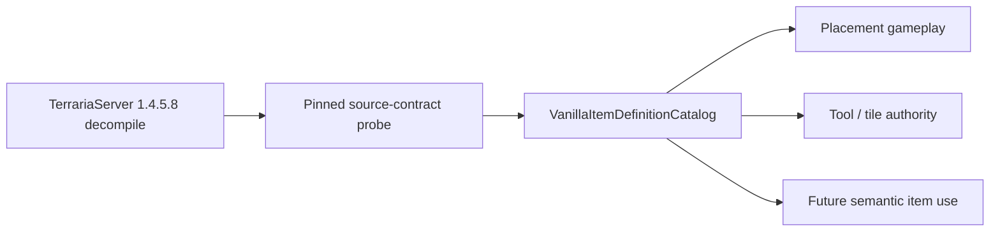

# Sparse vanilla item definitions

TerraRuntime now has an initial source-backed item-definition catalog for gameplay facts already verified against the pinned TerrariaServer 1.4.5.8 reference.

This is deliberately a **sparse** catalog. It does not manufacture a complete `Item.SetDefaults` projection from zeros, Wiki values or assumptions. A missing capability means **not verified/imported yet**, not “vanilla value is zero/false”.

## Ownership

`VanillaItemIds` owns item identity. `VanillaItemDefinitionCatalog` owns immutable verified gameplay facts. Inventory state owns stack/prefix/runtime slot state. Packet codecs remain outside this catalog.

## Initial verified slice

The repository source-contract probe currently pins the following official-source facts:

| Item | Verified facts |
|---|---|
| `DirtBlock` (`ItemTypeId(2)`) | `createTile = 0`, `consumable = true` |
| `CopperPickaxe` (`ItemTypeId(3509)`) | `pick = 35`, `tileBoost = -1` |

Those facts are represented as optional capability records:

- `VanillaItemPlacementDefinition`;
- `VanillaItemPickToolDefinition`.

The definition for Dirt Block therefore has `Placement` but no `PickTool`; Copper Pickaxe has `PickTool` but no `Placement`.

## Fail-closed semantics

Code must use capability queries such as `TryGetPlacement` and `TryGetPickTool`. If the requested capability is absent, the call returns `false`.

That distinction matters. For example, a missing `PickTool` definition does **not** prove

\[
\mathrm{pickPower}=0.
\]

It proves only that TerraRuntime has no source-backed pick-tool data for that item yet.

Likewise, a missing placement definition does not prove an item cannot place a tile.

## Existing tile authority

`VanillaTileInteractionItemFacts` remains as a thin compatibility facade because the live packet-17 authority path already consumes that API. It no longer owns a separate table; all values delegate to `VanillaItemDefinitionCatalog`.

This preserves current production behavior while giving future item-use, tool and placement work one definition source instead of another pile of feature-local constants.

## Source verification

`tools/ci/probe_tile_authority.py` parses the pinned decompiled official server and fails if the currently imported contracts change. It independently checks:

- `ItemID.DirtBlock == 2`;
- Dirt Block `consumable = true`;
- Dirt Block `createTile = 0`;
- `ItemID.CopperPickaxe == 3509`;
- Copper Pickaxe `pick = 35`;
- Copper Pickaxe `tileBoost = -1`.

`VanillaItemDefinitionCatalogTests` then verifies the runtime representation and compatibility facade.

## Next expansion

Additional fields such as use timing, damage, use style, ammo, shoot type, healing, mana, accessory/equipment behavior or other placement/tool properties are added only when the runtime consumes them **and** the pinned official source has been independently verified.

No giant speculative item table is required to continue D2. The catalog grows vertically with implemented gameplay.
