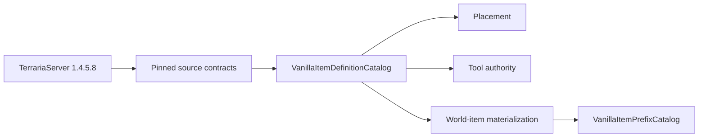

# Sparse vanilla item definitions

TerraRuntime uses a deliberately sparse, source-backed item-definition catalog. Missing metadata means **not verified/imported**, never an invented vanilla zero or `false`.

## Ownership

`VanillaItemIds` owns content identity. `VanillaItemDefinitionCatalog` owns immutable verified item facts. Runtime inventory/world-item stores own mutable stack, prefix, slot, generation and revision state.

## Verified capabilities

| Item | Verified capability facts |
|---|---|
| `DirtBlock` (`2`) | placement: `createTile = 0`, `consumable = true` |
| `CopperPickaxe` (`3509`) | pick tool: `pick = 35`, `tileBoost = -1` |
| `Gel` (`23`) | world drop: size `10×12`, ordinary gravity, no natural prefix family |
| `SlimeStaff` (`1309`) | world drop: size `26×28`, ordinary gravity, summon natural-prefix family |

The optional records are now:

- `VanillaItemPlacementDefinition`;
- `VanillaItemPickToolDefinition`;
- `VanillaItemWorldDropDefinition`.

Code consumes them through `TryGetPlacement`, `TryGetPickTool` and `TryGetWorldDrop`. An absent record fails closed.

## World-drop defaults

The pinned NPC-loot source contract proves Gel and Slime Staff are not members of `ItemID.Sets.ItemNoGravity`. Their vanilla `Item.NewItem` default velocity therefore uses

$$
v_x=0.1R_x,\quad R_x\in[-30,30],
$$

$$
v_y=0.1R_y,\quad R_y\in[-40,-16].
$$

`VanillaItemWorldDropDefinition` stores dimensions, gravity branch and verified natural-prefix family. It does not pretend to be a full `Item.SetDefaults` copy.

## Prefix metadata

`VanillaItemPrefixCatalog` contains only source-backed prefix facts currently needed by gameplay. For the initial slice this is the exact 22-entry summon family and the pinned `ReducedNaturalChance` set. Slime Staff's item-specific stat-rounding validation rejects natural prefixes `55`, `89` and `91`, so `Prefix(-1)` must reroll them.

This metadata is consumed by `VanillaNaturalItemPrefixRoller`; it remains separate from mutable `PrefixId` stored on an inventory/world item.

## Verification

Two permanent official-source gates currently protect this sparse catalog:

- `probe_tile_authority.py` verifies Dirt Block and Copper Pickaxe placement/tool facts;
- `probe_npc_loot_spawn.py` verifies Gel/Slime Staff dimensions, gravity branch, summon family, natural-prefix probability branches and item-specific prefix validity against the pinned TerrariaServer 1.4.5.8 Windows assembly.

Runtime tests then verify the typed representation and fail-closed capability queries.

## Scope

Use timing, damage, ammo, healing, equipment behavior and other item fields are added only when authoritative gameplay consumes them and official-source evidence is pinned. A giant speculative item table would merely convert unknowns into confidently wrong defaults, which is an impressively inefficient way to create bugs.
