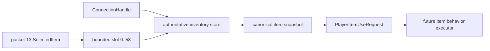

# Authoritative item-use boundary

[Русский](../ru/item-use-boundary.md) · [Gameplay](gameplay.md) · [Gameplay decomposition roadmap](../roadmap/gameplay-decomposition-and-catalogs.md)

## Purpose

TerraRuntime now has a protocol-neutral boundary between packet-13 selected-item state and future item gameplay. The boundary answers one narrow question safely:

> Which exact canonical inventory item does this exact connection generation currently have selected?

It deliberately does not execute weapon/tool/placeable behavior yet. The version-pinned catalog now supplies use style/timing plus placement/tool facts for the initial Dirt Block and Copper Pickaxe slice; damage, projectile spawning and broad item-family defaults remain separate work.

## Flow



The movement packet contributes only the selected inventory index. It does **not** supply the item identity used by gameplay. `RuntimePlayerItemUseBoundary` resolves that index against `RuntimePlayerInventoryStore`, which is already keyed by the exact `ConnectionHandle` occupation of the reusable player slot.

## Semantic request

`PlayerItemUseRequest` carries:

- exact `ConnectionHandle` and therefore generation-safe `PlayerHandle`;
- selected inventory slot;
- canonical `ItemTypeId`;
- authoritative stack;
- canonical `PrefixId`;
- bounded item flags already stored by the normalized inventory path.

The request is detached from mutable inventory storage. A later item executor can therefore receive one explicit semantic input instead of rereading raw packet fields or trusting a client-claimed item ID.

## Selection space

The existing TerrariaServer 1.4.5.8 `PlayerItemSlotID` evidence pins the low inventory projection to 59 entries:

\[
N_{inventory}=58+1=59,
\]

where slots `0..57` are ordinary inventory and slot `58` is the mouse-item entry. The item-use boundary accepts exactly this already verified inventory span and rejects `SelectedItem >= 59`.

This is a selection/identity rule only. It does not claim every slot has identical gameplay semantics.

## Generation safety

Inventory ownership is checked with the whole `ConnectionHandle`, not only the byte player slot. If player slot 0 disconnects and is later reused, a stale connection cannot resolve the replacement player's selected item.

```text
old connection/player generation
        x
        └── cannot read
              new occupation of slot 0
```

The resolver also rejects an unassigned connection, an empty selected slot, or any non-canonical stored item instead of fabricating an item-use request.

## Resolve results

`PlayerItemUseResolveResult` distinguishes:

- `Resolved`;
- invalid/unassigned connection;
- selected slot outside the inventory span;
- inventory generation mismatch;
- empty selected item;
- non-canonical selected item.

These are runtime/gameplay boundary results, not protocol decoder errors.

## What remains

This slice creates the D2 semantic boundary but intentionally does not invent missing vanilla item metadata. Dirt Block and Copper Pickaxe semantic intents already include source-backed use timing; follow-up work still needs broader definitions/defaults and behavior executors for categories such as melee/ranged weapons, tools, placeables, consumables and special-use items. Those executors should consume `PlayerItemUseRequest` rather than returning to packet offsets or raw item IDs.

## Verification

Focused tests prove exact selected-slot resolution, mouse-item slot acceptance, out-of-range rejection, stale connection-generation isolation, empty-slot rejection and invalid-connection rejection. Inventory identity remains the same canonical `ItemTypeId`/`PrefixId` state already used by packet-5 normalization and atomic inventory mutations.
