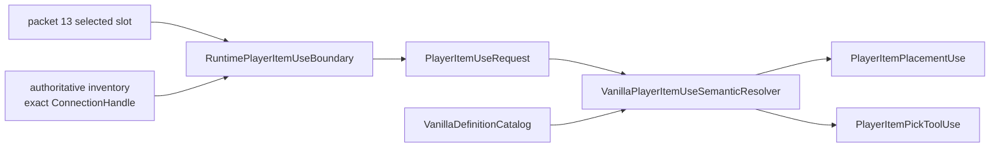
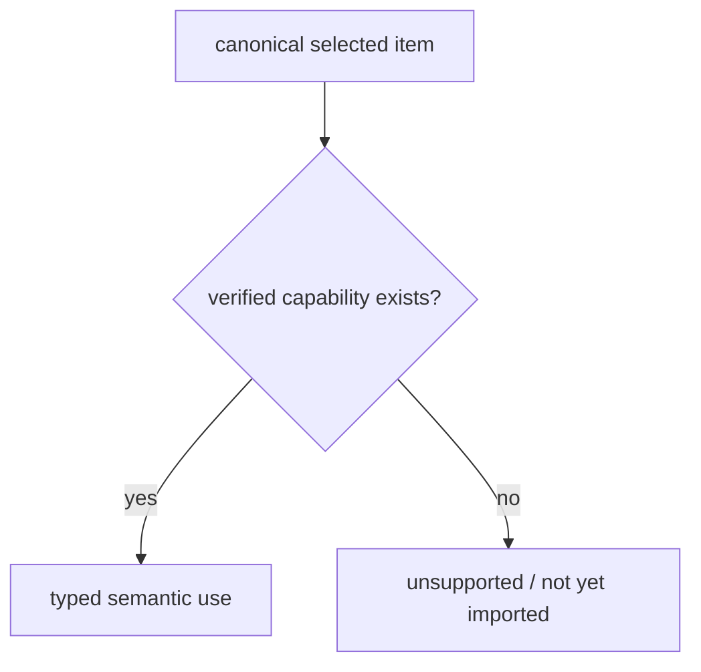

# Semantic item-use capabilities

The selected-item boundary and the source-backed item-definition catalog are separate on purpose:

1. `RuntimePlayerItemUseBoundary` answers **which exact inventory item this exact player generation selected**;
2. `VanillaDefinitionCatalog` answers **which gameplay capabilities TerraRuntime has verified for that item type**;
3. `VanillaPlayerItemUseSemanticResolver` combines both into typed gameplay intents without re-reading packet state or branching on raw item ids.

## Generation safety

Both semantic intents retain the complete `PlayerItemUseRequest`, including the exact `ConnectionHandle` / `PlayerHandle` generation. Reuse of the same Terraria player slot therefore does not make an old item-use intent belong to the new occupant.

This is the same basic rule used throughout authoritative runtime identity:

\[
\text{player identity} = (\text{slot},\ \text{generation})
\]

not merely `slot`.

## Placement

`TryResolvePlacement` succeeds only when:

- the detached `PlayerItemUseRequest` is valid;
- the selected `ItemTypeId` has a verified `VanillaItemPlacementDefinition`.

`VanillaItemPlacementDefinition` no longer means "one of the three items written out by hand". Three items were
all this catalog ever carried - Dirt Block, Stone Block, Sand Block - and every other placement a client
attempted was answered with a correction, which is why a connected player could not build. The catalog now falls
back to `VanillaItemPlacementTable1458`, generated from the pinned dedicated server by running
`Item.SetDefaults` over every id: **3,231 items that place a tile and 292 that place a wall**, with each item's
`createTile`, `createWall`, `placeStyle` and `consumable` exactly as the source sets them.

The hand-written definitions still win where they exist, because they carry use timing and tool facts the table
does not. A test pins the two against each other so a hand-written entry can never drift from the source's own
defaults, and the table's own totals are asserted so a truncated regeneration fails the build rather than a live
world.

The table is regenerated with `tools/ci/generate_item_placement_table.py` from the probe under
`.cache/itemdefs-probe`; it is committed as generated code and audited by regenerating and diffing.

For Dirt Block that resolves to:

- `TileTypeId = Dirt (0)`;
- `Consumable = true`.

Wall placement had no representation at all before this table. `TryGetWallPlacement` answers it, and packet-17
action 3 (`PlaceWall`) is now admitted and applied through `WorldGen.PlaceWall`'s own rules: the two-cell world
border is refused, and a cell that already carries a wall is refused rather than overwritten.

The returned `PlayerItemPlacementUse` contains those facts and the original player/item snapshot. Downstream placement gameplay therefore does not need to compare raw item ids.

It also contains the verified `VanillaItemUseTimingDefinition`: swing style, $15\,\text{ticks}$ animation, $10\,\text{ticks}$ use time, auto-reuse and turn-during-use.

## Pick tools

`TryResolvePickTool` follows the same model. The current Copper Pickaxe slice resolves to:

- `PickPower = 35`;
- `TileBoost = -1`.

Again, these values come from the source-backed definition catalog, not from packet data.

The Copper Pickaxe intent carries its inherited/overridden final defaults: swing style, $23\,\text{ticks}$ animation, $15\,\text{ticks}$ use time, auto-reuse and turn-during-use.

## Fail-closed behavior

A canonical item can be perfectly valid inventory state while still having no imported gameplay definition. In that case the semantic resolver returns `false` for unsupported capabilities.

This distinction is important:

The resolver never infers behavior from numeric ids, neighboring definitions, stack shape or `aiStyle`-like coincidences.

## Production placement consistency

`ClientTileManipulationConsistency` and authoritative tile-mining validation now read placement/tool facts directly from `TerraRuntime.Gameplay.Items.VanillaDefinitionCatalog`. The transparent `VanillaTileInteractionItemFacts` compatibility facade has been removed.

This keeps the packet-17 consistency policy unchanged while leaving one source-backed item capability owner instead of a second forwarding API.

## Verification

`VanillaPlayerItemUseSemanticResolverTests` verifies:

- Dirt Block resolves only as the currently verified placement capability;
- Copper Pickaxe resolves only as the currently verified pick-tool capability;
- unverified item types do not inherit semantics from their numeric id;
- invalid item-use requests are rejected before capability lookup;
- two generations occupying the same player slot remain distinct after semantic resolution.

The permanent gameplay acceptance workflow executes these `ItemUse` tests on every matching `main` change.
