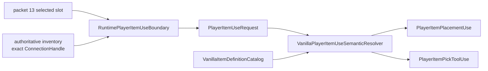
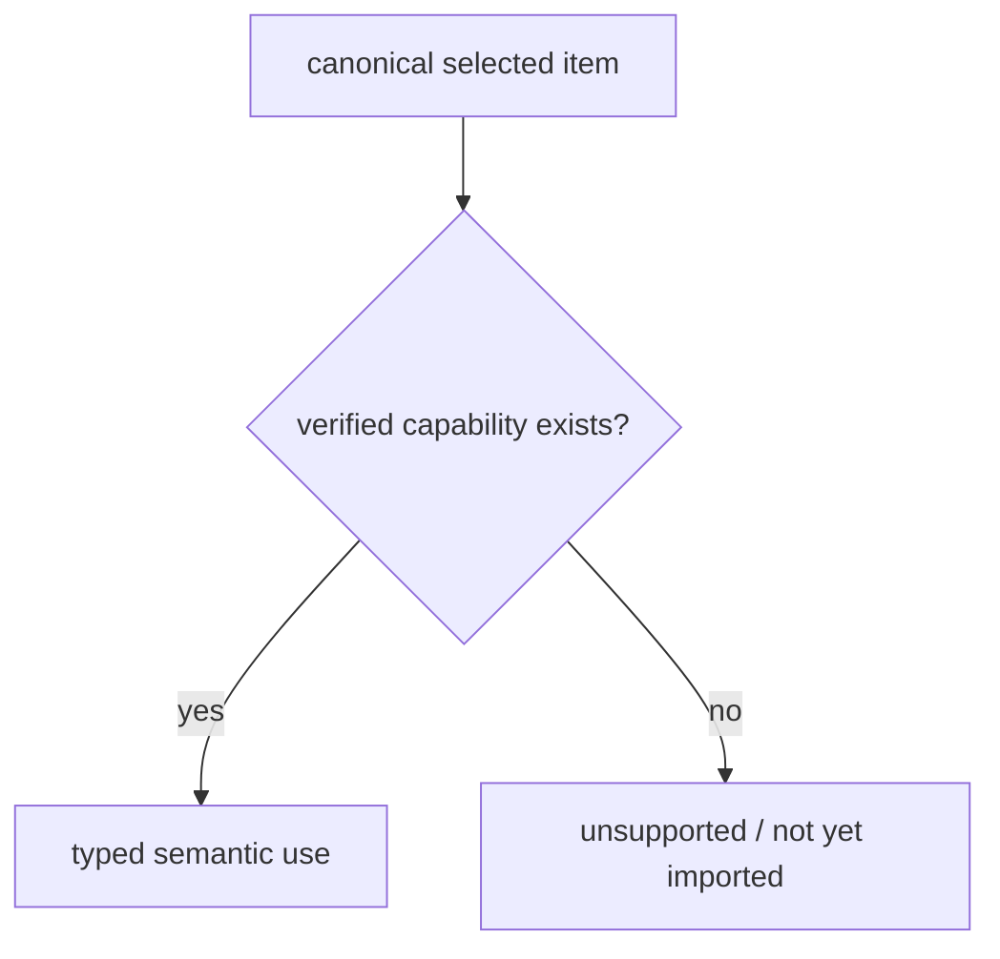

# Semantic item-use capabilities

The selected-item boundary and the source-backed item-definition catalog are separate on purpose:

1. `RuntimePlayerItemUseBoundary` answers **which exact inventory item this exact player generation selected**;
2. `VanillaItemDefinitionCatalog` answers **which gameplay capabilities TerraRuntime has verified for that item type**;
3. `VanillaPlayerItemUseSemanticResolver` combines both into typed gameplay intents without re-reading packet state or branching on raw item ids.

## Generation safety

Both semantic intents retain the complete `PlayerItemUseRequest`, including the exact `ConnectionHandle` / `PlayerHandle` generation. Reuse of the same Terraria player slot therefore does not make an old item-use intent belong to the new occupant.

This is the same basic rule used throughout authoritative runtime identity:

\[
\text{player identity} = (\text{slot},\ \text{generation})
\]

not merely `slot`.

## Placement

`TryResolvePlacement` succeeds only when:

- the detached `PlayerItemUseRequest` is valid;
- the selected `ItemTypeId` has a verified `VanillaItemPlacementDefinition`.

For the current source-backed slice, Dirt Block resolves to:

- `TileTypeId = Dirt (0)`;
- `Consumable = true`.

The returned `PlayerItemPlacementUse` contains those facts and the original player/item snapshot. Downstream placement gameplay therefore does not need to compare raw item ids.

## Pick tools

`TryResolvePickTool` follows the same model. The current Copper Pickaxe slice resolves to:

- `PickPower = 35`;
- `TileBoost = -1`.

Again, these values come from the source-backed definition catalog, not from packet data.

## Fail-closed behavior

A canonical item can be perfectly valid inventory state while still having no imported gameplay definition. In that case the semantic resolver returns `false` for unsupported capabilities.

This distinction is important:

The resolver never infers behavior from numeric ids, neighboring definitions, stack shape or `aiStyle`-like coincidences.

## Production placement consistency

`ClientTileManipulationConsistency` now reads placement facts directly from `VanillaItemDefinitionCatalog`. The old `VanillaTileInteractionItemFacts` facade remains only for compatibility with gameplay paths that have not yet migrated.

This keeps the packet-17 consistency policy unchanged while removing one feature-local item-definition dependency.

## Verification

`VanillaPlayerItemUseSemanticResolverTests` verifies:

- Dirt Block resolves only as the currently verified placement capability;
- Copper Pickaxe resolves only as the currently verified pick-tool capability;
- unverified item types do not inherit semantics from their numeric id;
- invalid item-use requests are rejected before capability lookup;
- two generations occupying the same player slot remain distinct after semantic resolution.

The permanent gameplay acceptance workflow executes these `ItemUse` tests on every matching `main` change.
