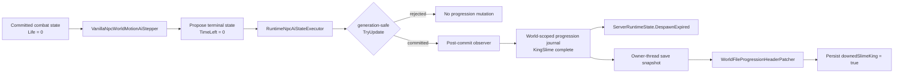

# King Slime death progression

TerraRuntime keeps King Slime death finalization inside the authoritative NPC state pipeline instead of inferring boss death from a client packet or from a later slot scan.

## Ownership

The post-commit observer receives both the pre-pass NPC snapshot and the committed revision. `downedSlimeKing` is therefore not published when a stale generation rejects the proposed transition.

## World scoping

`RuntimeWorldProgressionRegistry` uses the exact `WorldTileStore` object as a weak key. NPC simulation and persistence resolve the same `RuntimeWorldProgressionMutations` instance without a process-global current-world variable. The weak association also does not keep an unloaded world alive.

The journal stores semantic `VanillaWorldProgressionId` bits, not physical `.wld` offsets. Save capture detaches the journal value on the authoritative owner before background serialization begins.

## Lossless persistence

`WorldFileProgressionHeaderPatcher` currently owns one persistence mutation: `VanillaWorldProgressionId.KingSlime`. It validates the same identity/dimension prefix as the clock patcher, walks the pinned Terraria 1.4.5.8 fixed header prefix, and changes only the `downedSlimeKing` boolean. Unsupported mutation bits fail closed instead of being silently lost.

An already-set persisted flag is preserved. Runtime progression is monotonic in this slice: the journal can set a completed milestone but cannot clear unrelated or pre-existing `SaveWorldFlags` state.

## Deliberate parity boundary

This change closes the authoritative **death lifecycle + progression persistence** path for King Slime. It does **not** claim full King Slime death parity. NPC-specific loot, difficulty-dependent drops, death-time minion/effect behavior and any remaining source-ordered death side effects stay open until their TerrariaServer 1.4.5.8 contracts are verified and wired through the existing death/loot transaction boundaries.
