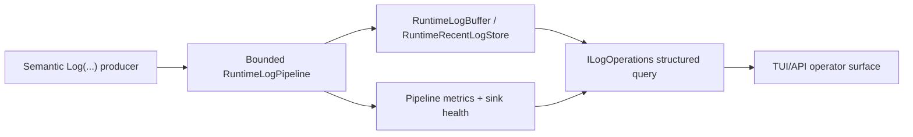

# Logging operator observability

[Русский](../ru/logging-operator-observability.md) · [Observability](observability-logging.md) · [Logging roadmap](../roadmap/runtime-logging-pipeline.md)

This page describes the first L4 operator-observability slice built on top of the completed L0-L3 logging pipeline.

## One state graph

There is no second metrics queue or duplicate log ring. `RuntimeLogBuffer` remains the retained-log sink and reads pipeline metrics/sink health through bounded snapshot providers attached by `RuntimeHostLog`.

## Structured query

`RuntimeLogQuery` supports deterministic exact filters for minimum level, subsystem/source, category, event ID and correlation ID. `MaxEntries` is always explicit and bounded by the retained-store capacity.

The returned `RuntimeLogEntry` preserves the existing compact TUI fields and additionally projects semantic event ID, category and correlation ID. Filtering operates on retained structured records before the legacy operations projection is produced.

## Diagnostics snapshot

Every `RuntimeLogSnapshot` carries one `RuntimeLogDiagnosticsSnapshot` containing accepted/filtered counts, per-level drops, drained count, current queue depth, queue high-water mark, sink failures, recent-store published/overwrite counts and bounded sink-health snapshots including quarantine state.

For current queue depth \(N_q\) and high-water mark \(N_h\), the invariant is

\[
0 \le N_q \le N_h \le C,
\]

where \(C\) is the configured pipeline queue capacity.

The aggregate drop count is

\[
D_{total}=D_{trace}+D_{debug}+D_{info}+D_{warning}+D_{error}+D_{critical}.
\]

## Isolation

Operator reads never perform console or disk I/O and do not mutate runtime state. Sink failures remain isolated inside the pipeline; the operator snapshot only reports their counters and quarantine state.

## Remaining L4 work

Interactive TUI filter controls, sustained flood/slow-sink benchmarks, NativeAOT logging smoke gates and rotation/disk-failure recovery tests remain separate L4 slices.
