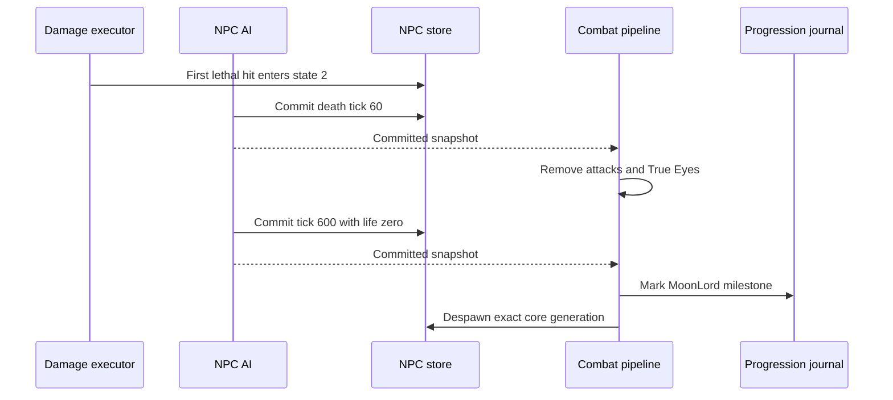

# Moon Lord death lifecycle

[Русский](../ru/moon-lord-death-sequence.md) · [NPC families](npc-behavior-families.md) · [NPC parity roadmap](../roadmap/npc-ai-parity.md)

## Implemented boundary

The first lethal core hit enters `ai[0] = 2`, restores life and makes the core invulnerable at the shared damage boundary. The authoritative AI then advances the death clock even when every player has disconnected or died. Death motion uses the pinned interpolation toward velocity $(0, -0.5)\,\mathrm{px/tick}$ with factor `0.98`.

`NpcAuthority` supplies the combat pipeline as the NPC executor's post-commit sink. Effects run only after the exact NPC generation and revision have committed:

- At $60\,\mathrm{ticks}$, remove active projectiles `456/462/455/452/454` through the projectile despawn/replication boundary and deactivate every True Eye (`NPC 400`). This is deliberately a global type scan, as in the official source. Other projectiles and ordinary NPCs remain active.
- At $600\,\mathrm{ticks}$, set core life to zero and invoke the existing imported-loot/progression boundary. Record the Moon Lord milestone in `RuntimeWorldProgressionMutations`, despawn the core and publish its terminal NPC state. No synthetic `packet 28` strike is emitted for timer expiry.
- Head, hands and True Eyes whose `ai[3]` slot no longer contains a core expire through the ordinary NPC lifecycle. They do not adopt another active core. Terminal parts cannot plan new projectiles.

The journal uses the existing canonical `.wld` save pipeline; the change adds no new file layout or omitted runtime-only progression field. Entity scans use buffers bounded by the configured NPC/projectile tables. Stale generation or revision callbacks cannot alter replacement entities or progression.

## Distance teleport

After pursuit, a living-target core in state `0/1` teleports only when its distance from the target center is strictly greater than $2400\,\mathrm{px}$. It enters state `-2` without resetting the timer and shifts to $150\,\mathrm{px}$ above the player. The same offset moves each active retained shell slot, in order, followed by every active True Eye globally. Repeated slot references retain repeated translations. Intro can allocate the shell and teleport it in the same step; the offset excludes subsequent core world movement.

Committed effects have an optional after-spawn phase, guarded by the exact core generation/revision after allocations and slot links. The world-motion wrapper forwards that phase. Authoritative translations emit `ForcedUpdate`, which the existing replication registry encodes as `packet 23` without motion-cadence suppression; baseline state and telemetry use the committed position. No network callback mutates NPC state.

Evidence includes 48 unmodified original server AI calls across the exact threshold, four directions and protected/exposed/intro completion states. Tests compare core and peer positions, AI and next RNG, plus emitted packet coordinates while the ordinary motion cadence is active. Two cases add the production world-motion wrapper; one replaces the core during commit. Disabling teleport or forced synchronization fails 26 tests each; removing the post-allocation generation guard fails the replacement test. This does not establish complete hand/head/True Eye attack AI or whole-encounter parity.

## Evidence and limits

Initialization sets `localAI[3]` and enters intro while preserving the incoming timer, even when the incoming state was death or departure. Intro and teleport return keep velocity unchanged and complete only when the incremented timer equals `60`. On completion, pursuit runs in the same tick. Intro creates the three parts even if target loss then enters departure; allocation retains the exact slots. Spawn coordinates use the core's center before world movement, truncated before the offsets, and new parts retain vanilla's unassigned target `255`.

The shared NPC AI stream now consumes the original core sound decision before initialization, including its conditional second draw, and the teleport-return draw whose result vanilla immediately overwrites. The retained fixture covers 384 direct original server AI calls with actual `NewNPC`, two RNG seeds (including the sound branch), fractional positions, initialized/uninitialized cores and absent/present players. State, velocity, slots, child positions/AI/target and next RNG result match through the executor; a separate world-motion test protects spawn ordering. Restoring the previous implementation fails all 385 tests. Death-presentation RNG consumption and complete cross-system random-stream parity remain open.

Mounted players remain in the authoritative NPC target candidates, including server-owned players. Vanilla `NPC.TargetClosest` filters activity, death and ghost state, not mount type. Mounting therefore cannot make a living player disappear from the core's departure check or from ordinary NPC targeting. Mount-specific player hitbox geometry remains a separate parity concern.

The departure path (`ai[0] = 3`) advances without living targets. On loss of the last player, the core performs its final pursuit step before entering departure with timer zero. Departure interpolates toward `(direction, -0.5)` with factor `0.98`. At $40\,\mathrm{ticks}$ it removes the five attack types and all True Eyes globally; projectile removal repeats `packet 27` and clears the server baseline without emitting `packet 29`. At $60\,\mathrm{ticks}$ it removes all hands, heads and True Eyes, then the departing core, clears `LunarApocalypseIsUp`, and requests the existing world-info broadcast. It awards no victory or loot. The journal retains the loaded event baseline and captures explicit boolean changes for the existing save-header patcher.

Departure evidence includes 120 direct original AI calls for velocity/timer/entity/event state, twelve target-loss pursuit cases, an executor-driven departure, stale-generation protection, packet27 repetition and join-baseline removal, and 32 original header combinations toggled in both directions. Header comparisons align only the original save timestamps in the expected fixture and require exactly one changed source byte. Full event/announcement behavior, remaining shared RNG consumption still require further verification; these checks do not establish full AI parity.

`LateHardmodeBossParityTests` covers the death motion, terminal clock boundary and absent-player case; these regressions fail on the previous implementation. `MoonLordDeathSequenceTests` drives the real executor and post-commit pipeline through the entire clock, verifies cleanup, progression, orphan expiry and slot reuse. Existing world-progression tests cover the persisted milestone layout.

`tools/ci/check_moon_lord_death_source.py` independently checks `NPC.AI_077_MoonLordCore`, `AI_078_MoonLordHands`, `AI_079_MoonLordHead` and `AI_081_TrueEyeOfCthulhu` from TerrariaServer `1.4.5.8`, with the executable SHA-256 pinned. The dedicated source-contract workflow repeats the check with ILSpy `11.0.0.9375`; game source stays outside version control.

This closes bounded lifecycle and death-loot gaps. Complete global event/announcement behavior, owner generation tracking across core slot reuse, and broader official-server differential scenarios remain open. Presentation-only death effects, including projectile `622`, are outside the server-authoritative claim. `FullVanillaAiParity` remains false.

## Core pursuit

Protected and exposed pursuit now refresh `TargetClosest(false)` every AI tick. Outside the $20\,\mathrm{px}$ dead zone, steering uses displacement minus current velocity, vanilla reversal acceleration and a half blend with the previous velocity. Inside the dead zone it preserves velocity. `MoonLordCoreMotionTests` retains independently captured hashes of 2,000 calls to the unmodified official `AI_077_MoonLordCore` in exposed state, covering exact velocity bits, target and AI state with one or two active players. Removing movement correction fails all fifteen focused tests; removing target refresh fails all ten differential cases. Degenerate zero steering preserves finite runtime velocity; the remaining full-core state/RNG contract still requires separate parity work.

## Exact shell slots

Successful shell allocations retain the two hand slots and head slot in the core's `localAI[0..2]`, through the existing generation-checked post-commit spawn boundary. Missing allocations retain a negative sentinel. While the core is protected (`ai[0] = 0`), a missing slot, inactive part or wrong NPC type removes the core directly, even without a live player. This does not run boss loot or record a defeat. A matching owned part in another slot cannot replace the original part. The three retained parts must all enter state `-2` to open the core; missing-shell removal does not apply to an already exposed or dying core. The source checker and full executor tests cover these boundaries, including partial allocation under a full NPC table.

## Death loot and participation

The committed terminal tick now executes the Moon Lord table. Classic drops Portal Gun, 70–90 Luminite and two distinct weapons from the ten-option `1.4.5.8` pool, including Moon Lord Whip. Mask and Meowmere Minecart retain their separate chance rolls. Expert/Master bags use addressed `packet 90` delivery to active participants; Master adds the relic and per-participant pet rolls. The trophy roll precedes the boss table in every mode. Common-item luck, stack rolls, weapon selection and intervening item materialization preserve source ordering.

Accepted hits on the head or hands credit the active core in the exact `ai[3]` slot, through both inbound `packet 28` and server-owned damage. Invalid or non-core owner slots do not credit an unrelated core. No loot is emitted on the initial lethal strike or before tick 600; stale terminal callbacks cannot duplicate delivery. Public items use the existing `packet 21` path and instanced bags retain the existing bounded slot lease.

The eighteen drop definitions and natural prefixes were checked against the unmodified official Linux dedicated-server assembly loaded by a local .NET probe on Windows. The retained tests pin the prefix and next RNG value for 100 seeds per item (1,800 comparisons); this is assembly differential evidence, not a Linux NativeAOT execution claim. `VanillaMoonLordLootTests` covers all 90 ordered distinct weapon choices, delivery/RNG interleaving and difficulty tables. `MoonLordLootPipelineTests` exercises real death ticks, both damage paths, participant routing and stale callbacks. Removing the loot dispatch makes the new pipeline regressions fail.

These are drop definitions only: opening bags, using or placing the new items, global coin/heart rules and full weapon gameplay remain separate work.

## Hand attack clock and combat frames

`VanillaMoonLordHandBehavior` implements the two 600-tick hand schedules, phase movement, pupil aiming, bounds before outer motion, and creation of Phantasmal Eye, Sphere and Bolt projectiles. `NpcSimulationState.FrameCounter` retains the authoritative frame clock: incoming frame 21 rejects damage even on the tick that starts reopening the hand. Phase transitions request immediate packet 23 through the existing generation-checked commit boundary.

`MoonLordHandTests` compares 3,600 independent original `AI_078` calls: both sides, every incoming clock from 0 through 599, and frames 0/19/21. It checks exact positions, velocities, AI/local state, vulnerability, frame, target, actual projectile creation and next RNG draw. The expanded numeric fixture SHA256 is `d3a5ecf7d781ab4b548372eaf621a3f606db9de347d1905cac0bed9607898fc1`. The unmodified Linux server assembly ran on Windows CoreCLR; this is not Linux native evidence. Three additional integration cases cover actual damage rejection and immediate packet delivery. Disabling the hand strategy fails 3,601 checks.

`IVanillaNpcRandom.NextDouble()` supplies a unit-interval draw. Production uses the underlying seeded `Random.NextDouble`; integer-only implementations retain a default adapter, while streams requiring identical seeded consumption should override the method. Projectile spawn centers are converted to runtime top-left coordinates before submission.

This verifies synthetic single AI calls with one stationary target. Full continuous fights, moving or absent targets, retired-hand differentials, attached explosive interactions, sphere release synchronization, head and True Eye attack fidelity remain separate parity work.
## Retained targets and sphere release

Hand bolt aiming continues against the retained player slot without a living target; an absent slot supplies the fresh Player center `(10, 21)`. Sphere release at local tick 292 follows `Player.FindClosest`: closest living active player, otherwise the first active slot even if dead, otherwise slot zero. Normalization preserves FNA reciprocal multiplication before the speed-12 scale. Bolt target acquisition requests packet 23 even when the incoming attack state is already 3.

An additional 80 original AI calls cover stationary, moving, dead and absent targets; 48 calls cover existing spheres immediately before, at and after release for both hands. Tests verify exact state and immediate packet-27 position/velocity, excluding already released and differently owned spheres. Two world-runtime cases verify moving network and server players through the existing snapshot velocity lookup. The production velocity path needed no change. Negative controls fail eight absent-target cases, eight release cases, the repeated-state packet-23 case and both velocity-lookup cases.

The two expanded fixture hashes are `6bd1013cf7860a9b035e01d8f61a533b1048fad989f42839f90e9769eced23e3` (targets) and `3e6440a9b0292eabeab9db6738f80b07dc8096ca63a2a85009609548cdc03aef` (release). These remain independent single-call evidence, not a complete encounter or validation of every multiplayer target arrangement.
## Head attack and eyelid state

`VanillaMoonLordHeadBehavior` replaces generic flight with the source head attachment: center at core center minus 400 pixels vertically, zero velocity before targeting or spawning. The 1,200-tick attack schedule updates pupil, mouth and eyelid state. Incoming `localAI[3] >= 15` controls damage; freshly allocated heads start with zero local state, while `ai[3]` retains the core slot. The retired `-2` to `-3` transition preserves the source early return, including its incoming eyelid gate.

The head now creates Deathray, Bolt and individually addressed Moon Leech projectiles at their original ticks and centers. Moon Leech's source 16×16 geometry and AI style 85 were added to the definition catalog. Telegraph angle draws consume the shared RNG even on a dedicated server. Phase changes, target changes, bolt acquisition and Deathray launch request immediate packet 23 through the existing committed-effect boundary.

`MoonLordHeadTests` checks 3,600 original AI calls across every incoming timer and eyelid states 0/13/15, plus 36 retired cases. It compares exact position, velocity, AI/local state, damage gate, target, actual projectile creation, next RNG and immediate packet-23 behavior. Reference setup uses the verified head size 38×56 and resets old target/directions as the outer NPC update does. Expanded fixture hashes: `b53358c6945b688feaca399e9a24327e72e667acdf3e084d57c1137b33f3a770` and `55c486f5d618095e952f21e97b81ad31218d55f4563543c5ae6aa894986963ac`. Three integration cases cover actual strikes and allocation of a head owned by core slot 20. Restoring old head behavior fails 3,631 tests; removing sync and restoring the owner/eyelid collision fails 3,511.

An additional regression retains the same head, local state, shared random stream and created projectiles over two full attack cycles ($2400\,\text{ticks}$). Every update matches an independent original-server trace, including exact projectile state and the final random draw. The expanded fixture SHA256 is `405a45608d1796c0b3e8be07d9d04433399dcd0ec102893967bbd12a57cd6062`. The trace runs head AI with a stationary core and player; it does not advance projectile AI or outer NPC physics.

Full continuous encounter behavior, Good World boulders, Moon Leech AI/buff/healing-blob interactions, all multiplayer targeting arrangements, retired visual rotation and True Eye attacks remain open.
