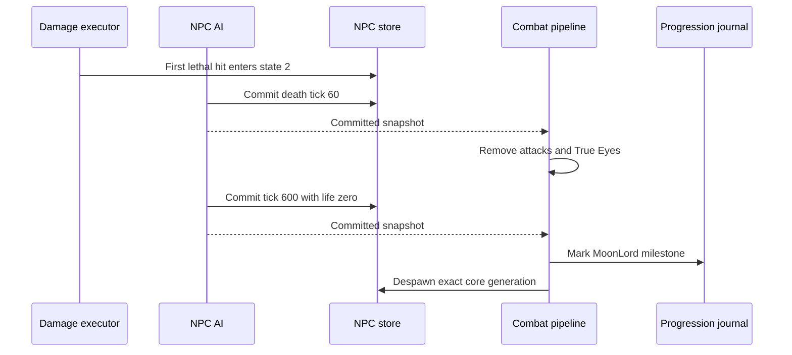

# Moon Lord death lifecycle

[Русский](../ru/moon-lord-death-sequence.md) · [NPC families](npc-behavior-families.md) · [NPC parity roadmap](../roadmap/npc-ai-parity.md)

## Implemented boundary

The first lethal core hit enters `ai[0] = 2`, restores life and makes the core invulnerable at the shared damage boundary. The authoritative AI then advances the death clock even when every player has disconnected or died. Death motion uses the pinned interpolation toward velocity $(0, -0.5)\,\mathrm{px/tick}$ with factor `0.98`.

`NpcAuthority` supplies the combat pipeline as the NPC executor's post-commit sink. Effects run only after the exact NPC generation and revision have committed:

- At $60\,\mathrm{ticks}$, remove active projectiles `456/462/455/452/454` through the projectile despawn/replication boundary and deactivate every True Eye (`NPC 400`). This is deliberately a global type scan, as in the official source. Other projectiles and ordinary NPCs remain active.
- At $600\,\mathrm{ticks}$, set core life to zero and invoke the existing imported-loot/progression boundary. Record the Moon Lord milestone in `RuntimeWorldProgressionMutations`, despawn the core and publish its terminal NPC state. No synthetic `packet 28` strike is emitted for timer expiry.
- Head, hands and True Eyes whose `ai[3]` slot no longer contains a core expire through the ordinary NPC lifecycle. They do not adopt another active core. Terminal parts cannot plan new projectiles.

The journal uses the existing canonical `.wld` save pipeline; the change adds no new file layout or omitted runtime-only progression field. Entity scans use buffers bounded by the configured NPC/projectile tables. Stale generation or revision callbacks cannot alter replacement entities or progression.

## Evidence and limits

`LateHardmodeBossParityTests` covers the death motion, terminal clock boundary and absent-player case; these regressions fail on the previous implementation. `MoonLordDeathSequenceTests` drives the real executor and post-commit pipeline through the entire clock, verifies cleanup, progression, orphan expiry and slot reuse. Existing world-progression tests cover the persisted milestone layout.

`tools/ci/check_moon_lord_death_source.py` independently checks `NPC.AI_077_MoonLordCore`, `AI_078_MoonLordHands`, `AI_079_MoonLordHead` and `AI_081_TrueEyeOfCthulhu` from TerrariaServer `1.4.5.8`, with the executable SHA-256 pinned. The dedicated source-contract workflow repeats the check with ILSpy `11.0.0.9375`; game source stays outside version control.

This closes bounded lifecycle and death-loot gaps. Complete global event/announcement behavior, owner generation tracking across core slot reuse, and broader official-server differential scenarios remain open. Presentation-only death effects, including projectile `622`, are outside the server-authoritative claim. `FullVanillaAiParity` remains false.

## Exact shell slots

Successful shell allocations retain the two hand slots and head slot in the core's `localAI[0..2]`, through the existing generation-checked post-commit spawn boundary. Missing allocations retain a negative sentinel. While the core is protected (`ai[0] = 0`), a missing slot, inactive part or wrong NPC type removes the core directly, even without a live player. This does not run boss loot or record a defeat. A matching owned part in another slot cannot replace the original part. The three retained parts must all enter state `-2` to open the core; missing-shell removal does not apply to an already exposed or dying core. The source checker and full executor tests cover these boundaries, including partial allocation under a full NPC table.

## Death loot and participation

The committed terminal tick now executes the Moon Lord table. Classic drops Portal Gun, 70–90 Luminite and two distinct weapons from the ten-option `1.4.5.8` pool, including Moon Lord Whip. Mask and Meowmere Minecart retain their separate chance rolls. Expert/Master bags use addressed `packet 90` delivery to active participants; Master adds the relic and per-participant pet rolls. The trophy roll precedes the boss table in every mode. Common-item luck, stack rolls, weapon selection and intervening item materialization preserve source ordering.

Accepted hits on the head or hands credit the active core in the exact `ai[3]` slot, through both inbound `packet 28` and server-owned damage. Invalid or non-core owner slots do not credit an unrelated core. No loot is emitted on the initial lethal strike or before tick 600; stale terminal callbacks cannot duplicate delivery. Public items use the existing `packet 21` path and instanced bags retain the existing bounded slot lease.

The eighteen drop definitions and natural prefixes were checked against the unmodified official Linux dedicated-server assembly loaded by a local .NET probe on Windows. The retained tests pin the prefix and next RNG value for 100 seeds per item (1,800 comparisons); this is assembly differential evidence, not a Linux NativeAOT execution claim. `VanillaMoonLordLootTests` covers all 90 ordered distinct weapon choices, delivery/RNG interleaving and difficulty tables. `MoonLordLootPipelineTests` exercises real death ticks, both damage paths, participant routing and stale callbacks. Removing the loot dispatch makes the new pipeline regressions fail.

These are drop definitions only: opening bags, using or placing the new items, global coin/heart rules and full weapon gameplay remain separate work.
