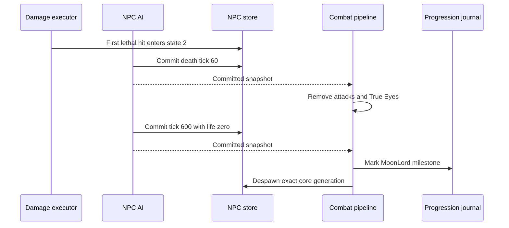

# Moon Lord death lifecycle

[Русский](../ru/moon-lord-death-sequence.md) · [NPC families](npc-behavior-families.md) · [NPC parity roadmap](../roadmap/npc-ai-parity.md)

## Implemented boundary

The first lethal core hit enters `ai[0] = 2`, restores life and makes the core invulnerable at the shared damage boundary. The authoritative AI then advances the death clock even when every player has disconnected or died. Death motion uses the pinned interpolation toward velocity $(0, -0.5)\,\mathrm{px/tick}$ with factor `0.98`.

`NpcAuthority` supplies the combat pipeline as the NPC executor's post-commit sink. Effects run only after the exact NPC generation and revision have committed:

- At $60\,\mathrm{ticks}$, remove active projectiles `456/462/455/452/454` through the projectile despawn/replication boundary and deactivate every True Eye (`NPC 400`). This is deliberately a global type scan, as in the official source. Other projectiles and ordinary NPCs remain active.
- At $600\,\mathrm{ticks}$, set core life to zero and invoke the existing imported-loot/progression boundary. Record the Moon Lord milestone in `RuntimeWorldProgressionMutations`, despawn the core and publish its terminal NPC state. No synthetic `packet 28` strike is emitted for timer expiry.
- Head, hands and True Eyes whose `ai[3]` slot no longer contains a core expire through the ordinary NPC lifecycle. They do not adopt another active core. Terminal parts cannot plan new projectiles.

The journal uses the existing canonical `.wld` save pipeline; the change adds no new file layout or omitted runtime-only progression field. Entity scans use buffers bounded by the configured NPC/projectile tables. Stale generation or revision callbacks cannot alter replacement entities or progression.

## Distance teleport

After pursuit, a living-target core in state `0/1` teleports only when its distance from the target center is strictly greater than $2400\,\mathrm{px}$. It enters state `-2` without resetting the timer and shifts to $150\,\mathrm{px}$ above the player. The same offset moves each active retained shell slot, in order, followed by every active True Eye globally. Repeated slot references retain repeated translations. Intro can allocate the shell and teleport it in the same step; the offset excludes subsequent core world movement.

Committed effects have an optional after-spawn phase, guarded by the exact core generation/revision after allocations and slot links. The world-motion wrapper forwards that phase. Authoritative translations emit `ForcedUpdate`, which the existing replication registry encodes as `packet 23` without motion-cadence suppression; baseline state and telemetry use the committed position. No network callback mutates NPC state.

Evidence includes 48 unmodified original server AI calls across the exact threshold, four directions and protected/exposed/intro completion states. Tests compare core and peer positions, AI and next RNG, plus emitted packet coordinates while the ordinary motion cadence is active. Two cases add the production world-motion wrapper; one replaces the core during commit. Disabling teleport or forced synchronization fails 26 tests each; removing the post-allocation generation guard fails the replacement test. This does not establish complete hand/head/True Eye attack AI or whole-encounter parity.

## Evidence and limits

Initialization sets `localAI[3]` and enters intro while preserving the incoming timer, even when the incoming state was death or departure. Intro and teleport return keep velocity unchanged and complete only when the incremented timer equals `60`. On completion, pursuit runs in the same tick. Intro creates the three parts even if target loss then enters departure; allocation retains the exact slots. Spawn coordinates use the core's center before world movement, truncated before the offsets, and new parts retain vanilla's unassigned target `255`.

The shared NPC AI stream now consumes the original core sound decision before initialization, including its conditional second draw, and the teleport-return draw whose result vanilla immediately overwrites. The retained fixture covers 384 direct original server AI calls with actual `NewNPC`, two RNG seeds (including the sound branch), fractional positions, initialized/uninitialized cores and absent/present players. State, velocity, slots, child positions/AI/target and next RNG result match through the executor; a separate world-motion test protects spawn ordering. Restoring the previous implementation fails all 385 tests. Death-presentation RNG consumption and complete cross-system random-stream parity remain open.

Mounted players remain in the authoritative NPC target candidates, including server-owned players. Vanilla `NPC.TargetClosest` filters activity, death and ghost state, not mount type. Mounting therefore cannot make a living player disappear from the core's departure check or from ordinary NPC targeting. Mount-specific player hitbox geometry remains a separate parity concern.

The departure path (`ai[0] = 3`) advances without living targets. On loss of the last player, the core performs its final pursuit step before entering departure with timer zero. Departure interpolates toward `(direction, -0.5)` with factor `0.98`. At $40\,\mathrm{ticks}$ it removes the five attack types and all True Eyes globally; projectile removal repeats `packet 27` and clears the server baseline without emitting `packet 29`. At $60\,\mathrm{ticks}$ it removes all hands, heads and True Eyes, then the departing core, clears `LunarApocalypseIsUp`, and requests the existing world-info broadcast. It awards no victory or loot. The journal retains the loaded event baseline and captures explicit boolean changes for the existing save-header patcher.

Departure evidence includes 120 direct original AI calls for velocity/timer/entity/event state, twelve target-loss pursuit cases, an executor-driven departure, stale-generation protection, packet27 repetition and join-baseline removal, and 32 original header combinations toggled in both directions. Header comparisons align only the original save timestamps in the expected fixture and require exactly one changed source byte. Full event/announcement behavior, remaining shared RNG consumption still require further verification; these checks do not establish full AI parity.

`LateHardmodeBossParityTests` covers the death motion, terminal clock boundary and absent-player case; these regressions fail on the previous implementation. `MoonLordDeathSequenceTests` drives the real executor and post-commit pipeline through the entire clock, verifies cleanup, progression, orphan expiry and slot reuse. Existing world-progression tests cover the persisted milestone layout.

`tools/ci/check_moon_lord_death_source.py` independently checks `NPC.AI_077_MoonLordCore`, `AI_078_MoonLordHands`, `AI_079_MoonLordHead`, AI style `82` and `AI_081_TrueEyeOfCthulhu` from TerrariaServer `1.4.5.8`, with the executable SHA-256 pinned. The dedicated source-contract workflow repeats the check with ILSpy `11.0.0.9375`; game source stays outside version control.

This closes bounded lifecycle and death-loot gaps. Complete global event/announcement behavior, owner generation tracking across core slot reuse, and broader official-server differential scenarios remain open. Presentation-only death effects, including projectile `622`, are outside the server-authoritative claim. `FullVanillaAiParity` remains false.

## Core pursuit

Protected and exposed pursuit now refresh `TargetClosest(false)` every AI tick. Outside the $20\,\mathrm{px}$ dead zone, steering uses displacement minus current velocity, vanilla reversal acceleration and a half blend with the previous velocity. Inside the dead zone it preserves velocity. `MoonLordCoreMotionTests` retains independently captured hashes of 2,000 calls to the unmodified official `AI_077_MoonLordCore` in exposed state, covering exact velocity bits, target and AI state with one or two active players. Removing movement correction fails all fifteen focused tests; removing target refresh fails all ten differential cases. Degenerate zero steering preserves finite runtime velocity; the remaining full-core state/RNG contract still requires separate parity work.

## Exact shell slots

Successful shell allocations retain the two hand slots and head slot in the core's `localAI[0..2]`, through the existing generation-checked post-commit spawn boundary. Missing allocations retain a negative sentinel. While the core is protected (`ai[0] = 0`), a missing slot, inactive part or wrong NPC type removes the core directly, even without a live player. This does not run boss loot or record a defeat. A matching owned part in another slot cannot replace the original part. The three retained parts must all enter state `-2` to open the core; missing-shell removal does not apply to an already exposed or dying core. The source checker and full executor tests cover these boundaries, including partial allocation under a full NPC table.

## Death loot and participation

The committed terminal tick now executes the Moon Lord table. Classic drops Portal Gun, 70–90 Luminite and two distinct weapons from the ten-option `1.4.5.8` pool, including Moon Lord Whip. Mask and Meowmere Minecart retain their separate chance rolls. Expert/Master bags use addressed `packet 90` delivery to active participants; Master adds the relic and per-participant pet rolls. The trophy roll precedes the boss table in every mode. Common-item luck, stack rolls, weapon selection and intervening item materialization preserve source ordering.

Accepted hits on the head or hands credit the active core in the exact `ai[3]` slot, through both inbound `packet 28` and server-owned damage. Invalid or non-core owner slots do not credit an unrelated core. No loot is emitted on the initial lethal strike or before tick 600; stale terminal callbacks cannot duplicate delivery. Public items use the existing `packet 21` path and instanced bags retain the existing bounded slot lease.

The eighteen drop definitions and natural prefixes were checked against the unmodified official Linux dedicated-server assembly loaded by a local .NET probe on Windows. The retained tests pin the prefix and next RNG value for 100 seeds per item (1,800 comparisons); this is assembly differential evidence, not a Linux NativeAOT execution claim. `VanillaMoonLordLootTests` covers all 90 ordered distinct weapon choices, delivery/RNG interleaving and difficulty tables. `MoonLordLootPipelineTests` exercises real death ticks, both damage paths, participant routing and stale callbacks. Removing the loot dispatch makes the new pipeline regressions fail.

These are drop definitions only: opening bags, using or placing the new items, global coin/heart rules and full weapon gameplay remain separate work.

## Good World Moon Boulder

The Good World head burst now enters an explicit type-1021 `aiStyle 25` runtime family. Each world tick runs the source two subupdates: it marks `ai[0] = 1`, caps incoming fall speed at 16, accelerates a low vertical-speed roll by `0.025`, then adds gravity `0.06`. A stopped upward-or-level boulder probes the source's three adjacent solid-tile distances before selecting a direction, falling back to its center-tile parity. Tile collision retains fast vertical rebounds at 90%, gentle-landed state and four horizontal rebounds before the fifth kills it. `Collision.SwitchTiles` pressure-switch and wiring trigger path remains outside the authoritative world-mutation boundary.

`VanillaProjectileWorldStateStepperTests` covers the two-subupdate trajectory, local update counter, adjacent-solid direction selection and vertical rebound. The profile-catalog regression requires type 1021 to remain in the explicit rolling-boulder family.

## Hand attack clock and combat frames

`VanillaMoonLordHandBehavior` implements the two 600-tick hand schedules, phase movement, pupil aiming, bounds before outer motion, and creation of Phantasmal Eye, Sphere and Bolt projectiles. A retired hand remains at `ai[0] = -2`, sets damage to zero and invulnerability, resets its clock at 32 (or from a negative input), and keeps flying toward its side's core attachment. `NpcSimulationState.FrameCounter` retains the authoritative frame clock: incoming frame 21 rejects damage even on the tick that starts reopening the hand. Phase transitions request immediate packet 23 through the existing generation-checked commit boundary.

`MoonLordHandTests` compares 3,664 independent original `AI_078` calls: both sides, every ordinary incoming clock from 0 through 599 and frames 0/19/21, plus retired inputs `-1/0/1/15/30/31/32/63` and frames 0/19/20/21. It checks exact positions, velocities, AI/local state, vulnerability, frame, target, actual projectile creation and next RNG draw. The numeric fixtures SHA256 values are `d3a5ecf7d781ab4b548372eaf621a3f606db9de347d1905cac0bed9607898fc1` (ordinary) and `e3d85bf8fe4387551d40cb0b79c9a1d71977f1b2ff7aeefcd41c3768466d8e94` (retired). The unmodified Linux server assembly ran on Windows CoreCLR; this is not Linux native evidence. Three additional integration cases cover actual damage rejection and immediate packet delivery.

`IVanillaNpcRandom.NextDouble()` supplies a unit-interval draw. Production uses the underlying seeded `Random.NextDouble`; integer-only implementations retain a default adapter, while streams requiring identical seeded consumption should override the method. Projectile spawn centers are converted to runtime top-left coordinates before submission.

The retained 2,400-tick hand trace now covers all four attack states over consecutive calls with the same stationary core and player. Every hand state, active projectile and final shared RNG draw matches the independent original-server trace; its expanded fixture SHA256 is `01138e8d1c53167047314125733ad2df65e449200ba557bd90880eb69d9e1cb2`. A second 2,400-tick trace moves the player by `(3.25, -1.75)` pixels per tick and supplies that velocity to every targeting call; it also matches state, active projectiles and final RNG with fixture SHA256 `be9bb6006eab3144dad9a673551a143b3204a72d09f8e5c2d56a4896f13e5509`. Both traces run hand AI only, so attached explosive interactions, broader multiplayer targeting, outer NPC physics and projectile AI remain separate parity work.
## Retained targets and sphere release

Hand bolt aiming continues against the retained player slot without a living target; an absent slot supplies the fresh Player center `(10, 21)`. Sphere release at local tick 292 follows `Player.FindClosest`: closest living active player, otherwise the first active slot even if dead, otherwise slot zero. Normalization preserves FNA reciprocal multiplication before the speed-12 scale. Bolt target acquisition requests packet 23 even when the incoming attack state is already 3.

An additional 80 original AI calls cover stationary, moving, dead and absent targets; 48 calls cover existing spheres immediately before, at and after release for both hands. Tests verify exact state and immediate packet-27 position/velocity, excluding already released and differently owned spheres. Two world-runtime cases verify moving network and server players through the existing snapshot velocity lookup. The production velocity path needed no change. Negative controls fail eight absent-target cases, eight release cases, the repeated-state packet-23 case and both velocity-lookup cases.

The two expanded fixture hashes are `6bd1013cf7860a9b035e01d8f61a533b1048fad989f42839f90e9769eced23e3` (targets) and `3e6440a9b0292eabeab9db6738f80b07dc8096ca63a2a85009609548cdc03aef` (release). These remain independent single-call evidence, not a complete encounter or validation of every multiplayer target arrangement.
## Head attack and eyelid state

`VanillaMoonLordHeadBehavior` replaces generic flight with the source head attachment: center at core center minus 400 pixels vertically, zero velocity before targeting or spawning. The 1,200-tick attack schedule updates pupil, mouth and eyelid state. Incoming `localAI[3] >= 15` controls damage; freshly allocated heads start with zero local state, while `ai[3]` retains the core slot. The retired `-2` to `-3` transition preserves the source early return, including its incoming eyelid gate.

The head now creates Deathray, Bolt and individually addressed Moon Leech projectiles at their original ticks and centers. Moon Leech's source 16×16 geometry and AI style 85 were added to the definition catalog. Telegraph angle draws consume the shared RNG even on a dedicated server. Phase changes, target changes, bolt acquisition and Deathray launch request immediate packet 23 through the existing committed-effect boundary.

`MoonLordHeadTests` checks 3,600 original AI calls across every incoming timer and eyelid states 0/13/15, plus 36 retired cases. It compares exact position, velocity, AI/local state, damage gate, target, actual projectile creation, next RNG and immediate packet-23 behavior. Reference setup uses the verified head size 38×56 and resets old target/directions as the outer NPC update does. Expanded fixture hashes: `b53358c6945b688feaca399e9a24327e72e667acdf3e084d57c1137b33f3a770` and `55c486f5d618095e952f21e97b81ad31218d55f4563543c5ae6aa894986963ac`. Three integration cases cover actual strikes and allocation of a head owned by core slot 20. Restoring old head behavior fails 3,631 tests; removing sync and restoring the owner/eyelid collision fails 3,511.

An additional regression retains the same head, local state, shared random stream and created projectiles over two full attack cycles ($2400\,\text{ticks}$). Every update matches an independent original-server trace, including exact projectile state and the final random draw. The expanded fixture SHA256 is `405a45608d1796c0b3e8be07d9d04433399dcd0ec102893967bbd12a57cd6062`. The trace runs head AI with a stationary core and player; it does not advance projectile AI or outer NPC physics.

Full continuous encounter behavior, Moon Leech AI/buff/healing-blob interactions, all multiplayer targeting arrangements, retired visual rotation and broader True Eye traces remain open.

## Good World head boulder burst

AI_079 now creates 30 type-`1021` boulders at the final Deathray close when the head-center tile is not solid. Each starts at the exact 31x31-centered head position with damage 70 and knockback 10. The solid-tile query remains inside all 30 source iterations, so a solid tile consumes no RNG. MoonLordHeadTests covers clear and solid tile paths. Later aiStyle-25 rolling, collision and SwitchTiles behavior remain open.

## True Eye hover, Bolt and sphere correction

The ordinary `AI_081` hover window now reacquires the closest living player every tick. It turns the pupil toward that player's 20-tick velocity prediction, opens it toward `0.7`, and blends velocity one thirtieth of the way toward the point 200 pixels above the player at speed 24. It then scans physical NPC slots and adds the source per-component separation impulse for every nearby True Eye, including eyes owned by another core. The Bolt window damps speed, adjusts the pupil scale and fires Phantasmal Bolt at source ticks 76 and 83 from its circular `30×30` pupil vector. The sphere window follows the six source spokes, creates each Phantasmal Sphere at its ten-tick boundary, adds the upward wind-up impulse at tick 75, then releases its own unreleased spheres with the source 12-speed vector. The rotating-eye window preserves its state-45 turn RNG, 40-tick damping, speed ramp and ten-tick Phantasmal Eye creation from the signed pupil vector at the source `12√2` offset. The Deathray window consumes its telegraph draws, retains pupil rotation and launches type `455` with source damage, sweep direction and True Eye slot ownership at tick 180. A retired True Eye preserves `ai[0] = -2` through non-zero attack-table entries and returns to state `0` only at the next hover entry. The shared NPC random stream also consumes AI_081's leading sound roll before validating the core link. `MoonLordFreeEyeTests` compares a stationary 1,200-tick original-server cycle, including state, active projectiles and final random draw; fixture SHA-256 is `51adc7a88fc15afbcacb7194a1ee530c0cd96219143f412d05aa80a69d315074`. A second 1,200-tick trace moves the player by `(3.25, -1.75)` pixels per tick and supplies that velocity to every target refresh; it matches state, active projectiles and final RNG with fixture SHA-256 `98fb1acdd8bf04546f3a07a572ab79b7dda643cfcddfdf555d6d88e7b091500e`. Broader multiplayer arrangements and outer NPC/projectile motion remain open.

## Moon Leech implementation in progress

The working implementation includes style-85 movement, the return transition on update 330 or loss of the addressed player, head validation, contact tracking and destruction near the returning mouth. A retained 160-case original-server fixture verifies exact AI/local state, velocities and destruction decisions; delaying the return by one update fails 14 cases. Its expanded SHA256 is `460000cef7d10aa92dcd7491e7baaee790c5a3b7ec358419b4dbd23f55fd148b`.

First contact now proposes buff 145 for the exact player generation, unless GodMode prevents it. The projectile executor applies it through the existing commit sink only after the complete projectile update succeeds. Remote player state retains the duration without a server countdown; packet 50 replaces received durations with 60 and clears omitted buffs. No packet 55 is emitted for Moon Leech.

The bounded player buff state retains 44 slots and the original full-array eviction order: ordinary slots may be removed, debuffs are preserved, and `Player.DelBuff` leaves the final slot in place when compacting earlier entries. Ten independent original `AddBuff` cases verify insertion, refresh, immunity and full-array behavior; all 401 buff identities are checked against the original 76-entry debuff table. The fixture hashes are `5e994022f14fa030b0b0ab15ae19cfb96f1d63d2592897b1f6b207fb3c782ddb` and `29d6b2c7fd4bd9510f06692541595bec0a1f2afd5c69789e8a8f4b148f06727f`.

`ProjectileSimulationStepResult.PlayerBuff` is an optional single application per local subupdate. The behavior composition preserves it through decorators; a later non-null proposal replaces the earlier one. It is cleared between subupdates, validated with the proposed state, and applied against the current player generation after commit. Invalid speculative state emits no application. This does not model effects that must influence a later extra update before the final commit.

Server-controlled players now decrement Moon Leech once per world tick, including when movement physics is absent. Refresh keeps the longer duration; death and despawn clear the generation-owned state. The existing packet-50 replication combines Moon Leech with lava burning in application order, preserving the other effect when either expires. Tests exercise both orders, independent expiry, death and slot reuse through real world ticks and inspect packet bytes. This timer is separate from the remote snapshot-owned duration; bot potion state and broader buff unification remain open.

Broader immunity/equipment behavior, committed packet-27 evidence and full acceptance remain unfinished. This is not full Moon Leech or general buff parity.

## Healing-clot anchor representation

NPC 401 carries a `ProjectileKey` by reinterpreting its bits as `ai[1]`. Valid keys can therefore encode NaN or infinity. `NpcAiState.IsValidFor` and the packet-23 boundary admit this opaque field only for NPC 401 and check the source index bound of 0 through 1000. Positions, velocities, other AI fields and other NPC types still require finite numbers. The generic `IsFinite` predicate retains its original meaning.

A 36-case fixture from the original `ProjectileKey` representation verifies state storage, behavior composition and packet-23 bytes, including high generations and both endpoint indices. Its SHA256 is `a92ff556dfa67d4534132a842ee7cc211de3f428b8f45b7b4a2197b4547bb3dc`. The original `ai[1] != 0` presence rule omits the negative-zero key `(spawner 0, index 0, generation 8192)` on the wire; the test retains this source behavior rather than claiming that every key survives transmission. NPC 401 now resolves its anchor through the existing exact wire-identity registry and applies its source movement and healing transition. Head-driven creation remains unfinished.

The native `--protocol-smoke` path also exercises NPC storage and packet-23 serialization with finite, NaN, infinity and negative-zero anchors. Projectile wire generations now retain the low 14 bits of the assigned runtime generation, including zero. Twelve actual original NewProjectileSetup calls cover spawners 0, 1 and 255 around both wrap boundaries (fixture SHA256 7e5ce31590f4a1950c28c3e5bfc0f3c15b9f419c7b0fb8f0e099959dc4c7c885). Packet 27 admits and preserves these keys; runtime handles still require an assigned, nonzero wide generation. The native protocol smoke covers this wrap as well. The original special handling of an entirely zero key on an ingress lookup miss, and lookup of inactive projectile keys, remain separate ingress parity gaps.

## Numeric healing presentation

The numeric combat-text codec now encodes packet 81, which the original dedicated server uses for `NPC.HealEffect`: two single-precision coordinates, RGB and a signed 32-bit amount. Six packets captured by invoking the original method verify exact bytes, including odd rectangle dimensions and negative coordinates (fixture SHA256 `00ca7b0b22ae766f6c58a6d160957dc00392a4177a7f78958837f216a9cad7cc`). The rectangle center uses integer half dimensions. The codec is connected to committed NPC 401 healing. A healed NPC updates its retained joining-client baseline; numeric healing is sent before the clot removal packet.
## Healing-clot simulation

NPC 401 has source defaults of $30\times30\,\text{pixels}$, $400\,\text{life}$, no gravity or tile collision, and hidden presentation. AI82 interpolates its center from the live Moon Leech anchor to the head mouth over $90\,\text{updates}$. At completion it spends a budget of $1000\,\text{life}$ in head, core, left-hand, right-hand order, then deactivates. An invalid head deactivates it before incrementing age; a missing projectile anchor preserves position and clears velocity.

The executor commits the terminal state without an intermediate update notification, applies exact-generation healing, and publishes removal before visiting the next NPC slot. The world-motion wrapper forwards this terminal decision and still integrates the original final velocity. A reentrant replacement after commit cannot receive the old generation's effects or removal. Ordinary store updates keep their existing publication semantics.

The 80-case original AI82 fixture (SHA256 `d782fd9d563a84cebd66c993ccf3b311ead62a56ecd9745f8e5e8b1cde4bb713`) checks motion, age, healing allocation and deactivation. Each case also runs through world motion, using the independently inspected outer `NPC.UpdateNPC` integration rule. Tests inspect packet-81 amounts and ordering before packet-23 removal. The native protocol smoke exercises healing through the world-motion wrapper. Full combat/loot behavior of the clot and comprehensive immunity remain open; this is not full Moon Lord parity.

## Head-created healing clots

The head now creates NPC 401 at phase-2 elapsed updates 120, 180 and 240. After committing the head update, it scans all 1000 physical projectile slots in ascending order. Each active Moon Leech whose addressed player retains buff 145 supplies its original wire key; returning tongues and tongues from other heads remain eligible. The new clot uses the head target's center as its spawn-bottom coordinate. Allocation is best effort, so exhausted NPC capacity does not discard earlier children or reject the head update. Higher-slot children run later in the same NPC pass.

`IVanillaNpcProjectileAnchorLookup.TryGetHealingAnchor` exposes this read-only eligibility query. The application adapter reads actual projectile slots, reverse wire identities and pending or active player buff snapshots; disconnect clears the snapshot. A shadowed older projectile retains its own key for creation even when forward lookup resolves only a newer generation. General equipment immunity is still outside this adapter's represented state.

Forty original head-AI cases (fixture SHA256 `0efd2e88193845b4a8d931eba93c2688a66eb326935b6874c5d4a73a6e7532e1`) verify creation from supplied anchor and buff-query facts. Separate application tests exercise real packet-50 state, key shadowing and capacity exhaustion. A coupled original trace of $400\,\text{updates}$ compares the head, tongue, buff, clot and healing states exactly (expanded fixture SHA256 `94c6de51c11f96a7971d20ea220162990dd5f5d9763ba3a84a29bbafe74c0de7`). Its player is stationary, core/hand AI is frozen, and remote buff countdown is absent; it is not a complete fight or full `Main.Update` comparison. Shifting the first creation update makes the regression fail. The native protocol smoke also creates a clot through the real application adapter. NPC spawn-slot protection now follows the original world-tick lifecycle; complete network update cadence remains open.
