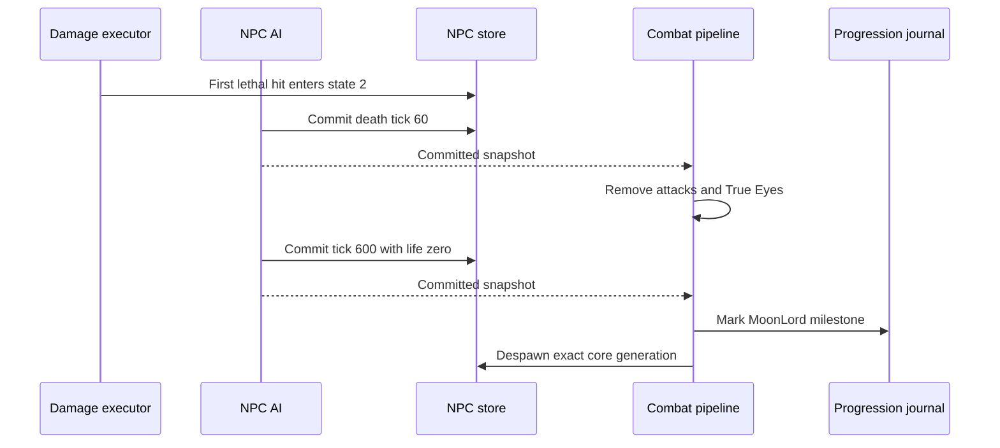

# Moon Lord death lifecycle

[Русский](../ru/moon-lord-death-sequence.md) · [NPC families](npc-behavior-families.md) · [NPC parity roadmap](../roadmap/npc-ai-parity.md)

## Implemented boundary

The first lethal core hit enters `ai[0] = 2`, restores life and makes the core invulnerable at the shared damage boundary. The authoritative AI then advances the death clock even when every player has disconnected or died. Death motion uses the pinned interpolation toward velocity $(0, -0.5)\,\mathrm{px/tick}$ with factor `0.98`.

`NpcAuthority` supplies the combat pipeline as the NPC executor's post-commit sink. Effects run only after the exact NPC generation and revision have committed:

- At $60\,\mathrm{ticks}$, remove active projectiles `456/462/455/452/454` through the projectile despawn/replication boundary and deactivate every True Eye (`NPC 400`). This is deliberately a global type scan, as in the official source. Other projectiles and ordinary NPCs remain active.
- At $600\,\mathrm{ticks}$, set core life to zero and invoke the existing imported-loot/progression boundary. Record the Moon Lord milestone in `RuntimeWorldProgressionMutations`, despawn the core and publish its terminal NPC state. No synthetic `packet 28` strike is emitted for timer expiry.
- Head, hands and True Eyes whose `ai[3]` slot no longer contains a core expire through the ordinary NPC lifecycle. They do not adopt another active core. Terminal parts cannot plan new projectiles.

The journal uses the existing canonical `.wld` save pipeline; the change adds no new file layout or omitted runtime-only progression field. Entity scans use buffers bounded by the configured NPC/projectile tables. Stale generation or revision callbacks cannot alter replacement entities or progression.

## Evidence and limits

`LateHardmodeBossParityTests` covers the death motion, terminal clock boundary and absent-player case; these regressions fail on the previous implementation. `MoonLordDeathSequenceTests` drives the real executor and post-commit pipeline through the entire clock, verifies cleanup, progression, orphan expiry and slot reuse. Existing world-progression tests cover the persisted milestone layout.

`tools/ci/check_moon_lord_death_source.py` independently checks `NPC.AI_077_MoonLordCore`, `AI_078_MoonLordHands`, `AI_079_MoonLordHead` and `AI_081_TrueEyeOfCthulhu` from TerrariaServer `1.4.5.8`, with the executable SHA-256 pinned. The dedicated source-contract workflow repeats the check with ILSpy `11.0.0.9375`; game source stays outside version control.

This closes a bounded lifecycle gap, not all Moon Lord parity. Moon Lord-specific loot tables, complete global event/announcement behavior, core self-termination when shell slots disappear, owner generation tracking across core slot reuse, and broader official-server differential scenarios remain open. Presentation-only death effects, including projectile `622`, are outside the server-authoritative claim. `FullVanillaAiParity` remains false.
