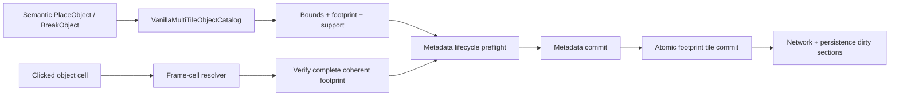

# Authoritative multi-tile object mutations

TerraRuntime owns multi-tile world-object mutation separately from packet decoding and persistence encoding. This layer consumes source-backed `VanillaMultiTileObjectDefinition` geometry and commits one coherent footprint on the authoritative single-writer thread.

## Transaction boundary

The object footprint area is

$$
A = w h,
$$

where $w$ and $h$ come from the version-pinned object definition. Frame cells use the vanilla base-style cell size of $18$ frame units; unrelated handlers do not reproduce that arithmetic.

## Metadata lifecycle

`IVanillaMultiTileObjectMetadataLifecycle` is the protocol-neutral bridge between `TerraRuntime.World` and runtime-owned chest/sign/tile-entity state. Both creation and removal have side-effect-free preflight calls followed by non-throwing commit calls. A metadata owner may therefore reject capacity exhaustion, an occupied chest, an active owner or another semantic conflict before the first `WorldTile` is changed.

The world layer deliberately does not depend on `RuntimeChestStore`, `RuntimeSignStore` or a future runtime tile-entity store. Packet and runtime composition choose the concrete adapter.

## Placement support

Placement is intentionally fail-closed. The first source-backed authoritative placement family is:

- `Containers`;
- `Containers2`;
- `Dressers`.

These objects require their complete bottom footprint to be supported by active, non-actuated solid or solid-top tiles. Placement translates the source-backed placement origin into the top-left footprint, verifies every target cell is inactive, verifies support, asks the metadata lifecycle for permission and then writes every object cell with deterministic base-style frames.

Signs and the currently catalogued tile-entity furniture are **not** guessed into this policy. Their exact alternate origins, anchors, liquid constraints and style variants remain fail-closed until independently pinned.

## Break and frame resolution

Break accepts any cell of a coherent object already described by `VanillaMultiTileObjectCatalog`. The clicked frame is converted to an object-local column/row; style offsets are handled modulo the verified width/height. Before mutation the service verifies every footprint cell has the expected tile identity and matching local frame coordinate. A malformed or partial object is rejected atomically.

Removing the object clears only tile-owned state: active identity, object frames, tile color, shape and block-specific actuator/visibility/fullbright flags. Independent wall, wall color, wires and liquid state remain intact.

## Dirty propagation

Every changed cell flows through `WorldTileStore.Set`, so its network and persistence section revisions are dirtied. The bounded one-tile framing neighborhood is also marked network-dirty, including both sides of a Terraria section boundary when an object spans or touches it.

## Scope boundary

This is the world transaction layer, not a claim of complete `TileObjectData` parity. The following remain separate work:

- Terraria's dedicated object-placement network ingress rather than overloading packet 17;
- exact support/anchor policies for signs and other furniture;
- alternate placement origins and style/substyle mapping;
- liquid-placement rules;
- concrete chest/sign/tile-entity metadata adapters and replication semantics;
- object-specific drops and secondary effects.

Accordingly the broad D5 placement/break/framing roadmap item remains open until those production boundaries are connected and verified by CI.
