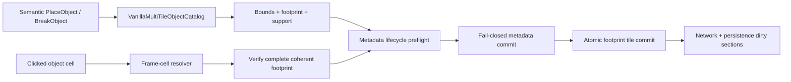

# Authoritative multi-tile object mutations

TerraRuntime owns multi-tile world-object mutation separately from packet decoding and persistence encoding. This layer consumes source-backed `VanillaMultiTileObjectDefinition` geometry and commits one coherent footprint on the authoritative single-writer thread.

## Transaction boundary

The object footprint area is

$$
A = w h,
$$

where $w$ and $h$ come from the version-pinned object definition. Frame cells use the vanilla base-style cell size of $18$ frame units; unrelated handlers do not reproduce that arithmetic.

## Metadata lifecycle

`IVanillaMultiTileObjectMetadataLifecycle` is the protocol-neutral bridge between `TerraRuntime.World` and runtime-owned chest/sign/tile-entity state. Both creation and removal have side-effect-free preflight calls followed by non-throwing `TryCommit*` calls. A metadata owner may therefore reject capacity exhaustion, an occupied chest, an active owner or another semantic conflict before the first `WorldTile` is changed. If state nevertheless changes between preflight and commit, the commit returns `false` and the world transaction reports `MetadataCommitFailed` without touching the footprint.

The world layer deliberately does not depend on `RuntimeChestStore`, `RuntimeSignStore` or a future runtime tile-entity store. Runtime composition chooses the concrete adapter.

### Runtime chest adapter

`RuntimeChestObjectMetadataLifecycle` is the first production adapter. It binds container footprints to `RuntimeChestStore` on the same authoritative writer:

- creation allocates the lowest free vanilla chest slot and creates an empty 40-slot ordinary container;
- duplicate coordinates or exhausted chest capacity reject placement before tile mutation;
- removal is rejected while the chest is open by any live session;
- removal is rejected while any item slot is non-empty;
- an empty chest name does not matter, and a non-empty name alone does not block safe removal;
- successful removal clears both coordinate and slot indexes, allowing the released slot to be reused later.

The runtime storage boundary remains compatible with protocol 326 variable chest sizes up to 256 item slots, while ordinary vanilla-created containers use the source-backed default of 40.

## Placement support

Placement is intentionally fail-closed. The first source-backed authoritative placement family is:

- `Containers`;
- `Containers2`;
- `Dressers`.

These objects require their complete bottom footprint to be supported by active, non-actuated solid or solid-top tiles. Placement translates the source-backed placement origin into the top-left footprint, verifies every target cell is inactive, verifies support, asks the metadata lifecycle for permission and then writes every object cell with deterministic base-style frames.

Signs and the currently catalogued tile-entity furniture are **not** guessed into this policy. Their exact alternate origins, anchors, liquid constraints and style variants remain fail-closed until independently pinned.

## Break and frame resolution

Break accepts any cell of a coherent object already described by `VanillaMultiTileObjectCatalog`. The clicked frame is converted to an object-local column/row; style offsets are handled modulo the verified width/height. Before mutation the service verifies every footprint cell has the expected tile identity and matching local frame coordinate. A malformed or partial object is rejected atomically.

Removing the object clears only tile-owned state: active identity, object frames, tile color, shape and block-specific actuator/visibility/fullbright flags. Independent wall, wall color, wires and liquid state remain intact.

The production packet-17 break path now admits the exact source-pinned base Chest identity (`Containers`, style 0, alternate 0). It resolves any clicked cell to the coherent 2x2 footprint, applies the runtime chest metadata veto, removes the footprint atomically and materializes one authoritative Chest item drop through a reserved world-item slot. Open or non-empty chests remain unchanged. Other styles and object families stay fail-closed until an exact reverse object-to-item mapping and secondary effects are pinned.

## Dirty propagation

Every changed cell flows through `WorldTileStore.Set`, so its network and persistence section revisions are dirtied. The bounded one-tile framing neighborhood is also marked network-dirty, including both sides of a Terraria section boundary when an object spans or touches it.

## Scope boundary

This is the world transaction layer, not a claim of complete `TileObjectData` parity. The following remain separate work:

- Terraria's dedicated object-placement network ingress rather than overloading packet 17;
- exact item-to-object authorization for client placement requests;
- exact support/anchor policies for signs and other furniture;
- alternate placement origins and style/substyle mapping;
- liquid-placement rules;
- concrete sign/tile-entity metadata adapters and replication semantics;
- remaining object-specific drops and secondary effects beyond the exact base Chest break slice.

Accordingly the broad D5 placement/break/framing roadmap item remains open until those production boundaries are connected and verified by CI.
