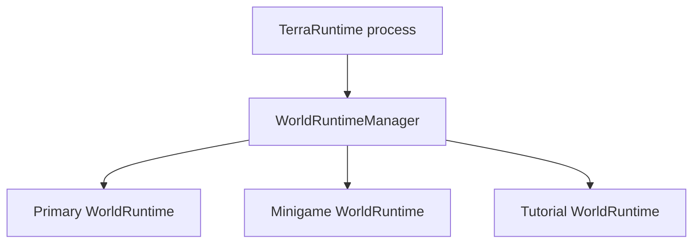

# Multi-world and sandbox runtime

TerraRuntime is being shaped so one server process can own more than one live world runtime and so selected worlds can instead run in dedicated worker processes.

This is not a replacement for Dimensions. Long-lived secondary worlds may later reuse the same foundation, but sandbox worlds primarily provide isolated minigame arenas, tutorials, temporary dungeons, event instances, test worlds and stronger fault/resource containment.

The normative delivery plan is [`../roadmap/multi-world-sandbox-runtime.md`](../roadmap/multi-world-sandbox-runtime.md).

## Identity

A `.wld` file is not the identity of a live runtime.

`WorldRuntimeId` identifies one logical runtime-world instance. A clone made from the same source receives another runtime ID.

`WorldSessionId` identifies one live activation. Restarting the same logical runtime creates a new session ID so stale host/process identities can be rejected.

`WorldRuntimeIdentity` combines both values for boundaries that must identify an exact live world.

`TerraRuntimeHostRuntimeInfo` now exposes `RuntimeIdentity`, `IsolationLevel` and `PersistenceMode`. Existing single-world startup automatically receives a fresh assigned identity and reports `InProcess` + `Persistent`; future multi-world composition may retain a logical `WorldRuntimeId` while rotating `WorldSessionId` when that runtime restarts.

The current implementation provides these identity contracts as foundation. It does not yet run multiple worlds concurrently.

## Isolation levels

`WorldIsolationLevel.InProcess` means the world runs inside the current TerraRuntime process with its own authoritative state boundary.

`WorldIsolationLevel.DedicatedProcess` means the world is hosted by a separate TerraRuntime worker supervised by the main process.

Isolation is independent from `WorldPersistenceMode`:

- `Persistent` keeps canonical persistence;
- `Ephemeral` exists only for the runtime/session lifecycle;
- `SnapshotClone` starts from another immutable source/snapshot but receives independent runtime identity and mutations.

## Level 1: in-process

The target model is:



Every runtime owns its mutable simulation state. One runtime may not mutate another runtime's players, entities, progression or extension state through shared globals.

The first implementation may use one authoritative thread per active runtime. That implementation detail can change after measurement, but the single-writer boundary per runtime remains.

Normal in-process gameplay does not go through IPC.

## Level 2: process-isolated with socket handoff

A stronger sandbox uses a worker process. The worker receives its world source, selected sandbox-side modules/plugins, configuration and limits, creates the `WorldRuntime`, attaches the local game logic and reports readiness through `TerraRuntime.Transport`.

`TerraRuntime.Transport` is the control plane. For a local dedicated sandbox it is **not** the permanent Terraria gameplay proxy.

Before the player enters the sandbox:

```text
Terraria client <---- TCP ----> Main TerraRuntime
```

After the sandbox is ready, TerraRuntime transfers the player's bounded semantic state through `TerraRuntime.Transport` and hands ownership of the already accepted TCP socket to the worker using an OS-specific socket-handoff mechanism:

```text
Terraria client <---- same TCP connection ----> Sandbox worker
```

The client does not reconnect. The worker becomes the only application-level reader/writer for that connection and handles normal Terraria traffic directly while its hooks, commands and sandbox-local game logic execute locally.

When the player leaves the sandbox, the operation runs in reverse: the worker prepares transferable player state, sends that state through `TerraRuntime.Transport`, hands the same TCP socket back to the main process, waits for ownership acknowledgement and only then retires its connection ownership. The main process then attaches the player to the destination `WorldRuntime`.

Windows uses verified Winsock/.NET socket duplication semantics; Unix/Linux uses verified descriptor passing over a local Unix-domain control channel such as `SCM_RIGHTS`. The kernel socket is not serialized as ordinary Transport payload bytes. Transport coordinates the transaction and carries semantic state while the platform mechanism transfers the live socket/descriptor.

A handoff may commit only at a complete Terraria protocol-frame boundary. User-space bytes already consumed into a decoder, `PipeReader` or process-local buffer do not move with the socket, so no partial frame or untransferred receive state may remain. At every instant exactly one process owns application-level reads and writes. Failed ownership negotiation fails closed rather than allowing two active connection processors.

The dedicated process provides crash containment and stronger resource isolation. A worker crash must not kill the main server; the supervisor detects the failure, retires the sandbox and deterministically disconnects or otherwise recovers affected clients according to the implemented recovery policy.

The first process-isolated implementation should host one sandbox world per worker. Packing multiple worlds into one worker is an optimization, not the baseline contract.

## Transport

`TerraRuntime.Transport` is deliberately kept.

It has two concrete roles:

1. Vega can communicate with multiple TerraRuntime servers through independent transport sessions. Vega remains responsible for permissions/capabilities exposed to ordinary plugins.
2. `SandboxSupervisor` communicates with dedicated TerraRuntime sandbox workers through the same bounded/versioned process-boundary envelope.

For level 2 it carries lifecycle, handshake, heartbeat, faults, metrics, administrative operations and semantic player/runtime transfer data. Once a local player's socket has been handed to the worker, ordinary Terraria gameplay traffic flows directly between that client and worker rather than being permanently proxied through Transport or the main process.

Transport provides mechanics such as framing, versioning, correlation, request/response/events, cancellation and heartbeats. It does not define gameplay operations and does not bypass the authoritative command boundary.

A Vega plugin should receive semantic, policy-scoped cross-server operations from Vega PluginSdk rather than unrestricted access to raw transport.

## Player transfer

A connection belongs to one active world session at a time. In a dedicated-process sandbox it also has exactly one committed process owner at a time.

Moving a player between in-process worlds is an authoritative runtime lifecycle operation, not a packet-emulation trick. Moving a player into or out of a level-2 sandbox additionally transfers the accepted TCP connection at a protocol-frame safe point after transferable player state has been prepared.

This prevents a host/plugin from rebuilding the old Dimensions/FakeProvider class of fragile state by sending a hand-crafted sequence of world and section packets, and it avoids permanent IPC proxy overhead for level-2 gameplay.

## Current status

Implemented foundation:

- `WorldRuntimeId`;
- `WorldSessionId`;
- `WorldRuntimeIdentity`;
- `WorldIsolationLevel`;
- `WorldPersistenceMode`;
- host-visible runtime identity/isolation/persistence through `TerraRuntimeHostRuntimeInfo`;
- retained bounded/versioned `TerraRuntime.Transport` envelope and handshake.

Normative but not implemented yet:

- `WorldRuntimeManager`;
- concurrently active world runtimes;
- connection transfer between worlds;
- ephemeral world materialization from worldgen/source state;
- sandbox worker process and supervisor;
- level-2 bidirectional TCP socket handoff;
- Vega multi-server service protocol on top of Transport;
- OS-level worker resource controls.

The next implementation slice should build the in-process runtime container first. Process isolation must reuse that world runtime model rather than creating a second simulation architecture.
