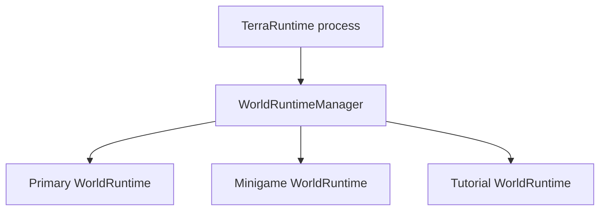
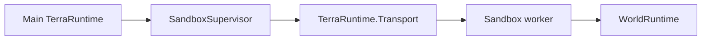

# Multi-world and sandbox runtime

TerraRuntime is being shaped so one server process can own more than one live world runtime and so selected worlds can instead run in dedicated worker processes.

This is not a replacement for Dimensions. Long-lived secondary worlds may later reuse the same foundation, but sandbox worlds primarily provide isolated minigame arenas, tutorials, temporary dungeons, event instances, test worlds and stronger fault/resource containment.

The normative delivery plan is [`../roadmap/multi-world-sandbox-runtime.md`](../roadmap/multi-world-sandbox-runtime.md).

## Identity

A `.wld` file is not the identity of a live runtime.

`WorldRuntimeId` identifies one logical runtime-world instance. A clone made from the same template receives another runtime ID.

`WorldSessionId` identifies one live activation. Restarting the same logical runtime creates a new session ID so stale host/process identities can be rejected.

`WorldRuntimeIdentity` combines both values for boundaries that must identify an exact live world.

`TerraRuntimeHostRuntimeInfo` now exposes `RuntimeIdentity`, `IsolationLevel` and `PersistenceMode`. Existing single-world startup automatically receives a fresh assigned identity and reports `InProcess` + `Persistent`; future multi-world composition may retain a logical `WorldRuntimeId` while rotating `WorldSessionId` when that runtime restarts.

The current implementation provides these identity contracts as foundation. It does not yet run multiple worlds concurrently.

## Isolation levels

`WorldIsolationLevel.InProcess` means the world runs inside the current TerraRuntime process with its own authoritative state boundary.

`WorldIsolationLevel.DedicatedProcess` means the world is hosted by a separate TerraRuntime worker supervised by the main process.

Isolation is independent from `WorldPersistenceMode`:

- `Persistent` keeps canonical persistence;
- `Ephemeral` exists only for the runtime/session lifecycle;
- `SnapshotClone` starts from another immutable source/snapshot but receives independent runtime identity and mutations.

## Level 1: in-process

The target model is:

Every runtime owns its mutable simulation state. One runtime may not mutate another runtime's players, entities, progression or extension state through shared globals.

The first implementation may use one authoritative thread per active runtime. That implementation detail can change after measurement, but the single-writer boundary per runtime remains.

Normal in-process gameplay does not go through IPC.

## Level 2: process-isolated

A stronger sandbox uses a worker process:

The dedicated process is useful when crash containment, strict resource accounting or less-trusted game-mode code requires a real operating-system boundary.

The first process-isolated implementation should host one sandbox world per worker. Packing multiple worlds into one worker is an optimization, not the baseline contract.

## Transport

`TerraRuntime.Transport` is deliberately kept.

It has two concrete roles:

1. Vega can communicate with multiple TerraRuntime servers through independent transport sessions. Vega remains responsible for permissions/capabilities exposed to ordinary plugins.
2. `SandboxSupervisor` communicates with dedicated TerraRuntime sandbox workers through the same bounded/versioned process-boundary envelope.

Transport provides mechanics such as framing, versioning, correlation, request/response/events, cancellation and heartbeats. It does not define gameplay operations and does not bypass the authoritative command boundary.

A Vega plugin should receive semantic, policy-scoped cross-server operations from Vega PluginSdk rather than unrestricted access to raw transport.

## Player transfer

A connection belongs to one active world session at a time.

Moving a player to an arena is an authoritative runtime lifecycle operation, not a packet-emulation trick. The runtime retires source-world membership, allocates destination membership, bootstraps destination world state and only then reports the destination session as playing.

This prevents a host/plugin from rebuilding the old Dimensions/FakeProvider class of fragile state by sending a hand-crafted sequence of world and section packets.

## Current status

Implemented foundation:

- `WorldRuntimeId`;
- `WorldSessionId`;
- `WorldRuntimeIdentity`;
- `WorldIsolationLevel`;
- `WorldPersistenceMode`;
- host-visible runtime identity/isolation/persistence through `TerraRuntimeHostRuntimeInfo`;
- retained bounded/versioned `TerraRuntime.Transport` envelope and handshake.

Not implemented yet:

- `WorldRuntimeManager`;
- concurrently active world runtimes;
- connection transfer between worlds;
- ephemeral world materialization from worldgen/template state;
- sandbox worker process and supervisor;
- Vega multi-server service protocol on top of Transport;
- OS-level worker resource controls.

The next implementation slice should build the in-process runtime container first. Process isolation should reuse that world runtime model rather than creating a second simulation architecture.
