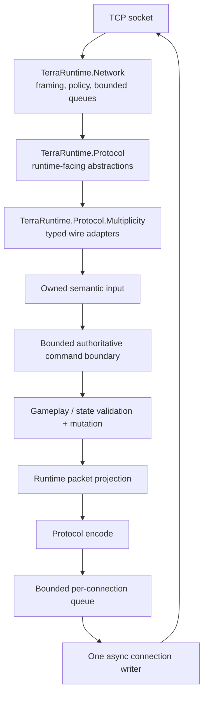
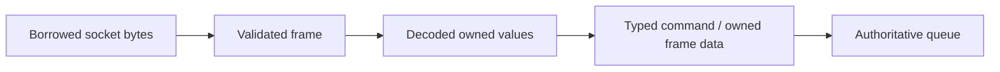
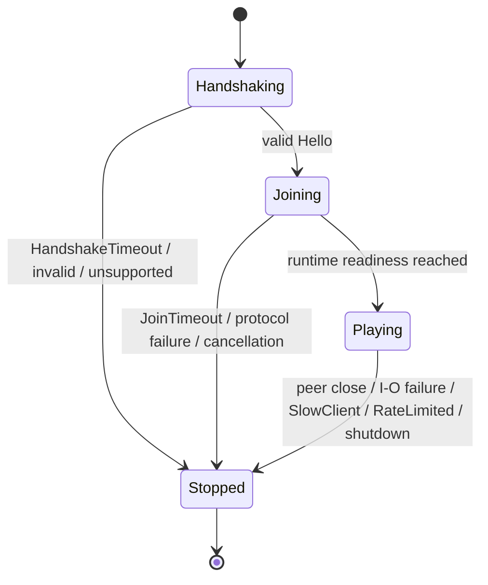
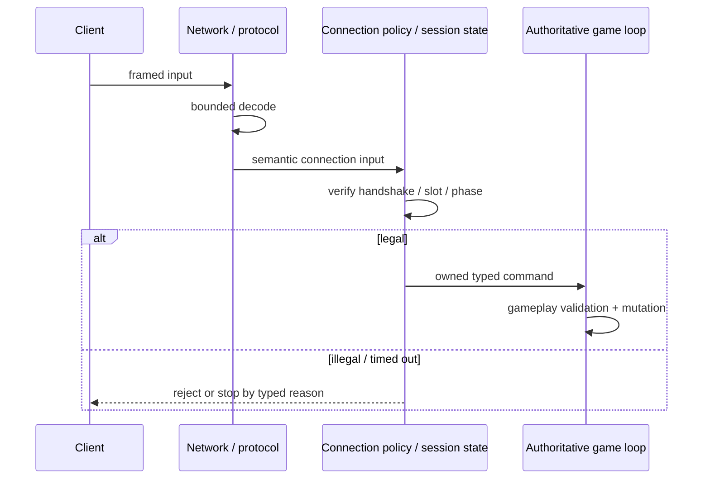
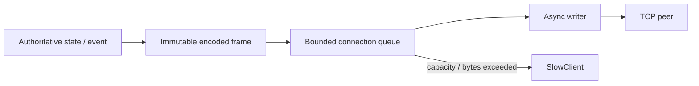
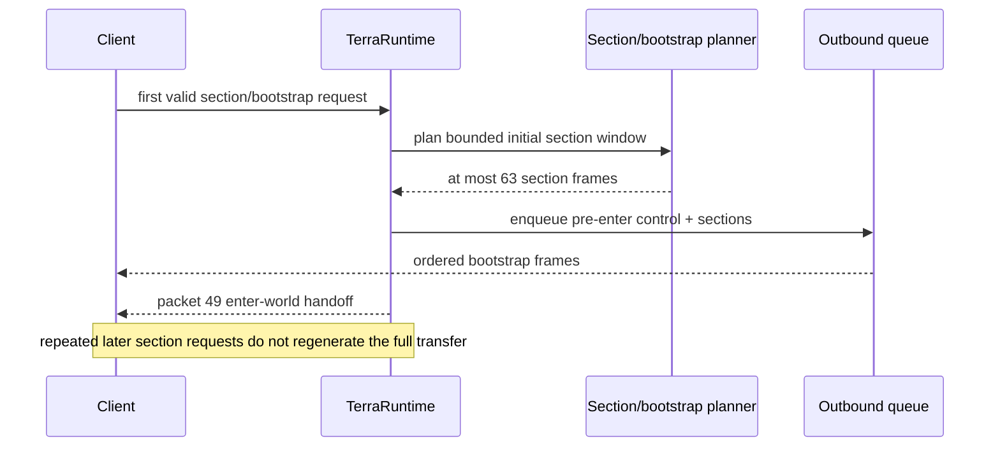
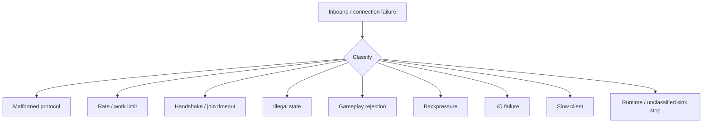

# Networking and protocol

[Русский](../ru/networking-protocol.md) · [Documentation](README.md) · [Architecture](architecture.md) · [Roadmap](../roadmap.md)

## 1. Scope

This guide describes the networking and Terraria protocol path that exists in TerraRuntime today. The protocol baseline is Terraria `1.4.5.8`, protocol `326`, with Multiplicity 3.0.x behind the TerraRuntime protocol boundary.

Official TerrariaServer 1.4.5.8 behavior and independent real-client traffic remain the final reference when implementation and self-round-trip evidence disagree.

## 2. Layer map



Packet decoding does not own gameplay policy. Socket callbacks do not own gameplay state.

## 3. Framing

Terraria frames use the literal envelope:

```text
[u16 total frame length][u8 message id][payload...]
```

The network layer handles split frames, multiple frames in one read, invalid lengths, oversized messages under explicit ceilings, and truncated input. Client-declared sizes are untrusted and must not select unbounded allocations.

## 4. Receive-buffer ownership



Transient `Span<T>`, `ReadOnlySequence<T>` and pooled-buffer data must not escape into authoritative state after the receive pipeline advances.

## 5. Connection policy

The current default connection policy uses:

- handshake deadline `$10\,\mathrm{s}$`;
- post-`Hello` join deadline `$2\,\mathrm{min}$` until readiness reaches `Playing`;
- no normal post-join idle timeout (`Timeout.InfiniteTimeSpan`);
- `HardAbuse` connection-wide and configured per-message rate limits.

The `$2\,\mathrm{min}$` join deadline is an abuse ceiling, not a vanilla gameplay timing rule. It prevents a peer from completing cheap protocol `Hello` and retaining an admitted player slot indefinitely.



A successful handshake records completion and wakes the watchdog. Production exposes a narrow `ITerrariaConnectionReadinessSource` to network policy rather than leaking gameplay objects into the network layer. Terminal stop state is monotonic.

## 6. Stop and rejection categories

`TerrariaConnectionStopReason` distinguishes `PeerClosed`, `ApplicationStopped`, `Cancelled`, `HandshakeTimeout`, `JoinTimeout`, `IdleTimeout`, `InvalidHandshake`, `UnsupportedProtocol`, `ProtocolFailure`, `InboundIoFailure`, `OutboundFailure`, `SlowClient`, `RateLimited` and `FrameRejected`.

`FrameRejected` is the connection-lifetime outcome when a downstream protocol/gameplay sink deliberately stops on a classified frame rejection. `ApplicationStopped` is retained for an unclassified/intentional inner-sink stop and is no longer used as the generic label for malformed, invalid-state, gameplay or backpressure rejection.

Frame-rejection telemetry remains a separate diagnostic dimension and normalizes malformed protocol, rate-limited, invalid-state, gameplay-rejected and backpressure failures. The lifetime reason answers why the connection ended; the rejection category answers what class of frame was rejected. These dimensions must not be flattened into one generic network error.

The production sink chain propagates rejection category through sign, chest, projectile/tile, world-item and vitals/bootstrap layers. Bootstrap failures such as malformed join/player packets, illegal join state, player-slot mismatch and ingress/outbound backpressure therefore remain visible even though `PlayerVitalsFrameSink` is the first rejection-source wrapper around the bootstrap layer.

## 7. Handshake and state legality



Connection-owned identity wins over client-claimed identity wherever ownership is already known. Illegal pre-handshake/pre-spawn operations do not reach runtime stores.

## 8. Multiplicity boundary

Multiplicity is a protocol dependency, not a gameplay dependency. `TerraRuntime.Protocol.Multiplicity` translates wire models into TerraRuntime-owned protocol/domain representations and back.

Critical layouts require independent evidence such as golden bytes, official traffic or differential probes. A successful encode/decode round trip proves only that our two sides agree.

## 9. Inbound and fan-out rate accounting

Rate accounting occurs before expensive gameplay work. Some legal input performs shared fan-out outside the authoritative command loop, so it needs a server-global budget before multiplication.

Public vanilla `Say` chat currently has a server-global ceiling of

$$
R_{\mathrm{chat}}=256\ \text{broadcasts}/\mathrm{s}.
$$

The budget is checked before the $O(P)$ recipient iteration, where $P$ is playing connections. Over-budget broadcasts are dropped and counted as rate-limited rejection rather than granting every sender an independent global allowance.

This is deliberately loose hard-abuse protection, not a normal chat cadence.

## 10. Authoritative command queue

The command loop has bounded global capacity, per-tick operation limits, per-source processing quotas and per-source pending/reservation ceilings. One connection cannot monopolize a tick or reserve the full shared mailbox merely by submitting faster than the loop drains.

See [Performance and tick scheduling](performance-runtime.md) for quantitative loop budgets.

## 11. Outbound queues and structural sizing



Production frame capacity is derived by `ConnectionOutboundQueueSizing`, not a magic fixed `$4\,096$` ceiling.

Let $P$ be configured player capacity. Current verified components are:

$$
F_{\mathrm{join}}=69,
\qquad
F_{\mathrm{entities}}=1\,257,
\qquad
F_{\mathrm{peer}}=393.
$$

Thus

$$
F_{\mathrm{queue}}(P)
=F_{\mathrm{join}}+F_{\mathrm{entities}}+(P-1)F_{\mathrm{peer}}
=933+393P.
$$

For default $P=8$:

$$
F_{\mathrm{queue}}(8)=4\,077\ \text{frames}.
$$

The byte envelope scales from the deployed default `$16\,\mathrm{MiB}$` baseline:

$$
B_{\mathrm{queue}}(P)
=\max\!\left(
B_{\mathrm{max\ frame}},
\left\lceil16\,\mathrm{MiB}\cdot\frac{F_{\mathrm{queue}}(P)}{4\,077}\right\rceil
\right).
$$

This is a structural correctness bound. Measurement-derived final queue sizing remains active work. Queue high-water telemetry is retained across disconnects so real workloads can justify future tightening.

## 12. Join and bootstrap traffic

The pre-`packet 49` live contract was tightened substantially. Runtime entity/global baselines are now deliberately outside the final packet-10-to-packet-49 handoff.

Current `PlayerBootstrapFrameBudget` proves:

$$
F_{\mathrm{sections,max}}=63,
\qquad
F_{\mathrm{pre49,max}}=65,
\qquad
F_{\mathrm{probe}}=96.
$$

For default $P=8$:

$$
65 < 96 < 4\,077.
$$



The section-heavy path is state-gated. Once the session advances to `AwaitingSpawn`/`Playing`, repeated section requests do not regenerate and enqueue the complete initial transfer.

The separate `$2\,\mathrm{min}$` join deadline bounds peers that finish `Hello` but never become ready.

## 13. Interest management

Interest management belongs to synchronization, not packet parsing. External hosts receive only `IInterestManagementControl`; spatial layout, hysteresis, enter/leave behavior and forced resync remain runtime-owned.

Until visibility transitions are fully proven, suppression fails open to broad vanilla-like routing.

## 14. Threading rules

Allowed off-thread work includes socket I/O, framing, bounded protocol decode/encode, immutable frame construction, connection-local accounting and bounded transport-only fan-out with an explicit server-global ceiling.

Direct mutation of player/world/NPC/projectile/item stores remains authoritative-thread work. Transient receive-buffer references must never be retained in gameplay state.

## 15. Failure isolation



Malformed/abusive traffic should remain connection-local. Classified downstream frame rejection ends as `FrameRejected` while preserving its granular rejection category. Shared non-authoritative work such as chat fan-out may drop only the over-budget operation instead of disconnecting unrelated peers.

## 16. Tests and executable evidence

Evidence includes framing/socket tests, handshake/join/idle watchdog tests, connection and fan-out rate tests, rejection-stop normalization and production bootstrap-propagation tests, Multiplicity decoder/mapper tests, deterministic malformed framing/typed-decoder fuzz tests, real-process slow-client tests, `Vanilla World Load` live join/movement probes and official-server reference workflows.

A regression test must fail when the guarded fix is removed.

## 17. Current limitations

Still incomplete are broader protocol/world fuzz corpora beyond the current deterministic floor, complete global/per-subsystem expensive-work budgets, measurement-derived final queue sizing, complete per-message byte/count telemetry, full section-aware suppression/resync semantics, broad real-client replay and full gameplay coverage behind every valid packet type.

## 18. Change checklist

A networking/protocol change is incomplete unless, where relevant:

- malformed and valid framing/decoder behavior is tested;
- connection-state legality and deadlines are tested;
- rate/queue/fan-out work is bounded;
- rejection lifetime reason and granular rejection category remain distinguishable;
- NativeAOT paths remain valid;
- wire-sensitive claims have independent evidence;
- diagrams use Mermaid rather than pseudographics;
- dimensional quantities/formulas use LaTeX with units;
- this page and `docs/ru/networking-protocol.md` change together.
