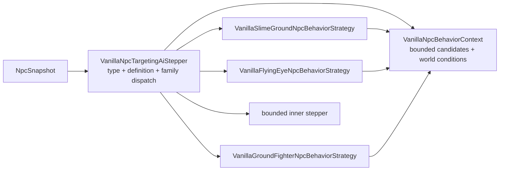

# NPC behavior-family dispatch

[Русский](../ru/npc-behavior-families.md) · [Gameplay](gameplay.md) · [Gameplay decomposition roadmap](../roadmap/gameplay-decomposition-and-catalogs.md)

## Purpose

TerraRuntime keeps two different NPC concepts separate:

- `NpcAiStyleId` is a source-backed Terraria 1.4.5.8 fact stored in the vanilla definition;
- `VanillaNpcBehaviorFamily` is a runtime-owned opt-in to an implementation strategy that has actually been verified for that definition.

They are deliberately not interchangeable. Terraria contains many NPCs that share an `aiStyle` while still having type-specific branches, parameters or lifecycle rules. Automatically routing every future NPC with `aiStyle = 3` through the current Zombie implementation would turn a useful source fact into an unsafe assumption.

## Current verified mapping

| NPC | source `AiStyle` | runtime behavior family |
| --- | --- | --- |
| Blue Slime | `Slime` | `SlimeGround` |
| Demon Eye | `DemonEye` | `FlyingEye` |
| Zombie | `Fighter` | `GroundFighter` |
| Eye of Cthulhu | `EyeOfCthulhu` | `EyeOfCthulhu` |
| Servant of Cthulhu | `Flyer` | `Flyer` |
| Skeleton | `Fighter` | `GroundFighter` |
| King Slime | `KingSlime` | `KingSlime` |

Only entries already present in the version-pinned `VanillaNpcDefinitionCatalog` receive a family. Adding another vanilla definition requires an explicit behavior-family decision; sharing an aiStyle alone is not sufficient evidence.

## Ownership after decomposition

The public compatibility facade no longer contains the family implementations.



Ownership is intentionally narrow:

- `VanillaNpcTargetingAiStepper` resolves `NpcTypeId`, looks up one `VanillaNpcDefinition`, selects the explicit family and preserves the existing fallback contract;
- `VanillaNpcBehaviorContext` owns the fixed-size target-candidate scratch buffer, target geometry helpers, live player velocity enrichment, world-surface conversion and current day/slime-rain facts;
- `VanillaSlimeGroundNpcBehaviorStrategy` owns Slime-family engagement/targeting input and the verified `VanillaBlueSlimeMotion` transition;
- `VanillaFlyingEyeNpcBehaviorStrategy` owns FlyingEye target refresh before the independently implemented eye AI receives the state;
- `VanillaGroundFighterNpcBehaviorStrategy` owns Fighter-family target prepass, overlap semantics, day/surface pursuit policy and the verified `VanillaZombieMotion` compatibility transition. `VanillaGroundFighterBehaviorCatalog` retains admitted type-specific parameters such as Skeleton's `1.5f` base speed.

The facade keeps `EnableBlueSlimeMotion`, `EnableZombieMotion`, `SetWorldConditions` and `SetCandidates` so runtime composition and existing callers do not need a simultaneous API migration. Those methods now configure the context rather than accumulating behavior inside the dispatcher.

## Dispatch invariants

Each concrete strategy still checks the expected source-backed `AiStyle`. `BehaviorFamily` chooses the implementation, while `AiStyle` proves that the selected definition still satisfies the source invariant used to verify that implementation.

A family that is not enabled falls through to the bounded inner stepper exactly as before. A valid NPC type that is not present in the definition catalog also falls through rather than inheriting behavior from a numerically similar type or aiStyle.

The separation remains:

```text
Terraria fact             TerraRuntime implementation decision
AiStyle = Fighter   !=    BehaviorFamily = GroundFighter
```

## Eye of Cthulhu difficulty boundary

`VanillaEyeOfCthulhuMotion` consumes the live Expert-mode world condition for the source-backed deterministic parts of `AI_004` verified against TerrariaServer `1.4.5.8`. Phase one includes the Expert hover speed/acceleration, the $210\,\text{tick}$ hover window, the $44\,\text{tick}$ Servant cadence at any vertical offset, $6\,\text{pixels/tick}$ Servant launches, $7\,\text{pixels/tick}$ direct dashes, the sequential `0.98f` and `0.985f` slowdown, the $100\,\text{tick}$ dash window and the transition below $65\%$ life.

Expert transformation is also authoritative. The two $100\,\text{tick}$ transformation stages advance the source spin/timer state and apply the `0.98f` velocity decay. Every twentieth transformation tick produces a post-commit Servant intent from the exact two `Main.rand.Next(-200, 200)` direction rolls, normalized to $5\,\text{pixels/tick}$ and advanced ten ticks from the Eye center before spawning. The tick-100 spawn is preserved before the transformation stage changes, matching source call order.

The deterministic Expert phase-two slice includes the source distance bands above $400/600/800\,\text{pixels}$, later direct-dash speed multipliers `1.15f` and `1.30f`, the Expert slowdown/duration boundaries of $50$ and $90$ ticks, and low-life state `ai[1] = 5` movement toward the point $600\,\text{pixels}$ below the target.

`VanillaEyeOfCthulhuExpertRapidDashNpcBehaviorStrategy` owns the remaining non-Good-World Expert rapid-dash boundary. It preserves source RNG order for the `Main.rand.Next(1, 4)` seed after the third ordinary phase-two dash, the `Main.rand.Next(-3, 1)` low-life seed, the predictive `ai[1] = 3` launch using live player velocity, both ±10% direction perturbation layers, velocity jitter, critical-life vector rotation/renormalization and the `ai[1] = 4` $20/10 + 13\,\text{tick}$ cadence. Runtime target candidates are enriched from the authoritative player-slot snapshot lookup before boss AI reads them, so prediction uses the same live motion state rather than a fabricated zero velocity.

These are bounded capabilities (`BossExpertPhaseOneSlice`, `BossExpertTransformationSlice`, `BossExpertPhaseTwoDeterministicSlice` and `BossExpertRapidDashSlice`), not a full difficulty claim. The live phase-two combat projection now commits source `NPC.damage`/`NPC.defense` values for Classic, Expert and Master, including the `<12%` and `<4%` bands. Good World transformation state drives an authoritative projectile/NPC reflection short-circuit after projectile movement: admitted aiStyle 1/2 player projectiles preserve `oldVelocity` speed, quarter current damage, become one-shot reflected state with penetrate `1`, and keep their original owner. Sound, dust, gore and other presentation-only effects remain outside the server gameplay claim.

## GroundFighter door and tall-gate interactions

The admitted `GroundFighter` slice now carries the full source-backed door-pressure path:

- `VanillaWorldZombieDoorContact` accumulates per-contact `ai[1]` pressure (5 per door, 2 per tall-gate, plus type-specific bonuses) and emits a typed `VanillaGroundFighterDoorOpeningIntent` at the vanilla 10-point threshold;
- `VanillaWorldGroundFighterDoorOpeningService` executes the exact `WorldGen.OpenDoor` / `ShiftTallGate` mutations (locked-door rejection, `1x3 -> 2x3` frame/style transform, paint/coating transfer, `tileCut` clearance, `388 -> 389` type shift);
- `VanillaWorldUnbreakableWallScan` replicates `UnbreakableWallScan.InsideUnbreakableWalls` (8 directions ×250 tiles, wall 350, color ≥16) and feeds `TargetInsideUnbreakableWalls` into the pressure policy for the `+6` bonus;
- `RuntimeTallGateOccupancyProbe` implements `Collision.EmptyTile(ignoreTiles:true)` by testing live player (`20×42`) and NPC (live hitbox) rectangles against each gate tile, now wired in `ServerRuntimeState` through `RuntimeGroundFighterDoorOpeningSink` with packet-19 replication.

Normal doors open without an occupancy probe; tall-gates fail closed when any of the five gate tiles is occupied and succeed only when all five are free, matching vanilla `ShiftTallGate` semantics. The `GetGoodWorld` seed flag and `insideUnbreakableWalls` target state are now projected from live world state rather than defaulting to `false`.

## Why the roadmap AI-decomposition item is complete

The D4 `AI family/behavior decomposition` item tracks ownership and dispatch architecture, not exhaustive support for every Terraria NPC. For the authoritative vanilla NPC slice currently admitted by `VanillaNpcDefinitionCatalog`, family selection, shared context and family behavior are now separate units with executable coverage. Adding future NPC definitions extends this architecture instead of reopening a monolithic dispatcher.

All D4 checkboxes describe decomposition/ownership for admitted slices. They do not claim exhaustive NPC support. `VanillaNpcAiCoverageCatalog` keeps every current `FullVanillaAiParity` claim false, and the remaining roster is tracked in the [NPC/AI parity roadmap](../roadmap/npc-ai-parity.md).

## Verification

`VanillaNpcBehaviorFamilyDispatchTests` pins the fail-closed dispatch contract: disabled families fall back, unknown catalog types do not inherit a behavior, and FlyingEye target refresh occurs in the family strategy before delegation. `VanillaEyeOfCthulhuExpertRapidDashTests` pins source RNG consumption, live-player-velocity prediction, low-life seeding and rapid-state cadence. `VanillaNpcAiCoverageCatalogTests` prevents those slices from being mislabeled as full parity.

## AI_002 lifecycle world state

AI_002 now keeps its non-cosmetic lifecycle rules outside packet/state guessing. Daylight discouragement is source-shaped: only the pinned fleeing identities, during daytime, at or above `worldSurface`, and only when the current target is not in a functional Graveyard. The branch clamps `timeLeft` to 10, forces upward intent, and deliberately skips `TargetClosest` for that tick.

Pigrons now preserve the source `ai[0]/ai[1]` phase machine. Missing line of sight increments `ai[0]`; tick 300 enters no-tile-collision mode. Restored LOS only exits phasing after `Collision.SolidCollision` is false. Production facts come from `VanillaWorldCanHit`, `VanillaWorldSolidCollision`, and `VanillaWorldGraveyardScene`. Cosmetic alpha, rotation, dust and sound remain outside the authoritative state claim.

### AI_005 projectile side-effect boundary

Ordinary Probe and Blood Squid attacks now keep their source-backed `localAI[0]` cadence in the NPC simulation revision and stage projectile creation through `INpcAiProjectileIntentPlanner`. The executor allocates projectile slots only after the exact source NPC generation commits, so a stale or rejected AI transition cannot emit a ghost laser/blood shot. Production LOS uses the same source-backed tile `Collision.CanHit` adapter as other NPC world queries, and the global firing gate pins TerrariaServer 1.4.5.8 `Main.MaxWorldViewSize` at 1920x1200 with the source 50-pixel inset. Hornet stingers and the Good World Eater child remain deliberately outside this claim until their missing authoritative player state / NPC 666 definition is admitted.
