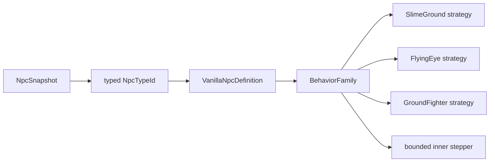

# NPC behavior-family dispatch

[Русский](../ru/npc-behavior-families.md) · [Gameplay](gameplay.md) · [Gameplay decomposition roadmap](../roadmap/gameplay-decomposition-and-catalogs.md)

## Purpose

TerraRuntime keeps two different NPC concepts separate:

- `NpcAiStyleId` is a source-backed Terraria 1.4.5.8 fact stored in the vanilla definition;
- `VanillaNpcBehaviorFamily` is a runtime-owned opt-in to an implementation strategy that has actually been verified for that definition.

They are deliberately not interchangeable. Terraria contains many NPCs that share an `aiStyle` while still having type-specific branches, parameters or lifecycle rules. Automatically routing every future NPC with `aiStyle = 3` through the current Zombie implementation would therefore turn a useful source fact into an unsafe assumption.

## Current verified mapping

| NPC | source `AiStyle` | runtime behavior family |
| --- | --- | --- |
| Blue Slime | `Slime` | `SlimeGround` |
| Demon Eye | `DemonEye` | `FlyingEye` |
| Zombie | `Fighter` | `GroundFighter` |

Only entries already present in the version-pinned `VanillaNpcDefinitionCatalog` receive a family. Adding another vanilla definition requires an explicit behavior-family decision; sharing an aiStyle alone is not sufficient evidence.

## Dispatch path



`VanillaNpcTargetingAiStepper` now resolves the definition once and dispatches by `BehaviorFamily`. The orchestration path no longer asks whether the NPC is specifically Blue Slime, Demon Eye or Zombie before selecting the strategy. The specialized strategy still checks the expected source `AiStyle` as an invariant.

Definition metadata is also reused for dimensions during targeting/overlap calculations, removing repeated catalog lookups inside the same step.

## Why this is safer than dispatching by aiStyle

Suppose a later verified NPC definition also reports the `Fighter` aiStyle. That new entry is not automatically assigned `GroundFighter`. Until its type-specific vanilla branches are checked, its runtime family can remain `None` or another explicit strategy can be introduced. This fails closed instead of silently producing plausible-looking but wrong AI.

The separation is:

```text
Terraria fact             TerraRuntime implementation decision
AiStyle = Fighter   !=    BehaviorFamily = GroundFighter
```

The current Zombie definition explicitly has both because that path has already been implemented and exercised.

## Scope and remaining work

This change decomposes strategy selection for the currently supported NPC catalog. It does not claim that all vanilla style-1/style-2/style-3 NPCs share these exact implementations, and it does not close the broader roadmap items for full NPC AI-family coverage, bosses, town NPCs, loot or removal of every remaining type-specific branch inside verified behavior implementations.

Future NPC expansion should add source defaults first, inspect type-specific official-server behavior, then opt into an existing family only when that reuse is actually valid.

## Verification

Catalog tests pin the explicit behavior-family assignment for Blue Slime, Demon Eye and Zombie while retaining the independent aiStyle assertions. Existing NPC targeting/motion tests continue to exercise the three runtime paths through `VanillaNpcTargetingAiStepper`, and the gameplay CI builds and runs all `Npc`/`Projectile` tests as one non-cancelling acceptance slice.
