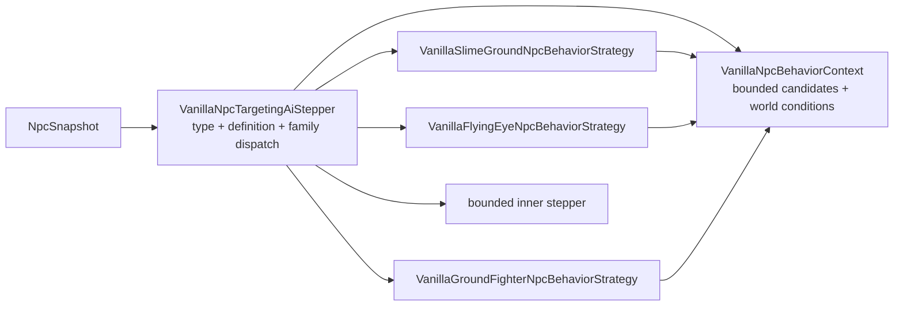

# NPC behavior-family dispatch

[Русский](../ru/npc-behavior-families.md) · [Gameplay](gameplay.md) · [Gameplay decomposition roadmap](../roadmap/gameplay-decomposition-and-catalogs.md)

## Purpose

TerraRuntime keeps two different NPC concepts separate:

- `NpcAiStyleId` is a source-backed Terraria 1.4.5.8 fact stored in the vanilla definition;
- `VanillaNpcBehaviorFamily` is a runtime-owned opt-in to an implementation strategy that has actually been verified for that definition.

They are deliberately not interchangeable. Terraria contains many NPCs that share an `aiStyle` while still having type-specific branches, parameters or lifecycle rules. Automatically routing every future NPC with `aiStyle = 3` through the current Zombie implementation would turn a useful source fact into an unsafe assumption.

## Current verified mapping

| NPC | source `AiStyle` | runtime behavior family |
| --- | --- | --- |
| Blue Slime | `Slime` | `SlimeGround` |
| Demon Eye | `DemonEye` | `FlyingEye` |
| Zombie | `Fighter` | `GroundFighter` |

Only entries already present in the version-pinned `VanillaNpcDefinitionCatalog` receive a family. Adding another vanilla definition requires an explicit behavior-family decision; sharing an aiStyle alone is not sufficient evidence.

## Ownership after decomposition

The public compatibility facade no longer contains the family implementations.



Ownership is intentionally narrow:

- `VanillaNpcTargetingAiStepper` resolves `NpcTypeId`, looks up one `VanillaNpcDefinition`, selects the explicit family and preserves the existing fallback contract;
- `VanillaNpcBehaviorContext` owns the fixed-size target-candidate scratch buffer, target geometry helpers, world-surface conversion and current day/slime-rain facts;
- `VanillaSlimeGroundNpcBehaviorStrategy` owns Slime-family engagement/targeting input and the verified `VanillaBlueSlimeMotion` transition;
- `VanillaFlyingEyeNpcBehaviorStrategy` owns FlyingEye target refresh before the independently implemented eye AI receives the state;
- `VanillaGroundFighterNpcBehaviorStrategy` owns Fighter-family target prepass, overlap semantics, day/surface pursuit policy and the verified `VanillaZombieMotion` transition.

The facade keeps `EnableBlueSlimeMotion`, `EnableZombieMotion`, `SetWorldConditions` and `SetCandidates` so runtime composition and existing callers do not need a simultaneous API migration. Those methods now configure the context rather than accumulating behavior inside the dispatcher.

## Dispatch invariants

Each concrete strategy still checks the expected source-backed `AiStyle`. `BehaviorFamily` chooses the implementation, while `AiStyle` proves that the selected definition still satisfies the source invariant used to verify that implementation.

A family that is not enabled falls through to the bounded inner stepper exactly as before. A valid NPC type that is not present in the definition catalog also falls through rather than inheriting behavior from a numerically similar type or aiStyle.

The separation remains:

```text
Terraria fact             TerraRuntime implementation decision
AiStyle = Fighter   !=    BehaviorFamily = GroundFighter
```

## Why the roadmap AI-decomposition item is complete

The D4 `AI family/behavior decomposition` item tracks ownership and dispatch architecture, not exhaustive support for every Terraria NPC. For the authoritative vanilla NPC slice currently admitted by `VanillaNpcDefinitionCatalog`, family selection, shared context and family behavior are now separate units with executable coverage. Adding future NPC definitions extends this architecture instead of reopening a monolithic dispatcher.

This does **not** close the other D4 items:

- spawn / physics / combat / loot separation;
- boss / town behavior boundaries;
- removal of all remaining raw NPC IDs and AI-style numbers.

Those remain independent work and therefore remain unchecked in the roadmap.

## Verification

`VanillaNpcBehaviorFamilyDispatchTests` pins the fail-closed dispatch contract: disabled families fall back, unknown catalog types do not inherit a behavior, and FlyingEye target refresh occurs in the family strategy before delegation. Existing Blue Slime, Demon Eye and Zombie targeting/motion tests continue to exercise the same public `VanillaNpcTargetingAiStepper` facade, so the decomposition preserves externally observable state transitions while changing ownership underneath it.
