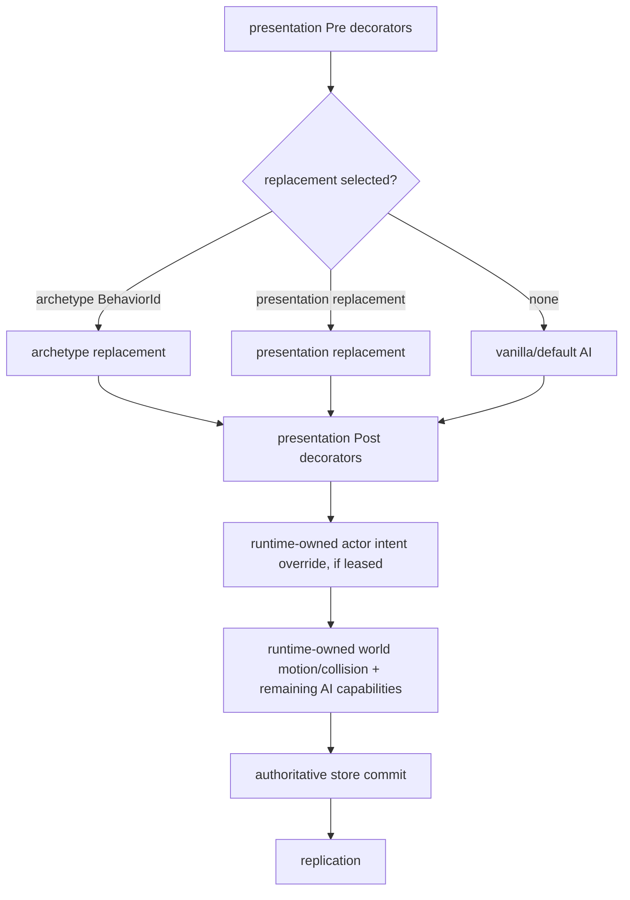

# Runtime NPC behavior boundary

TerraRuntime exposes a trusted-host NPC behavior boundary without transferring simulation ownership to the host. The runtime remains the only authority that owns NPC lifecycle, generation identity, client-visible presentation, state validation, authoritative ticking, world motion/collision, combat and replication.

This document describes the TerraRuntime boundary only. Host-framework adapters, plugin discovery, permissions and Vega-specific APIs are intentionally outside this layer.

## Identity, presentation and behavior are separate

A server-defined NPC uses three independent identities:

- `GameplayArchetypeId` is the stable runtime/host identity of the custom archetype.
- `NpcArchetypeDescriptor.VanillaPresentationType` is the vanilla NPC type sent to an unmodified Terraria client.
- `NpcArchetypeDescriptor.BehaviorId` selects the runtime behavior registered for that archetype.

For example, `example:resident-zombie` may use `VanillaNpcIds.Zombie` as its presentation while selecting `example:resident-ai` as its behavior. The official client still renders a normal Zombie. TerraRuntime keeps the custom archetype identity separately and dispatches the registered behavior for the exact live NPC generation.

Behavior code cannot change `Type` or `NetId`. `NpcBehaviorState` deliberately contains only mutable simulation state such as position, velocity, target, `ai[]` and `NpcSimulationState`. TerraRuntime copies the current authoritative `Type` and `NetId` into the internal state transition after the callback returns.

## Registration surface

`INpcActorOperations` exposes two behavior registration lanes.

`RegisterBehaviorAsync(GameplayExtensionId, INpcBehaviorProvider, ...)` registers an archetype-addressed exclusive replacement. A custom `NpcArchetypeDescriptor` selects it through `BehaviorId`. Multiple custom archetypes can share the same vanilla presentation type while using different behavior IDs.

`RegisterPresentationBehaviorAsync(GameplayExtensionId, NpcTypeId, NpcBehaviorStage, int order, INpcBehaviorProvider, ...)` registers behavior against a vanilla presentation type. The supported stages are:

1. `Pre`, ordered decorators before the replacement/default behavior.
2. `Replacement`, the single type-level replacement when no archetype-specific replacement is selected.
3. `Post`, ordered decorators after the replacement/default behavior.

Archetype-specific replacement has priority over the type-level replacement. Type-level pre/post decorators still surround the selected replacement.

Registration is serialized through the authoritative runtime command queue. A successful result means the registration was accepted and staged; the immutable dispatch snapshot becomes visible at the next authoritative safe boundary. Disposing `INpcBehaviorRegistration` stages retirement, which is likewise published only at a safe boundary.

## Behavior callback

`INpcBehaviorProvider.TryStep` is synchronous and executes on the authoritative runtime thread. It receives a stack-only `NpcBehaviorContext` containing:

- the stable behavior ID;
- the custom archetype ID when the exact live generation belongs to a registered archetype;
- the current immutable `NpcSnapshot`;
- current authoritative tick number;
- generation-safe player and NPC snapshot queries;
- bounded NPC enumeration into caller-provided `Span<NpcSnapshot>`;
- solid-collision and line-of-sight world queries.

The callback proposes an `NpcBehaviorState`. TerraRuntime remains responsible for committing or rejecting that proposal and for all later authoritative simulation stages.

Callbacks must not block, sleep, perform I/O, wait on tasks or start a second simulation owner. The boundary does not expose mutable NPC arrays, tile storage, packet queues or arbitrary packet sending.

## Authoritative pipeline

For an uncontrolled NPC, the runtime behavior portion of the tick is conceptually:



The behavior dispatcher is part of the production `NpcAuthority` AI chain driven by `ServerRuntimeState`. It is not a test-only registry. `INpcAiStateStepperWrapper` composition is preserved so nested vanilla capabilities such as targeting, spawn planners, projectile planners and post-commit hooks remain discoverable through the wrapper chain.

## Bounded world queries

`NpcBehaviorContext` deliberately exposes semantic queries rather than raw world data:

- `TryGetPlayer(PlayerHandle, ...)`
- `TryGetPlayer(PlayerSlotId, ...)`
- `TryGetNpc(NpcHandle, ...)`
- `CopyNpcs(Span<NpcSnapshot>)`
- `HasSolidCollision(NpcBehaviorBounds)`
- `HasLineOfSight(NpcBehaviorBounds, NpcBehaviorBounds)`

Player and NPC identities are generation-safe where a generation-bearing handle is used. Collision and line-of-sight delegate to TerraRuntime's version-pinned world collision primitives.

This slice does not expose arbitrary child-NPC or projectile spawning from a behavior callback. Those operations require separately bounded runtime-owned request APIs rather than leaking stores or packet access into the callback.

## Lifecycle and unload

Behavior registrations are leases. The extensible host scope tracks them together with custom actor and archetype leases. Scope retirement performs cleanup in this order:

1. release actor controllers;
2. despawn actors owned by the scope;
3. retire behavior registrations;
4. retire archetype registrations.

The registry publishes immutable snapshots only at safe boundaries, so callbacks are never removed by mutating a dispatch table while the authoritative tick is enumerating it. After retirement is committed, the published snapshot no longer retains the provider callback.

## Example: resident-like Zombie

A host can register a behavior ID, then register an archetype that presents as a vanilla Zombie and references that behavior:

```csharp
var behaviorId = new GameplayExtensionId("example:resident-ai");
var archetypeId = new GameplayArchetypeId("example:resident-zombie");

NpcBehaviorRegistrationResult behavior = await runtime.NpcActors.RegisterBehaviorAsync(
    behaviorId,
    new ResidentZombieBehavior());

runtime.NpcActors.TryRegisterArchetype(
    new NpcArchetypeDescriptor(
        archetypeId,
        VanillaNpcIds.Zombie,
        behaviorId),
    out INpcArchetypeRegistration? archetype);

NpcActorSpawnResult spawned = await runtime.NpcActors.SpawnAsync(
    new NpcActorSpawnRequest(archetypeId, 100f, 200f));
```

This is an AI/runtime customization boundary, not automatic Town NPC membership. Housing, happiness, pylons, shops, arrival rules and other Town NPC systems remain explicit gameplay subsystems and are not inferred from a custom NPC's presentation or behavior.
