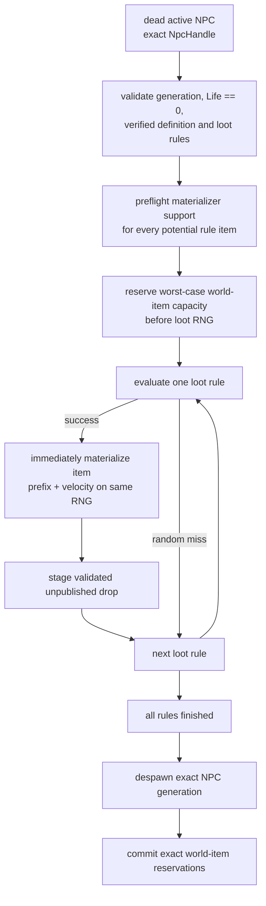

# NPC death, loot and world-item finalization

TerraRuntime keeps damage, death detection, loot evaluation, world-item materialization and replication as separate authoritative boundaries. The current Blue Slime slice can now complete a server-owned death into real world-item state without fabricating a client `ConnectionHandle`.

## Production flow

The critical detail is that loot is **streamed**, not collected and materialized later.

## Why streaming is required

The pinned TerrariaServer 1.4.5.8 source proves that `NPC.NPCLoot_DropItems` constructs

`DropAttemptInfo { rng = Main.rand }`.

`CommonDrop.TryDroppingItem` performs the luck check, consumes `info.rng.Next(...)` for stack size, and immediately calls `CommonCode.DropItemFromNPC`. That path calls `Item.NewItem`, whose natural-prefix and default-velocity behavior also consumes `Main.rand` before the next loot rule is executed.

Therefore the required ordering is

$$
R_i^{loot}\;\rightarrow\;R_i^{stack}\;\rightarrow\;R_i^{prefix}\;\rightarrow\;R_i^{velocity}\;\rightarrow\;R_{i+1}^{loot}.
$$

Buffering every `NpcLootDrop` first and spawning later would produce the right marginal probabilities but the wrong deterministic random stream. The transaction now evaluates one rule through `VanillaNpcLootEvaluator.TryEvaluateRule`, immediately materializes a successful result, then advances to the next rule.

## Generation safety and capacity

NPC identity is

$$
H_{npc}=(slot,generation).
$$

Initial lookup and final despawn both use the exact handle. A stale generation cannot finalize a replacement NPC occupying the same slot, and a second call after success fails before RNG is touched.

`RuntimeWorldItemStore` reservations are unpublished and generation-safe. The transaction reserves the maximum number of item slots represented by the imported rule sequence before consuming loot RNG. For Blue Slime this is two slots, Gel and Slime Staff. If capacity is insufficient, the dead NPC remains present and no luck/random call is consumed.

This conservative capacity preflight intentionally differs from Terraria's opportunistic slot selection under extreme item-capacity pressure: TerraRuntime may defer a death when only one slot is free even though one of two probabilistic rules might miss. The tradeoff prevents retry-driven RNG drift and partial loot commits while the broader loot transaction model is still being expanded.

## Concrete Blue Slime materializer

`VanillaNpcLootWorldItemMaterializer` currently supports the two source-backed Blue Slime items:

| Item | Size | Gravity | Natural prefix |
|---|---:|---|---|
| Gel (`23`) | `10×12` | ordinary | none |
| Slime Staff (`1309`) | `26×28` | ordinary | summon family |

Ordinary NPC loot uses the integer NPC center

$$
x_c=\lfloor x_{npc}\rfloor+\left\lfloor\frac{w_{npc}}2\right\rfloor,
\qquad
y_c=\lfloor y_{npc}\rfloor+\left\lfloor\frac{h_{npc}}2\right\rfloor.
$$

The materialized world-item top-left is the center minus half the verified item dimensions. Neither supported item is in `ItemID.Sets.ItemNoGravity`, so default velocity is

$$
v_x=0.1R_x,\quad R_x\in[-30,30],
$$

$$
v_y=0.1R_y,\quad R_y\in[-40,-16].
$$

## Natural Slime Staff prefixes

`VanillaItemPrefixCatalog` pins the exact 22-entry summon family from the official server. `Prefix(-1)` is reproduced in source order:

1. `Next(4) == 0` yields prefix `0`;
2. otherwise one summon prefix is selected uniformly;
3. prefixes in `ReducedNaturalChance` survive only when `Next(3) == 0`, otherwise the result becomes prefix `0`;
4. item-specific prefix validity is checked; an invalid selected prefix restarts the natural-prefix loop.

For Slime Staff, the source-backed stat-rounding guards reject prefix IDs `55`, `89` and `91`. Their damage multipliers round the staff's base damage of `8` back to `8`, which vanilla treats as an ineffective modifier and rerolls.

The materializer performs prefix selection before velocity RNG, matching `Item.NewItem` ordering.

## Source contract

`NPC Loot Source Contract` downloads the official TerrariaServer 1.4.5.8 Windows assembly and pins SHA-256:

`d87e3faf08637f6be8882c63e7f11fb7e792b0230006309618473ece0f863e1e`

The executable probe verifies rule registration, `Player.RollLuck`, stack ranges, NPC center placement, item dimensions, gravity membership, shared `Main.rand`, immediate `CommonDrop → Item.NewItem` execution, summon-prefix membership, reduced-natural-chance data and Slime Staff prefix validity.

## Deerclops boss death vertical

Deerclops now has an explicit imported boss-death path rather than falling through ordinary unknown-NPC finalization. The evaluator preserves the 1.4.5.8 rule ordering for the currently admitted difficulty branches:

- Expert: instanced Boss Bag `5111` with the existing `54000`-tick slot lease;
- Master: relic `5110` plus independent per-interacting-player `1/4` pet rolls for item `5090`;
- Classic: mask `5109`, Chester `5098`, Eyebrella `5101`, shader `5113`, Dizzy Hat `5385`, and one guaranteed weapon from `5117/5118/5119/5095`;
- all difficulties: Deerclops trophy `5108` at the source `1/10` boss-trophy rule.

The Classic guaranteed weapon path intentionally retains both nested guaranteed `Next(1)` calls from `OneFromRulesRule(1)` and `OneFromOptionsNotScalingWithLuck(1)` before selecting the weapon option. Active interacting players must be supplied in player-slot order so Master per-player rolls stay aligned with the vanilla loop.

Successful authoritative death marks `VanillaWorldProgressionId.Deerclops`. The `.wld` progression header patcher now updates the source-backed `downedDeerclops` byte located immediately after `downedQueenSlime`. Regression coverage round-trips a current-format world and proves that the patch changes exactly one header byte while preserving the adjacent Empress, Queen Slime and town-slime/truffle unlock flags.

## Current limits

This is still the NPC-specific Blue Slime slice, not the whole Terraria loot engine. Global/chained rules, world/event conditions, money/heal drops and other NPC definitions remain future work. Killer/closest-player resolution and a production `Player.RollLuck` provider also remain separate responsibilities; they must not be guessed from a reused byte player slot.
