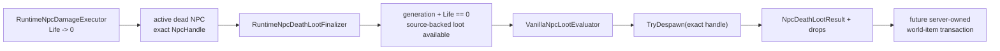

# NPC death and loot finalization

TerraRuntime keeps damage, death finalization, loot evaluation and world-item spawning as separate gameplay boundaries. The initial finalizer connects the already verified NPC damage state to the source-backed NPC-specific loot catalog without pretending that world-item placement is solved as a side effect.

## Flow

The finalizer is deliberately not a network API. It consumes runtime-owned identity and state only.

## Exactly-once generation boundary

A Terraria NPC slot can be reused. Therefore `slot` alone is not a death identity. Finalization requires the exact

$$
H_{npc}=(slot, generation).
$$

The finalizer first reads that exact handle and later despawns that same handle. After a successful finalization a second call with the old handle fails before consuming loot RNG because the generation is no longer active.

This also means a stale handle cannot finalize a replacement NPC that happens to reuse the same byte slot.

## Ordering

For the currently imported Blue Slime slice:

1. the exact NPC generation must still be active;
2. combat state must be materialized and `Life == 0`;
3. the source-backed NPC-specific loot set must exist;
4. the caller-provided drop buffer must be large enough;
5. loot rules consume luck/RNG in their verified source order;
6. the exact NPC generation is despawned;
7. `NpcDeathLootResult` preserves the final pre-despawn revision, type and coordinates for the next stage.

Invalid/live/stale/unsupported/short-buffer paths do not consume loot RNG.

## Why world items are not spawned here

The runtime world-item store already has reservation primitives, but NPC loot still needs pinned TerrariaServer 1.4.5.8 evidence for the relevant `NPC.NPCLoot` / `Item.NewItem` placement, sizing, velocity and ownership ordering. Reusing tile-drop constants or inventing a generic spawn point would create plausible-looking but false vanilla parity.

The next integration stage can therefore reserve server-owned world-item capacity, materialize source-backed item spawn state, and commit drops without requiring a fake `ConnectionHandle`.

## Current scope

`RuntimeNpcDeathLootFinalizer` currently succeeds only where `VanillaNpcLootEvaluator` has an imported NPC-specific rule set. At present that is Blue Slime. Unsupported dead NPCs are left active and dead so a higher layer cannot silently erase an unimplemented loot path.
