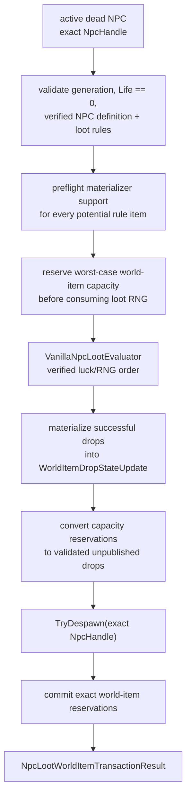

# NPC death, loot and world-item finalization

TerraRuntime keeps damage, death detection, loot evaluation, world-item materialization and replication as separate gameplay boundaries. The source-backed Blue Slime slice now has two finalization paths:

- `RuntimeNpcDeathLootFinalizer` evaluates NPC-specific loot and returns semantic `NpcLootDrop` values before despawning the exact NPC generation;
- `RuntimeNpcLootWorldItemTransaction` additionally coordinates those rolls with `RuntimeWorldItemStore` reservations so a server-owned death path can publish world-item drops without inventing a client `ConnectionHandle`.

The transaction does **not** itself decide Terraria item defaults, prefixes or spawn RNG. Those facts belong to an `INpcLootWorldItemMaterializer`, which must be source-backed for every item it advertises.

## Transaction flow

## Generation safety and exactly-once behavior

NPC slots are reusable, therefore a slot number is not a death identity. The transaction requires

$$
H_{npc}=(slot, generation).
$$

The initial lookup and the final despawn both use that exact handle. A stale generation cannot finalize a replacement NPC in the same slot. After a successful transaction the old generation is inactive, so a repeated call fails before loot RNG or item materialization is touched.

The result preserves the last active NPC revision observed before despawn. Despawn itself intentionally clears runtime slot state; the pre-despawn revision is therefore the meaningful final state revision for diagnostics and downstream bookkeeping.

## Capacity ordering

`RuntimeWorldItemStore` exposes unpublished generation-safe reservations. The transaction reserves enough slots for the maximum number of drops represented by the currently imported NPC-specific rule sequence **before** calling `VanillaNpcLootEvaluator`.

This is deliberately conservative. It guarantees that capacity exhaustion cannot consume player-luck or stack RNG and then leave a dead NPC pending for a retry with a different random outcome. For the current Blue Slime slice the maximum is two world items: Gel and Slime Staff.

Reservations are invisible to snapshots and replication until committed. Unused reservations are released without publishing an item.

## Materializer contract

`INpcLootWorldItemMaterializer.CanMaterialize(ItemTypeId)` is a side-effect-free preflight. If it returns `true`, `TryMaterialize` must be able to convert a valid rolled `NpcLootDrop` of that item type into a valid `WorldItemDropStateUpdate`. A materializer that advertises support and then fails is treated as an internal contract violation rather than silently deleting loot.

The materializer receives the source-backed NPC loot origin. TerrariaServer 1.4.5.8 establishes the ordinary NPC-drop center as

$$
x_c=\lfloor x_{npc}\rfloor+\left\lfloor\frac{w_{npc}}{2}\right\rfloor,
\qquad
y_c=\lfloor y_{npc}\rfloor+\left\lfloor\frac{h_{npc}}{2}\right\rfloor.
$$

For Blue Slime, the verified NPC definition is `24×18`, so an NPC at `(10.9, 20.9)` yields center `(22, 29)` exactly as the runtime tests assert.

## Source-backed spawn facts already pinned

The permanent `NPC Loot Source Contract` downloads the official TerrariaServer 1.4.5.8 Windows assembly with SHA-256

`d87e3faf08637f6be8882c63e7f11fb7e792b0230006309618473ece0f863e1e`

and verifies the relevant `CommonCode.DropItemFromNPC` / `Item.NewItem` path. Current pinned facts include:

- ordinary NPC loot uses the NPC center and `scattered = false`;
- `Item.NewItem` is called with natural prefix request `-1` and normal broadcast behavior;
- Gel defaults are `10×12` and Slime Staff defaults are `26×28`;
- neither item is in `ItemID.Sets.ItemNoGravity`;
- default velocity therefore follows

$$
v_x=0.1R_x,\quad R_x\in[-30,30],
$$

$$
v_y=0.1R_y,\quad R_y\in[-40,-16].
$$

- Slime Staff is in the summon-prefix family;
- the summon rollable prefix list contains 22 verified prefix IDs;
- natural `Prefix(-1)` first has a `1/4` no-prefix branch and applies the `ReducedNaturalChance` `1/3` survival rule to the relevant selected prefixes.

These facts are source evidence for the concrete vanilla materializer; the transaction itself remains independent of any specific prefix table.

## Failure behavior

The following paths fail before loot RNG is consumed:

- invalid, live or stale NPC handle;
- unsupported NPC-specific loot table;
- caller output buffer smaller than the rule count;
- materializer does not support one of the potential rule items;
- insufficient world-item capacity.

If materialization fails after `CanMaterialize` promised support, or an exact staged world-item reservation becomes impossible under the authoritative single-writer contract, the runtime throws because continuing would silently corrupt the death/loot transaction.

## Current scope

The catalog still contains only the source-backed Blue Slime NPC-specific rule slice. Global loot rules, chained conditions, world/event conditions and other NPCs remain outside this transaction. The concrete Gel/Slime Staff vanilla world-item materializer is the next layer; until it is wired, the transaction boundary is production-capable but intentionally dependency-injected rather than guessing item defaults or prefix behavior.
