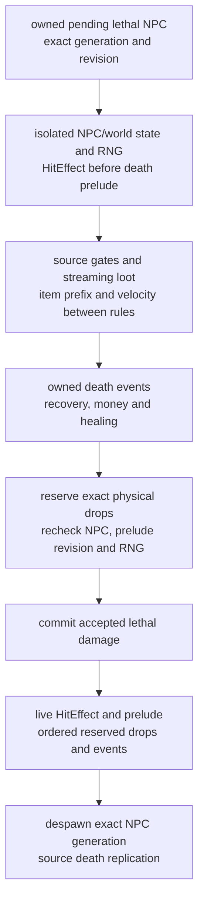

# NPC death, loot and world-item finalization

Retained newborns preserve the source strike boundary. A server-origin strike announces its pending generation with the pre-strike state before packet `28`; accepted client damage completes loot and death effects before announcing its post-strike state and relaying `28`. Targeted join replay leaves the broadcast birth pending. Exact-generation replacement flushes the previous pending generation. Shared Destroyer life is sampled from an exact root snapshot and applied within the accepted damage transition; failed lethal admission leaves segment and root state, pending publication and gameplay RNG unchanged. Original recording-socket fixtures contain 32 Bee and 64 Blue Slime cases; their final lethal `23` is an explicit later-publication harness call, not evidence of a complete outer update.

2026-10-04 seventh gameplay/NPC checkpoint is accepted on baseline `52c8c5ab`: retained AI002 state/RNG/defaults and world execution, source item owner eligibility and client creation/timing, bounded contextual town emotes, Immortal HP and unchecked knockback arithmetic. Full **1,182,793/1,182,793** tests pass in **513.212 s**, with zero failures/errors/skips; clean Release rebuild, Windows NativeAOT/five smokes and documentation/domain/graph/staged-diff gates pass. Production/test inputs stayed unchanged through acceptance: `2b4baf3527e7c98579b702c7b05796e4343b0654174d6039ffe1123374e4c200`. Evidence `.cache/flying-eye-owner-emotes-final-status.json`. FullVanillaAiParity remains false; broad N1–N5, Linux NativeAOT, unowned AI002 target/frame facts, selected unknown town contexts and instanced item400 remain open. Next: contained slime items/Hive/Bee, source mechanical-summon loot before contents, and authenticated town biome context. No push requested.

2026-10-04 sixth gameplay/NPC batch is accepted on baseline `36bd2a15`: source Big Mimic 473..476 AI87 and retained reflection/cannon effects, paired ordinary-town conversations/RPS/frame ownership and Nurse 13/584 healing, source world-item allocation/overflow and transient sentinel400 wire, physical drop producers and shared nonclient strike28-before-final23. Full 1,088,799/1,088,799 tests pass in 397.240 s with zero failures/errors/skips; clean Release rebuild, Windows NativeAOT and five smokes plus documentation/domain/graph/diff gates pass. Every tracked and new production/test input was included in the source hash that stayed unchanged through immutable acceptance: `c60e7b8a9d27d7deaaab2a02c87b2bb03b6d69f611d02cdcd6a1ccf2bf9ef7cc`. Rejected owned tile/drop transactions preserve RNG; source Catch publishes 21→22→23 and retains source grab-delay fields. Evidence `.cache/big-mimic-social-overflow-final-status.json`. This bounded checkpoint leaves FullVanillaAiParity=false, broad N1-N5 and Linux NativeAOT open. Active-player None400 owner eligibility, instanced400, contextual town emotes, wet/special town families and imported life-above-max remain fenced. Next: source AI002 motion/target/RNG closure and inventory/buff-owned world-item owner selection. No push requested.

The accepted sixth batch adds server-origin strike publication at the shared combat boundary. Eligibility and lethal admission finish before an unpublished exact-generation damage commit; raw supplied damage, knockback, direction and critical flag are then broadcast in packet 28. Surviving actors publish their resulting packet 23; lethal actors publish their final despawn after owned death effects, without an intermediate Life=0 packet. Client packet-28 ingress keeps its separate acknowledgement and sender exclusion. Original captures cover the already-published actor path; pending-spawn and arbitrary direct raw callers remain outside this scope. Large positive wire damage saturates at short.MaxValue on the exercised net11 Windows host.

The seventh batch preserves HP for owned `Immortal` NPCs while retaining resolved damage, `JustHit`, knockback and the source strike packets. These hits do not enter lethal admission. Ordinary knockback uses the source unchecked 32-bit damage product for the stagger threshold, including overflow. Independent original captures contain 9,720 knockback calls; 3,240 distinct runtime cases pass, and restoring the old wider product fails 1,509 cases without runner errors. The 323 wire checks include immortal actors through both server combat paths; removing only HP preservation fails 160 checks. These focused results are included in seventh integrated acceptance. Other NPC-specific knockback modifiers remain outside this ordinary branch.

2026-10-04 integrated checkpoint: the Mothron/Mother, death healing/prelude/banner/bestiary and ordinary town contact/regen/Stinky slices pass664,317/664,317 tests in404.906s, with zero failures/errors/skips. Clean Release rebuild, Windows NativeAOT and all five smokes plus documentation/domain/graph/diff gates pass with unchanged production/test source. Source incoming contact28 precedes final23. Linux NativeAOT, full N1-N5 parity, item overflow and existing nonclient/custom-strike publication remain open.

The death-prelude slice owns achievement packet 97, bestiary kill credit and claimable banner counters. Its preview preserves the source early dungeon gates, terminal Eater/Twins achievement gates, credit before statue suppression and the statue RNG short circuit. Root interaction credit and the NPC's own interaction mask remain distinct. Banner attribution follows `NPC.FindClosestPlayer` squared float-center distance; it does not reuse money/healing's `Player.FindClosest` geometry. Standard composition derives `Main.onlyShimmerOceanWorlds` from retained seed flags; 32 original getter cases and accepted/suppressed/unknown live dungeon deaths verify it. Removing the owned projection causes two assertion failures in 42 focused cases. Custom hosts with missing facts reject relevant gates before damage.

In 1.4.5.8 a banner threshold increments a claimable counter; it does not create a world item. Module 11 claim requests use the authenticated current player generation, normalize amount zero to one, grant the available minimum and report any denied remainder. Source client-local cursor/inventory delivery remains on the client. Clients cannot write authoritative counter/full-state messages. Immutable published banner and recognized bestiary baseline bytes precede packet 49 in the section-request path; destination transfer also receives its current baseline before handoff. Unknown loaded bestiary keys remain in persistence without fabricated client identities.

Checkpoint snapshots detach banner arrays and all three bestiary trackers. The world writer replaces only the decoded banner range in the header, rebuilds section offsets and writes the owned bestiary section; foreign header bytes and retained sight/chat entries survive. Prepared-cache layout 4 invalidates older cached projections. Banner arrays are bounded by the source 293 entries; a full admitted bestiary entry budget rejects a new credit in the death preview rather than accepting unsavable state.

Independent evidence adds 697 default rows, 762 credit identities, 293 banner inverses, 199 module frames, seven original packet-97 frames, thirty executed original claim cases, sixty executed original tally cases, 216 complete suppressed-statue deaths and 256 original banner-target geometry cases. Thirty-two original terminal-achievement executions also pin recipient bytes and absence. The isolated graph currently passes 2,582 checks, including complete world checkpoint/reload/restart and initial join ordering. Disabling only the new credit/statue/claim/replay/target geometry behavior in a copied Application graph yields 345 assertion failures with zero runner errors. Removing only live pipeline credit publication additionally fails all three accepted lethal ingress checks while preserving helper APIs. The structural outbound queue accounts for one banner frame and at most 762 recognized entries per bestiary tracker; the default eight-player frame ceiling is 6,771, with the retained 16 MiB byte envelope. This slice is included in the integrated checkpoint above. Complete encounter achievement state, arbitrary unowned `realLife` links, bestiary sight/chat discovery remain open; the admitted source allocator is described below.

The healing slice previews `NPC.NPCLoot_DropHeals` after money and publishes its exact reserved physical drops as a separate phase. Common luck offers precede damage, maximum-life and vitals guards; the life offer remains conditional on the first mana offer. Type-specific hearts keep source order, including the Eater segment's `Next(4)` before checking health. The isolated Eater-heart path is removed, so every admitted lethal ingress has one owner. Needs use the closest retained player snapshot; missing optional vitals do not assert a need. Arbitrary callbacks and unknown raw-player states remain outside this projection.

The original 22,464-case matrix covers 39 NPC identities, combat profiles, luck, life/mana needs, difficulty and tenth-anniversary materialization. The typed helper matches physical drops and next RNG. The isolated Application graph passes 25,339 focused and 38,499 adjacent death/loot/boss cases. Removing only the pipeline healing phase causes 116 assertion failures in 153 adjacent cases, with zero runner errors. Money-only source fixtures remain separate from the updated coupled callbacks. This healing phase is included in the integrated checkpoint above.

TerraRuntime keeps damage, death detection, loot evaluation, world-item materialization and replication as separate authoritative boundaries. The current Blue Slime slice can now complete a server-owned death into real world-item state without fabricating a client `ConnectionHandle`.

## Production flow

```mermaid
flowchart TD
    Validate["owned pending lethal NPC\nexact generation and revision"] --> Preview["isolated NPC/world state and RNG\nHitEffect before death prelude"]
    Preview --> Rules["source gates and streaming loot\nitem prefix and velocity between rules"]
    Rules --> Tail["owned death events\nrecovery, money and healing"]
    Tail --> Reserve["reserve exact physical drops\nrecheck NPC, prelude revision and RNG"]
    Reserve --> Damage["commit accepted lethal damage"]
    Damage --> Publish["live HitEffect and prelude\nordered reserved drops and events"]
    Publish --> Despawn["despawn exact NPC generation\nsource death replication"]
```

The critical detail is that loot is **streamed**, not collected and materialized later.

## Why streaming is required

The pinned TerrariaServer 1.4.5.8 source proves that `NPC.NPCLoot_DropItems` constructs

`DropAttemptInfo { rng = Main.rand }`.

`CommonDrop.TryDroppingItem` performs the luck check, consumes `info.rng.Next(...)` for stack size, and immediately calls `CommonCode.DropItemFromNPC`. That path calls `Item.NewItem`, whose natural-prefix and default-velocity behavior also consumes `Main.rand` before the next loot rule is executed.

Therefore the required ordering is

$$
R_i^{loot}\;\rightarrow\;R_i^{stack}\;\rightarrow\;R_i^{prefix}\;\rightarrow\;R_i^{velocity}\;\rightarrow\;R_{i+1}^{loot}.
$$

Buffering every `NpcLootDrop` first and spawning later would produce the right marginal probabilities but the wrong deterministic random stream. The transaction now evaluates one rule through `VanillaNpcLootEvaluator.TryEvaluateRule`, immediately materializes a successful result, then advances to the next rule.

## Generation safety and capacity

The current allocation contract and independent overflow evidence are in [Source world-item allocation](world-item-allocation.md).

NPC identity is

$$
H_{npc}=(slot,generation).
$$

Initial lookup and final despawn both use the exact handle. A stale generation cannot finalize a replacement NPC occupying the same slot, and a second call after success fails before RNG is touched.

The death transaction materializes its actual ordered drops on a cloned RNG, then stages source slot selection on a detached `RuntimeWorldItemStore.AllocationPreview`. It checks the complete retained item/pending-transfer state and claims touched physical slots before lethal damage. A full table can accept replacement or stacking; it no longer requires one empty slot per possible rule.

A rejected stale or unsupported plan leaves NPC, RNG and live items unchanged. Unknown temporary reservations are excluded from source eviction. Published replacement advances the generation, sends the old active item removal before its new drop, and may reuse the same slot several times within one accepted death.

## Concrete Blue Slime materializer

`VanillaNpcLootWorldItemMaterializer` currently supports the two source-backed Blue Slime items:

| Item | Size | Gravity | Natural prefix |
|---|---:|---|---|
| Gel (`23`) | `10×12` | ordinary | none |
| Slime Staff (`1309`) | `26×28` | ordinary | summon family |

Ordinary NPC loot uses the integer NPC center

$$
x_c=\operatorname{trunc}(x_{npc})+\left\lfloor\frac{w_{npc}}2\right\rfloor,
\qquad
y_c=\operatorname{trunc}(y_{npc})+\left\lfloor\frac{h_{npc}}2\right\rfloor.
$$

The materialized world-item top-left is the center minus $8\,\mathrm{px}$ on each axis. The physical `WorldItem` body is always $16\times16\,\mathrm{px}$; `Item.SetDefaults` dimensions describe item data and do not size that entity. Neither supported item is in `ItemID.Sets.ItemNoGravity`, so default velocity is

$$
v_x=0.1R_x,\quad R_x\in[-30,30],
$$

$$
v_y=0.1R_y,\quad R_y\in[-40,-16].
$$

## Natural Slime Staff prefixes

`VanillaItemPrefixCatalog` pins the exact 22-entry summon family from the official server. `Prefix(-1)` is reproduced in source order:

1. `Next(4) == 0` yields prefix `0`;
2. otherwise one summon prefix is selected uniformly;
3. prefixes in `ReducedNaturalChance` survive only when `Next(3) == 0`, otherwise the result becomes prefix `0`;
4. item-specific prefix validity is checked; an invalid selected prefix restarts the natural-prefix loop.

For Slime Staff, the source-backed stat-rounding guards reject prefix IDs `55`, `89` and `91`. Their damage multipliers round the staff's base damage of `8` back to `8`, which vanilla treats as an ineffective modifier and rerolls.

The materializer performs prefix selection before velocity RNG, matching `Item.NewItem` ordering.

## Source contract

`NPC Loot Source Contract` downloads the official TerrariaServer 1.4.5.8 Windows assembly and pins SHA-256:

`d87e3faf08637f6be8882c63e7f11fb7e792b0230006309618473ece0f863e1e`

The executable probe verifies rule registration, `Player.RollLuck`, stack ranges, integer NPC drop centers, item default dimensions, gravity membership, shared `Main.rand`, immediate `CommonDrop → Item.NewItem` execution, summon-prefix membership, reduced-natural-chance data and Slime Staff prefix validity.

## Deerclops boss death vertical

Deerclops now has an explicit imported boss-death path rather than falling through ordinary unknown-NPC finalization. The evaluator preserves the 1.4.5.8 rule ordering for the currently admitted difficulty branches:

- Expert: instanced Boss Bag `5111` with the existing `54000`-tick slot lease;
- Master: relic `5110` plus independent per-interacting-player `1/4` pet rolls for item `5090`;
- Classic: mask `5109`, Chester `5098`, Eyebrella `5101`, shader `5113`, Dizzy Hat `5385`, and one guaranteed weapon from `5117/5118/5119/5095`;
- all difficulties: Deerclops trophy `5108` at the source `1/10` boss-trophy rule.

The Classic guaranteed weapon wrapper consumes three `Next(1)` calls: the outer chance, its single-rule choice, then the option rule chance. It chooses the weapon with a fourth call and delivers a fixed stack without another stack draw. The trophy registration precedes these boss-specific rules, as in `ItemDropDatabase.Populate`.

Successful authoritative death marks `VanillaWorldProgressionId.Deerclops`. The `.wld` progression header patcher now updates the source-backed `downedDeerclops` byte located immediately after `downedQueenSlime`. Regression coverage round-trips a current-format world and proves that the patch changes exactly one header byte while preserving the adjacent Empress, Queen Slime and town-slime/truffle unlock flags.

## Current limits

The admitted NPC-specific reward families, boss recovery and money callbacks share owned death ordering. Global/chained rules, banner/bestiary counters, generic healing, statue-specific gates and complete world/event conditions remain open. Closest-player lookup resolves the live integer NPC body, mounted player body, source Manhattan distance, dead-player filter and first-slot ties; retained player luck feeds the existing ordinary reward roll boundary.

## Boss announcements

The existing tile, packet `61`, Slime Rain and Mechdusa summon routes emit the source localized boss chat only after successful authoritative allocation. Retinazer emits `LegacyMisc.48`; Spazmatism emits no spawn chat; Mechdusa emits `LegacyMisc.107` once for its Prime anchor. These events are broadcast to playing peers and are not replayed as join baselines.

Admitted boss deaths announce after loot and progression, before removal. The first Twin remains silent while the other is active; the last emits the plural `Enemies.TheTwins` announcement. Only the last Eater segment celebrates, preserving that segment's NPC localization key. Moon Lord uses `Enemies.MoonLord` at the owned terminal death tick $600\,\text{ticks}$; shell deaths, departure and stale terminal callbacks do not announce victory. The protocol `326` text module retains nested localization keys, author `255` and the source boss/event color `(175,75,255)`. Five independent golden packets come from the official `1.4.5.8` serializer. Other spawn origins, event announcements and full boss presentation parity remain open.

Classic King Slime ordinary loot now has source-backed body and nonprefixable facts for all nine formerly missing reward items, including the guaranteed Ninja clothing, Solidifier and Slime Hook/Slime Gun branch. Accepted lethal hits can therefore finish ordinary loot and death; previously the materializer rejected those mandatory drops. Loot rule order is unchanged; bag opening and global loot parity remain open.

The shared materializer now places physical $16\times16\,\mathrm{px}$ bodies. Generic transactions and all retained Application boss-loot paths use truncated NPC coordinates plus half the live integer hitbox, including explicit AI body overrides. Independent original captures verify three body sizes at fractional NPC positions.

The common `VanillaBossRecovery1458` phase replaces Wall-only recovery. It runs after imported loot and boss-specific `DoDeathEvents` effects, before the boss defeat announcement. It drops the source potion stack $5\ldots15$, then $5\ldots9$ hearts; potion identity follows the explicit source boss branches. First Twins, nonterminal Eater segments and Moon Lord shells do not recover. Moon Lord core recovers only through its generation-safe terminal tick $600$. The world-clock-owned `VanillaBossRecoveryDailyState1458` retains Eye/Wall kills until both occur, delivers one Badger hat and clears both flags. Dusk and new-world ownership reset this transient ledger; dawn and persistence do not.

`VanillaSeasonalItemDropFacts1458` substitutes hearts/stars before prefix and launch RNG. Tenth-anniversary choices take precedence; simultaneous Halloween/Christmas chooses between their substitutions. Composition reads retained forced-world seasonal facts. Ordinary calendar activation is not admitted. `VanillaBossRecoveryItemCatalog1458` contains the independently verified potion/pickup defaults. `VanillaBossRewardItemPrefixFacts1458` adds exact natural prefix families and rounding guards for sixteen retained weapon/accessory rewards; this does not admit additional weapon use. Seven imported evaluators now place ordinary trophies before boss rules; option rules deliver fixed stacks without invented RNG calls.

Source allocation now owns item age and protection offsets, pickup replacement above age 1200, the server threshold at slot 360, emergency stacking and oldest-age / age-minus-cooldown fallback. The shared owner directly implements thirteen reward interfaces, recovery and generic rules. Accepted phases retain imported rewards → owned events → recovery → money → healing order; instanced publication adopts the selected generation without allocating again. The transaction retains a 400-drop ceiling, 4096 money attempts and 4096 allocation-operation ceiling. Ordinary sentinel 400 consumes materialization RNG but has no authoritative physical entity. Instanced sentinel 400 remains rejected before lethal mutation because its client-local wire/expiry ownership is not represented.

The NPC preview retains at most $256$ physical slots, allocator protection, generations and revisions without publishing child NPCs. Clock/progression previews retain scalar state and an isolated daily recovery ledger. The configured spawn-context provider is trusted owner-thread read-only input and is sampled once. Actual phase boundaries check the complete live RNG state before advancing to a precomputed checkpoint. A Good-World child spawn with an independent/custom NPC RNG, or a triggered opaque Slime Rain spawn callback, is rejected before the owned lethal mutation; those callbacks cannot be speculatively invoked. Arbitrary reentrant allocation callbacks are outside this synchronous admission contract. Addressed transport failure retains the accepted lease rather than recycling a possibly observed bag.

`NpcSimulationState.MoneyValue`, `ExtraMoneyValue` and `Midas` are server-only retained facts. Fresh admitted NPCs materialize verified monetary defaults, zero extra value and false Midas; state-only updates preserve represented values, including zero. The money helper runs after recovery, consumes the source random prelude even when value is zero, chooses the better/worse candidate with closest-player luck, applies retained Midas/Blood Moon/extra value, and materializes each coin before the next split. A zero higher-denomination stack performs no `Item.NewItem` allocation or velocity draws and can require another bounded split. Coins use the shared physical $16\times16\,\mathrm{px}$ materializer and no natural prefix. NPC coin-pickup/revenge and general Midas status producers remain open. Positive monetary defaults follow the source difficulty curve; negative net variants retain captured integer-truncation results at the ordinary runtime strengths `0.5/1/2/3/4`, while fractional variant strength and unadmitted special-world variants remain closed.

Independent executable evidence comprises $1152$ direct recovery cases, $2592$ admitted post-imported recovery suffix cases over seasonal modes/difficulties/live bodies, $108$ complete Classic imported-loot/recovery cases without seasonal global rules, sixty-four original heart/star materializations and sixteen full prefix-family/stat-guard captures. They assert item order, stacks, prefixes, positions, velocities and the next shared RNG value as applicable. Suffix cases begin at the captured original post-imported cursor and do not claim omitted global-rule parity. Pipeline fixtures also verify terminal gates, duplicate/stale deaths, Badger pairing, dusk reset and pressure admission. These coupled checks inject one retained `VanillaUnifiedRandom1458` into the pipeline; production composition now shares its retained RNG across NPC creation/AI/loot/projectiles; exact alignment of omitted callbacks remains open. Generic pickup, bestiary discovery, calendar authority, full overflow allocation and bag opening remain open.

Money evidence adds 1120 original `NPCLoot_DropMoney` cases over value, luck, Midas, Blood Moon and extra value; 1915 positive-default and 180 negative-variant captures; 108 Classic accepted callback chains over live bodies/terminal gates; and 32 original `Player.FindClosest` geometry/dead/tie cases. They retain coin order, stacks, physical origins, velocities and next RNG. The Classic chain deliberately isolates imported/recovery/money callbacks and does not claim omitted banners, generic heals or complete encounter parity. Eight additional default-composition callback chains retain NPC creation, actual Eye loot/recovery/money, dedicated-server flask termination and later NPC creation on the shared owner. This historical money-only matrix omits the newer prelude/healing callbacks. Generic pickup, bestiary discovery, calendar authority, complete overflow allocation and bag opening remain open.

NPC death allocations use the same one-time bound world-item owner facts and guarded physical/sentinel21?22 publication described in [world-item allocation](world-item-allocation.md). Source instanced noBroadcast paths skip ordinary owner search; unowned pickup modifiers and instanced sentinel400 remain closed before death mutation.

The eighth contained-loot family executes mechanical summon globals before `SlimeBodyItemDropRule`, then materializes each drop before the next global/NPC-specific rule. Mechanical order is unfinished Destroyer/Worm556, Twins/Eyes544, then Skeletron Prime/Skull557: `RollLuck(2500)` for each unfinished boss, first success only, stack1 without a stack RNG draw. Its immediate `NewItem` prefix/velocity draws precede slime contents. Loaded baseline flags combine with the owned progression journal; the default synthetic fixture context represents a fresh world. The accepted death plan checks the captured progression snapshot before lethal acceptance. Original mechanical evidence covers61,440 direct/coupled rows and12 defaults; copied missing/reversed/extra-stack controls fail10080/2016/2880 assertions with zero runner errors.

Contained-item eligibility retains source `SlimeCanContainItems` types1/59/147/184/537 and positive ai1 belowItemID.Count. It truncates the retained ID and draws the source inclusive stack range even for fixed1..1. The sparse catalog adds the independently captured sixty producer outcomes, verified Desert Fossil3347 and Conveyor Belt3610 siblings, and Ice Cream4026. Existing verified retained-item materializers remain admitted; unknown eligible contents reject the detached whole-death plan before NPC/item mutation or live RNG adoption. Ordinary nongood Torch content is distinct from the still-fenced GoodWorld ignition producer. Herb/Web defaults do not admit their unowned same-tick tile effects.

The complete admitted NPC-specific tail is Lava Slime with no ordinary rule; Blue Slime Gel1..2 then Slime Staff10000/7000; Ice/Spiked Ice food4026 chance150 with `NotFromStatue` before Gel and Staff; Sand Slime Gel2..3 then Staff8000/5600. Every successful reward materializes inline, including the fixed food stack draw and natural prefix. Source prelude statue suppression remains separate from the food condition. Current evidence has260 original defaults/prefix rows,21,080 direct contained-rule rows,21,286 full imported callbacks (including199 food and7 Staff cases), and8060 imported→zero-value money→full-vitals healing callback sequences compared against real lethal ingress and next RNG. A standard host/real writer proves physical21→selected-owner22, generation-safe duplicate rejection and no repeated RNG. This is bounded callback/owned lifecycle evidence; it does not establish a continuous vanilla encounter or all global loot. Later holiday/biome keys, souls, Living Flames, Pirate Map and yoyo globals remain open; captured clear-world contexts exclude their source gates. Whole-death claims, unknown allocation leases and stale generation/currentness guards retain the existing ownership contract.

The contained-loot copied graph now passes50,698 checks with zero failures/errors/skips. Source-copy controls produce35,771 failures without sparse defaults,13,600 without fixed-stack draws and12,854 without Ice/Sand-specific rules (each42,626 checks); removing or delaying the actual death global hook fails all11 lifecycle/writer checks. All controls have zero runner errors; restored copied production passes all50,698 again. Full eighth-package acceptance is pending. Mechanical live evidence separately covers1536 original imported→positive-money→healing sequences exercised through both loaded baseline and progression journal (3072 live cases plus2 guards); root64,526 checks pass. Moving Mech after contents fails673/3074 cases, removing progression currentness fails1/1, with zero runner errors.
