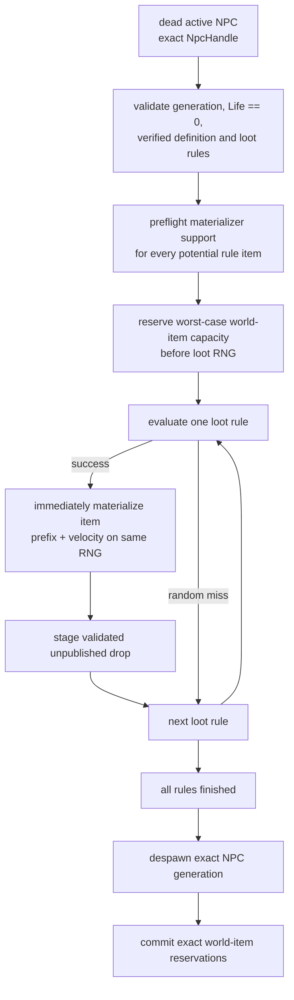

# NPC death, loot and world-item finalization

TerraRuntime keeps damage, death detection, loot evaluation, world-item materialization and replication as separate authoritative boundaries. The current Blue Slime slice can now complete a server-owned death into real world-item state without fabricating a client `ConnectionHandle`.

## Production flow

```mermaid
flowchart TD
    Dead["dead active NPC\nexact NpcHandle"] --> Validate["validate generation, Life == 0,\nverified definition and loot rules"]
    Validate --> Support["preflight materializer support\nfor every potential rule item"]
    Support --> Capacity["reserve worst-case world-item capacity\nbefore loot RNG"]
    Capacity --> Rule["evaluate one loot rule"]
    Rule -->|success| Materialize["immediately materialize item\nprefix + velocity on same RNG"]
    Materialize --> Stage["stage validated unpublished drop"]
    Stage --> Next["next loot rule"]
    Rule -->|random miss| Next
    Next --> Rule
    Next --> Done["all rules finished"]
    Done --> Despawn["despawn exact NPC generation"]
    Despawn --> Commit["commit exact world-item reservations"]
```

The critical detail is that loot is **streamed**, not collected and materialized later.

## Why streaming is required

The pinned TerrariaServer 1.4.5.8 source proves that `NPC.NPCLoot_DropItems` constructs

`DropAttemptInfo { rng = Main.rand }`.

`CommonDrop.TryDroppingItem` performs the luck check, consumes `info.rng.Next(...)` for stack size, and immediately calls `CommonCode.DropItemFromNPC`. That path calls `Item.NewItem`, whose natural-prefix and default-velocity behavior also consumes `Main.rand` before the next loot rule is executed.

Therefore the required ordering is

$$
R_i^{loot}\;\rightarrow\;R_i^{stack}\;\rightarrow\;R_i^{prefix}\;\rightarrow\;R_i^{velocity}\;\rightarrow\;R_{i+1}^{loot}.
$$

Buffering every `NpcLootDrop` first and spawning later would produce the right marginal probabilities but the wrong deterministic random stream. The transaction now evaluates one rule through `VanillaNpcLootEvaluator.TryEvaluateRule`, immediately materializes a successful result, then advances to the next rule.

## Generation safety and capacity

NPC identity is

$$
H_{npc}=(slot,generation).
$$

Initial lookup and final despawn both use the exact handle. A stale generation cannot finalize a replacement NPC occupying the same slot, and a second call after success fails before RNG is touched.

`RuntimeWorldItemStore` reservations are unpublished and generation-safe. The transaction reserves the maximum number of item slots represented by the imported rule sequence before consuming loot RNG. For Blue Slime this is two slots, Gel and Slime Staff. If capacity is insufficient, the dead NPC remains present and no luck/random call is consumed.

This conservative capacity preflight intentionally differs from Terraria's opportunistic slot selection under extreme item-capacity pressure: TerraRuntime may defer a death when only one slot is free even though one of two probabilistic rules might miss. The tradeoff prevents retry-driven RNG drift and partial loot commits while the broader loot transaction model is still being expanded.

## Concrete Blue Slime materializer

`VanillaNpcLootWorldItemMaterializer` currently supports the two source-backed Blue Slime items:

| Item | Size | Gravity | Natural prefix |
|---|---:|---|---|
| Gel (`23`) | `10×12` | ordinary | none |
| Slime Staff (`1309`) | `26×28` | ordinary | summon family |

Ordinary NPC loot uses the integer NPC center

$$
x_c=\operatorname{trunc}(x_{npc})+\left\lfloor\frac{w_{npc}}2\right\rfloor,
\qquad
y_c=\operatorname{trunc}(y_{npc})+\left\lfloor\frac{h_{npc}}2\right\rfloor.
$$

The materialized world-item top-left is the center minus $8\,\mathrm{px}$ on each axis. The physical `WorldItem` body is always $16\times16\,\mathrm{px}$; `Item.SetDefaults` dimensions describe item data and do not size that entity. Neither supported item is in `ItemID.Sets.ItemNoGravity`, so default velocity is

$$
v_x=0.1R_x,\quad R_x\in[-30,30],
$$

$$
v_y=0.1R_y,\quad R_y\in[-40,-16].
$$

## Natural Slime Staff prefixes

`VanillaItemPrefixCatalog` pins the exact 22-entry summon family from the official server. `Prefix(-1)` is reproduced in source order:

1. `Next(4) == 0` yields prefix `0`;
2. otherwise one summon prefix is selected uniformly;
3. prefixes in `ReducedNaturalChance` survive only when `Next(3) == 0`, otherwise the result becomes prefix `0`;
4. item-specific prefix validity is checked; an invalid selected prefix restarts the natural-prefix loop.

For Slime Staff, the source-backed stat-rounding guards reject prefix IDs `55`, `89` and `91`. Their damage multipliers round the staff's base damage of `8` back to `8`, which vanilla treats as an ineffective modifier and rerolls.

The materializer performs prefix selection before velocity RNG, matching `Item.NewItem` ordering.

## Source contract

`NPC Loot Source Contract` downloads the official TerrariaServer 1.4.5.8 Windows assembly and pins SHA-256:

`d87e3faf08637f6be8882c63e7f11fb7e792b0230006309618473ece0f863e1e`

The executable probe verifies rule registration, `Player.RollLuck`, stack ranges, integer NPC drop centers, item default dimensions, gravity membership, shared `Main.rand`, immediate `CommonDrop → Item.NewItem` execution, summon-prefix membership, reduced-natural-chance data and Slime Staff prefix validity.

## Deerclops boss death vertical

Deerclops now has an explicit imported boss-death path rather than falling through ordinary unknown-NPC finalization. The evaluator preserves the 1.4.5.8 rule ordering for the currently admitted difficulty branches:

- Expert: instanced Boss Bag `5111` with the existing `54000`-tick slot lease;
- Master: relic `5110` plus independent per-interacting-player `1/4` pet rolls for item `5090`;
- Classic: mask `5109`, Chester `5098`, Eyebrella `5101`, shader `5113`, Dizzy Hat `5385`, and one guaranteed weapon from `5117/5118/5119/5095`;
- all difficulties: Deerclops trophy `5108` at the source `1/10` boss-trophy rule.

The Classic guaranteed weapon wrapper consumes three `Next(1)` calls: the outer chance, its single-rule choice, then the option rule chance. It chooses the weapon with a fourth call and delivers a fixed stack without another stack draw. The trophy registration precedes these boss-specific rules, as in `ItemDropDatabase.Populate`.

Successful authoritative death marks `VanillaWorldProgressionId.Deerclops`. The `.wld` progression header patcher now updates the source-backed `downedDeerclops` byte located immediately after `downedQueenSlime`. Regression coverage round-trips a current-format world and proves that the patch changes exactly one header byte while preserving the adjacent Empress, Queen Slime and town-slime/truffle unlock flags.

## Current limits

The admitted NPC-specific reward families, boss recovery and money callbacks share owned death ordering. Global/chained rules, banner/bestiary counters, generic healing, statue-specific gates and complete world/event conditions remain open. Closest-player lookup resolves the live integer NPC body, mounted player body, source Manhattan distance, dead-player filter and first-slot ties; retained player luck feeds the existing ordinary reward roll boundary.

## Boss announcements

The existing tile, packet `61`, Slime Rain and Mechdusa summon routes emit the source localized boss chat only after successful authoritative allocation. Retinazer emits `LegacyMisc.48`; Spazmatism emits no spawn chat; Mechdusa emits `LegacyMisc.107` once for its Prime anchor. These events are broadcast to playing peers and are not replayed as join baselines.

Admitted boss deaths announce after loot and progression, before removal. The first Twin remains silent while the other is active; the last emits the plural `Enemies.TheTwins` announcement. Only the last Eater segment celebrates, preserving that segment's NPC localization key. Moon Lord uses `Enemies.MoonLord` at the owned terminal death tick $600\,\text{ticks}$; shell deaths, departure and stale terminal callbacks do not announce victory. The protocol `326` text module retains nested localization keys, author `255` and the source boss/event color `(175,75,255)`. Five independent golden packets come from the official `1.4.5.8` serializer. Other spawn origins, event announcements and full boss presentation parity remain open.

Classic King Slime ordinary loot now has source-backed body and nonprefixable facts for all nine formerly missing reward items, including the guaranteed Ninja clothing, Solidifier and Slime Hook/Slime Gun branch. Accepted lethal hits can therefore finish ordinary loot and death; previously the materializer rejected those mandatory drops. Loot rule order is unchanged; bag opening and global loot parity remain open.

The shared materializer now places physical $16\times16\,\mathrm{px}$ bodies. Generic transactions and all retained Application boss-loot paths use truncated NPC coordinates plus half the live integer hitbox, including explicit AI body overrides. Independent original captures verify three body sizes at fractional NPC positions.

The common `VanillaBossRecovery1458` phase replaces Wall-only recovery. It runs after imported loot and boss-specific `DoDeathEvents` effects, before the boss defeat announcement. It drops the source potion stack $5\ldots15$, then $5\ldots9$ hearts; potion identity follows the explicit source boss branches. First Twins, nonterminal Eater segments and Moon Lord shells do not recover. Moon Lord core recovers only through its generation-safe terminal tick $600$. The world-clock-owned `VanillaBossRecoveryDailyState1458` retains Eye/Wall kills until both occur, delivers one Badger hat and clears both flags. Dusk and new-world ownership reset this transient ledger; dawn and persistence do not.

`VanillaSeasonalItemDropFacts1458` substitutes hearts/stars before prefix and launch RNG. Tenth-anniversary choices take precedence; simultaneous Halloween/Christmas chooses between their substitutions. Composition reads retained forced-world seasonal facts. Ordinary calendar activation is not admitted. `VanillaBossRecoveryItemCatalog1458` contains the independently verified potion/pickup defaults. `VanillaBossRewardItemPrefixFacts1458` adds exact natural prefix families and rounding guards for sixteen retained weapon/accessory rewards; this does not admit additional weapon use. Seven imported evaluators now place ordinary trophies before boss rules; option rules deliver fixed stacks without invented RNG calls.

The source overflow allocator uses item age, pickup replacement and emergency stacking, which remain unported. Death admission instead previews all admitted ordinary, instanced, recovery and money materializations on an isolated copy of the complete RNG state, then holds exactly the required physical slots before the lethal NPC commit. The shared owner directly implements thirteen typed reward interfaces, the recovery interface and the generic rule path. Reservations include leased slots; accepted phases preserve imported rewards → owned death events → recovery → money order, and instanced delivery adopts the held slot without allocating again. A full pool rejects an ordinary lethal strike; Moon Lord terminal finalization waits for capacity. Nonlethal hits do not require drop capacity. The preview has a $400$-drop ceiling and $4096$ money-split attempts; rejection discards its draws and releases unpublished reservations.

The NPC preview retains at most $256$ physical slots, allocator protection, generations and revisions without publishing child NPCs. Clock/progression previews retain scalar state and an isolated daily recovery ledger. The configured spawn-context provider is trusted owner-thread read-only input and is sampled once. Actual phase boundaries check the complete live RNG state before advancing to a precomputed checkpoint. A Good-World child spawn with an independent/custom NPC RNG, or a triggered opaque Slime Rain spawn callback, is rejected before the owned lethal mutation; those callbacks cannot be speculatively invoked. Arbitrary reentrant allocation callbacks are outside this synchronous admission contract. Addressed transport failure retains the accepted lease rather than recycling a possibly observed bag.

`NpcSimulationState.MoneyValue`, `ExtraMoneyValue` and `Midas` are server-only retained facts. Fresh admitted NPCs materialize verified monetary defaults, zero extra value and false Midas; state-only updates preserve represented values, including zero. The money helper runs after recovery, consumes the source random prelude even when value is zero, chooses the better/worse candidate with closest-player luck, applies retained Midas/Blood Moon/extra value, and materializes each coin before the next split. A zero higher-denomination stack performs no `Item.NewItem` allocation or velocity draws and can require another bounded split. Coins use the shared physical $16\times16\,\mathrm{px}$ materializer and no natural prefix. NPC coin-pickup/revenge and general Midas status producers remain open. Positive monetary defaults follow the source difficulty curve; negative net variants retain captured integer-truncation results at the ordinary runtime strengths `0.5/1/2/3/4`, while fractional variant strength and unadmitted special-world variants remain closed.

Independent executable evidence comprises $1152$ direct recovery cases, $2592$ admitted post-imported recovery suffix cases over seasonal modes/difficulties/live bodies, $108$ complete Classic imported-loot/recovery cases without seasonal global rules, sixty-four original heart/star materializations and sixteen full prefix-family/stat-guard captures. They assert item order, stacks, prefixes, positions, velocities and the next shared RNG value as applicable. Suffix cases begin at the captured original post-imported cursor and do not claim omitted global-rule parity. Pipeline fixtures also verify terminal gates, duplicate/stale deaths, Badger pairing, dusk reset and pressure admission. These coupled checks inject one retained `VanillaUnifiedRandom1458` into the pipeline; production-wide `Main.rand` alignment across NPC creation/AI/loot/projectiles remains open. Generic healing, generic pickup/banner/bestiary death phases, calendar authority, full overflow allocation and bag opening remain open.

Money evidence adds 1120 original `NPCLoot_DropMoney` cases over value, luck, Midas, Blood Moon and extra value; 1915 positive-default and 180 negative-variant captures; 108 Classic accepted callback chains over live bodies/terminal gates; and 32 original `Player.FindClosest` geometry/dead/tie cases. They retain coin order, stacks, physical origins, velocities and next RNG. The Classic chain deliberately isolates imported/recovery/money callbacks and does not claim omitted banners, generic heals or complete encounter parity. Eight additional default-composition callback chains retain NPC creation, actual Eye loot/recovery/money, dedicated-server flask termination and later NPC creation on the shared owner. Generic healing/pickup/banner/bestiary phases, statue gates, calendar authority, complete overflow allocation and bag opening remain open.
