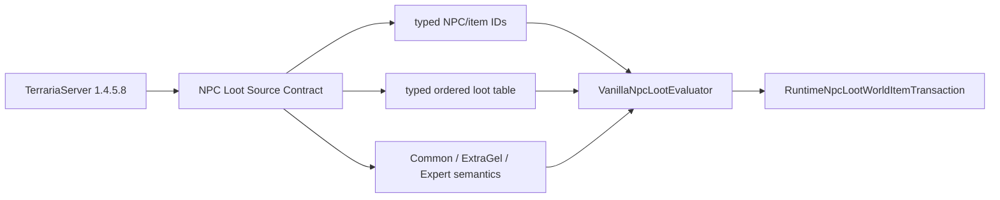
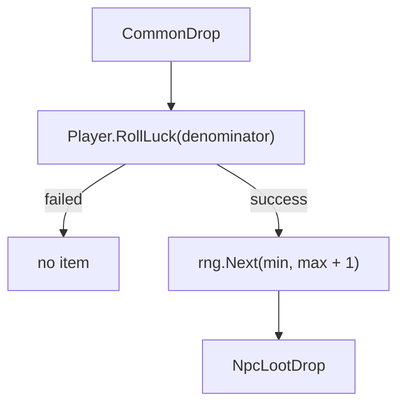

# Source-backed NPC loot rules

TerraRuntime's first NPC-loot slice implements the NPC-specific standard-slime rules for Blue Slime from the pinned TerrariaServer 1.4.5.8 source. It does **not** claim that every global, world-condition, event, bestiary or chained vanilla drop layer is implemented yet.

## Source contract

The dedicated `NPC Loot Source Contract` workflow downloads the official 1.4.5.8 server, selects the exact Windows assembly with SHA-256

`d87e3faf08637f6be8882c63e7f11fb7e792b0230006309618473ece0f863e1e`,

and decompiles only the item-drop classes required by this slice.

The verified Blue Slime NPC-specific rule sequence is:

1. `Gel(1, 1, 2)`;
2. `NormalvsExpert(SlimeStaff, 10000, 7000)`.

Named identities are also pinned from the official ID tables:

- `BlueSlime = 1`;
- `Gel = 23`;
- `SlimeStaff = 1309`.

## Why the rule is not a flat probability table

`ItemDropRule.Gel(1, 1, 2)` creates two luck-scaled `CommonDrop` branches and wraps them in `DropBasedOnExtraGel`:

- normal branch: stack range `1..2`;
- `DropExtraGel` branch: stack range `2..4`.

The loot engine therefore receives the semantic `DropExtraGel` condition result explicitly. It does not guess why Terraria enabled that condition.

`NormalvsExpert` selects between two `CommonDrop` rules through `DropAttemptInfo.IsExpertMode`:

- normal denominator: `10000`;
- expert-mode denominator: `7000`.

The denominator is passed to `Player.RollLuck`. The effective Slime Staff probability therefore depends on Terraria player-luck semantics; TerraRuntime does **not** replace that with an implicit process-wide `Random.Next(denominator)` approximation.

## CommonDrop call order

The pinned source contract verifies this order:

For a successful stack roll, the upper bound is inclusive in vanilla because the random call uses `max + 1` as its exclusive bound.

For the Gel wrapper the ranges are therefore

$$
S_{normal} \in \{1,2\}, \qquad
S_{extra} \in \{2,3,4\}.
$$

## Typed table boundary

`VanillaNpcLootRuleCatalog.TryGetNpcSpecificTable` is the authoritative support boundary. It returns a `VanillaNpcLootTable` containing:

- the typed `NpcTypeId` that owns the table;
- the immutable source-registration-order rule view;
- `RuleCount`;
- `MaximumDropCount`, derived from admitted rule semantics rather than assuming that the number of rules always equals world-item capacity.

This distinction matters. Lookup failure means **unsupported**. A future source-verified NPC may legitimately have an imported table containing zero NPC-specific rules, and that must not be confused with an unknown NPC merely because both cases expose an empty rule span.

`GetNpcSpecificRules` remains only as a compatibility view. New authoritative code uses the typed table boundary.

## Runtime evaluation and transaction ownership

`VanillaNpcLootEvaluator` is allocation-free on the evaluation path:

- the caller supplies a `Span<NpcLootDrop>`;
- `INpcLootRollSource.RollLuck` owns player-luck semantics;
- `INpcLootRollSource.NextInt32` owns the RNG stream;
- `VanillaNpcLootContext` supplies `IsExpertMode` and the semantic `DropExtraGel` condition result;
- `TryEvaluateNpcSpecificTable` consumes a validated typed table directly.

`RuntimeNpcLootWorldItemTransaction` resolves the same typed table before any loot RNG is consumed. It preflights materializer support and reserves `MaximumDropCount` world-item capacity, then evaluates and materializes successful rules in exact registration order. This preserves the verified shared `Main.rand` ordering between loot rules and `Item.NewItem` behavior.

Loot rule evaluation itself still does not own world-item state. The transaction owns slot reservation/commit, while `VanillaNpcLootWorldItemMaterializer` owns source-backed item spawn defaults and prefix/velocity RNG.

## Fail-closed scope

An NPC without an imported NPC-specific table is unsupported rather than receiving guessed generic drops. The current catalog intentionally contains only Blue Slime.

This slice also does not claim full Blue Slime vanilla loot parity. Global and conditional rules outside the verified standard-slime registration layer must be imported separately from official source before they can participate in authoritative drops.

## Verification

`VanillaNpcLootRuleTests` covers:

- exact table owner, rule order, constants and maximum-drop capacity;
- explicit unsupported-table behavior;
- normal vs `DropExtraGel` stack ranges;
- normal vs expert-mode Slime Staff denominator selection;
- `RollLuck` before stack RNG;
- output order when both rules succeed;
- fail-closed behavior for unsupported NPCs and undersized output buffers.

`RuntimeNpcLootWorldItemTransactionTests` additionally covers generation safety, capacity exhaustion, unsupported materialization, shared RNG ordering and exact world-item staging/commit behavior.

The permanent gameplay acceptance workflow executes `NpcLoot` tests, while the dedicated source-contract workflow independently re-verifies the official TerrariaServer evidence whenever loot code or tests change.

## Roadmap boundary

D6 `loot rules` is complete as an architectural/runtime boundary for the currently imported vanilla slice: rules are typed immutable data, tables explicitly encode support and capacity, evaluation is separated from world-item mutation, and source/RNG order is executable proof. Expanding the number of imported NPCs and rule families remains parity work rather than a reason to keep the decomposition task open forever. Humans do enjoy checkboxes that can never become true; this one now has an actual completion contract instead.
