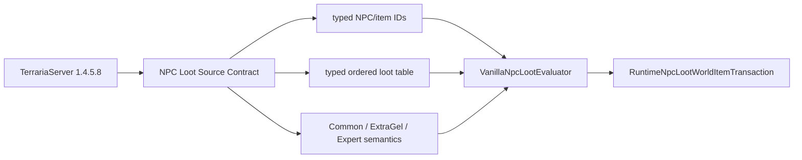
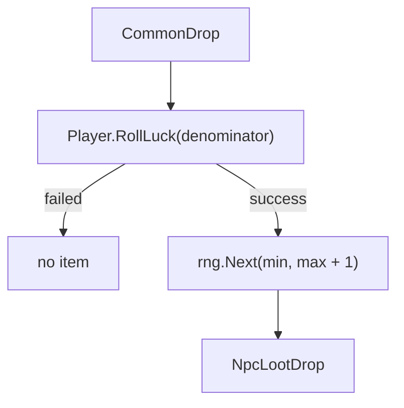

# Source-backed NPC loot rules

Eleventh integrated local acceptance: 1553881/1553882 tests, zero failures/errors, one existing worldgen skip; clean Release rebuild, Windows NativeAOT/five smokes and local gates. See [NPC parity checkpoint](../roadmap/npc-ai-parity.md). Earlier candidate/pending notes below are historical for their respective checkpoints. Full gameplay/NPC parity remains open.

Tenth integrated local acceptance: 1474709/1474710 tests, zero failures/errors, one existing worldgen skip; clean Release rebuild, Windows NativeAOT/five smokes and local gates. See [NPC parity checkpoint](../roadmap/npc-ai-parity.md). Earlier candidate/pending notes below are historical for their respective checkpoints. Broad parity remains open.

Skeletron's actual death pipeline now passes the committed head's RedHat marker into the existing loot evaluator. When `ai[3] == 1`, the five source-registered vanity items (`5624`, `5625`, `5626`, `5737`, `5628`) are world drops in Classic, Expert and Master; the hand-style local marker does not enable head rewards. Nine pipeline regressions verify packet-21 delivery to all registered players and no duplicate rewards after a stale repeat kill. This closes the previously disconnected condition, without claiming full encounter or all loot-position/modifier parity.

TerraRuntime's first NPC-loot slice implements the NPC-specific standard-slime rules for Blue Slime from the pinned TerrariaServer 1.4.5.8 source. It does **not** claim that every global, world-condition, event, bestiary or chained vanilla drop layer is implemented yet.

## Source contract

The dedicated `NPC Loot Source Contract` workflow downloads the official 1.4.5.8 server, selects the exact Windows assembly with SHA-256

`d87e3faf08637f6be8882c63e7f11fb7e792b0230006309618473ece0f863e1e`,

and decompiles only the item-drop classes required by this slice.

The verified Blue Slime NPC-specific rule sequence is:

1. `Gel(1, 1, 2)`;
2. `NormalvsExpert(SlimeStaff, 10000, 7000)`.

Named identities are also pinned from the official ID tables:

- `BlueSlime = 1`;
- `Gel = 23`;
- `SlimeStaff = 1309`.

```mermaid
flowchart LR
    Official["TerrariaServer 1.4.5.8"] --> Probe["NPC Loot Source Contract"]
    Probe --> IDs["typed NPC/item IDs"]
    Probe --> Tables["typed ordered loot table"]
    Probe --> Semantics["Common / ExtraGel / Expert semantics"]
    IDs --> Runtime["VanillaNpcLootEvaluator"]
    Tables --> Runtime
    Semantics --> Runtime
    Runtime --> Tx["RuntimeNpcLootWorldItemTransaction"]
```

## Why the rule is not a flat probability table

`ItemDropRule.Gel(1, 1, 2)` creates two luck-scaled `CommonDrop` branches and wraps them in `DropBasedOnExtraGel`:

- normal branch: stack range `1..2`;
- `DropExtraGel` branch: stack range `2..4`.

The loot engine therefore receives the semantic `DropExtraGel` condition result explicitly. It does not guess why Terraria enabled that condition.

`NormalvsExpert` selects between two `CommonDrop` rules through `DropAttemptInfo.IsExpertMode`:

- normal denominator: `10000`;
- expert-mode denominator: `7000`.

The denominator is passed to `Player.RollLuck`. The effective Slime Staff probability therefore depends on Terraria player-luck semantics; TerraRuntime does **not** replace that with an implicit process-wide `Random.Next(denominator)` approximation.

## CommonDrop call order

The pinned source contract verifies this order:

```mermaid
flowchart TD
    Rule["CommonDrop"] --> Luck["Player.RollLuck(denominator)"]
    Luck -->|failed| NoDrop["no item"]
    Luck -->|success| Stack["rng.Next(min, max + 1)"]
    Stack --> Drop["NpcLootDrop"]
```

For a successful stack roll, the upper bound is inclusive in vanilla because the random call uses `max + 1` as its exclusive bound.

For the Gel wrapper the ranges are therefore

$$
S_{normal} \in \{1,2\}, \qquad
S_{extra} \in \{2,3,4\}.
$$

## Typed table boundary

`VanillaNpcLootRuleCatalog.TryGetNpcSpecificTable` is the authoritative support boundary. It returns a `VanillaNpcLootTable` containing:

- the typed `NpcTypeId` that owns the table;
- the immutable source-registration-order rule view;
- `RuleCount`;
- `MaximumDropCount`, derived from admitted rule semantics rather than assuming that the number of rules always equals world-item capacity.

This distinction matters. Lookup failure means **unsupported**. A future source-verified NPC may legitimately have an imported table containing zero NPC-specific rules, and that must not be confused with an unknown NPC merely because both cases expose an empty rule span.

`GetNpcSpecificRules` remains only as a compatibility view. New authoritative code uses the typed table boundary.

## Runtime evaluation and transaction ownership

`VanillaNpcLootEvaluator` is allocation-free on the evaluation path:

- the caller supplies a `Span<NpcLootDrop>`;
- `INpcLootRollSource.RollLuck` owns player-luck semantics;
- `INpcLootRollSource.NextInt32` owns the RNG stream;
- `VanillaNpcLootContext` supplies `IsExpertMode` and the semantic `DropExtraGel` condition result;
- `TryEvaluateNpcSpecificTable` consumes a validated typed table directly.

`RuntimeNpcLootWorldItemTransaction` resolves the same typed table before any loot RNG is consumed. It preflights materializer support and reserves `MaximumDropCount` world-item capacity, then evaluates and materializes successful rules in exact registration order. This preserves the verified shared `Main.rand` ordering between loot rules and `Item.NewItem` behavior.

Loot rule evaluation itself still does not own world-item state. The transaction owns slot reservation/commit, while `VanillaNpcLootWorldItemMaterializer` owns source-backed item spawn defaults and prefix/velocity RNG.

## Fail-closed scope

An NPC without an imported NPC-specific table is unsupported rather than receiving guessed generic drops. The current catalog intentionally contains only Blue Slime.

This slice also does not claim full Blue Slime vanilla loot parity. Global and conditional rules outside the verified standard-slime registration layer must be imported separately from official source before they can participate in authoritative drops.

## Verification

`VanillaNpcLootRuleTests` covers:

- exact table owner, rule order, constants and maximum-drop capacity;
- explicit unsupported-table behavior;
- normal vs `DropExtraGel` stack ranges;
- normal vs expert-mode Slime Staff denominator selection;
- `RollLuck` before stack RNG;
- output order when both rules succeed;
- fail-closed behavior for unsupported NPCs and undersized output buffers.

`RuntimeNpcLootWorldItemTransactionTests` additionally covers generation safety, capacity exhaustion, unsupported materialization, shared RNG ordering and exact world-item staging/commit behavior.

The permanent gameplay acceptance workflow executes `NpcLoot` tests, while the dedicated source-contract workflow independently re-verifies the official TerrariaServer evidence whenever loot code or tests change.

## Roadmap boundary

D6 `loot rules` is complete as an architectural/runtime boundary for the currently imported vanilla slice: rules are typed immutable data, tables explicitly encode support and capacity, evaluation is separated from world-item mutation, and source/RNG order is executable proof. Expanding the number of imported NPCs and rule families remains parity work rather than a reason to keep the decomposition task open forever. Humans do enjoy checkboxes that can never become true; this one now has an actual completion contract instead.

## Ordered global drop family

`VanillaNpcGlobalLoot1458` owns the remaining seventeen registered globals after MechBossSpawners and SlimeBody. The order is Halloween weapons, six biome keys, Goodie Bag, Present, Living Fire, Light/Night souls, Pirate Map, then Cascade, Amarok, Yelets and Hel-Fire. This includes the four yoyo registrations outside `RegisterGlobalRules`; the official database has nineteen globals in total.

Each successful offer materializes immediately before the next rule. CommonDrop consumes its stack draw even for a fixed stack of one. The Bladed Glove child runs only after the Bloody Machete's failed random roll, never after a failed condition. Souls deliberately retain the source simulation exception and Remix depth exception; Desert Key excludes Beach. Pirate Map uses the live floating NPC center for eligibility and the truncated integer body for the physical drop origin. Boss eligibility reads the generalized `VanillaNpcSourceMetadata1458` source table, not the catalog's semantic boss role.

The context distinguishes unowned nullable difficulty, friendliness, seasons, zones, depth and progression from known facts. It rejects an offer whose eligibility can change under those unknowns before any luck/stack draw. Known false holidays do not require a Journey difficulty override. Root composition captures the closest player's genuine zones/luck, live NPC combat/body/value and world facts. Metadata-backed hosts capture local calendar once plus retained forced flags; explicit detached world contexts retain their supplied seasons. Force-for-today activation/reset and other seasonal producer lifecycles remain outside this closure.

The permanent source evidence contains 4335 direct rows, 324 sparse defaults/prefix rows and 8790 actual original item→money→healing callback sequences. Those full sequences use admitted Blue/Lava/Ice/Spiked Ice/Sand slime profiles; Zombie, Meteor Head, Slimer and Spiked Slime individual tables remain separate work. Predicate-only rows still cover their genuine global exclusions. Independent original calendar methods cover 5856 date/force combinations with only their two DateTime.Now input reads substituted; 696 original defaults preserve boss/face metadata.

Copied production passes 20,005 checks. Omitting globals fails 12,208 assertions; skipping fixed stack draws 4236; removing Beach, Remix and NPC exclusions fails 306, 153 and 51; losing weapon prefixes 425; removing glove rounding 18; starting Halloween one day early 4. A separate missing-friendly admission control fails one direct pre-luck assertion. Each control reports zero runner errors. Full ninth-package local acceptance is complete: 1447626 tests pass, zero failures/errors, one pre-existing worldgen skip; Windows NativeAOT/five smokes and all local gates pass with unchanged source inputs. CI is asynchronous by explicit user request.

## Ordinary NPC-specific tables

The tenth family admits the complete original tables for Zombie3, Meteor Head23 and Spiked Slime535, plus the verified empty Slimer121 table. Zombie order is Shackle216/50, Zombie Arm1304/250, Spiffo5332/1500, then conditional Sickle1786/15. Meteor Head offers Meteorite116/50 then Sea of Silence5486/100. Spiked Slime uses Gel1..2 followed by Staff10000/7000. Each successful common rule still consumes its fixed-stack draw before immediate materialization. Verified empty lookup is distinct from an unsupported NPC.

Sickle eligibility owns nullable `LowTiles` and `HasSickle` facts. The latter means the source inventory-or-open-Void-Bag predicate. `LowTiles=false` or `HasSickle=true` proves no offer without needing the other fact; otherwise missing facts reject the entire table before any luck draw. A Skyblock metadata flag does not establish the dynamically scanned source low-tiles value. Live persisted Skyblock remains selectively fenced unless an actual low-tiles lifecycle provider is supplied. Inventory and available open-Void-Bag contents are generation-owned, and death admission checks their captured serial.

Independent evidence contains11,550 original item/money/healing sequences and108 original defaults/prefix rows. The production copied graph passes11,670 checks. Source-copy omission of Spiffo fails3,455 assertions; skipping fixed-stack RNG fails862; accepting unknown Sickle facts fails3. Each control has zero runner errors. The696-type original table audit grants no capability to its other unimported tables. Tenth integrated acceptance is recorded above.

## Ordinary undead tables (eleventh slice)

The catalog represents the complete registered individual tables for23 Zombie and20 Skeleton identities. All43 have pure table support;32 already have actor definitions, while11 retain their separate actor/AI boundary. Failed-random-roll alternatives stop on success or failed conditions. Options draw their selection without a CommonDrop stack draw. Food remains earlier and statue-gated. NPC635 has no Hook;34 has separate Cream Soda and late Nazar Expert rerolls. Slime Zombie187/433 Gel/Staff and Eskimo Zombie161/431 options precede shared Zombie rewards.

Dynamic lowTiles and exact inventory/open-Void-Bag Sickle facts apply to all23 Zombies. Wood for188/189/434/435 independently requires known lowTiles; Sickle possession does not establish it. Effective Expert includes GoodWorld promotion; ExtraGel uses tenth-anniversary/drunk/non-Remix/non-bees facts. Unknown relevant facts fence the table before RNG. The16 local-drop bound remains unchanged.

Independent39,642 dedicated-HitEffect→original-items→money→heals sequences verify all19 global checkpoints, every rare output, physical drops/prefixes and final RNG. Copied Gameplay controls fail354 for continuing after chain success,2966 for late Slime Zombie rewards,264 for omitted options draws,8 for unconditional Expert rerolls,4 for fabricated Wood absence and20 for missing Bone Sword prefixes; each runs40,190 checks with zero runner errors. Restored focused acceptance is40,190/40,190; integrated eleventh local acceptance is recorded above.

The39,642-row callback matrix deliberately invokes the private item/money/healing phases and therefore does not establish full NPCLoot admission. A separate39,642-row original HitEffect→actual NPCLoot-wrapper capture preserves the prelude:3354 rows return without items (1170 statue rows and2184 GoodWorld dungeon rows). These expectations come from executing the original wrapper, not from filtering the callback output with our evaluator. Fresh source interaction masks are empty, matching the environment-lethal fixtures; other interaction/banner histories require their own lifecycle evidence.

The full wrapper fixture now contains39,978 actual calls: the original39,642 profiles plus336 loaded-baseline cases. GoodWorld dungeon actors31/32/294 with source Skeletron-down baseline produce144 positive sequences;192 Hardmode statue3/21 cases separately cover empty and positive interaction masks, including24 accepted statue rewards. None of the43 undead identities has the source NoEarlymodeStatue flag. Consequently a separate two-row NPC82 proof checks only the already-owned first Halloween global: original NPCLoot at seed1417 produces zero Goodie Bags before Hardmode and one after Hardmode. It grants no NPC82 individual-table or full-death/RNG parity. Statue-rarity evaluation may consume NextFloat before returning; early returns must preserve the captured RNG rather than assume no draws.

## Ordinary Pirate rewards

The four original individual tables for Deckhand212, Corsair213, Deadeye214 and Crossbower215 share the same34 ordered common rules. Captain216 has seven ordered offers:905/1000,855/500,854/250,2584/250,3033/125,672/50 and5460/50. Each successful offer consumes the source stack draw and immediately materializes its item, natural prefix and velocity before the next offer. All Captain outputs reuse the existing verified sparse invasion world-drop definitions; this does not grant unrelated item-use capabilities.

Parrot252 and Pirate Ghost662 have independently verified empty individual tables. Empty lookup does not skip globals, money, healing or death producers. Populated source evidence also records the empty Cannon492 table and twelve Flying Dutchman491 rules, but those linked actors and ship rewards remain outside this catalog's admission. A supported table alone does not enable an NPC's AI or natural selection. The ordinary Pirate event slice must preserve selected unsupported ship refusal rather than substitute another Pirate; complete Pirate encounters are not claimed.

Independent evidence records nine actual populated tables and49 direct resolver→original NewItem callback sequences across Classic, Expert and GoodWorld profiles, including selected successes for every Captain output. Seven existing item snapshots retain their defaults and natural-prefix offers. This fixture proves the individual-table phase, not a whole dedicated death: Captain's Ghost continuation belongs to the separately retained death-event owner after specific drops and before money/healing. Six focused Facts pass in an isolated graph; copied omissions of shared tables, Captain order/chance and the verified empty Ghost table produce3/2/2/2 assertion failures with zero runner errors, and the restored graph passes all six. Combined checkpoint acceptance remains separate.
