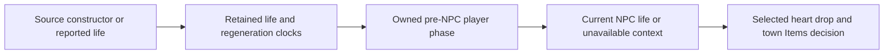

# Owned NPC health context and physical producers

[Русский](../ru/npc-owned-health-and-producers-1458.md) · [NPC roadmap](../roadmap/npc-ai-parity.md)

This checkpoint joins three NPC dependencies: continuous player-life context, the Guide Doll death operation, and physical AI001 herb/web offers. Support follows executable TerrariaServer 1.4.5.8 evidence and explicit owner admission; broad NPC parity remains open.

## Current life for NPC decisions

NPC healing drops and town Items topics need the current source life, not an indefinitely retained packet16 report. `PlayerNpcHealthState1458` retains NPC-facing integer life and the source regeneration count/time separately from reported combat health. Genuine constructor state starts at 100 with zero clocks; packet16 replaces life without resetting those clocks. A missing imported clock cannot be reconstructed from another health report. Ordinary transfers retain explicit provenance; respawn and accepted Hurt follow their source clock/health transitions.

The pre-NPC player phase handles the admitted remote regeneration and represented Regeneration, Poison, OnFire, CursedInferno and Lifeforce context, including source ghost/dead/outside ordering. Remote DoT may produce negative life without the separately local death call. Equipped regeneration, unsupported buffs/unlocks, environmental writers and unowned grappling remain selectively unavailable. Known empty owned projectile context establishes the absence of a hook; an unknown active actor-owned projectile does not. Missing world provenance never implies ordinary non-Vampire rules.

## Guide Doll admission

The supported one-Guide operation stages exact-generation doll removal as the first entry of the same allocation plan as death drops. This frees the source item slot before loot allocation. Lethal damage, selected player dependencies and the prospective Wall spawn are validated before adopting the operation. Rejection retains the doll, Guide and gameplay RNG. Accepted publication preserves removal before the source strike/death sequence, then the admitted Wall continuation.

No-Guide burns remain supported. Multiple Guides or a stacked doll with additional town victims require an ordered multi-death transaction and remain explicitly unavailable before item consumption. Original multi-victim outcomes remain reference evidence; runtime refusal is an admission boundary, not a claim that vanilla refuses those burns. This closes the single-Guide failure mode without declaring the broad stacked producer complete.

Town strikes now apply the source AI reset, direction and `Next(300)` before loot through the shared server/client combat boundary. Conversation-peer writes remain fenced when their ownership is unavailable. Guide loot additionally requires an exact-generation resident name: Andrew drops Green Cap before money; missing or stale identity rejects admission. Accepted doll removal uses packet151 before packet28.

## Herb and web offers

Contained Herb Slime placement uses the source terrain styles, placement conditions, coating/paint and success-only local clock increment. Web offers retain their selected coordinate, occupied/failed-placement behavior and source tile-square publication. Successful cobweb framing requires owned neighborhood context; unknown adjacent framing effects reject before adoption. Liquid queue membership matters even when the cell's liquid amount is zero.

World edits, parent NPC revision, source RNG and section/liquid facts belong to one admitted transition. `WorldGen.genRand` aliases `Main.rand` in this version: web framing must advance the same source stream as NPC AI. Torch Slime's hostile status/DoT dependencies and broader neighboring framing remain open. Presentation-only effects are outside this server claim.

Producer tile-square delivery checks the source recipient section range, including all four source corners using `x + size` and `y + size`, and the current endpoint generation.

## Evidence

The shared checkpoint records actual original player sequences, burn/death outcomes and tile/RNG offers, with regression controls that restore the former mistakes. Focused results and final build/full-suite/NativeAOT acceptance are recorded in the [NPC roadmap](../roadmap/npc-ai-parity.md); this page does not independently claim full vanilla compatibility.
