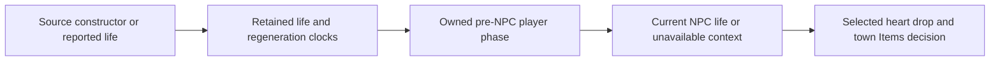

# Owned NPC health context and physical producers

[Русский](../ru/npc-owned-health-and-producers-1458.md) · [NPC roadmap](../roadmap/npc-ai-parity.md)

This checkpoint joins continuous player-life context, the ordered Guide Doll operation, bound slime statuses and physical AI001 herb/web offers. Support follows executable TerrariaServer 1.4.5.8 evidence and explicit owner admission; broad NPC parity remains open.

## Current life for NPC decisions

NPC healing drops and town Items topics need the current source life, not an indefinitely retained packet16 report. `PlayerNpcHealthState1458` retains NPC-facing integer life and the source regeneration count/time separately from reported combat health. Genuine constructor state starts at 100 with zero clocks; packet16 replaces life without resetting those clocks. A missing imported clock cannot be reconstructed from another health report. Ordinary transfers retain explicit provenance; respawn and accepted Hurt follow their source clock/health transitions.

The pre-NPC player phase handles the admitted remote regeneration and represented Regeneration, Poison, OnFire, CursedInferno and Lifeforce context, including source ghost/dead/outside ordering. Remote DoT may produce negative life without the separately local death call. Equipped regeneration, unsupported buffs/unlocks, environmental writers and unowned grappling remain selectively unavailable. Known empty owned projectile context establishes the absence of a hook; an unknown active actor-owned projectile does not. Missing world provenance never implies ordinary non-Vampire rules.

## Guide Doll admission

The whole ordered operation stages exact-generation doll removal and every selected death on one source item-allocation claim. It handles multiple Guides in ascending live slot order, an in-loop Wall birth after the first Guide, and random town victims without replacement for the remaining stack. The source explicitly records a bestiary kill before each strike. Guide names belong to exact resident generations: Andrew produces Green Cap before money. Rejection retains the doll, all victims, bestiary state and gameplay RNG.

No-Guide burns consume the item without consulting unrelated name or health facts. Additional admitted town victims use independently verified empty tables or the [owned registered town reward tables](town-npc-death-rewards-1458.md). Named rewards require exact resident generations and an owned loot-language profile; missing actor/default/name/locale provenance rejects the whole operation before its first live effect. The ordered coordinator does not admit the Travelling Merchant actor or complete other AI families. Removal uses packet151 before the actual strike/death sequence.

Town strikes share source direction, AI reset and `Next(300)` ordering with the other combat paths. The detached preview preserves item metadata, source RNG checkpoints, player/inventory context, progression, clocks, resident identities and source slot generations. Its final guard runs before removal, damage, credit or publication, including pure owner checks after external callbacks. The terrain-version vector has a bounded runtime admission ceiling of 1024 sections; ordinary source worlds need at most 672. Angler, pets and town slimes consume the four source dedicated-server death choices before the prelude and loot, despite particle suppression.

## Slime status and lethal debuffs

Bound Blue/Lava Slime phases retain status aging, source flags, regeneration counters and dedicated-server visual RNG before AI on the same speculative stream. Torch Slime in Good World installs its own Fire buff for `216000` ticks and source immunities; it does not burn nearby actors. Its special Fire suppression, positive regeneration from represented contained items, and water removal follow the original phase order. Unbound or unrepresented contexts remain unavailable.

A lethal admitted pulse completes the original `GetHurtByDebuff` path: prepare counter and life1, admit the entire death, publish expiry54 before the real strike28 with damage9999, finish owned death/loot, then consume visual RNG. The original HP and buff duration remain unchanged if allocation or a phase dependency refuses admission. Prepared state does not mutate the live actor before acceptance.

## Herb and web offers

Herb placement retains the source terrain styles, placement conditions, coating/paint and success-only local clock increment. Web placement owns the x-major surrounding frame pass, connected Cobweb attachment masks and runtime frame bank, inactive cleanup, source edge skips and bounded recursive liquid deaths. `WorldGen.genRand` aliases `Main.rand`; framing and drops advance that same stream. Successful liquid death publishes source item21/22, kill17 and final tile square20 in source order.

Cobweb frameNumber is runtime state, absent from `.wld`. Canonical source loading establishes zero; arbitrary imports do not. Sparse retained claims are invalidated by every ordinary tile write, including equal-byte writes, and never reconstructed from frame coordinates. Tile/section bytes, bank claims, queue membership/counts, NPC protection context, parent revision, item allocation and RNG belong to one admitted transition.

Cosmetic recursion preserves source depth25 and L/R/U/D ordering; a separate runtime budget of 4096 calls bounds admission. Active non-Web frame callbacks, unsupported shapes, mixed Echo visibility, unowned banks, near-capacity liquid queues and unknown AI013 tile-protection history remain fenced before adoption. No AI013 writer is currently admitted; admitting one will require a phase-owned clear/protection history rather than a current actor census. These boundaries preserve the original operation rather than partially consuming it. Producer tile-square delivery retains the source four-corner section range and current endpoint generations.

## Evidence

Independent evidence includes 960 whole Doll outcomes and the 40-town original loot registry, 400 town HitEffect calls and 72 complete Angler/pet/slime batches, 14 slime status sequences/346 outer phases, 24 complete lethal updates, and 102 Web profiles. The Web profiles retain 70 exact original AI/outer comparisons and 32 whole-transition refusals for independently identified unowned paths. Metadata covers 768 mask/bank combinations and all 754 tile identities for attachment and frame importance. Original cold-load evidence proves bank2 becomes zero through loading/liquid startup; it does not claim the wet Web survives startup. Copied regression controls restore wrong credit, victim selection, status/counter/RNG ordering and dependency checks. Final build, full-suite and NativeAOT results are recorded in the [NPC roadmap](../roadmap/npc-ai-parity.md). The [complete NPC source inventory](npc-source-inventory-1458.md) measures remaining definition coverage; this page does not claim full vanilla compatibility.
