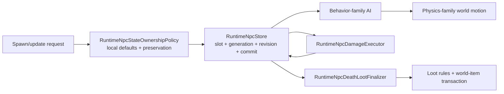

# NPC runtime ownership boundaries

[Русский](../ru/npc-runtime-ownership.md) · [NPC behavior families](npc-behavior-families.md) · [Gameplay decomposition roadmap](../roadmap/gameplay-decomposition-and-catalogs.md)

TerraRuntime keeps NPC storage, spawn/default materialization, AI, physics, combat and loot as separate ownership layers. The point is not directory decoration. Each layer must be able to evolve without teaching the slot store about vanilla combat rules or teaching physics about concrete NPC content IDs.

## Spawn and local state

`RuntimeNpcStore` owns addressable slots, active state, generation/revision monotonicity, snapshots and commit ordering. It no longer owns Terraria definition lookup or vanilla local-state defaults.

`RuntimeNpcStateOwnershipPolicy` owns the current verified spawn/update rules for fields that are not packet identity:

- definition-backed `Life/LifeMax` materialization;
- default active lifetime (`TimeLeft`);
- initial sprite direction;
- preservation of combat/lifetime/presentation state when an AI/state update deliberately leaves those fields unspecified.

This keeps storage generic while preserving the existing sentinel contract (`LifeMax == 0`, `TimeLeft == -1`, compatible zero sprite direction ingress).

## AI family versus physics family

`VanillaNpcBehaviorFamily` and `VanillaNpcPhysicsFamily` are intentionally separate metadata. Sharing an AI implementation does not automatically prove shared collision, platform, gravity or obstacle behavior.

Current verified mappings are:

| NPC | behavior family | physics family |
| --- | --- | --- |
| Blue Slime | `SlimeGround` | `SlimeGround` |
| Demon Eye | `FlyingEye` | `FlyingEye` |
| Zombie | `GroundFighter` | `GroundFighter` |

The names currently line up because the admitted slice is small. They remain different fields so future source-backed definitions can diverge safely.

`VanillaNpcWorldMotionAiStepper` dispatches special movement and platform behavior from `PhysicsFamily`, not from `NpcTypeId`. `VanillaNpcGravity` accepts a resolved definition as its authoritative gameplay overload; raw/typed ID overloads remain compatibility boundaries and resolve the definition before entering the physics implementation.

## Combat and loot

Combat remains owned by `RuntimeNpcDamageExecutor` plus `VanillaNpcDamageResolver`. Lethal damage commits `Life = 0` and does not despawn or roll loot inside the damage resolver.

Death/loot remains owned by `RuntimeNpcDeathLootFinalizer`, `VanillaNpcLootRules`, the vanilla world-item materializer and the generation-safe loot transaction. The store therefore does not know drop tables, prefix RNG or world-item capacity semantics.

## D4 completion boundary

The roadmap item `spawn/physics/combat/loot separation` is considered complete for the currently admitted authoritative NPC slice because:

- slot storage no longer contains vanilla definition/default materialization;
- physics dispatch no longer branches on concrete Blue Slime/Demon Eye/Zombie IDs;
- combat and death/loot already execute through distinct generation-safe components;
- tests pin catalog family selection and local-state ownership behavior;
- future definitions must explicitly opt into behavior and physics families.

This does not claim complete Terraria NPC support. Boss/town boundaries and removal of all remaining raw NPC IDs/AI-style values are separate D4 items and remain open.
