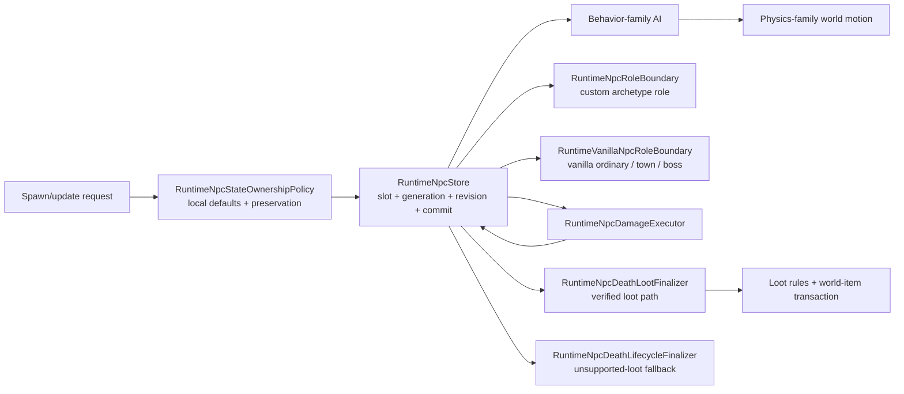

# NPC runtime ownership boundaries

Destroyer (`134`, AI `37`) retains the source `localAI[0]` digging marker alongside `localAI[1]`. A digging-marker transition produces an explicit, source-scoped forced NPC update; TerrariaServer sets `netUpdate` at that exact branch, so the runtime bypasses the ordinary 30-tick packet-23 cadence only for it. AI_037 also sets `netUpdate` when a Destroyer Body clears its laser counter, passes `Collision.CanHit`, and creates a Death Laser. The executor now forces packet 23 for that exact planned laser intent, but not when the counter merely resets behind a blocked line of sight. Duke Fishron (`370`, AI `69`) uses the same opt-in path when source `netUpdate` is written: retained-target refresh beyond the 5600-pixel guard and known root-phase transitions. Sharkron and Sharkron2 (`372/373`, AI `71`) likewise force the update only after a retained-target refresh or at the 90-tick emergence-to-charge transition; their refresh preserves the source `TargetClosest(false)` direction reset to `1`. Counter updates remain on the ordinary cadence. Focused runtime regressions cover marker entry/exit, both laser visibility branches, Duke/AI71 update boundaries and the emitted `ForcedUpdate` lifecycle event.

Prime Saw (`129`, AI `33`) and Prime Vice (`130`, AI `34`) now follow the original hover bands, pursuit, vertical attacks, repeated Vice charges, Saw tracking phase, and distance-based return transitions. Return transitions precede phase dispatch. Parent phase `3` encourages despawn only in the source hover branches. Physical flags and hit state remain unchanged by these branches.

Independent original Windows/Linux captures cover $9520\,\text{calls/platform}$ across difficulty, Good World, parent phases, attack counters, velocity signs, physical flags, active-parent type validation and inactive-parent near/far geometry. Tests compare complete retained NPC state and RNG; eight additional tests check stale proposals and replacement during removal. All $9408\,\text{initial regression cases}$ failed on the previous implementation. The native protocol smoke exercises both melee strategies. Invalid-parent removal commits only despawn and retains the four dedicated-server gore RNG draws. The runtime now passes a bounded retained-slot view alongside ordinary active peers, so an inactive parent still drives the source distance transition. Alternative player body geometry, inactive/ghost target projection, consecutive encounters and outer NPC movement remain unverified.

Prime Cannon (`128`, AI `35`) and Prime Laser (`131`, AI `36`) now use separate source phase rules for movement, rotation, target handoff, despawn encouragement and firing clocks. The cannon's idle shot points away from its parent attachment point; its active movement reads the retained target before selecting the next shooting target. The laser preserves its distinct idle and active thresholds, including the phase-`3` branch. State transitions preserve physical flags that these AI branches do not own.

Projectile planning for these arms consumes no RNG. After the exact source revision commits, the effect consumes the two source spread draws and allocates the bomb or laser from the pre-movement physical center. Full projectile storage still consumes the draws and retains the reset firing clock. A newer source revision or replacement generation cannot receive the old shot. Orphan removal publishes only the final despawn; its dedicated-server `HitEffect` still consumes four `Next(61,64)` calls, which are preserved before removal. A replacement during those calls survives.

Independent Windows and Linux captures cover $3456\,\text{initial calls/platform}$, $6912\,\text{geometry/target/flag calls/platform}$, $96\,\text{sequences/platform}$ of eight consecutive calls, and $60\,\text{parent cases/platform}$. Checks compare retained NPC state, projectile positions/velocities/keys/lifetime and the full RNG state. The native protocol smoke exercises both arms through committed creation. These captures isolate arm AI with the parent frozen; complete Prime encounters, remaining melee projection gaps, Mech Queen behavior, raw inactive-player projection, outer movement and full projectile update/network cadence remain open.

Creation scaling for Skeletron, Prime, Destroyer, Probe, Dark Caster, Water Sphere and the two demon types now follows the original host platform's arithmetic. Windows retains wider products before integer conversion, the source Single store between the two life adjustments and final rounding, and wider damage/knockback expressions. Multiplayer balance rounds at the original output stores. Linux retains its own Single boundaries. The default `VanillaNpcSpawnDefaults.TryResolve` selects the host platform; its explicit `windowsArithmetic` overload permits verification of either original on either host.

Independent captures retain $14400\,\text{creations/platform}$ across fifteen types, fractional difficulty, Good World, Hardmode, Plantera, active Skeletron and player counts through $255\,\text{players}$. Both arithmetic paths compare against the originals without tolerances. Existing creation/RNG/phase suites also retain separately captured Windows expectations. Prime's daytime speed calculation now preserves the Windows wider division/addition before its Single speed store; the original phase matrix checks the resulting velocity. The native protocol smoke exercises fractional head/hand health, large multiplayer Prime health and Hardmode sphere damage.

This closes the recorded fractional creation discrepancy for these profiles and retained contexts. Other NPC profiles, untested custom difficulty values, full boss encounters, outer lifecycle and complete network convergence still require independent verification.

Skeletron Head (`35`) now implements the RedHat hover/spin variants, source rotation and retained physical flags. RedHat advances the hover clock by $1.5\,\text{ticks/call}$, uses its own acceleration/speed factors and applies the source double-precision damage multiplier. Reflection and the ordinary Good World summon gate use the Expert-only hand count. At a hover transition, a due skull uses the target selected before phase handling; only then does the head select its next closest target and announce the taunt. A distant target is reacquired before deciding to flee.

Caster summons use a dedicated `IVanillaSkeletronEnvironment`, configured through `SetSkeletronEnvironment`. The owned-world adapter reproduces the bounded $1000\,\text{attempts}$, physical-center tile coordinates, solid-tile predicate and downward scan. Platforms, slopes, half bricks and actuated tiles do not stop this scan. It preserves the original empty-bottom and above-world outcomes. The source spin clock gates attempts every $200\,\text{ticks}$; the world-wide caster cap is four for RedHat and six for ordinary Good World. New casters retain target `255` and receive their marker when their own AI runs. A higher new slot runs later in the same ascending pass.

`INpcAiTauntCommitSink` publishes only accepted `SkeletronTaunt` variants `2` through `5`; the application uses the original localized red server message through packet `82`. `TryAnnounceSkeletronTaunt` checks the source revision after the random draw. The source-scoped `TrySpawn` overload checks ownership before creation callbacks and again after context/RNG evaluation, before allocation or publication. Skeletron summons and Dark Caster spheres use this path: rejected newer revisions or replacement generations retain accepted RNG draws without publishing a child.

Evidence includes $2443\,\text{isolated head calls}$, $96\,\text{five-call sequences}$, $1008\,\text{terrain/capacity cases}$, $144\,\text{head/caster passes}$, $32\,\text{target handoffs}$, $32\,\text{flag cases}$, $16\,\text{world-edge cases}$ and four original chat packets. Windows and Linux originals were both captured; platform-specific projectile arithmetic is retained where necessary. Tests compare full retained head/child state, projectiles and all RNG cells. These AI-only captures freeze unrelated actors and exclude outer `NPC.Update` movement/lifecycle. Full encounters, raw disconnected/ghost target projection, arbitrary hitboxes, remaining combat/loot modifiers and complete urgent network cadence remain open.

Skeletron's skull attack now consumes its four random draws and allocates the projectile after the head's accepted state transition. Speculative projectile planning consumes nothing. The committed effect uses the target selected before phase handling, the pre-movement head position/velocity, source cadence and double-precision health threshold. `INpcAiCommittedNpcMutationSink.TrySpawnProjectile` checks the expected source generation and revision before attaching provenance. A reentrant visibility query cannot spend draws for a superseded source; reentry during RNG retains the accepted draw prefix but cannot spawn for a newer source. Failed allocation retains the draws.

The skull's physical top-left position is derived from the original spawn center and catalog dimensions. Its initial AI is `(-1, 0, 0)`, damage is `17`, and lifetime is $300\,\text{ticks}$. Separate Windows x86/XNA and Linux/FNA captures retain $384\,\text{calls}$ each, varying difficulty, Good World, hand count, seed and target coordinates. Tests compare velocity without tolerance on both arithmetic paths and the host-selected committed spawn's position, AI, lifetime, provenance and complete RNG state. Windows intermediate arithmetic is reproduced explicitly; it is not a global change to all float calculations. Full encounters, arbitrary target hitboxes and wire-level convergence remain open.

Dark Caster (`32`) now has its dedicated-server AI-style-`8` implementation: first-head RedHat inheritance, retained local marker, target refresh, horizontal damping, attack clocks, queued teleport and Water Sphere creation. The bounded teleport search follows the original random attempts, floor/clearance predicates, dungeon-wall exception, lava branch and player exclusion. Successful selection resets the attack countdown before the current call can create a sphere. A sphere uses the caster's position after an already queued teleport but before outer movement; a newly allocated higher slot runs later in the same ascending pass. Another 48 original queries verify search windows touching the world boundaries and failed clearance near the world bottom, including their RNG consumption. Search windows outside owned tile storage fail closed.

Random-dependent AI fields finish after the source state is accepted and before its update is published. `INpcAiStatePostCommitEffect` can defer publication and complete the committed state through the revision-checked `TryUpdateAi` sink. Observers receive the final state; replacement or a newer revision during selection prevents stale publication and later effects. The accepted query's RNG prefix is retained. World motion still runs once. Sphere creation precedes the caster's dedicated-server dust-chance draw, including when allocation fails.

The original platform libraries differ in teleport player exclusion: Windows XNA correctly unions the current player rectangle with its predicted displacement, while the shipped Linux FNA aliases a `ref` input with the `out` result and loses positive displacement on each axis. Runtime selection follows the host platform. Both original servers were exercised independently; 600 queries per platform expose 40 differing results. This is separate from the native runtime's Windows/Linux build checks. Caster evidence also includes 4,800 isolated AI calls with byte-identical captures from the original Windows and Linux assemblies, 960 five-call traces, 96 coupled caster/sphere passes and 486 original firing-rectangle edge checks. Complete encounters, nonstandard player geometry, disconnected-target projection and other caster types remain separate unfinished work.

Vanilla creation now shares the world-owned NPC random stream with natural spawning and built-in AI. `SystemVanillaNpcRandom` uses the pinned 1.4.5.8 `UnifiedRandom` algorithm; hosts may inject the stream with `RuntimeNpcStore.SetVanillaSpawnRandomSource`. In Good World, both vanilla creation entry points consume one `Next(3)` before slot allocation, including an unsuccessful allocation. A nonzero result substitutes Bunny (`46`) with Explosive Bunny (`614`) and Demon (`62`) with Voodoo Demon (`66`). Selected-type defaults are resolved after substitution. Exact-slot `TrySpawn` does not perform this vanilla creation step.

The four creation definitions and difficulty profiles are verified independently. Both rabbits remain friendly with five life and retained difficulty `1`; demons begin with gravity enabled and use the ordinary verified scaling rules. Their AI, loot and complete gameplay remain separate unfinished work. Evidence includes 2,880 original creation calls checked through both entry points and six coupled creation → full-table failure → Water Sphere AI sequences, comparing the complete RNG state. The composition shares the stream with built-in AI; custom AI and other game systems still require their own verified integration before claiming whole-game `Main.rand` parity.

Burning Sphere (`25`) and Water Sphere (`33`) now share the verified AI-style-`9` path. Only an unassigned target (`255`) triggers initial aiming; an assigned dead, inactive or ghost target does not redirect an already moving sphere. The initial aim uses physical centers and the original division order. Good World boss presence changes launch speed and latches invulnerability, which stays enabled after boss removal. Each AI call caps the remaining lifetime at 100, advances the owned rotation by `0.4 * direction`, and retains `JustHit` and physical flags. Outer movement, lifetime retirement and the spawning caster are separate stages.

`NpcSimulationState.Rotation` is a nullable finite angle in radians: spawn defaults to zero, omitted updates retain the angle, explicit zero resets it, and changing NPC identity resets it. Water Sphere's two `Next(5)` calls occur only after the accepted state and planned spawns; they remain part of dedicated-server AI even though dust creation itself returns early. Burning Sphere has no corresponding draws. The shared AI executor also rejects a proposal whose source revision changed during planning, preventing a newer update from being overwritten. Generation replacement, invalid proposals and superseding commit observers leave this RNG continuation untouched.

Evidence comprises 5,760 isolated original AI calls and 144 five-call traces (720 calls) for both sphere types, with complete pre/post RNG state, target fallback and boss removal. Tests restore the independently captured post-creation stream position; the separate creation and coupled fixtures above establish the admitted `NewNPC` RNG integration. Tank-pet redirection, previous-target/negative-aggro facing, nonstandard player geometry and retained disconnected-player positions still need their full targeting-state projection. RedHat head summon/taunt ordering remains open.

Dark Caster (`32`) and Water Sphere (`33`) now have source-backed creation geometry, combat defaults, alpha and physical flags. The shared spawn context additionally samples Hardmode, Plantera progression and active Skeletron presence for each creation. Loaded world facts and committed progression both contribute; an active head with zero life still counts until removal. Good World head presence suppresses Hardmode scaling for both types and separately adjusts the caster's health and defense. Water Sphere remains an NPC with one life, not an entity in the projectile store. A retained fixture compares 784 original `NewNPC` results, including fractional difficulty, player counts and all three world conditions.

`NpcSimulationState.KnockBackResist` stores live resistance: null means unspecified, spawn materializes the definition or verified difficulty profile, state-only updates retain it, and changing type/net identity restores the new definition. Explicit zero is valid and disables knockback; negative or non-finite values are rejected. Combat consumes the committed value. `AlphaAtSpawn` supplies source transparency when no nonzero initial alpha was supplied. NPC slot-pressure weights and the RedHat head's ordered minion/taunt effects remain open; Dark Caster AI style `8` and sphere AI style `9` are covered above.

RedHat contact behavior, incoming damage and Skeletron loot now share `VanillaSkeletronCombat.HasRedHatAdjustments`: head/Water Sphere use `ai[3]`, hand/Dark Caster use `localAI[3]`, and only the exact value `1` enables the variant. The shared authoritative damage executor applies the original float `0.7` multiplier after ordinary defense/critical rounding, clamps the result to at least one and uses it for HP and knockback. The death pipeline reads the committed head marker when enabling the five guaranteed vanity drops; it no longer supplies a constant false condition.

Evidence includes 1,760 ordinary-range and 960 large-input original public `StrikeNPC` calls for Skeletron head/hand and non-variant controls, 54 original marker-predicate calls for all four affected types plus controls, and nine real death-pipeline cases across Classic/Expert/Master. Ordinary defense/critical math now uses source `double` precision before integer rounding; RedHat reduction remains `float`. Pipeline checks decode world-item packets for the killer, another player and a spectator and reject duplicate stale kills. Removing mitigation fails 306 checks, the old float defense calculation fails 450, and restoring the constant loot flag fails three. Full Dark Caster/Water Sphere definitions and AI, RedHat head AI, other damage modifiers and encounter-wide parity remain unfinished.

Skeletron hands now follow the RedHat marker inherited from a valid parent's `ai[3]`, independently of difficulty and seed flags. The marker changes contact damage from the retained spawn baseline, resting timers, wind-up acceleration/caps and dash speeds. Clearing the marker stops those motion adjustments but preserves the live damage value, as vanilla does. Invalid parents leave the hand's local marker intact, including its damage effect.

Parent validation follows active `aiStyle 11`, including Dungeon Guardian. Its source base definition and geometry are now available, while Guardian AI and difficulty scaling remain unimplemented. An orphan adds ten to `ai[2]` per AI call and deactivates immediately above fifty. The runtime represents vanilla's internal negative-life sentinel as zero life plus generation-safe removal, retaining `TimeLeft`. The existing committed-effect stage suppresses the intermediate active update, publishes despawn before the next NPC slot and preserves final world-motion integration. This path does not manufacture a combat kill or loot.

Independent fixtures retain 1,296 original RedHat calls and 288 parent-lifecycle traces containing 1,248 original calls. Together with ordinary hand cases and ownership/motion regressions, 3,810 focused checks pass. Reintroducing the type-only parent rule fails 48 checks, suppressing immediate deactivation fails 193, and disabling RedHat adjustments fails 1,300. Native protocol smoke exercises RedHat dash values and orphan removal. This supersedes the hand marker/parent-lifecycle limitations below; head RedHat AI, dead/missing/ghost targets, rotations, complete encounters and exact packet/RNG continuation remain open.

Ordinary Skeletron hand phases now use physical dimensions, with integer half-widths for parent alignment and float centers for dash vectors. Dash transitions refresh the closest target and both facing directions; sprite direction follows the hand's side. Hands copy the parent's `ai[3]` into `localAI[3]`, preserve the source `0.01` dash-distance floor and division order, and measure the long-distance exit against the player's top-left position. The ten-update flee lifetime applies only in hand states `0` and `3`. A retained fixture covers 2,220 original hand AI calls, including timers, sides, parent phases, Good World, exact alignment, tiny distances and distance-exit boundaries. Parent AI is frozen; orphan removal, other parent styles, RedHat behavior, full encounter and packet/RNG evidence remain unfinished.

Vanilla allocation now initializes zero `DirectionY` to the original fresh NPC value `1`, including slot reuse. Explicit nonzero directions remain caller-owned. Exact storage `TrySpawn` and ordinary updates preserve zero as supplied. This is verified independently by original hand creation and an ownership-boundary test; it does not change the wire layout.

Skeletron initialization now creates hands before the remaining head AI calculates defense and plans skulls. `INpcAiSpawnIntentPlanner.TryPlanInitialization` is an optional stage; ordinary planners retain post-step allocation. The executor first admits a valid, side-effect-free state proposal, commits only initialization without publishing an intermediate head update, allocates children in order, refreshes peers and runs the remaining state step. Timers and world movement advance once. Exact generation/revision checks reject stale initial proposals and stop after reentrant child publication or a changed continuation source. Already accepted initialization/child allocations remain if later continuation is rejected; this is a committed prefix, not a rolled-back transaction.

The expanded 48-call original hand fixture now includes initial head damage, defense, velocity and projectile count in an empty, initialized tile world. Both AI-only and world-motion comparisons pass: ordinary Expert defense is 60 with two created hands, 35 with one and 10 with none; the initial skull is suppressed when both hands exist at full health. Runtime tests also verify child publication before final head state, first-child visibility, target refresh, no speculative skull RNG and reentrant boundaries. Disabling initialization fails 65 checks; removing each of three revision guards fails a boundary test. Full encounters, other initialization families, precise projectile bytes/RNG continuation and hand AI remain open.

NPC state now retains nullable `SpawnDifficulty` (`NPC.difficulty`). Vanilla allocation samples it once even for types whose stat profile is not yet implemented. Explicit storage creation defaults known types to Classic; omitted updates preserve the value, while definition changes reset it to Classic alongside definition defaults. Nonfinite or out-of-range values are rejected before mutation; supported values are `0.5` through `4`. This does not yet reproduce arbitrary vanilla transformation parameters.

Initialized Skeletron head phases now restore spawn combat baselines, interpolate spin damage using retained difficulty, preserve live damage while fleeing, and use physical centers with the original positive-distance guard and float operation order. Good World spin reflection follows the current Expert hand count. Independent evidence contains 715 original head AI calls covering modes, seeds, hand counts, timers, fractional difficulty and distance thresholds, plus ownership regressions and a native spin-exit smoke. These calls start after initialization and freeze hand AI; full hand AI, RedHat, rotations and encounter-wide network/RNG behavior remain open.

Skeletron head and hands also use the shared spawn profile: Good World physical scaling is `1.25` for the head and `1.15` for hands; difficulty and player-count adjustments retain the original float rounding. Hand batch coordinates use the pre-motion head dimensions and truncate vertical position before adding integer half-height. Evidence includes 158 original creations and 48 original head batches, exercised by 254 comparisons; disabling the profile fails 202 checks and restoring the old vertical cast fails 36. Native smoke checks scaled head/hand stats and fractional batch placement. This closes the sibling creation gap; full hand AI, RedHat variants and complete encounter/network behavior remain unfinished.

Prime's initial arm batch now uses the head's physical dimensions and position before world movement. The source truncates the vertical position before adding integer half-height; this also matters at negative fractional positions. All four arms keep the head's allocation start slot, and exhausted slots produce a partial batch without retrying initialization. A retained fixture contains 48 original head calls across three modes, Good World, four starting slots and fractional coordinates. Each case runs through both AI-only and world-motion composition, comparing initial child state before child AI. Restoring old coordinates fails 63 of the 96 checks; isolated post-motion and truncation controls fail 18 and 36. Native protocol smoke also checks the Good World fractional spawn. This verifies creation, not full arm AI or network publication order.

NPC snapshots now retain `BaseDamage` and `BaseDefense`, corresponding to vanilla `defDamage` and `defDefense`, separately from the live combat overrides. Spawn resolves them from the verified difficulty profile or definition unless the caller supplies them explicitly. An omitted value on an update preserves the same definition's baseline; changing type/net definition resets it to the new definition, and slot reuse cannot inherit the old generation's values. This is state ownership support, not a claim that arbitrary NPC transformations already reproduce vanilla difficulty/spawn parameters.

Skeletron Prime and all four arms now use the shared creation context. Head AI restores the retained baseline each step, doubles live damage/defense while spinning and restores the baseline after the spin ends. Hover, charge and daytime-rage aim use the physical hitbox center. Charge/rage preserve source division/multiplication order, replace only nonpositive distance with one and keep the original distance thresholds. Target acquisition now also sets the head's facing direction, and hover/spin/rage/despawn phases store rotation before their velocity changes, matching AI `32` ordering. The committed arm batch follows source type and slot order: Cannon (`128`), Saw (`129`), Vice (`130`) and Laser (`131`); all four children execute after their head in that same ascending pass. Independent evidence covers 395 original Prime-family creations and 408 head AI calls, including zero/tiny distance and both sides of every acceleration threshold; paired 2,400-step Windows/Linux original encounter fixtures cover the first 1,200 ticks from both the `599`→spin and `399`→hover boundaries, including the Cannon bomb and Laser projectile creation, with all four arms updated in slot order. Runtime compares every retained actor field, active projectile slot, kinematics, AI, lifetime and complete RNG state after NPC AI in all 2,400 steps; the capture restores the later source RNG state after projectile presentation effects so the following NPC step keeps its original lineage; the second phase keeps the first phase's active projectiles, as the source world does. Windows float comparisons allow $10^{-4}$ because the original x86 and current x64 math paths differ in their final float bits over the long encounter. Projectile update/network cadence remains open. Remaining Mechdusa combat behavior, head behavior and transformation difficulty remain open.

Packet `61` action `-16` now reaches the server-side `NPC.SpawnMechQueen` boundary when the loaded world has the Zenith flag. It first refuses the action if any Prime, Destroyer or Twin is active; otherwise it creates Prime through the normal player-directed placement starting at slot `100`, retains that slot in Prime's `ai[3]` and applies the `×20` SpawnBoss lifetime. It then emits Retinazer, Spazmatism, Destroyer and two Probes at Prime's truncated physical center. The Probes retain the new Destroyer slot in `ai[2]` and `-1`/`1` in `ai[3]`. The runtime verifies the exact six-member order, anchors, default targets, Prime linkage/lifetime, duplicate rejection and non-Zenith rejection. Shared Mechdusa AI remains open; the Waffle Iron loot branch now follows the source kill predicate.

Attached Mechdusa Probes now use their Destroyer's live physical center and rotation, while inheriting the live Mech Queen Prime velocity. Their `26 × ai[3]` offset remains invulnerable while the Prime anchor is live; the AI_005 timer consumes three updates per world tick and fires every 360 updates. The resulting Probe Pink Laser starts from the source's pre-attachment eight-pixel-snapped center, but aims from the attached center toward the target's 20-tick velocity lead at speed `8`. The covered slice includes classic and Good World dimensions through the normal hitbox resolver. AI_005 now also reacquires the first Destroyer when its stored slot is outside the physical table, and otherwise clears `ai[3]`, invulnerability and the three-step timer when Prime or the in-range Destroyer anchor disappears. The rest of the shared encounter remains open.

Mechdusa Retinazer and Spazmatism now replace their ordinary phase-one hover steering while Prime's anchor is live. Both orbit Prime's physical center shifted upward by $14\,\mathrm{px}$ and rotate their $(-112.5,-187.5)$ / $(112.5,-187.5)$ pixel anchors by `Prime.velocity.X × 0.025`; Retinazer retains the source `59/60` smoothing and Spazmatism the `4/5` smoothing, each capped at speed `14`. Their phase-one `ai[2]` boundary remains `1200` updates; its source `ai[3]` counters feed the existing projectile planner, including Spazmatism's Cursed Flame boundary at `60`. During the source transformation states `ai[0]=1/2`, the live Prime anchor also enables projectile reflection. In the later hover state `ai[0] >= 3, ai[1]=0`, the same anchors remain active with the inverse smoothing: Retinazer `4/5`, Spazmatism `59/60`, and the `1200` update boundary. Projectile ordering and later shared encounter states remain open.

The final tick that advances a Mechdusa Twin from transformation `ai[0]=2` to phase three still retains projectile reflection, because AI_030/AI_031 sets the flag before it increments the phase.

Mechdusa Twins now retain the source target-facing rotation before their phase branches. Retinazer turns by `0.1`, Spazmatism by `0.15`, and the latter uses the source quarter-step `0.0375` in its live-Prime phase-three hover. The rotation derives from physical width/height with the original lower `59 px` aim point and circular wrap rules.

Late Twin firing now observes the source Collision.CanHit gate through the authoritative world projectile environment. Retinazer keeps a due counter until the line is clear; Spazmatism does not advance its late flame counter while blocked. Retinazer's phase-three Death Laser uses its direct, unjittered aim, fifteen-velocity spawn lead, and Classic/Expert damage pairs 25/23 or 18/17 by state. Spazmatism's Eye Fire preserves the source Y-then-X random draws and Classic/Expert 30/27 damage. In a live Mechdusa anchor, the flame replaces that aim with the Twin rotation bearing plus half its current velocity and starts three velocity units behind the physical center. Focused tests cover blocked counters, Retinazer geometry and the Mechdusa bearing; full encounter cadence remains open. Retinazer phase one also gates its laser against the live physical lower hitbox edge rather than a fixed height. Spazmatism phase one now refreshes the closest target on every hover update and uses source Expert Cursed Flame damage 22. At phase-one cycle boundaries Retinazer refreshes the closest target before its charge, Spazmatism clears it, and both clear it after a completed charge. Charge rotation now snaps to target at entry, follows velocity until damping, and returns to target at the cycle boundary. Late cycles retain the corresponding Retinazer target refresh and Spazmatism clear, while late Spazmatism charges use the same source rotation transitions. Mechdusa Retinazer uses its source 90/120 phase-one laser threshold based on active Destroyer Body presence. Its phase-one laser range gate retains the ordinary hover vector before Mechdusa substitutes Prime-orbit steering. Its late Collision.CanHit gate supplies the NPC instance's live physical hitbox. Twin phase movement, charge vectors and Retinazer's late aim now use that same live center. Twin projectile spawning also resolves that live hitbox before choosing its source center, including phase-one shots and late Retinazer lasers. Destroyer Body now refreshes the closest target at its source laser boundary, gates the pre-attachment physical hitbox with Collision.CanHit, then emits its 8-speed laser with source jitter and Classic/Expert damage 22/18. The Destroyer head also refreshes its closest target on every non-digging movement update. Linked segment rotation preserves the source pre-translation, unshifted parent vector. Daytime Destroyer retreat falls through its ordinary non-digging steering with source 16/32 surface speed caps. When the head is below its target, no active player intersecting the source 2000-by-2000 proximity rectangle forces its digging path; active dead/ghost slots still count in that source scan. At daytime positions below the loaded rock layer, the head atomically deactivates the admitted Destroyer head/body/tail chain before later slots run. The head fades alpha by 42 each update; a segment fades only after its predecessor drops below 128.

The Mechdusa Destroyer head now completes the AI_037 orbit override after its normal head step. It takes Prime's physical center minus $14\,\mathrm{px}$, rotates the downward $100\,\mathrm{px}$ anchor by `Prime.velocity.X × 0.025`, applies Prime's velocity to the resulting top-left position, clears its own velocity, and uses the source rotation `orbit × 0.75 + π`. A focused runtime regression covers the physical hitboxes, target refresh, position, zero velocity and rotation. Segment attachment, missing-anchor recovery and the other combined encounter states remain open.

Mechdusa Destroyer segments now count their linked predecessors back to the head. For indices one through nine, AI_037 first aims below the preceding segment by its integer-scaled $44\,\mathrm{px}$ gap, then compresses the radial separation to one tenth of that gap per index and retains the resulting rotation. The normal chain keeps its ordinary spacing. The regression begins with an invalid target and verifies target refresh, first-segment geometry, zero velocity and rotation. Missing-parent recovery and the remaining encounter states stay open.

Vanilla NPC creation now samples the world's effective difficulty, current owned player count and `getGoodWorld` once per allocation request. `NpcAuthority` supplies the inputs on the authoritative thread through `RuntimeNpcStore.SetVanillaSpawnContextSource`; explicit storage construction with `TrySpawn` keeps its existing semantics. Joining or leaving affects later creations, not the health of existing NPCs. Dead actors count; disconnected actors do not. The same effective difficulty also supplies the AI's Expert/Master flags, including the extra difficulty level from `getGoodWorld`.

`VanillaNpcSpawnDefaults` currently implements the source scaling for Destroyer head/body/tail, Probe, Skeletron Prime and its four arms, and Skeletron head/hands. It preserves the original order of physical dimensions, secret-seed scaling, difficulty stat tweaks and multiplayer health scaling. Physical dimensions remain separate from visual scale: an ordinary Expert Destroyer has a $47\times47$ hitbox with scale `1.3125`; good-world creation has a $76\times76$ hitbox while later difficulty scaling changes its visual scale to `1.70625`. Health, contact damage and physical size are present in the initial spawn commit, including head-created segments. Explicitly supplied life and live combat overrides remain owned by their caller.

Independent evidence includes 240 applicable cases from the 540-row original `NpcSpawnContext1458` fixture and all 76 original fractional-difficulty cases in `NpcSpawnFractional1458`. The remaining rows were captured for subsequent type-specific comparisons. Tests compare position, physical/visual size, health, damage and defense; six composed runtime cases check live player-count changes and same-tick children. The 32 original chain cases now also compare good-world position and health. Negative controls fail when world binding, physical-size order, multiplayer scaling or effective AI flags are removed. The native protocol smoke exercises the actual runtime binding. Full context scaling for other NPCs, Journey difficulty controls, hardcore ghost projection, broad seed behavior, RNG continuation and complete boss combat/network cadence remain open.

Destroyer `AI_037` now allocates the complete chain during the committed head call: 80 bodies and one tail, or 100 bodies and one tail with `getGoodWorld`. Every allocation starts at the head slot; `ai[1]` links the predecessor, `ai[3]` identifies the head and `ai[2]` stays zero. A full table leaves the visible predecessor's `ai[0]` at the original failure sentinel `200`, without exposing a live sentinel NPC or retrying the chain next tick. The existing ascending executor then visits newly created higher slots in the same world pass. Exact-generation follower mutation stays behind `INpcAiCommittedNpcMutationSink.TryLinkFollower`; speculative or rejected head steps cannot create children.

Independent `DestroyerChainSpawn1458` evidence contains 32 original head-only calls, with four head slots, four occupancy/replacement arrangements and both `getGoodWorld` settings. Tests compare every chain link, type, initial local state and lifetime; both ordinary Classic and good-world cases additionally compare position, velocity and health. A composed world-step test observes the complete chain before the first body runs. Restoring the former per-segment planner fails all 33 regressions. An additional regression covers overwriting an old head root reference, exhausted small stores and rejected stale-generation follower changes; restoring the old root guard fails it. The fixture is captured from the official Linux assembly on Windows CoreCLR; native acceptance uses the runtime smoke separately. RNG continuation, Mechdusa, full movement/combat and exact packet-23 flush timing remain open; this evidence does not establish complete Destroyer parity.

Clientless server players remain combat participants but have no packet90 consumer. Difficulty-loot recipient projection now requires an exact-generation playing/open client-local item receiver; otherwise personalized rewards are withheld rather than aborting the lethal hit, granting items directly or redirecting them to observers. This is an explicit fail-closed runtime-extension policy, not a vanilla player-eligibility claim. Classic world drops and ordinary bot pickup are unchanged. Twelve synthetic boundary cases and two real Guard-bot Expert/Master kills reproduce the former exception; restoring the gate passes, including repeated bot runs. An actor-owned personalized-loot adapter remains open.

Eye of Cthulhu now has its missing NPC-specific death-loot dispatch and first-boss progression. Classic ore/seeds follow the world-owned evil flag; Expert bag, Master relic/Aviator Sunglasses/per-player pet and all-mode trophy preserve source rule order. The existing network/server-player/town-NPC death branches mark the Eye milestone, and the existing world-header patcher changes only downedBoss1. Tests cover both world evils/all difficulties, recipient isolation, duplicate kills and byte-exact/idempotent persistence (27 focused tests; 11 negative-control failures). Global event/announcement, global loot and full encounter AI remain open.

Ordinary mechanical encounter loot now uses the same death boundary: Classic Hallowed Bars15–30/Souls25–40 and masks, Expert bags, Master relic/pets, later trophies. MissingTwin checks active opposite eyes before encounter rewards; each eye's trophy is independent. NPC.ApplyInteraction propagation now credits all active Twins or Prime parts through the existing generation-safe ledger in network and server-player damage paths. Twenty verified item defaults preserve no-gravity Soul velocity RNG. Source-order and production-delivery tests cover all roots/difficulties, both eye kill orders, four Prime arm-credit paths and the Mechdusa final-root predicate. Global loot, bag opening and full encounter AI remain open. In Zenith worlds, Waffle Iron is now guaranteed only when the dying Prime, Destroyer or Twin is the last of the other three root types; the runtime keeps the source independent-trophy registration before the boss table and materializes Waffle Iron with its source 30-by-30 world-drop defaults.

Queen Slime's NPC-specific death rewards now use the existing imported-loot boundary and item delivery/lease stores. Source-ordered Classic rules include gel, mask, one armor piece, Blade Staff, mount and the raw-RNG hook; Expert/Master bags remain addressed packet90 copies, with Master relic/per-interactor pet and all-mode trophy. Twelve world-drop definitions do not admit unverified item-use behavior. Blade Staff natural prefix validity respects damage6/zero knockback. Exact-RNG and real authoritative-player-kill tests cover all three difficulties, packet21/90 recipients, unpublished leases and duplicate-kill rejection; negative controls produce ten failures. Global drops, opening bags and other Hardmode boss tables remain open.

AI70 now initializes speed/scale/offsets only for an incoming unassigned target, then applies homing, jitter and the world-owned wind input. Loaded wind comes from the persisted target, as in `WorldFile.LoadWorld`; weather evolution/rain amplification remains open. Detonation checks all active living players using the source's asymmetric integer rectangle and base player dimensions. `checkDead` prepares the four-update detonation through shared damage instead of ordinary death/loot. The physical body expands from $36\times36\,\mathrm{px}$ to $100\times100\,\mathrm{px}$ around its old center independently of scale. Bounded nullable `NpcSimulationState.HitboxOverride` shares the authoritative revision; targeting, collision, combat and packet anchors consume it through the definition helper. State-only updates preserve it; new-definition defaults do not inherit it. Target loss cannot suspend expiry. Tests cover source boundaries, expansion, invalid bodies, preservation, packet geometry and production bot contact; removing the physical/death/proximity rules causes eleven failures. Mounted-player proximity dimensions and live weather remain limitations.

Duke bubble creation now uses incoming `ai[2] % 4 == 0`, including tick zero. Phase one creates an unassigned, zero-velocity/default-AI bubble; phase two uses the incoming (pre-circle-rotation) direction for the mouth and perpendicular speed, assigns the target and draws only scale. AI70's lifetime no longer increments during detonation: the countdown reaches zero and the existing post-AI expiry path retires that exact NPC without combat loot/progression. Fourteen tests cover spawn timing/defaults/geometry and the four-update timeout sequence. The follow-on AI70 implementation below adds motion initialization and physical detonation; live weather evolution remains open.

The next verified AI69 slice restores phase-one/two attack-cycle resets and waits for the hover boundary before phase changes. Phase-one bubble/shark attacks leave cycles `1`/`0`; phase-two uses six dash steps, then circle/shark steps, resetting to `1`/`0`. Phase-two circle and state `13` rotate incoming velocity instead of hovering/freezing; hover reversal acceleration and facing follow the source. Tests cover each selector/reset and signed circle motion; reverting resets/rotation causes eight failures. Ocean/enrage and remaining phase details are still open, so this does not close the Duke encounter.

TZ-35 adds server-owned nullable `Friendly`, `Chaseable` and `Immortal` to the committed simulation revision. Null means unspecified (targeting fails closed); verified spawn defaults materialize values, state-only updates preserve them, and AI writes live transitions atomically. Controlled magic and bot Guard consume these flags through the source-backed `CanBeChasedBy` predicate; NPC contact also rejects friendly instances. Clone 440 and Ancient Doom 523 start unchaseable. Duke states 10/12 clear chaseability, 11 sets it, and untouched branches retain it, including transition ticks. Cultist intro/ritual and reposition damage gates follow the executed source branch. This does not claim every NPC's transient allegiance/immortality branch or temporary catchable immunity is implemented.

[Русский](../ru/npc-runtime-ownership.md) · [NPC behavior families](npc-behavior-families.md) · [Gameplay decomposition roadmap](../roadmap/gameplay-decomposition-and-catalogs.md)

The follow-on Duke Fishron AI69 slice fixes actual phase-three relocation at incoming timer `15`, its opposite-side destination, damping/fade, and the nine-step one/two/three-dash cycle between teleports. Focused tests pin the adjacent timer boundaries and all nine decisions; restoring the old wait-only/modulo-four behavior makes six regressions fail. This is not full Duke parity: ocean/enrage inputs, remaining phase details and official-client combat acceptance remain open. Duke now refreshes a retained target beyond the source 5600-pixel center range before deciding to retreat.

TerraRuntime keeps NPC storage, spawn/default materialization, AI, physics, combat and loot as separate ownership layers. The point is not directory decoration. Each layer must be able to evolve without teaching the slot store about vanilla combat rules or teaching physics about concrete NPC content IDs.

`TerraRuntime.Gameplay.Npcs` owns the immutable source-backed vanilla definition layer: `VanillaNpcDefinition`, behavior/physics family metadata, net variants, and the admitted slime/flying-eye/flyer/worm/AI17-20-21/town definition catalogs. Core consumes those facts but does not own them. Mutable NPC slots, authoritative state transitions, AI execution, combat and world-item transactions remain in Core/application runtime.

The same ownership rule now covers protocol-neutral NPC simulation and loot. Source-backed gravity, targeting, knockback, motion/check-active primitives, ordinary spawn cadence, town identity/rescue rules, AI coverage and boss-loot evaluators live in `TerraRuntime.Gameplay.Npcs`. Core keeps the mutable behavior context/state steppers, generation-safe interaction ledger, world-item materialization transactions and death/finalization steps. `NpcLootWorldItemOrigin` and the vanilla interactable-player slot ceiling are gameplay facts rather than properties of a particular runtime store.

The same boundary applies to NPC catching: `VanillaNpcCatchCatalog1458` owns immutable critter/catch-item facts in Gameplay, while `VanillaNpcCatchWorldItem1458` remains in Core because it materializes the captured world-item state and reservation policy.

## Spawn and local state

`RuntimeNpcStore` owns addressable slots, active state, generation/revision monotonicity, snapshots and commit ordering. It no longer owns Terraria definition lookup or vanilla local-state defaults.

`RuntimeNpcStateOwnershipPolicy` owns the current verified spawn/update rules for fields that are not packet identity:

- definition-backed `Life/LifeMax` materialization;
- default active lifetime (`TimeLeft`);
- initial sprite direction;
- preservation of combat/lifetime/presentation state when an AI/state update deliberately leaves those fields unspecified.

This keeps storage generic while preserving the existing sentinel contract (`LifeMax == 0`, `TimeLeft == -1`, compatible zero sprite direction ingress).

AI-triggered child NPC creation crosses `INpcAiSpawnIntentPlanner` rather than mutating the slot store from inside AI. The executor supplies bounded scratch storage, planners may emit an ordered batch of zero or more intents, and the batch is applied only after the exact source generation commits. A rejected/stale source transition therefore cannot leak children into the world. After the source commit, individual child allocation follows vanilla-style best effort: if the NPC table fills mid-batch, already accepted children remain and later spawns may fail.

## AI family versus physics family

`VanillaNpcBehaviorFamily` and `VanillaNpcPhysicsFamily` are intentionally separate metadata. Sharing an AI implementation does not automatically prove shared collision, platform, gravity or obstacle behavior.

Current verified mappings are:

| NPC | behavior family | physics family |
| --- | --- | --- |
| Blue Slime | `SlimeGround` | `SlimeGround` |
| Demon Eye | `FlyingEye` | `FlyingEye` |
| Zombie | `GroundFighter` | `GroundFighter` |
| Eye of Cthulhu | `EyeOfCthulhu` | `NoClipFlight` |
| Servant of Cthulhu | `Flyer` | `NoClipFlight` |
| Skeleton | `GroundFighter` | `GroundFighter` |
| King Slime | `KingSlime` | `SlimeGround` |

The names line up only where the admitted source-backed behavior proves that relationship. They remain different fields so future definitions can diverge safely.

`VanillaNpcWorldMotionAiStepper` dispatches special movement and platform behavior from `PhysicsFamily`, not from `NpcTypeId`. `VanillaNpcGravity` accepts a resolved definition as its authoritative gameplay overload; raw/typed ID overloads remain compatibility boundaries and resolve the definition before entering the physics implementation.

## Door and tall-gate production wiring

`VanillaNpcWorldMotionAiStepper` now owns the production door-pressure projection and the tall-gate occupancy probe. `RuntimeWorldClock` supplies live `BloodMoonActive` (already filtered by `GetGoodWorld`) and `GetGoodWorld` itself; `VanillaWorldUnbreakableWallScan` supplies `TargetInsideUnbreakableWalls` (8×250 scan for wall 350, color ≥16); `RuntimeTallGateOccupancyProbe` supplies `IsActorFree` by testing live player (`20×42`) and NPC (live hitbox) rectangles via `Collision.EmptyTile(ignoreTiles:true)` semantics. The resolved `VanillaGroundFighterDoorEnvironment` therefore carries the exact vanilla policy inputs, and `VanillaWorldGroundFighterDoorOpeningService` executes the mutation behind `RuntimeGroundFighterDoorOpeningSink` which also replicates packet-19 to playing peers. Tall-gate opening fails closed without the probe; normal doors do not require it.

## Combat, death and loot

Combat remains owned by `RuntimeNpcDamageExecutor` plus `VanillaNpcDamageResolver`. Lethal damage commits `Life = 0` and does not despawn or roll loot inside the damage resolver.

For NPC types with imported source-backed loot, death/loot remains owned by `RuntimeNpcDeathLootFinalizer`, `VanillaNpcLootRules`, the vanilla world-item materializer and the generation-safe loot transaction. The store therefore does not know drop tables, prefix RNG or world-item capacity semantics.

A separate `RuntimeNpcDeathLifecycleFinalizer.TryFinalizeWhenLootUnsupported` closes entity lifecycle only for dead vanilla types whose loot table is not yet imported. It deliberately refuses any type already admitted by `VanillaNpcLootRuleCatalog`, so verified drops cannot be bypassed accidentally. A successful fallback means **loot parity is unresolved**, not that the vanilla drop set is empty. This lets partially implemented bosses such as the current Eye of Cthulhu slice despawn generation-safely at `Life = 0` without pretending its drops are complete.

## Town and boss role boundaries

`NpcArchetypeRole` classifies policy as `Ordinary`, `Town` or `Boss`, but runtime-defined/custom and vanilla identities reach that policy through different trusted sources.

`RuntimeNpcRoleBoundary` resolves a custom archetype role through the exact live `NpcHandle`, generation-safe archetype binding and one published descriptor revision. The role is custom runtime identity metadata and is never inferred from its vanilla presentation type or AI style.

`RuntimeVanillaNpcRoleBoundary` resolves a live vanilla generation through `RuntimeNpcStore` and the version-pinned `VanillaNpcDefinitionCatalog`. It fails closed for stale generations and unsupported vanilla types. The current source-backed Eye of Cthulhu definition therefore selects `Boss` lifecycle policy through its exact live handle, while Blue Slime, Demon Eye, Zombie and Servant remain `Ordinary`.

Both classification results expose mutually exclusive policy gates for town interaction, boss lifecycle or ordinary lifecycle. This prevents housing/shop policy from entering ordinary combat AI and prevents boss progression/despawn policy from becoming a raw type-number branch in the store.

These are ownership boundaries, not complete vanilla town/boss parity. Housing, boss progression, boss bars, remaining boss-specific death effects and broad boss AI still require separate source-backed implementation. The actor-commerce smoke continues to mark its custom merchant archetype as `Town` explicitly.

## Vanilla slot allocation

`RuntimeNpcStore.TrySpawnVanilla` searches only the original $200\,\text{slots}$, even when storage has greater byte-addressable capacity. With the default start index, ordinary types search upwards; the source `CannotSpawnInSlot0` set starts at slot 1. Queen Bee and Golem search downwards from slot 199 and exclude slot 0. `VanillaNpcSpawnRules` owns these content rules. Smaller host/test stores retain their capacity.

The optional `startSlot` argument and `NpcAiSpawnIntent.StartSlot` represent `NewNPC.Start`. Ascending search includes that index; reverse search excludes it. The slot-zero adjustment applies only when the requested start is zero. Negative or out-of-capacity arguments fail without mutation. Skeletron hands, Skeletron Prime arms, Wall of Flesh eyes/Hungry, Plantera hooks, the free Golem head, Moon Lord shell parts, and Lunatic Cultist ritual clones now carry their parent slot, preserving source allocation order when earlier slots are free. Other child-spawn producers still require individual verification of their start index.

Vanilla creation protects the chosen slot for $2\,\text{updates}$. At the start of each authoritative world tick, active slots refresh protection and inactive slots decrement it to zero. An AI pass alone does not advance this timer. Explicit-slot `TrySpawn` remains a trusted storage operation and can construct a replacement after despawning without using the vanilla allocator.

Free, unprotected slots always take priority. If none remains, allocation chooses the first `CanBeReplacedByOtherNpcs` entry in the same order, including protected inactive entries. Replacement advances the exact generation, emits a spawn commit and preserves the active count when replacing a live NPC; it does not run death or loot effects. Inactive slot state stays private and bounded so its replacement flag survives deactivation. Queen Bee's minion intent carries the original replacement flag with its local-AI seed. Other flag producers, including Hive Slime and released explosive rabbits, and full pending-spawn network flush ordering remain open.

A retained original-server fixture compares $6264\,\text{allocation decisions}$ across all positive vanilla types and nine slot arrangements, plus protection decay and five actual `NPC.NewNPC` calls (expanded SHA256 `3066507d07e01edb34f8812ffede7c9671e135d930783efca982496268b60bd6`). A second fixture covers $25056\,\text{decisions}$ with start indices 1, 17, 198 and 199 (expanded SHA256 `55ad9275bbc2e8fa15e7d15d97e9767067dbe366c0b96339bcb7a1e09f37526a`). Regressions cover stale handles, replacement publication, real world-tick ownership, limb allocation above the head, and the Wall of Flesh's 13 first-tick children allocating above their root. Negative controls fail when protection is removed, capacity becomes 256, reverse search includes slot 0, or the start index is ignored. Native protocol smoke exercises reverse search, excluded slot zero, protection, generation advancement, a nonzero start and invalid-bound rejection.

## D4 completion boundary

The roadmap item `spawn/physics/combat/loot separation` is considered complete for the currently admitted authoritative NPC slice because:

- slot storage no longer contains vanilla definition/default materialization;
- physics dispatch no longer branches on concrete Blue Slime/Demon Eye/Zombie IDs;
- AI child spawns cross a bounded post-commit intent boundary rather than mutating the store speculatively;
- combat, entity death lifecycle and verified death/loot execute through distinct generation-safe components;
- custom and vanilla role policy resolve through explicit generation-safe boundaries;
- tests pin catalog family selection and local-state ownership behavior;
- future definitions must explicitly opt into behavior and physics families.

This does not claim complete Terraria NPC support. Vanilla town/housing, boss progression and boss behavior breadth remain open even though their ownership boundaries are now explicit.
