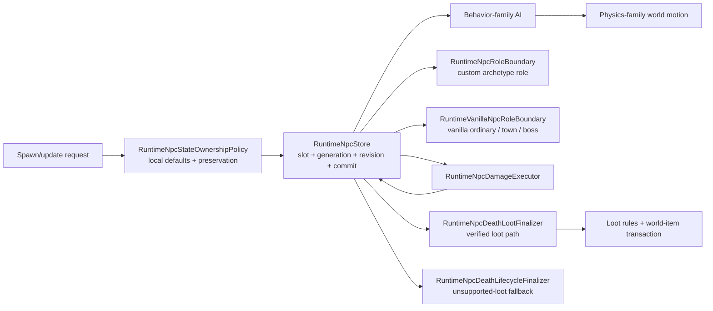

# NPC runtime ownership boundaries

NPC state now retains nullable `SpawnDifficulty` (`NPC.difficulty`). Vanilla allocation samples it once even for types whose stat profile is not yet implemented. Explicit storage creation defaults known types to Classic; omitted updates preserve the value, while definition changes reset it to Classic alongside definition defaults. Nonfinite or out-of-range values are rejected before mutation; supported values are `0.5` through `4`. This does not yet reproduce arbitrary vanilla transformation parameters.

Initialized Skeletron head phases now restore spawn combat baselines, interpolate spin damage using retained difficulty, preserve live damage while fleeing, and use physical centers with the original positive-distance guard and float operation order. Good World spin reflection follows the current Expert hand count. Independent evidence contains 715 original head AI calls covering modes, seeds, hand counts, timers, fractional difficulty and distance thresholds, plus ownership regressions and a native spin-exit smoke. These calls start after initialization and freeze hand AI; first-call hand creation/defense ordering, full hand AI, RedHat, rotations and encounter-wide network/RNG behavior remain open.

Skeletron head and hands also use the shared spawn profile: Good World physical scaling is `1.25` for the head and `1.15` for hands; difficulty and player-count adjustments retain the original float rounding. Hand batch coordinates use the pre-motion head dimensions and truncate vertical position before adding integer half-height. Evidence includes 158 original creations and 48 original head batches, exercised by 254 comparisons; disabling the profile fails 202 checks and restoring the old vertical cast fails 36. Native smoke checks scaled head/hand stats and fractional batch placement. This closes the sibling creation gap; first-call head/hand ordering, full hand AI, RedHat variants and complete encounter/network behavior remain unfinished.

Prime's initial arm batch now uses the head's physical dimensions and position before world movement. The source truncates the vertical position before adding integer half-height; this also matters at negative fractional positions. All four arms keep the head's allocation start slot, and exhausted slots produce a partial batch without retrying initialization. A retained fixture contains 48 original head calls across three modes, Good World, four starting slots and fractional coordinates. Each case runs through both AI-only and world-motion composition, comparing initial child state before child AI. Restoring old coordinates fails 63 of the 96 checks; isolated post-motion and truncation controls fail 18 and 36. Native protocol smoke also checks the Good World fractional spawn. This verifies creation, not full arm AI or network publication order.

NPC snapshots now retain `BaseDamage` and `BaseDefense`, corresponding to vanilla `defDamage` and `defDefense`, separately from the live combat overrides. Spawn resolves them from the verified difficulty profile or definition unless the caller supplies them explicitly. An omitted value on an update preserves the same definition's baseline; changing type/net definition resets it to the new definition, and slot reuse cannot inherit the old generation's values. This is state ownership support, not a claim that arbitrary NPC transformations already reproduce vanilla difficulty/spawn parameters.

Skeletron Prime and all four arms now use the shared creation context. Head AI restores the retained baseline each step, doubles live damage/defense while spinning and restores the baseline after the spin ends. Hover, charge and daytime-rage aim use the physical hitbox center. Charge/rage preserve source division/multiplication order, replace only nonpositive distance with one and keep the original distance thresholds. Independent evidence covers 395 original Prime-family creations and 408 head AI calls, including zero/tiny distance and both sides of every acceleration threshold. Runtime tests cover all four arms and spin exit after context changes; the native smoke exercises baseline restoration. Removing baseline use, physical centers or the small-distance rule causes 201, 168 and 12 failures respectively. Full limb AI, Mechdusa, rotations, encounter-wide projectile/network cadence and transformation difficulty remain open.

Vanilla NPC creation now samples the world's effective difficulty, current owned player count and `getGoodWorld` once per allocation request. `NpcAuthority` supplies the inputs on the authoritative thread through `RuntimeNpcStore.SetVanillaSpawnContextSource`; explicit storage construction with `TrySpawn` keeps its existing semantics. Joining or leaving affects later creations, not the health of existing NPCs. Dead actors count; disconnected actors do not. The same effective difficulty also supplies the AI's Expert/Master flags, including the extra difficulty level from `getGoodWorld`.

`VanillaNpcSpawnDefaults` currently implements the source scaling for Destroyer head/body/tail, Probe, Skeletron Prime and its four arms, and Skeletron head/hands. It preserves the original order of physical dimensions, secret-seed scaling, difficulty stat tweaks and multiplayer health scaling. Physical dimensions remain separate from visual scale: an ordinary Expert Destroyer has a $47\times47$ hitbox with scale `1.3125`; good-world creation has a $76\times76$ hitbox while later difficulty scaling changes its visual scale to `1.70625`. Health, contact damage and physical size are present in the initial spawn commit, including head-created segments. Explicitly supplied life and live combat overrides remain owned by their caller.

Independent evidence includes 240 applicable cases from the 540-row original `NpcSpawnContext1458` fixture and all 76 original fractional-difficulty cases in `NpcSpawnFractional1458`. The remaining rows were captured for subsequent type-specific comparisons. Tests compare position, physical/visual size, health, damage and defense; six composed runtime cases check live player-count changes and same-tick children. The 32 original chain cases now also compare good-world position and health. Negative controls fail when world binding, physical-size order, multiplayer scaling or effective AI flags are removed. The native protocol smoke exercises the actual runtime binding. Full context scaling for other NPCs, Journey difficulty controls, hardcore ghost projection, broad seed behavior, RNG continuation and complete boss combat/network cadence remain open.

Destroyer `AI_037` now allocates the complete chain during the committed head call: 80 bodies and one tail, or 100 bodies and one tail with `getGoodWorld`. Every allocation starts at the head slot; `ai[1]` links the predecessor, `ai[3]` identifies the head and `ai[2]` stays zero. A full table leaves the visible predecessor's `ai[0]` at the original failure sentinel `200`, without exposing a live sentinel NPC or retrying the chain next tick. The existing ascending executor then visits newly created higher slots in the same world pass. Exact-generation follower mutation stays behind `INpcAiCommittedNpcMutationSink.TryLinkFollower`; speculative or rejected head steps cannot create children.

Independent `DestroyerChainSpawn1458` evidence contains 32 original head-only calls, with four head slots, four occupancy/replacement arrangements and both `getGoodWorld` settings. Tests compare every chain link, type, initial local state and lifetime; both ordinary Classic and good-world cases additionally compare position, velocity and health. A composed world-step test observes the complete chain before the first body runs. Restoring the former per-segment planner fails all 33 regressions. An additional regression covers overwriting an old head root reference, exhausted small stores and rejected stale-generation follower changes; restoring the old root guard fails it. The fixture is captured from the official Linux assembly on Windows CoreCLR; native acceptance uses the runtime smoke separately. RNG continuation, Mechdusa, full movement/combat and exact packet-23 flush timing remain open; this evidence does not establish complete Destroyer parity.

Clientless server players remain combat participants but have no packet90 consumer. Difficulty-loot recipient projection now requires an exact-generation playing/open client-local item receiver; otherwise personalized rewards are withheld rather than aborting the lethal hit, granting items directly or redirecting them to observers. This is an explicit fail-closed runtime-extension policy, not a vanilla player-eligibility claim. Classic world drops and ordinary bot pickup are unchanged. Twelve synthetic boundary cases and two real Guard-bot Expert/Master kills reproduce the former exception; restoring the gate passes, including repeated bot runs. An actor-owned personalized-loot adapter remains open.

Eye of Cthulhu now has its missing NPC-specific death-loot dispatch and first-boss progression. Classic ore/seeds follow the world-owned evil flag; Expert bag, Master relic/Aviator Sunglasses/per-player pet and all-mode trophy preserve source rule order. The existing network/server-player/town-NPC death branches mark the Eye milestone, and the existing world-header patcher changes only downedBoss1. Tests cover both world evils/all difficulties, recipient isolation, duplicate kills and byte-exact/idempotent persistence (27 focused tests; 11 negative-control failures). Global event/announcement, global loot and full encounter AI remain open.

Ordinary mechanical encounter loot now uses the same death boundary: Classic Hallowed Bars15–30/Souls25–40 and masks, Expert bags, Master relic/pets, later trophies. MissingTwin checks active opposite eyes before encounter rewards; each eye's trophy is independent. NPC.ApplyInteraction propagation now credits all active Twins or Prime parts through the existing generation-safe ledger in network and server-player damage paths. Twenty verified item defaults preserve no-gravity Soul velocity RNG. Source-order and production-delivery tests cover all roots/difficulties, both eye kill orders and four Prime arm-credit paths (65 tests; 18 negative-control failures). Mechdusa/Waffle Iron, global loot, bag opening and full encounter AI remain open.

Queen Slime's NPC-specific death rewards now use the existing imported-loot boundary and item delivery/lease stores. Source-ordered Classic rules include gel, mask, one armor piece, Blade Staff, mount and the raw-RNG hook; Expert/Master bags remain addressed packet90 copies, with Master relic/per-interactor pet and all-mode trophy. Twelve world-drop definitions do not admit unverified item-use behavior. Blade Staff natural prefix validity respects damage6/zero knockback. Exact-RNG and real authoritative-player-kill tests cover all three difficulties, packet21/90 recipients, unpublished leases and duplicate-kill rejection; negative controls produce ten failures. Global drops, opening bags and other Hardmode boss tables remain open.

AI70 now initializes speed/scale/offsets only for an incoming unassigned target, then applies homing, jitter and the world-owned wind input. Loaded wind comes from the persisted target, as in `WorldFile.LoadWorld`; weather evolution/rain amplification remains open. Detonation checks all active living players using the source's asymmetric integer rectangle and base player dimensions. `checkDead` prepares the four-update detonation through shared damage instead of ordinary death/loot. The physical body expands from $36\times36\,\mathrm{px}$ to $100\times100\,\mathrm{px}$ around its old center independently of scale. Bounded nullable `NpcSimulationState.HitboxOverride` shares the authoritative revision; targeting, collision, combat and packet anchors consume it through the definition helper. State-only updates preserve it; new-definition defaults do not inherit it. Target loss cannot suspend expiry. Tests cover source boundaries, expansion, invalid bodies, preservation, packet geometry and production bot contact; removing the physical/death/proximity rules causes eleven failures. Mounted-player proximity dimensions and live weather remain limitations.

Duke bubble creation now uses incoming `ai[2] % 4 == 0`, including tick zero. Phase one creates an unassigned, zero-velocity/default-AI bubble; phase two uses the incoming (pre-circle-rotation) direction for the mouth and perpendicular speed, assigns the target and draws only scale. AI70's lifetime no longer increments during detonation: the countdown reaches zero and the existing post-AI expiry path retires that exact NPC without combat loot/progression. Fourteen tests cover spawn timing/defaults/geometry and the four-update timeout sequence. The follow-on AI70 implementation below adds motion initialization and physical detonation; live weather evolution remains open.

The next verified AI69 slice restores phase-one/two attack-cycle resets and waits for the hover boundary before phase changes. Phase-one bubble/shark attacks leave cycles `1`/`0`; phase-two uses six dash steps, then circle/shark steps, resetting to `1`/`0`. Phase-two circle and state `13` rotate incoming velocity instead of hovering/freezing; hover reversal acceleration and facing follow the source. Tests cover each selector/reset and signed circle motion; reverting resets/rotation causes eight failures. Ocean/enrage and remaining phase details are still open, so this does not close the Duke encounter.

TZ-35 adds server-owned nullable `Friendly`, `Chaseable` and `Immortal` to the committed simulation revision. Null means unspecified (targeting fails closed); verified spawn defaults materialize values, state-only updates preserve them, and AI writes live transitions atomically. Controlled magic and bot Guard consume these flags through the source-backed `CanBeChasedBy` predicate; NPC contact also rejects friendly instances. Clone 440 and Ancient Doom 523 start unchaseable. Duke states 10/12 clear chaseability, 11 sets it, and untouched branches retain it, including transition ticks. Cultist intro/ritual and reposition damage gates follow the executed source branch. This does not claim every NPC's transient allegiance/immortality branch or temporary catchable immunity is implemented.

[Русский](../ru/npc-runtime-ownership.md) · [NPC behavior families](npc-behavior-families.md) · [Gameplay decomposition roadmap](../roadmap/gameplay-decomposition-and-catalogs.md)

The follow-on Duke Fishron AI69 slice fixes actual phase-three relocation at incoming timer `15`, its opposite-side destination, damping/fade, and the nine-step one/two/three-dash cycle between teleports. Focused tests pin the adjacent timer boundaries and all nine decisions; restoring the old wait-only/modulo-four behavior makes six regressions fail. This is not full Duke parity: ocean/enrage inputs, remaining phase details and official-client combat acceptance remain open.

TerraRuntime keeps NPC storage, spawn/default materialization, AI, physics, combat and loot as separate ownership layers. The point is not directory decoration. Each layer must be able to evolve without teaching the slot store about vanilla combat rules or teaching physics about concrete NPC content IDs.

`TerraRuntime.Gameplay.Npcs` owns the immutable source-backed vanilla definition layer: `VanillaNpcDefinition`, behavior/physics family metadata, net variants, and the admitted slime/flying-eye/flyer/worm/AI17-20-21/town definition catalogs. Core consumes those facts but does not own them. Mutable NPC slots, authoritative state transitions, AI execution, combat and world-item transactions remain in Core/application runtime.

The same ownership rule now covers protocol-neutral NPC simulation and loot. Source-backed gravity, targeting, knockback, motion/check-active primitives, ordinary spawn cadence, town identity/rescue rules, AI coverage and boss-loot evaluators live in `TerraRuntime.Gameplay.Npcs`. Core keeps the mutable behavior context/state steppers, generation-safe interaction ledger, world-item materialization transactions and death/finalization steps. `NpcLootWorldItemOrigin` and the vanilla interactable-player slot ceiling are gameplay facts rather than properties of a particular runtime store.

The same boundary applies to NPC catching: `VanillaNpcCatchCatalog1458` owns immutable critter/catch-item facts in Gameplay, while `VanillaNpcCatchWorldItem1458` remains in Core because it materializes the captured world-item state and reservation policy.

## Spawn and local state

`RuntimeNpcStore` owns addressable slots, active state, generation/revision monotonicity, snapshots and commit ordering. It no longer owns Terraria definition lookup or vanilla local-state defaults.

`RuntimeNpcStateOwnershipPolicy` owns the current verified spawn/update rules for fields that are not packet identity:

- definition-backed `Life/LifeMax` materialization;
- default active lifetime (`TimeLeft`);
- initial sprite direction;
- preservation of combat/lifetime/presentation state when an AI/state update deliberately leaves those fields unspecified.

This keeps storage generic while preserving the existing sentinel contract (`LifeMax == 0`, `TimeLeft == -1`, compatible zero sprite direction ingress).

AI-triggered child NPC creation crosses `INpcAiSpawnIntentPlanner` rather than mutating the slot store from inside AI. The executor supplies bounded scratch storage, planners may emit an ordered batch of zero or more intents, and the batch is applied only after the exact source generation commits. A rejected/stale source transition therefore cannot leak children into the world. After the source commit, individual child allocation follows vanilla-style best effort: if the NPC table fills mid-batch, already accepted children remain and later spawns may fail.

## AI family versus physics family

`VanillaNpcBehaviorFamily` and `VanillaNpcPhysicsFamily` are intentionally separate metadata. Sharing an AI implementation does not automatically prove shared collision, platform, gravity or obstacle behavior.

Current verified mappings are:

| NPC | behavior family | physics family |
| --- | --- | --- |
| Blue Slime | `SlimeGround` | `SlimeGround` |
| Demon Eye | `FlyingEye` | `FlyingEye` |
| Zombie | `GroundFighter` | `GroundFighter` |
| Eye of Cthulhu | `EyeOfCthulhu` | `NoClipFlight` |
| Servant of Cthulhu | `Flyer` | `NoClipFlight` |
| Skeleton | `GroundFighter` | `GroundFighter` |
| King Slime | `KingSlime` | `SlimeGround` |

The names line up only where the admitted source-backed behavior proves that relationship. They remain different fields so future definitions can diverge safely.

`VanillaNpcWorldMotionAiStepper` dispatches special movement and platform behavior from `PhysicsFamily`, not from `NpcTypeId`. `VanillaNpcGravity` accepts a resolved definition as its authoritative gameplay overload; raw/typed ID overloads remain compatibility boundaries and resolve the definition before entering the physics implementation.

## Door and tall-gate production wiring

`VanillaNpcWorldMotionAiStepper` now owns the production door-pressure projection and the tall-gate occupancy probe. `RuntimeWorldClock` supplies live `BloodMoonActive` (already filtered by `GetGoodWorld`) and `GetGoodWorld` itself; `VanillaWorldUnbreakableWallScan` supplies `TargetInsideUnbreakableWalls` (8×250 scan for wall 350, color ≥16); `RuntimeTallGateOccupancyProbe` supplies `IsActorFree` by testing live player (`20×42`) and NPC (live hitbox) rectangles via `Collision.EmptyTile(ignoreTiles:true)` semantics. The resolved `VanillaGroundFighterDoorEnvironment` therefore carries the exact vanilla policy inputs, and `VanillaWorldGroundFighterDoorOpeningService` executes the mutation behind `RuntimeGroundFighterDoorOpeningSink` which also replicates packet-19 to playing peers. Tall-gate opening fails closed without the probe; normal doors do not require it.

## Combat, death and loot

Combat remains owned by `RuntimeNpcDamageExecutor` plus `VanillaNpcDamageResolver`. Lethal damage commits `Life = 0` and does not despawn or roll loot inside the damage resolver.

For NPC types with imported source-backed loot, death/loot remains owned by `RuntimeNpcDeathLootFinalizer`, `VanillaNpcLootRules`, the vanilla world-item materializer and the generation-safe loot transaction. The store therefore does not know drop tables, prefix RNG or world-item capacity semantics.

A separate `RuntimeNpcDeathLifecycleFinalizer.TryFinalizeWhenLootUnsupported` closes entity lifecycle only for dead vanilla types whose loot table is not yet imported. It deliberately refuses any type already admitted by `VanillaNpcLootRuleCatalog`, so verified drops cannot be bypassed accidentally. A successful fallback means **loot parity is unresolved**, not that the vanilla drop set is empty. This lets partially implemented bosses such as the current Eye of Cthulhu slice despawn generation-safely at `Life = 0` without pretending its drops are complete.

## Town and boss role boundaries

`NpcArchetypeRole` classifies policy as `Ordinary`, `Town` or `Boss`, but runtime-defined/custom and vanilla identities reach that policy through different trusted sources.

`RuntimeNpcRoleBoundary` resolves a custom archetype role through the exact live `NpcHandle`, generation-safe archetype binding and one published descriptor revision. The role is custom runtime identity metadata and is never inferred from its vanilla presentation type or AI style.

`RuntimeVanillaNpcRoleBoundary` resolves a live vanilla generation through `RuntimeNpcStore` and the version-pinned `VanillaNpcDefinitionCatalog`. It fails closed for stale generations and unsupported vanilla types. The current source-backed Eye of Cthulhu definition therefore selects `Boss` lifecycle policy through its exact live handle, while Blue Slime, Demon Eye, Zombie and Servant remain `Ordinary`.

Both classification results expose mutually exclusive policy gates for town interaction, boss lifecycle or ordinary lifecycle. This prevents housing/shop policy from entering ordinary combat AI and prevents boss progression/despawn policy from becoming a raw type-number branch in the store.

These are ownership boundaries, not complete vanilla town/boss parity. Housing, boss progression, boss bars, remaining boss-specific death effects and broad boss AI still require separate source-backed implementation. The actor-commerce smoke continues to mark its custom merchant archetype as `Town` explicitly.

## Vanilla slot allocation

`RuntimeNpcStore.TrySpawnVanilla` searches only the original $200\,\text{slots}$, even when storage has greater byte-addressable capacity. With the default start index, ordinary types search upwards; the source `CannotSpawnInSlot0` set starts at slot 1. Queen Bee and Golem search downwards from slot 199 and exclude slot 0. `VanillaNpcSpawnRules` owns these content rules. Smaller host/test stores retain their capacity.

The optional `startSlot` argument and `NpcAiSpawnIntent.StartSlot` represent `NewNPC.Start`. Ascending search includes that index; reverse search excludes it. The slot-zero adjustment applies only when the requested start is zero. Negative or out-of-capacity arguments fail without mutation. Skeletron hands and Skeletron Prime arms now carry their head's slot, preserving source allocation order when earlier slots are free. Other child-spawn producers still require individual verification of their start index.

Vanilla creation protects the chosen slot for $2\,\text{updates}$. At the start of each authoritative world tick, active slots refresh protection and inactive slots decrement it to zero. An AI pass alone does not advance this timer. Explicit-slot `TrySpawn` remains a trusted storage operation and can construct a replacement after despawning without using the vanilla allocator.

Free, unprotected slots always take priority. If none remains, allocation chooses the first `CanBeReplacedByOtherNpcs` entry in the same order, including protected inactive entries. Replacement advances the exact generation, emits a spawn commit and preserves the active count when replacing a live NPC; it does not run death or loot effects. Inactive slot state stays private and bounded so its replacement flag survives deactivation. Queen Bee's minion intent carries the original replacement flag with its local-AI seed. Other flag producers, including Hive Slime and released explosive rabbits, and full pending-spawn network flush ordering remain open.

A retained original-server fixture compares $6264\,\text{allocation decisions}$ across all positive vanilla types and nine slot arrangements, plus protection decay and five actual `NPC.NewNPC` calls (expanded SHA256 `3066507d07e01edb34f8812ffede7c9671e135d930783efca982496268b60bd6`). A second fixture covers $25056\,\text{decisions}$ with start indices 1, 17, 198 and 199 (expanded SHA256 `55ad9275bbc2e8fa15e7d15d97e9767067dbe366c0b96339bcb7a1e09f37526a`). Regressions cover stale handles, replacement publication, real world-tick ownership and limb allocation above the head. Negative controls fail when protection is removed, capacity becomes 256, reverse search includes slot 0, or the start index is ignored. Native protocol smoke exercises reverse search, excluded slot zero, protection, generation advancement, a nonzero start and invalid-bound rejection.

## D4 completion boundary

The roadmap item `spawn/physics/combat/loot separation` is considered complete for the currently admitted authoritative NPC slice because:

- slot storage no longer contains vanilla definition/default materialization;
- physics dispatch no longer branches on concrete Blue Slime/Demon Eye/Zombie IDs;
- AI child spawns cross a bounded post-commit intent boundary rather than mutating the store speculatively;
- combat, entity death lifecycle and verified death/loot execute through distinct generation-safe components;
- custom and vanilla role policy resolve through explicit generation-safe boundaries;
- tests pin catalog family selection and local-state ownership behavior;
- future definitions must explicitly opt into behavior and physics families.

This does not claim complete Terraria NPC support. Vanilla town/housing, boss progression and boss behavior breadth remain open even though their ownership boundaries are now explicit.
