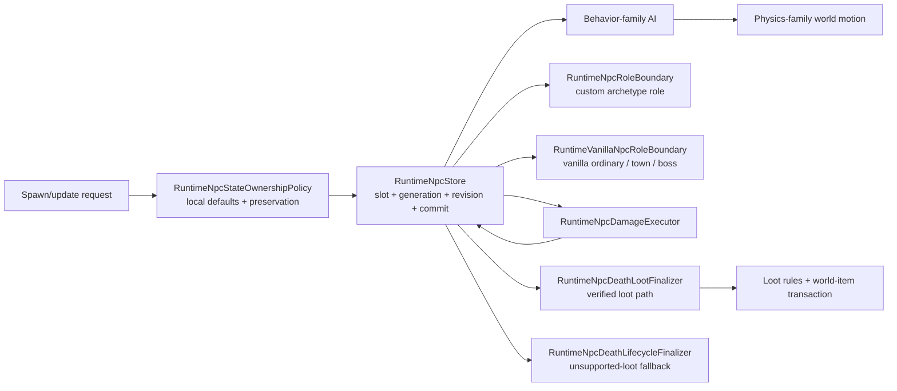

# NPC runtime ownership boundaries

[Русский](../ru/npc-runtime-ownership.md) · [NPC behavior families](npc-behavior-families.md) · [Gameplay decomposition roadmap](../roadmap/gameplay-decomposition-and-catalogs.md)

TerraRuntime keeps NPC storage, spawn/default materialization, AI, physics, combat and loot as separate ownership layers. The point is not directory decoration. Each layer must be able to evolve without teaching the slot store about vanilla combat rules or teaching physics about concrete NPC content IDs.

## Spawn and local state

`RuntimeNpcStore` owns addressable slots, active state, generation/revision monotonicity, snapshots and commit ordering. It no longer owns Terraria definition lookup or vanilla local-state defaults.

`RuntimeNpcStateOwnershipPolicy` owns the current verified spawn/update rules for fields that are not packet identity:

- definition-backed `Life/LifeMax` materialization;
- default active lifetime (`TimeLeft`);
- initial sprite direction;
- preservation of combat/lifetime/presentation state when an AI/state update deliberately leaves those fields unspecified.

This keeps storage generic while preserving the existing sentinel contract (`LifeMax == 0`, `TimeLeft == -1`, compatible zero sprite direction ingress).

AI-triggered child NPC creation crosses `INpcAiSpawnIntentPlanner` rather than mutating the slot store from inside AI. The executor supplies bounded scratch storage, planners may emit an ordered batch of zero or more intents, and the batch is applied only after the exact source generation commits. A rejected/stale source transition therefore cannot leak children into the world. After the source commit, individual child allocation follows vanilla-style best effort: if the NPC table fills mid-batch, already accepted children remain and later spawns may fail.

## AI family versus physics family

`VanillaNpcBehaviorFamily` and `VanillaNpcPhysicsFamily` are intentionally separate metadata. Sharing an AI implementation does not automatically prove shared collision, platform, gravity or obstacle behavior.

Current verified mappings are:

| NPC | behavior family | physics family |
| --- | --- | --- |
| Blue Slime | `SlimeGround` | `SlimeGround` |
| Demon Eye | `FlyingEye` | `FlyingEye` |
| Zombie | `GroundFighter` | `GroundFighter` |
| Eye of Cthulhu | `EyeOfCthulhu` | `NoClipFlight` |
| Servant of Cthulhu | `Flyer` | `NoClipFlight` |

The names line up only where the admitted source-backed behavior proves that relationship. They remain different fields so future definitions can diverge safely.

`VanillaNpcWorldMotionAiStepper` dispatches special movement and platform behavior from `PhysicsFamily`, not from `NpcTypeId`. `VanillaNpcGravity` accepts a resolved definition as its authoritative gameplay overload; raw/typed ID overloads remain compatibility boundaries and resolve the definition before entering the physics implementation.

## Combat, death and loot

Combat remains owned by `RuntimeNpcDamageExecutor` plus `VanillaNpcDamageResolver`. Lethal damage commits `Life = 0` and does not despawn or roll loot inside the damage resolver.

For NPC types with imported source-backed loot, death/loot remains owned by `RuntimeNpcDeathLootFinalizer`, `VanillaNpcLootRules`, the vanilla world-item materializer and the generation-safe loot transaction. The store therefore does not know drop tables, prefix RNG or world-item capacity semantics.

A separate `RuntimeNpcDeathLifecycleFinalizer.TryFinalizeWhenLootUnsupported` closes entity lifecycle only for dead vanilla types whose loot table is not yet imported. It deliberately refuses any type already admitted by `VanillaNpcLootRuleCatalog`, so verified drops cannot be bypassed accidentally. A successful fallback means **loot parity is unresolved**, not that the vanilla drop set is empty. This lets partially implemented bosses such as the current Eye of Cthulhu slice despawn generation-safely at `Life = 0` without pretending its drops are complete.

## Town and boss role boundaries

`NpcArchetypeRole` classifies policy as `Ordinary`, `Town` or `Boss`, but runtime-defined/custom and vanilla identities reach that policy through different trusted sources.

`RuntimeNpcRoleBoundary` resolves a custom archetype role through the exact live `NpcHandle`, generation-safe archetype binding and one published descriptor revision. The role is custom runtime identity metadata and is never inferred from its vanilla presentation type or AI style.

`RuntimeVanillaNpcRoleBoundary` resolves a live vanilla generation through `RuntimeNpcStore` and the version-pinned `VanillaNpcDefinitionCatalog`. It fails closed for stale generations and unsupported vanilla types. The current source-backed Eye of Cthulhu definition therefore selects `Boss` lifecycle policy through its exact live handle, while Blue Slime, Demon Eye, Zombie and Servant remain `Ordinary`.

Both classification results expose mutually exclusive policy gates for town interaction, boss lifecycle or ordinary lifecycle. This prevents housing/shop policy from entering ordinary combat AI and prevents boss progression/despawn policy from becoming a raw type-number branch in the store.

These are ownership boundaries, not complete vanilla town/boss parity. Housing, boss progression, boss bars, remaining boss-specific death effects and broad boss AI still require separate source-backed implementation. The actor-commerce smoke continues to mark its custom merchant archetype as `Town` explicitly.

## D4 completion boundary

The roadmap item `spawn/physics/combat/loot separation` is considered complete for the currently admitted authoritative NPC slice because:

- slot storage no longer contains vanilla definition/default materialization;
- physics dispatch no longer branches on concrete Blue Slime/Demon Eye/Zombie IDs;
- AI child spawns cross a bounded post-commit intent boundary rather than mutating the store speculatively;
- combat, entity death lifecycle and verified death/loot execute through distinct generation-safe components;
- custom and vanilla role policy resolve through explicit generation-safe boundaries;
- tests pin catalog family selection and local-state ownership behavior;
- future definitions must explicitly opt into behavior and physics families.

This does not claim complete Terraria NPC support. Vanilla town/housing, boss progression and boss behavior breadth remain open even though their ownership boundaries are now explicit.
