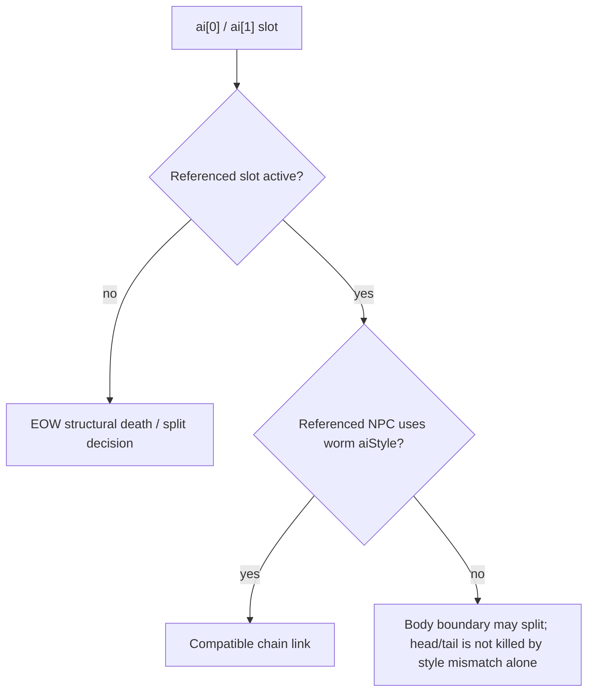

# Vanilla AI_006 worm lifecycle parity

This guide records the source-backed chain-lifecycle slice implemented for TerrariaServer 1.4.5.8 worm AI. It is deliberately narrower than full NPC parity: movement families, chain construction, link repair and the Eater of Worlds server-side death/loot/progression vertical described here are admitted, while remaining AI_006 side effects stay separate work.

## Chain state

TerraRuntime treats the synchronized `ai` slots as the vanilla linked-list state:

| Slot | Source-backed meaning in the admitted chain slice |
|---|---|
| `ai[0]` | successor/follower NPC slot, or the construction sentinel before the next segment is committed |
| `ai[1]` | predecessor/leader NPC slot |
| `ai[2]` | remaining follower construction count for supported chain profiles |
| `ai[3]` | root/head slot copied from the head into spawned descendants |

The official 1.4.5.8 `AI_006_Worms` method initializes a chain head with its own `whoAmI` in `ai[3]` and copies that value into each newly spawned follower. TerraRuntime now preserves the same root-slot propagation for Eater of Worlds as well as ordinary admitted worm families. This does not by itself claim complete vanilla `realLife`/shared-health behavior.

## Eater of Worlds link semantics

Eater of Worlds does not use one generic "valid worm link" predicate for every lifecycle decision. The source has two distinct contracts:

1. structural terminal checks use only whether the referenced predecessor/successor slot is active;
2. a body split checks both activity and `aiStyle` compatibility before transforming into a replacement head or tail.

That distinction matters when an NPC slot is reused. A live non-worm occupant keeps an existing Eater head/tail from satisfying the source's inactive-link death condition, but it is not a compatible body-chain neighbor. A body meeting that boundary splits, matching `AI_006_Worms`, instead of being incorrectly killed as an isolated segment.

TerraRuntime keeps its defensive wire/runtime boundary for malformed float link values: a slot must be finite, integral and addressable before lookup. Normal server-authored chain links satisfy this automatically.

## Executable evidence

`.github/workflows/npc-worm-reference-probe.yml` decompiles the official TerrariaServer 1.4.5.8 binary and runs `tools/ci/check_npc_worm_reference.py`. The checker fails closed unless the pinned method still proves head `ai[3]` initialization, child root propagation, ordinary worm `active + aiStyle` guards, Eater active-only structural death gates, body `aiStyle` split gates, both transforms and their source order.

`VanillaWormLifecycleParityTests` separately pins TerraRuntime behavior for reused non-worm slots, missing structural links and Eater root-slot propagation.

## Eater of Worlds death and shared combat state

Packet-28 player interaction now follows `NPC.PlayerInteraction` for types 13/14/15: a hit credits every currently active Eater segment, so later splits and segment deaths do not lose the player list used by per-player boss loot. On lethal damage the runtime performs the same `DropEoWLoot` family scan: every segment evaluates the two small Shadow Scale/Demonite rules, but only the final active segment is promoted to boss for the Expert bag, Master relic/per-player pet, normal-only finishing drops and trophy. The final segment also marks `VanillaWorldProgressionId.EvilBoss`, and `WorldFileProgressionHeaderPatcher` now persists that mutation to the 1.4.5.8 `downedBoss2` header byte.

## Still incomplete

This evidence does not make `FullVanillaAiParity` true. Eater meteor scheduling, the Skyblock low-tile `shadowOrbSmashed` death side effect, healing-heart/presentation effects, unowned `realLife` nuances and broad differential gameplay scenarios remain open in the NPC parity roadmap.
